# CYP2D6 DDGI Qualification

| Version                         | main-OSP12.2                                                 |
| ------------------------------- | ------------------------------------------------------------ |
| Qualification Plan Release      | https://github.com/Open-Systems-Pharmacology/DDGI-CYP2D6     |
| OSP Version                     | 12.2                                                         |
| Qualification Framework Version | 3.5                                                          |

This qualification report is filed at:

https://github.com/Open-Systems-Pharmacology/OSP-Qualification-Reports

# Table of Contents

 * [1 Introduction and CYP2D6 DDGI Network](#introduction)
   * [1.1 Objective](#objective)
   * [1.2 CYP2D6 DDGI Network](#cyp2d6-ddgi-network)
   * [1.3 DDI Clinical Studies](#ddi-study-evaluations)
     * [1.3.1 Atomoxetine - Desipramine DDI](#atomoxetine-desipramine-ddi)
     * [1.3.2 Atomoxetine - Midazolam DDI](#atomoxetine-midazolam-ddi)
     * [1.3.3 Carbamazepine - Quinidine DDI](#carbamazepine-quinidine-ddi)
     * [1.3.4 Cimetidine - Metoprolol DDI](#cimetidine-metoprolol-ddi)
     * [1.3.5 Cimetidine - Quinidine DDI](#cimetidine-quinidine-ddi)
     * [1.3.6 Erythromycin - Quinidine DDI](#erythromycin-quinidine-ddi)
     * [1.3.7 Fluvoxamine - Atomoxetine DDI](#fluvoxamine-atomoxetine-ddi)
     * [1.3.8 Fluvoxamine - Quinidine DDI](#fluvoxamine-quinidine-ddi)
     * [1.3.9 Itraconazole - Paroxetine DDI](#itraconazole-paroxetine-ddi)
     * [1.3.10 Itraconazole - Quinidine DDI](#itraconazole-quinidine-ddi)
     * [1.3.11 Ketoconazole - Risperidone DDI](#ketoconazole-risperidone-ddi)
     * [1.3.12 Omeprazole - Quinidine DDI](#omeprazole-quinidine-ddi)
     * [1.3.13 Paroxetine - Alprazolam DDI](#paroxetine-alprazolam-ddi)
     * [1.3.14 Paroxetine - Metoprolol DDI](#paroxetine-metoprolol-ddi)
     * [1.3.15 Quinidine - Desipramine DDI](#quinidine-desipramine-ddi)
     * [1.3.16 Quinidine - Dextromethorphan DDI](#quinidine-dextromethorphan-ddi)
     * [1.3.17 Quinidine - Digoxin DDI](#quinidine-digoxin-ddi)
     * [1.3.18 Quinidine - Paroxetine DDI](#quinidine-paroxetine-ddi)
     * [1.3.19 Rifampicin - Metoprolol DDI](#rifampicin-metoprolol-ddi)
     * [1.3.20 Rifampicin - Quinidine DDI](#rifampicin-quinidine-ddi)
     * [1.3.21 Rifampicin - Risperidone DDI](#rifampicin-risperidone-ddi)
     * [1.3.22 Verapamil - Quinidine DDI](#verapamil-quinidine-ddi)
     * [1.3.23 Verapamil - Risperidone DDI](#verapamil-risperidone-ddi)
   * [1.4 DGI Clinical Studies](#dgi-parent-model-evaluations)
     * [1.4.1 Atomoxetine DGI](#atomoxetine-dgi)
     * [1.4.2 Clomiphene DGI](#clomiphene-dgi)
     * [1.4.3 Desipramine DGI](#desipramine-dgi)
     * [1.4.4 Dextromethorphan DGI](#dextromethorphan-dgi)
     * [1.4.5 Metoprolol DGI](#metoprolol-dgi)
     * [1.4.6 Mexiletine DGI](#mexiletine-dgi)
     * [1.4.7 Paroxetine DGI](#paroxetine-dgi)
     * [1.4.8 Risperidone DGI](#risperidone-dgi)
   * [1.5 DDGI Clinical Studies](#ddgi-study-evaluations)
     * [1.5.1 Clarithromycin - Clomiphene DDGI](#clarithromycin-clomiphene-ddgi)
     * [1.5.2 Paroxetine - Atomoxetine DDGI](#paroxetine-atomoxetine-ddgi)
     * [1.5.3 Paroxetine - Clomiphene DDGI](#paroxetine-clomiphene-ddgi)
     * [1.5.4 Paroxetine - Desipramine DDGI](#paroxetine-desipramine-ddgi)
     * [1.5.5 Paroxetine - Dextromethorphan DDGI](#paroxetine-dextromethorphan-ddgi)
     * [1.5.6 Quinidine - Metoprolol DDGI](#quinidine-metoprolol-ddgi)
     * [1.5.7 Quinidine - Mexiletine DDGI](#quinidine-mexiletine-ddgi)
 * [2 Qualification of CYP2D6-Mediated Interactions](#ddi-evaluations)
   * [2.1 DDI Qualification](#ddi-ratio-evaluations)
     * [2.1.1 Perpetrator](#ddi-ratio-evaluations-ddi-subunit-9)
       * [2.1.1.1 Atomoxetine](#ddi-ratio-evaluations-ddi-subunit-10)
       * [2.1.1.2 Carbamazepine](#ddi-ratio-evaluations-ddi-subunit-18)
       * [2.1.1.3 Cimetidine](#ddi-ratio-evaluations-ddi-subunit-26)
       * [2.1.1.4 Clarithromycin](#ddi-ratio-evaluations-ddi-subunit-34)
       * [2.1.1.5 Erythromycin](#ddi-ratio-evaluations-ddi-subunit-42)
       * [2.1.1.6 Fluvoxamine](#ddi-ratio-evaluations-ddi-subunit-50)
       * [2.1.1.7 Itraconazole](#ddi-ratio-evaluations-ddi-subunit-58)
       * [2.1.1.8 Ketoconazole](#ddi-ratio-evaluations-ddi-subunit-66)
       * [2.1.1.9 Omeprazole](#ddi-ratio-evaluations-ddi-subunit-74)
       * [2.1.1.10 Paroxetine](#ddi-ratio-evaluations-ddi-subunit-82)
       * [2.1.1.11 Quinidine](#ddi-ratio-evaluations-ddi-subunit-90)
       * [2.1.1.12 Rifampicin](#ddi-ratio-evaluations-ddi-subunit-98)
       * [2.1.1.13 Verapamil](#ddi-ratio-evaluations-ddi-subunit-106)
     * [2.1.2 Victim](#ddi-ratio-evaluations-ddi-subunit-114)
       * [2.1.2.1 (E)-Clomiphene](#ddi-ratio-evaluations-ddi-subunit-115)
       * [2.1.2.2 Alprazolam](#ddi-ratio-evaluations-ddi-subunit-123)
       * [2.1.2.3 Atomoxetine](#ddi-ratio-evaluations-ddi-subunit-131)
       * [2.1.2.4 Desipramine](#ddi-ratio-evaluations-ddi-subunit-139)
       * [2.1.2.5 Dextromethorphan](#ddi-ratio-evaluations-ddi-subunit-147)
       * [2.1.2.6 Digoxin](#ddi-ratio-evaluations-ddi-subunit-155)
       * [2.1.2.7 Metoprolol](#ddi-ratio-evaluations-ddi-subunit-163)
       * [2.1.2.8 Mexiletine](#ddi-ratio-evaluations-ddi-subunit-171)
       * [2.1.2.9 Midazolam](#ddi-ratio-evaluations-ddi-subunit-179)
       * [2.1.2.10 Paroxetine](#ddi-ratio-evaluations-ddi-subunit-187)
       * [2.1.2.11 Quinidine](#ddi-ratio-evaluations-ddi-subunit-195)
       * [2.1.2.12 Risperidone](#ddi-ratio-evaluations-ddi-subunit-203)
   * [2.2 DGI Qualification](#dgi-ratio-plots)
     * [2.2.1 Victim](#dgi-ratio-plots-ddi-subunit-301)
       * [2.2.1.1 (E)-Clomiphene](#dgi-ratio-plots-ddi-subunit-302)
       * [2.2.1.2 Atomoxetine](#dgi-ratio-plots-ddi-subunit-310)
       * [2.2.1.3 Desipramine](#dgi-ratio-plots-ddi-subunit-318)
       * [2.2.1.4 Dextromethorphan](#dgi-ratio-plots-ddi-subunit-326)
       * [2.2.1.5 Metoprolol](#dgi-ratio-plots-ddi-subunit-334)
       * [2.2.1.6 Mexiletine](#dgi-ratio-plots-ddi-subunit-342)
       * [2.2.1.7 Paroxetine](#dgi-ratio-plots-ddi-subunit-350)
       * [2.2.1.8 Risperidone](#dgi-ratio-plots-ddi-subunit-358)
   * [2.3 DDGI Qualification](#ddgi-evaluations)
     * [2.3.1 Perpetrator](#ddgi-evaluations-ddi-subunit-219)
       * [2.3.1.1 Clarithromycin](#ddgi-evaluations-ddi-subunit-220)
       * [2.3.1.2 Paroxetine](#ddgi-evaluations-ddi-subunit-228)
       * [2.3.1.3 Quinidine](#ddgi-evaluations-ddi-subunit-236)
     * [2.3.2 Victim](#ddgi-evaluations-ddi-subunit-244)
       * [2.3.2.1 (E)-Clomiphene](#ddgi-evaluations-ddi-subunit-245)
       * [2.3.2.2 Atomoxetine](#ddgi-evaluations-ddi-subunit-253)
       * [2.3.2.3 Desipramine](#ddgi-evaluations-ddi-subunit-261)
       * [2.3.2.4 Dextromethorphan](#ddgi-evaluations-ddi-subunit-269)
       * [2.3.2.5 Metoprolol](#ddgi-evaluations-ddi-subunit-277)
       * [2.3.2.6 Mexiletine](#ddgi-evaluations-ddi-subunit-285)
 * [3 Concentration-Time Profiles](#concentration-time-profiles)
   * [3.1 DDI Concentration-Time Profiles](#ddi-concentration-time-profiles)
     * [3.1.1 Atomoxetine - Desipramine DDI](#atomoxetine-desipramine-ddi-timeprofile)
     * [3.1.2 Atomoxetine - Midazolam DDI](#atomoxetine-midazolam-ddi-timeprofile)
     * [3.1.3 Carbamazepine - Quinidine DDI](#carbamazepine-quinidine-ddi-timeprofile)
     * [3.1.4 Cimetidine - Metoprolol DDI](#cimetidine-metoprolol-ddi-timeprofile)
     * [3.1.5 Cimetidine - Quinidine DDI](#cimetidine-quinidine-ddi-timeprofile)
     * [3.1.6 Clarithromycin - Clomiphene DDI](#clarithromycin-clomiphene-ddgi-timeprofile)
     * [3.1.7 Erythromycin - Quinidine DDI](#erythromycin-quinidine-ddi-timeprofile)
     * [3.1.8 Fluvoxamine - Atomoxetine DDI](#fluvoxamine-atomoxetine-ddi-timeprofile)
     * [3.1.9 Fluvoxamine - Quinidine DDI](#fluvoxamine-quinidine-ddi-timeprofile)
     * [3.1.10 Itraconazole - Paroxetine DDI](#itraconazole-paroxetine-ddi-timeprofile)
     * [3.1.11 Itraconazole - Quinidine DDI](#itraconazole-quinidine-ddi-timeprofile)
     * [3.1.12 Ketoconazole - Risperidone DDI](#ketoconazole-risperidone-ddi-timeprofile)
     * [3.1.13 Omeprazole - Quinidine DDI](#omeprazole-quinidine-ddi-timeprofile)
     * [3.1.14 Paroxetine - Alprazolam DDI](#paroxetine-alprazolam-ddi-timeprofile)
     * [3.1.15 Paroxetine - Atomoxetine DDI](#paroxetine-atomoxetine-ddgi-timeprofile)
     * [3.1.16 Paroxetine - Clomiphene DDI](#paroxetine-clomiphene-ddgi-timeprofile)
     * [3.1.17 Paroxetine - Desipramine DDI](#paroxetine-desipramine-ddgi-timeprofile)
     * [3.1.18 Paroxetine - Dextromethorphan DDI](#paroxetine-dextromethorphan-ddgi-timeprofile)
     * [3.1.19 Paroxetine - Metoprolol DDI](#paroxetine-metoprolol-ddi-timeprofile)
     * [3.1.20 Quinidine - Desipramine DDI](#quinidine-desipramine-ddi-timeprofile)
     * [3.1.21 Quinidine - Dextromethorphan DDI](#quinidine-dextromethorphan-ddi-timeprofile)
     * [3.1.22 Quinidine - Digoxin DDI](#quinidine-digoxin-ddi-timeprofile)
     * [3.1.23 Quinidine - Metoprolol DDI](#quinidine-metoprolol-ddgi-timeprofile)
     * [3.1.24 Quinidine - Mexiletine DDI](#quinidine-mexiletine-ddgi-timeprofile)
     * [3.1.25 Quinidine - Paroxetine DDI](#quinidine-paroxetine-ddi-timeprofile)
     * [3.1.26 Rifampicin - Metoprolol DDI](#rifampicin-metoprolol-ddi-timeprofile)
     * [3.1.27 Rifampicin - Quinidine DDI](#rifampicin-quinidine-ddi-timeprofile)
     * [3.1.28 Rifampicin - Risperidone DDI](#rifampicin-risperidone-ddi-timeprofile)
     * [3.1.29 Verapamil - Quinidine DDI](#verapamil-quinidine-ddi-timeprofile)
     * [3.1.30 Verapamil - Risperidone DDI](#verapamil-risperidone-ddi-timeprofile)
   * [3.2 DGI Concentration-Time Profiles](#dgi-concentration-time-profiles)
     * [3.2.1 Atomoxetine DGI](#atomoxetine-dgi-timeprofile)
     * [3.2.2 Clomiphene DGI](#clomiphene-dgi-timeprofile)
     * [3.2.3 Desipramine DGI](#desipramine-dgi-timeprofile)
     * [3.2.4 Dextromethorphan DGI](#dextromethorphan-dgi-timeprofile)
     * [3.2.5 Metoprolol DGI](#metoprolol-dgi-timeprofile)
     * [3.2.6 Mexiletine DGI](#mexiletine-dgi-timeprofile)
     * [3.2.7 Paroxetine DGI](#paroxetine-dgi-timeprofile)
     * [3.2.8 Risperidone DGI](#risperidone-dgi-timeprofile)
 * [4 Conclusion](#conclusion)
 * [5 References](#references)
 * [6 Appendix](#appendix)
   * [6.1 Open Systems Pharmacology Suite (OSPS) Introduction](#osp-introduction)
   * [6.2 Mathematical Implementation of Drug-Drug Interactions](#mathematical-implementation-of-ddi)
   * [6.3 Automatic (re)-qualification workflow](#automatic-requalification-workflow)
 * [7 Glossary](#glossary)

# 1 Introduction and CYP2D6 DDGI Network

## 1.1 Objective

This qualification report evaluates the developed physiologically based pharmacokinetic (PBPK) drug-drug-gene interaction (DDGI) network for the ability to perform simulations with the intended purpose to predict cytochrome P450 2D6 (**CYP2D6**)-mediated drug-drug interactions (DDIs) and DDGIs.

This report is mainly based on the comprehensive CYP2D6 DDGI network published by [Rüdesheim 2025](#references) and on the quinidine PBPK model and interaction network published by [Feick 2023](#references). These publications provide the scientific basis for the network structure, CYP2D6 activity-score implementation, and quinidine interaction scenarios evaluated here.

To demonstrate the level of confidence, the predictive performance is assessed using a network of PBPK models for selected CYP2D6 perpetrators, victims, and genotype-dependent interaction scenarios together with clinical DD(G)I data from published studies. The models are whole-body PBPK models and allow dynamic interaction simulations in tissues expressing the relevant enzymes or transporters.

The respective *qualification plan* to produce this *qualification report* is transparently documented and provided open-source (https://github.com/Open-Systems-Pharmacology/DDGI-CYP2D6). The same applies for all presented PBPK models including *evaluation reports* on model building and evaluation of each model (https://github.com/Open-Systems-Pharmacology/OSP-PBPK-Model-Library).

*Evaluation reports* include descriptions of model building and detailed evaluations of the included models. These reports are available separately. The models and interaction scenarios in this qualification are summarized in the [CYP2D6 DDGI network](#cyp2d6-ddgi-network).

See the [Appendix](#appendix) for further details:

- The [OSP Suite introduction](#osp-introduction) describes the whole-body PBPK model structure.

- The [mathematical implementation section](#mathematical-implementation-of-ddi) describes DDI, DGI, and DDGI mechanisms in the OSP Suite.

- The [automatic requalification workflow](#automatic-requalification-workflow) describes the qualification plan, execution, and report generation.

## 1.2 CYP2D6 DDGI Network

**Figure 1-1** shows the developed CYP2D6 DDGI network of interacting perpetrator and victim drugs. (a) Schematic illustration of the modeled interactions of CYP2D6 perpetrator and victim drugs. Black arrows indicate metabolism or transport, green arrows indicate induction, red solid lines indicate competitive inhibition, and red dashed lines indicate down-regulation (bupropion), noncompetitive inhibition (verapamil P-gp inhibition), or mechanism-based inactivation (other compounds). (b-c) Drug-drug-(gene) interaction matrices for modeled interactions mediated by (b) CYP2D6 and (c) CYP3A4 and P-gp. Colors indicate categories according to the [U.S. Food and Drug Administration](#references) examples of drugs that interact with CYP enzymes and transporter systems. The height of the grey ribbons indicates the number of clinical studies for the respective interaction covered by the network. Numbers in brackets indicate the number of clinical interaction studies for the corresponding compound. CYP: cytochrome P450, P-gp: P-glycoprotein.

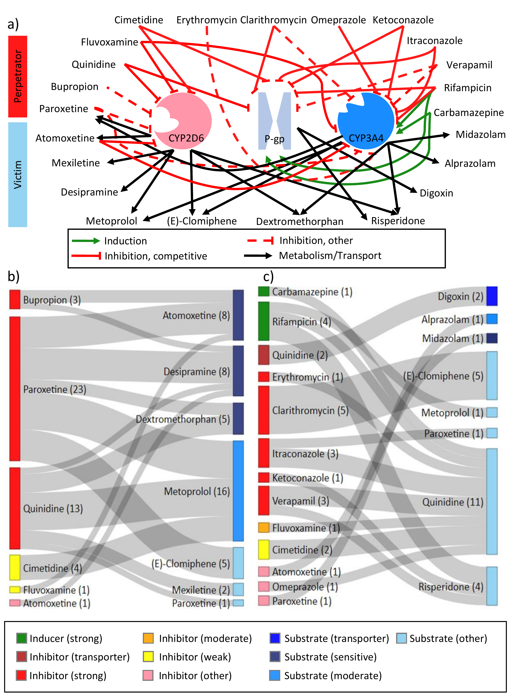

**Figure 1-1: CYP2D6 DDGI modeling network**

### Qualification input manifest

The qualification plan imports the snapshots listed below. A commit link identifies an immutable input. `Pending` identifies a mutable development reference that must be replaced before release. The release column gives the corresponding published release when one is available.

| Project | Type | Repository | Snapshot path | Commit | Release |
| --- | --- | --- | --- | --- | --- |
| Quinidine-Dextromethorphan-DDI | Interaction project | [Quinidine-Dextromethorphan-DDI](https://github.com/SRuedesh/Quinidine-Dextromethorphan-DDI) | [Quinidine-Dextromethorphan-DDI.json](https://raw.githubusercontent.com/SRuedesh/Quinidine-Dextromethorphan-DDI/130705a63d03b8131e7854bda3ea42a039fe1daf/Quinidine-Dextromethorphan-DDI.json) | [130705a](https://github.com/SRuedesh/Quinidine-Dextromethorphan-DDI/commit/130705a63d03b8131e7854bda3ea42a039fe1daf) | — |
| Quinidine-Digoxin-DDI | Interaction project | [Quinidine-Digoxin-DDI](https://github.com/SRuedesh/Quinidine-Digoxin-DDI) | [Quinidine-Digoxin-DDI.json](https://raw.githubusercontent.com/SRuedesh/Quinidine-Digoxin-DDI/60368a8137280bbb495c257874445f1fea102b8b/Quinidine-Digoxin-DDI.json) | [60368a8](https://github.com/SRuedesh/Quinidine-Digoxin-DDI/commit/60368a8137280bbb495c257874445f1fea102b8b) | — |
| Quinidine-Mexiletine-DDGI | Interaction project | [Quinidine-Mexiletine-DDGI](https://github.com/SRuedesh/Quinidine-Mexiletine-DDGI) | [Quinidine-Mexiletine-DDGI.json](https://raw.githubusercontent.com/SRuedesh/Quinidine-Mexiletine-DDGI/ad572764185123e1bebd9505f6cdc20c6693d22b/Quinidine-Mexiletine-DDGI.json) | [ad57276](https://github.com/SRuedesh/Quinidine-Mexiletine-DDGI/commit/ad572764185123e1bebd9505f6cdc20c6693d22b) | — |
| Quinidine-Paroxetine-DDI | Interaction project | [Quinidine-Paroxetine-DDI](https://github.com/SRuedesh/Quinidine-Paroxetine-DDI) | [Quinidine-Paroxetine-DDI.json](https://raw.githubusercontent.com/SRuedesh/Quinidine-Paroxetine-DDI/f90df12a6fce389139733663bdfd6375da7e5b69/Quinidine-Paroxetine-DDI.json) | [f90df12](https://github.com/SRuedesh/Quinidine-Paroxetine-DDI/commit/f90df12a6fce389139733663bdfd6375da7e5b69) | — |
| Carbamazepine-Quinidine-DDI | Interaction project | [Carbamazepine-Quinidine-DDI](https://github.com/SRuedesh/Carbamazepine-Quinidine-DDI) | [Carbamazepine-Quinidine-DDI.json](https://raw.githubusercontent.com/SRuedesh/Carbamazepine-Quinidine-DDI/4d6a3808f09f86b363de47ea0cf499056838e8c2/Carbamazepine-Quinidine-DDI.json) | [4d6a380](https://github.com/SRuedesh/Carbamazepine-Quinidine-DDI/commit/4d6a3808f09f86b363de47ea0cf499056838e8c2) | — |
| Cimetidine-Quinidine-DDI | Interaction project | [Cimetidine-Quinidine-DDI](https://github.com/SRuedesh/Cimetidine-Quinidine-DDI) | [Cimetidine-Quinidine-DDI.json](https://raw.githubusercontent.com/SRuedesh/Cimetidine-Quinidine-DDI/d48911a06c30f61483dda31d1759af452024b184/Cimetidine-Quinidine-DDI.json) | [d48911a](https://github.com/SRuedesh/Cimetidine-Quinidine-DDI/commit/d48911a06c30f61483dda31d1759af452024b184) | — |
| Fluvoxamine-Quinidine-DDI | Interaction project | [Fluvoxamine-Quinidine-DDI](https://github.com/Open-Systems-Pharmacology/Fluvoxamine-Quinidine-DDI) | [Fluvoxamine-Quinidine-DDI.json](https://raw.githubusercontent.com/Open-Systems-Pharmacology/Fluvoxamine-Quinidine-DDI/a1c4dbce403f9ec56785409bdf9f8923e6385b26/Fluvoxamine-Quinidine-DDI.json) | [a1c4dbc](https://github.com/Open-Systems-Pharmacology/Fluvoxamine-Quinidine-DDI/commit/a1c4dbce403f9ec56785409bdf9f8923e6385b26) | — |
| Omeprazole-Quinidine-DDI | Interaction project | [Omeprazole-Quinidine-DDI](https://github.com/Open-Systems-Pharmacology/Omeprazole-Quinidine-DDI) | [Omeprazole-Quinidine-DDI.json](https://raw.githubusercontent.com/Open-Systems-Pharmacology/Omeprazole-Quinidine-DDI/c94744e07869170b3a9515ea65c84152aac54229/Omeprazole-Quinidine-DDI.json) | [c94744e](https://github.com/Open-Systems-Pharmacology/Omeprazole-Quinidine-DDI/commit/c94744e07869170b3a9515ea65c84152aac54229) | — |
| Rifampicin-Quinidine-DDI | Interaction project | [Rifampicin-Quinidine-DDI](https://github.com/SRuedesh/Rifampicin-Quinidine-DDI) | [Rifampicin-Quinidine-DDI.json](https://raw.githubusercontent.com/SRuedesh/Rifampicin-Quinidine-DDI/31e7ead216d155d8d6e93dbe541f5f0b20902326/Rifampicin-Quinidine-DDI.json) | [31e7ead](https://github.com/SRuedesh/Rifampicin-Quinidine-DDI/commit/31e7ead216d155d8d6e93dbe541f5f0b20902326) | — |
| Verapamil-Quinidine-DDI | Interaction project | [Verapamil-Quinidine-DDI](https://github.com/Open-Systems-Pharmacology/Verapamil-Quinidine-DDI) | [Verapamil-Quinidine-DDI.json](https://raw.githubusercontent.com/Open-Systems-Pharmacology/Verapamil-Quinidine-DDI/1c639aa68e641c760ef5db2ec85485b267fd933c/Verapamil-Quinidine-DDI.json) | [1c639aa](https://github.com/Open-Systems-Pharmacology/Verapamil-Quinidine-DDI/commit/1c639aa68e641c760ef5db2ec85485b267fd933c) | — |
| Paroxetine-Alprazolam-DDI | Interaction project | [Paroxetine-Alprazolam-DDI](https://github.com/Open-Systems-Pharmacology/Paroxetine-Alprazolam-DDI) | [Paroxetine-Alprazolam-DDI.json](https://raw.githubusercontent.com/Open-Systems-Pharmacology/Paroxetine-Alprazolam-DDI/a5e63065b8c45457aa87be1a4e1f7916990d3614/Paroxetine-Alprazolam-DDI.json) | [a5e6306](https://github.com/Open-Systems-Pharmacology/Paroxetine-Alprazolam-DDI/commit/a5e63065b8c45457aa87be1a4e1f7916990d3614) | — |
| Fluvoxamine-Atomoxetine-DDI | Interaction project | [Fluvoxamine-Atomoxetine-DDI](https://github.com/SRuedesh/Fluvoxamine-Atomoxetine-DDI) | [Fluvoxamine-Atomoxetine-DDI.json](https://raw.githubusercontent.com/SRuedesh/Fluvoxamine-Atomoxetine-DDI/75e0dc469b4e4bcde5bedbe83c91aa8a0579badf/Fluvoxamine-Atomoxetine-DDI.json) | [75e0dc4](https://github.com/SRuedesh/Fluvoxamine-Atomoxetine-DDI/commit/75e0dc469b4e4bcde5bedbe83c91aa8a0579badf) | — |
| Paroxetine-Atomoxetine-DDGI | Interaction project | [Paroxetine-Atomoxetine-DDGI](https://github.com/SRuedesh/Paroxetine-Atomoxetine-DDGI) | [Paroxetine-Atomoxetine-DDGI.json](https://raw.githubusercontent.com/SRuedesh/Paroxetine-Atomoxetine-DDGI/de844358842739d4509bb8b20ce0f8b3b318c2d0/Paroxetine-Atomoxetine-DDGI.json) | [de84435](https://github.com/SRuedesh/Paroxetine-Atomoxetine-DDGI/commit/de844358842739d4509bb8b20ce0f8b3b318c2d0) | — |
| Clarithromycin-Clomiphene-DDGI | Interaction project | [Clarithromycin-Clomiphene-DDGI](https://github.com/SRuedesh/Clarithromycin-Clomiphene-DDGI) | [Clarithromycin-Clomiphene-DDGI.json](https://raw.githubusercontent.com/SRuedesh/Clarithromycin-Clomiphene-DDGI/ecdc35a29363180b53de4000c7b7d4b3c38bcdb8/Clarithromycin-Clomiphene-DDGI.json) | [ecdc35a](https://github.com/SRuedesh/Clarithromycin-Clomiphene-DDGI/commit/ecdc35a29363180b53de4000c7b7d4b3c38bcdb8) | — |
| Paroxetine-Clomiphene-DDGI | Interaction project | [Paroxetine-Clomiphene-DDGI](https://github.com/Open-Systems-Pharmacology/Paroxetine-Clomiphene-DDGI) | [Paroxetine-Clomiphene-DDGI.json](https://raw.githubusercontent.com/Open-Systems-Pharmacology/Paroxetine-Clomiphene-DDGI/ebad9136cadb5db843bf938d9e1f998d2783d454/Paroxetine-Clomiphene-DDGI.json) | [ebad913](https://github.com/Open-Systems-Pharmacology/Paroxetine-Clomiphene-DDGI/commit/ebad9136cadb5db843bf938d9e1f998d2783d454) | — |
| Atomoxetine-Desipramine-DDI | Interaction project | [Atomoxetine-Desipramine-DDI](https://github.com/SRuedesh/Atomoxetine-Desipramine-DDI) | [Atomoxetine-Desipramine-DDI.json](https://raw.githubusercontent.com/SRuedesh/Atomoxetine-Desipramine-DDI/ebcf7cb3d3a3f434779d0e637602379be60dd34b/Atomoxetine-Desipramine-DDI.json) | [ebcf7cb](https://github.com/SRuedesh/Atomoxetine-Desipramine-DDI/commit/ebcf7cb3d3a3f434779d0e637602379be60dd34b) | — |
| Paroxetine-Desipramine-DDGI | Interaction project | [Paroxetine-Desipramine-DDGI](https://github.com/SRuedesh/Paroxetine-Desipramine-DDGI) | [Paroxetine-Desipramine-DDGI.json](https://raw.githubusercontent.com/SRuedesh/Paroxetine-Desipramine-DDGI/09a7393f648fbe8634f0ce7ef0310696c00f8cee/Paroxetine-Desipramine-DDGI.json) | [09a7393](https://github.com/SRuedesh/Paroxetine-Desipramine-DDGI/commit/09a7393f648fbe8634f0ce7ef0310696c00f8cee) | — |
| Quinidine-Desipramine-DDI | Interaction project | [Quinidine-Desipramine-DDI](https://github.com/SRuedesh/Quinidine-Desipramine-DDI) | [Quinidine-Desipramine-DDI.json](https://raw.githubusercontent.com/SRuedesh/Quinidine-Desipramine-DDI/c2643acb37a70be0bdfa9ee9a26f6a926fc5d075/Quinidine-Desipramine-DDI.json) | [c2643ac](https://github.com/SRuedesh/Quinidine-Desipramine-DDI/commit/c2643acb37a70be0bdfa9ee9a26f6a926fc5d075) | — |
| Paroxetine-Dextromethorphan-DDGI | Interaction project | [Paroxetine-Dextromethorphan-DDGI](https://github.com/SRuedesh/Paroxetine-Dextromethorphan-DDGI) | [Paroxetine-Dextromethorphan-DDGI.json](https://raw.githubusercontent.com/SRuedesh/Paroxetine-Dextromethorphan-DDGI/d9e0e241e1f9d5f1a7bebad6f4c7f217f7db235f/Paroxetine-Dextromethorphan-DDGI.json) | [d9e0e24](https://github.com/SRuedesh/Paroxetine-Dextromethorphan-DDGI/commit/d9e0e241e1f9d5f1a7bebad6f4c7f217f7db235f) | — |
| Cimetidine-Metoprolol-DDI | Interaction project | [Cimetidine-Metoprolol-DDI](https://github.com/SRuedesh/Cimetidine-Metoprolol-DDI) | [Cimetidine-Metoprolol-DDI-.json](https://raw.githubusercontent.com/SRuedesh/Cimetidine-Metoprolol-DDI/fb835f356c9edcf78421e0c613298defafaee741/Cimetidine-Metoprolol-DDI-.json) | [fb835f3](https://github.com/SRuedesh/Cimetidine-Metoprolol-DDI/commit/fb835f356c9edcf78421e0c613298defafaee741) | — |
| Paroxetine-Metoprolol-DDI | Interaction project | [Paroxetine-Metoprolol-DDI](https://github.com/Open-Systems-Pharmacology/Paroxetine-Metoprolol-DDI) | [Paroxetine-Metoprolol-DDI.json](https://raw.githubusercontent.com/Open-Systems-Pharmacology/Paroxetine-Metoprolol-DDI/5031c5129c4322ac670f7d79383eb04f9b49dea6/Paroxetine-Metoprolol-DDI.json) | [5031c51](https://github.com/Open-Systems-Pharmacology/Paroxetine-Metoprolol-DDI/commit/5031c5129c4322ac670f7d79383eb04f9b49dea6) | — |
| Quinidine-Metoprolol-DDGI | Interaction project | [Quinidine-Metoprolol-DDGI](https://github.com/Open-Systems-Pharmacology/Quinidine-Metoprolol-DDGI) | [Quinidine-Metoprolol-DDGI_v1.1.json](https://raw.githubusercontent.com/Open-Systems-Pharmacology/Quinidine-Metoprolol-DDGI/e7e414f0804844bf608baeff241326ba1727c912/Quinidine-Metoprolol-DDGI_v1.1.json) | [e7e414f](https://github.com/Open-Systems-Pharmacology/Quinidine-Metoprolol-DDGI/commit/e7e414f0804844bf608baeff241326ba1727c912) | [v1.1](https://github.com/Open-Systems-Pharmacology/Quinidine-Metoprolol-DDGI/releases/tag/v1.1) |
| Rifampicin-Metoprolol-DDI | Interaction project | [Rifampicin-Metoprolol-DDI](https://github.com/SRuedesh/Rifampicin-Metoprolol-DDI) | [Rifampicin-Metoprolol-DDI.json](https://raw.githubusercontent.com/SRuedesh/Rifampicin-Metoprolol-DDI/efaa377c6477ec4a3551eb06b459a2c3b0632b08/Rifampicin-Metoprolol-DDI.json) | [efaa377](https://github.com/SRuedesh/Rifampicin-Metoprolol-DDI/commit/efaa377c6477ec4a3551eb06b459a2c3b0632b08) | — |
| Atomoxetine-Midazolam-DDI | Interaction project | [Atomoxetine-Midazolam-DDI](https://github.com/SRuedesh/Atomoxetine-Midazolam-DDI) | [Atomoxetine-Midazolam-DDI.json](https://raw.githubusercontent.com/SRuedesh/Atomoxetine-Midazolam-DDI/c6b15fedec9b0e15a7998bee99636315c11d2a36/Atomoxetine-Midazolam-DDI.json) | [c6b15fe](https://github.com/SRuedesh/Atomoxetine-Midazolam-DDI/commit/c6b15fedec9b0e15a7998bee99636315c11d2a36) | — |
| Itraconazole-Paroxetine-DDI | Interaction project | [Itraconazole-Paroxetine-DDI](https://github.com/SRuedesh/Itraconazole-Paroxetine-DDI) | [Itraconazole-Paroxetine-DDI.json](https://raw.githubusercontent.com/SRuedesh/Itraconazole-Paroxetine-DDI/392cdf64eb3ffd04dca680029a3ffa57ee7b1eb4/Itraconazole-Paroxetine-DDI.json) | [392cdf6](https://github.com/SRuedesh/Itraconazole-Paroxetine-DDI/commit/392cdf64eb3ffd04dca680029a3ffa57ee7b1eb4) | — |
| Erythromycin-Quinidine-DDI | Interaction project | [Erythromycin-Quinidine-DDI](https://github.com/Open-Systems-Pharmacology/Erythromycin-Quinidine-DDI) | [Erythromycin-Quinidine-DDI.json](https://raw.githubusercontent.com/Open-Systems-Pharmacology/Erythromycin-Quinidine-DDI/d6e6784299f796b9ded4e0a58fcdb3b37f0d8413/Erythromycin-Quinidine-DDI.json) | [d6e6784](https://github.com/Open-Systems-Pharmacology/Erythromycin-Quinidine-DDI/commit/d6e6784299f796b9ded4e0a58fcdb3b37f0d8413) | — |
| Itraconazole-Quinidine-DDI | Interaction project | [Itraconazole-Quinidine-DDI](https://github.com/SRuedesh/Itraconazole-Quinidine-DDI) | [Itraconazole-Quinidine-DDI.json](https://raw.githubusercontent.com/SRuedesh/Itraconazole-Quinidine-DDI/a76b395f3ba9ad9661efa9661e818b8322bc177e/Itraconazole-Quinidine-DDI.json) | [a76b395](https://github.com/SRuedesh/Itraconazole-Quinidine-DDI/commit/a76b395f3ba9ad9661efa9661e818b8322bc177e) | — |
| Ketoconazole-Risperidone-DDI | Interaction project | [Ketoconazole-Risperidone-DDI](https://github.com/SRuedesh/Ketoconazole-Risperidone-DDI) | [Ketoconazole-Risperidone-DDI.json](https://raw.githubusercontent.com/SRuedesh/Ketoconazole-Risperidone-DDI/3785af24ae9041b3915cc31b39c48904381bbbe0/Ketoconazole-Risperidone-DDI.json) | [3785af2](https://github.com/SRuedesh/Ketoconazole-Risperidone-DDI/commit/3785af24ae9041b3915cc31b39c48904381bbbe0) | — |
| Rifampicin-Risperidone-DDI | Interaction project | [Rifampicin-Risperidone-DDI](https://github.com/SRuedesh/Rifampicin-Risperidone-DDI) | [Rifampicin-Risperidone-DDI.json](https://raw.githubusercontent.com/SRuedesh/Rifampicin-Risperidone-DDI/dc71052b8d9997792a82d753bd4082caf83e4f0e/Rifampicin-Risperidone-DDI.json) | [dc71052](https://github.com/SRuedesh/Rifampicin-Risperidone-DDI/commit/dc71052b8d9997792a82d753bd4082caf83e4f0e) | — |
| Verapamil-Risperidone-DDI | Interaction project | [Verapamil-Risperidone-DDI](https://github.com/SRuedesh/Verapamil-Risperidone-DDI) | [Verapamil-Risperidone-DDI.json](https://raw.githubusercontent.com/SRuedesh/Verapamil-Risperidone-DDI/4f2b6033442dfe9eca91fe238057079cb70c12b7/Verapamil-Risperidone-DDI.json) | [4f2b603](https://github.com/SRuedesh/Verapamil-Risperidone-DDI/commit/4f2b6033442dfe9eca91fe238057079cb70c12b7) | — |
| Clomiphene-DGI | Parent model | [Clomiphene-DGI](https://github.com/SRuedesh/Clomiphene-Model) | [Clomiphene-Model.json](https://raw.githubusercontent.com/SRuedesh/Clomiphene-Model/f04a04817bd199810af30a048f994d15719dce10/Clomiphene-Model.json) | [f04a048](https://github.com/SRuedesh/Clomiphene-Model/commit/f04a04817bd199810af30a048f994d15719dce10) | [v1.0](https://github.com/Open-Systems-Pharmacology/Clomiphene-Model/releases/tag/v1.0) |
| Atomoxetine-DGI | Parent model | [Atomoxetine-DGI](https://github.com/SRuedesh/Atomoxetine-Model) | [Atomoxetine-model.json](https://raw.githubusercontent.com/SRuedesh/Atomoxetine-Model/49e74b781a9ccd21421889ea6c0188655e60864c/Atomoxetine-model.json) | [49e74b7](https://github.com/SRuedesh/Atomoxetine-Model/commit/49e74b781a9ccd21421889ea6c0188655e60864c) | [v1.0](https://github.com/Open-Systems-Pharmacology/Atomoxetine-Model/releases/tag/v1.0) |
| Desipramine-DGI | Parent model | [Desipramine-DGI](https://github.com/SRuedesh/Desipramine-Model) | [Desipramine-Model.json](https://raw.githubusercontent.com/SRuedesh/Desipramine-Model/f6091e53d52e7da49baa42a7b238dc1ee7a55fc4/Desipramine-Model.json) | [f6091e5](https://github.com/SRuedesh/Desipramine-Model/commit/f6091e53d52e7da49baa42a7b238dc1ee7a55fc4) | [v1.0](https://github.com/Open-Systems-Pharmacology/Desipramine-Model/releases/tag/v1.0) |
| Dextromethorphan-DGI | Parent model | [Dextromethorphan-DGI](https://github.com/Open-Systems-Pharmacology/Dextromethorphan-Model) | [Dextromethorphan-model.json](https://raw.githubusercontent.com/Open-Systems-Pharmacology/Dextromethorphan-Model/3434c87ae86bd12bcf6242cf5bfa5d9021825bf2/Dextromethorphan-model.json) | [3434c87](https://github.com/Open-Systems-Pharmacology/Dextromethorphan-Model/commit/3434c87ae86bd12bcf6242cf5bfa5d9021825bf2) | — |
| Metoprolol-DGI | Parent model | [Metoprolol-DGI](https://github.com/SRuedesh/Metoprolol-Model) | [Metoprolol-Model.json](https://raw.githubusercontent.com/SRuedesh/Metoprolol-Model/4656e978f33d3ab583d1b96b9a88611454e56d7c/Metoprolol-Model.json) | [4656e97](https://github.com/SRuedesh/Metoprolol-Model/commit/4656e978f33d3ab583d1b96b9a88611454e56d7c) | — |
| Mexiletine-DGI | Parent model | [Mexiletine-DGI](https://github.com/Open-Systems-Pharmacology/Mexiletine-Model) | [Mexiletine-Model.json](https://raw.githubusercontent.com/Open-Systems-Pharmacology/Mexiletine-Model/fe9371155d52080d3f27734bf11804a82fbfeade/Mexiletine-Model.json) | [fe93711](https://github.com/Open-Systems-Pharmacology/Mexiletine-Model/commit/fe9371155d52080d3f27734bf11804a82fbfeade) | [v2.0](https://github.com/Open-Systems-Pharmacology/Mexiletine-Model/releases/tag/v2.0) |
| Paroxetine-DGI | Parent model | [Paroxetine-DGI](https://github.com/SRuedesh/Paroxetine-Model) | [Paroxetine-Model.json](https://raw.githubusercontent.com/SRuedesh/Paroxetine-Model/27ded16e5a4aca32dbbd90704a13e94e4eb54531/Paroxetine-Model.json) | [27ded16](https://github.com/SRuedesh/Paroxetine-Model/commit/27ded16e5a4aca32dbbd90704a13e94e4eb54531) | [v1.0](https://github.com/Open-Systems-Pharmacology/Paroxetine-Model/releases/tag/v1.0) |
| Risperidone-DGI | Parent model | [Risperidone-DGI](https://github.com/SRuedesh/Risperidone-Model) | [Risperidone-model.json](https://raw.githubusercontent.com/SRuedesh/Risperidone-Model/c2e31e374cb9eaefc32440fa9d170f7a57df43ba/Risperidone-model.json) | [c2e31e3](https://github.com/SRuedesh/Risperidone-Model/commit/c2e31e374cb9eaefc32440fa9d170f7a57df43ba) | [v1.0](https://github.com/Open-Systems-Pharmacology/Risperidone-Model/releases/tag/v1.0) |

Bupropion interactions are retained as network context only. They are not imported into the quantitative qualification because the available interaction simulations are MoBi-only projects that the automatic qualification workflow cannot process.
### Deviations from parent-model snapshots

Some interaction-project snapshots contain prespecified mechanism parameters that are absent from the corresponding parent-model snapshot. Table 1-1 records these deviations. The qualification workflow does not optimize these values during report generation.

| **Interaction project** | **Parameter not present in parent snapshot** | **Value** | **Source or justification** |
| --- | --- | ---: | --- |
| Fluvoxamine-atomoxetine | CYP2D6 competitive inhibition $K_i$ | 8.2 µmol/L | Prespecified in the [interaction snapshot](https://raw.githubusercontent.com/Open-Systems-Pharmacology/Fluvoxamine-Atomoxetine-DDI/main/Fluvoxamine-Atomoxetine-DDI.json); external source or methodological justification is not documented in the project repository. |
| Fluvoxamine-atomoxetine | CYP2C19 competitive inhibition $K_i$ | 3.6 nmol/L | Prespecified in the [interaction snapshot](https://raw.githubusercontent.com/Open-Systems-Pharmacology/Fluvoxamine-Atomoxetine-DDI/main/Fluvoxamine-Atomoxetine-DDI.json); external source or methodological justification is not documented in the project repository. |
| Fluvoxamine-quinidine | CYP2D6 competitive inhibition $K_i$ | 1.7 µmol/L | Prespecified in the [interaction snapshot](https://raw.githubusercontent.com/Open-Systems-Pharmacology/Fluvoxamine-Quinidine-DDI/main/Fluvoxamine-Quinidine-DDI.json); external source or methodological justification is not documented in the project repository. |
| Fluvoxamine-quinidine | CYP2C19 competitive inhibition $K_i$ | 3.6 nmol/L | Prespecified in the [interaction snapshot](https://raw.githubusercontent.com/Open-Systems-Pharmacology/Fluvoxamine-Quinidine-DDI/main/Fluvoxamine-Quinidine-DDI.json); external source or methodological justification is not documented in the project repository. |

**Table 1-1: Prespecified interaction-project parameters that are absent from the parent fluvoxamine snapshot.**

The available project documentation does not explain why the two interaction snapshots use different CYP2D6 $K_i$ values for fluvoxamine. This report records the difference and does not interpret it as study-specific calibration.

The following interaction scenarios were predicted and used to qualify the final DDGI network:

- Alprazolam as victim:
  - Paroxetine-alprazolam-DDI

- Atomoxetine as victim:
  - Fluvoxamine-atomoxetine-DDI
  - Paroxetine-atomoxetine-DDGI

- (E)-Clomiphene as victim:
  - Clarithromycin-clomiphene-DDGI
  - Paroxetine-clomiphene-DDGI

- Desipramine as victim:
  - Atomoxetine-desipramine-DDI
  - Paroxetine-desipramine-DDGI
  - Quinidine-desipramine-DDI

- Dextromethorphan as victim:
  - Paroxetine-dextromethorphan-DDGI
  - Quinidine-dextromethorphan-DDI

- Digoxin as victim: 
  - Quinidine-digoxin-DDI

- Metoprolol as victim:
  - Cimetidine-metoprolol-DDI
  - Paroxetine-metoprolol-DDI
  - Quinidine-metoprolol-DDGI
  - Rifampicin-metoprolol-DDI

- Mexiletine as victim: 
  - Quinidine-mexiletine-DDGI

- Midazolam as victim: 
  - Atomoxetine-midazolam-DDI

- Paroxetine as victim:
  - Itraconazole-paroxetine-DDI
  - Quinidine-paroxetine-DDI

- Quinidine as victim: 
  - Carbamazepine-quinidine-DDI
  - Cimetidine-quinidine-DDI
  - Erythromycin-quinidine-DDI
  - Fluvoxamine-quinidine-DDI
  - Itraconazole-quinidine-DDI
  - Omeprazole-quinidine-DDI
  - Rifampicin-quinidine-DDI
  - Verapamil-quinidine-DDI

- Risperidone as victim:
  - Ketoconazole-risperidone-DDI
  - Rifampicin-risperidone-DDI
  - Verapamil-risperidone-DDI

The published DD(G)I studies between the respective perpetrators and victim drugs were simulated and compared to observed data. The following sections give an overview of the clinical studies being part of this qualification report.

## 1.3 DDI Clinical Studies

### 1.3.1 Atomoxetine - Desipramine DDI

The atomoxetine-desipramine interaction was evaluated using clinical DDI studies listed in [Table 2-7](#table-2-7).

| **DataID** | **Source**                    | **Route** | **Schedule** | **Pop.** | **Sex** | **N** | **Perpetrator**          |
| --- | ----------------------------- | --------- | ------------ | -------- | ------- | ----- | ------------------------ |
| 17078 | [Sauer 2004](#references)   | po        | 50 mg s.d.   | American | m       | 22    | +/- ATO, 60 mg b.i.d. po |

**Table 2-7: Clinical studies included for atomoxetine-desipramine DDI** ATO: atomoxetine, b.i.d.: twice daily, m: male, N: number of study participants, po: oral, pop.: population used in simulations, s.d.: single dose. If perpetrator or victim drugs were applied in form of salts, the respective dose of base was calculated and incorporated in simulations.

Source project: [Atomoxetine-Desipramine-DDI](https://github.com/Open-Systems-Pharmacology/Atomoxetine-Desipramine-DDI).

### 1.3.2 Atomoxetine - Midazolam DDI

The atomoxetine-midazolam interaction was evaluated using the two comparison periods listed in [Table 2-14](#table-2-14). Both periods use the day-1 midazolam profile as the control.

| **DataID** | **Source** | **Route** | **Schedule** | **Pop.** | **Sex** | **N** | **Perpetrator** |
| --- | --- | --- | --- | --- | --- | --- | --- |
| 17154 | [Sauer 2004](#references) | po | 5 mg s.d., day 6 | American | f | 8 | +/- ATO, 60 mg b.i.d. po |
| 17156 | [Sauer 2004](#references) | po | 5 mg s.d., day 12 | American | f | 8 | +/- ATO, 60 mg b.i.d. po |

**Table 2-14: Clinical study periods included for the atomoxetine-midazolam DDI.** ATO: atomoxetine, b.i.d.: twice daily, DDI: drug-drug interaction, f: female, N: number of study participants, po: oral, pop.: population used in simulations, s.d.: single dose.

Source project: [Atomoxetine-Midazolam-DDI](https://github.com/Open-Systems-Pharmacology/Atomoxetine-Midazolam-DDI).

### 1.3.3 Carbamazepine - Quinidine DDI

The carbamazepine-quinidine interaction was evaluated using clinical DDI studies listed in [Table 2-17](#table-2-17).

| **DataID** | **Source**                     | **Route** | **Schedule** | **Pop.** | **Sex** | **N** | **Perpetrator**              |
| --- | ------------------------------ | --------- | ------------ | -------- | ------- | ----- | ---------------------------- |
| 16956, 16958 | [Andreasen 2007](#references)| po        | 200 mg s.d.  | European | m       | 10    | +/- CBZ, 200/400 mg b.i.d. po|

**Table 2-17: Clinical studies included for carbamazepine-quinidine DDI** b.i.d.: twice daily, CBZ: carbamazepine, m: male, N: number of study participants, po: oral, pop.: population used in simulations, s.d.: single dose. If perpetrator or victim drugs were applied in form of salts, the respective dose of base was calculated and incorporated in simulations.

Source project: [Carbamazepine-Quinidine-DDI](https://github.com/Open-Systems-Pharmacology/Carbamazepine-Quinidine-DDI).

### 1.3.4 Cimetidine - Metoprolol DDI

The cimetidine-metoprolol interaction was evaluated using clinical DDI studies listed in [Table 2-11](#table-2-11).

| **DataID** | **Source**                           | **Route** | **Schedule**  | **Pop.** | **Sex** | **N** | **Perpetrator**               |
| --- | ------------------------------------ | --------- | ------------- | -------- | ------- | ----- | ----------------------------- |
| 17108 | [Chellingsworth 1988](#references) | po        | 100 mg s.d.   | European | m       | 12    | +/- CIM, 800 mg q.d. po       |
| 17110 | [Chellingsworth 1988](#references) | po        | 100 mg b.i.d. | European | m       | 12    | +/- CIM, 800 mg q.d. po       |
| 17112 | [Toon 1988](#references)           | po        | 100 mg b.i.d. | European | m       | 12    | +/- CIM, 800 mg q.d. po       |
| 17114 | [Kirch 1982](#references)          | po        | 100 mg b.i.d. | European | m       | 6     | +/- CIM, 200/400 mg q.i.d. po |

**Table 2-11: Clinical studies included for cimetidine-metoprolol DDI** b.i.d.: twice daily, CIM: cimetidine, m: male, N: number of study participants, po: oral, pop.: population used in simulations, q.d.: once daily, q.i.d.: four times daily, s.d.: single dose. If perpetrator or victim drugs were applied in form of salts, the respective dose of base was calculated and incorporated in simulations.

Source project: [Cimetidine-Metoprolol-DDI](https://github.com/Open-Systems-Pharmacology/Cimetidine-Metoprolol-DDI).

### 1.3.5 Cimetidine - Quinidine DDI

The cimetidine-quinidine interaction was evaluated using clinical DDI studies listed in [Table 2-18](#table-2-18).

| **DataID** | **Source**                    | **Route** | **Schedule** | **Pop.** | **Sex** | **N** | **Perpetrator**           |
| --- | ----------------------------- | --------- | ------------ | -------- | ------- | ----- | ------------------------- |
| 16960 | [Kolb 1984](#references)    | po        | 400 mg s.d.  | American | m       | 9     | +/- CIM, 300 mg q.d. po   |
| 16962 | [Hardy 1988](#references)   | po        | 400 mg s.d.  | American | m       | 9     | +/- CIM, 300 mg q.i.d. po |

**Table 2-18: Clinical studies included for cimetidine-quinidine DDI** CIM: cimetidine, m: male, N: number of study participants, po: oral, pop.: population used in simulations, q.d.: once daily, q.i.d.: four times daily, s.d.: single dose. If perpetrator or victim drugs were applied in form of salts, the respective dose of base was calculated and incorporated in simulations.

Source project: [Cimetidine-Quinidine-DDI](https://github.com/Open-Systems-Pharmacology/Cimetidine-Quinidine-DDI).

### 1.3.6 Erythromycin - Quinidine DDI

The erythromycin-quinidine interaction was evaluated using clinical DDI studies listed in [Table 2-19](#table-2-19).

| **DataID** | **Source**                            | **Route** | **Schedule**  | **Pop.** | **Sex** | **N** | **Perpetrator**           |
| --- | ------------------------------------- | --------- | ------------- | -------- | ------- | ----- | ------------------------- |
| 17160 | [Damkier 1999b](#references)  | po        | 200 mg s.d.    | European | m       | 6     | +/- ERY, 250 mg q.i.d. po |

**Table 2-19: Clinical studies included for erythromycin-quinidine DDI** ERY: erythromycin, m: male, N: number of study participants, po: oral, pop.: population used in simulations, q.i.d.: four times daily, s.d.: single dose. If perpetrator or victim drugs were applied in form of salts, the respective dose of base was calculated and incorporated in simulations.

Source project: [Erythromycin-Quinidine-DDI](https://github.com/Open-Systems-Pharmacology/Erythromycin-Quinidine-DDI).

### 1.3.7 Fluvoxamine - Atomoxetine DDI

The fluvoxamine-atomoxetine interaction was evaluated using the crossover dataset summarized in [Table 2-6](#table-2-6). The interaction snapshot compares atomoxetine exposure without and with fluvoxamine-mediated CYP2D6 inhibition.

| **DataID** | **Source**                 | **Route** | **Schedule** | **Pop.** | **Sex** | **N** | **Perpetrator**              |
| --- | -------------------------- | --------- | ------------ | -------- | ------- | ----- | ---------------------------- |
| 16986 | [Todor 2017](#references) | po        | 25 mg s.d.   | European | m       | 18    | +/- FLV, 50-100 mg q.d. po   |

**Table 2-6: Clinical studies included for fluvoxamine-atomoxetine DDI** FLV: fluvoxamine, m: male, N: number of study participants, po: oral, pop.: population used in simulations, q.d.: once daily, s.d.: single dose. If perpetrator or victim drugs were applied in form of salts, the respective dose of base was calculated and incorporated in simulations.

Source project: [Fluvoxamine-Atomoxetine-DDI](https://github.com/Open-Systems-Pharmacology/Fluvoxamine-Atomoxetine-DDI).

### 1.3.8 Fluvoxamine - Quinidine DDI

The fluvoxamine-quinidine interaction was evaluated using clinical DDI studies listed in [Table 2-20](#table-2-20).

| **DataID** | **Source**                    | **Route** | **Schedule** | **Pop.** | **Sex** | **N** | **Perpetrator**         |
| --- | ----------------------------- | --------- | ------------ | -------- | ------- | ----- | ----------------------- |
| 16964, 16966 | [Damkier 1999a](#references)| po        | 200 mg s.d.  | American | m       | 6     | +/- FLV, 100 mg q.d. po |

**Table 2-20: Clinical studies included for fluvoxamine-quinidine DDI** FLV: fluvoxamine, m: male, N: number of study participants, po: oral, pop.: population used in simulations, q.d.: once daily, s.d.: single dose. If perpetrator or victim drugs were applied in form of salts, the respective dose of base was calculated and incorporated in simulations.

Source project: [Fluvoxamine-Quinidine-DDI](https://github.com/Open-Systems-Pharmacology/Fluvoxamine-Quinidine-DDI).

### 1.3.9 Itraconazole - Paroxetine DDI

The itraconazole-paroxetine interaction was evaluated using clinical DDI studies listed in [Table 2-15](#table-2-15).

| **DataID** | **Source**                            | **Route** | **Schedule**  | **Pop.** | **Sex** | **N** | **Perpetrator**           |
| --- | ------------------------------------- | --------- | ------------- | -------- | ------- | ----- | ------------------------- |
| 17158 | [Yasui-Furukori 2007](#references)  | po        | 20 mg s.d.    | Japanese | f       | 13    | +/- ITR, 100 mg b.i.d. po |

**Table 2-15: Clinical studies included for itraconazole-paroxetine DDI** b.i.d.: twice daily, f: female, ITR: itraconazole, N: number of study participants, po: oral, pop.: population used in simulations, s.d.: single dose. If perpetrator or victim drugs were applied in form of salts, the respective dose of base was calculated and incorporated in simulations.

Source project: [Itraconazole-Paroxetine-DDI](https://github.com/Open-Systems-Pharmacology/Itraconazole-Paroxetine-DDI).

### 1.3.10 Itraconazole - Quinidine DDI

The itraconazole-quinidine interaction was evaluated using clinical DDI studies listed in [Table 2-21](#table-2-21).

| **DataID** | **Source**                      | **Route** | **Schedule**  | **Pop.** | **Sex** | **N** | **Perpetrator**           |
| --- | ------------------------------- | --------- | ------------- | -------- | ------- | ----- | ------------------------- |
| 17162 | [Kaukonen 1997](#references)  | po        | 100 mg s.d.   | European | f       | 9     | +/- ITR, 200 mg q.d. po   |
| 17164 | [Damkier 1999b](#references)  | po        | 200 mg s.d.   | European | m       | 6     | +/- ITR, 100 mg q.d. po   |

**Table 2-21: Clinical studies included for itraconazole-quinidine DDI** f: female, ITR: itraconazole, m: male, N: number of study participants, po: oral, pop.: population used in simulations, q.d.: once daily, s.d.: single dose. If perpetrator or victim drugs were applied in form of salts, the respective dose of base was calculated and incorporated in simulations.

Source project: [Itraconazole-Quinidine-DDI](https://github.com/Open-Systems-Pharmacology/Itraconazole-Quinidine-DDI).

### 1.3.11 Ketoconazole - Risperidone DDI

The ketoconazole-risperidone interaction was evaluated using clinical DDI studies listed in [Table 2-25](#table-2-25).

| **DataID** | **Source**                      | **Route** | **Schedule**  | **Pop.** | **Sex** | **N** | **Perpetrator**           |
| --- | ------------------------------- | --------- | ------------- | -------- | ------- | ----- | ------------------------- |
| 17166, 17168 | [Mahatthanatrakul 2012](#references)  | po        | 2 mg s.d.   | Asian | m       | 10     | +/- KET, 200 mg q.d. po   |

**Table 2-25: Clinical studies included for ketoconazole-risperidone DDI** KET: ketoconazole, m: male, N: number of study participants, po: oral, pop.: population used in simulations, q.d.: once daily, s.d.: single dose. If perpetrator or victim drugs were applied in form of salts, the respective dose of base was calculated and incorporated in simulations.

Source project: [Ketoconazole-Risperidone-DDI](https://github.com/Open-Systems-Pharmacology/Ketoconazole-Risperidone-DDI).

### 1.3.12 Omeprazole - Quinidine DDI

The omeprazole-quinidine interaction was evaluated using clinical DDI studies listed in [Table 2-22](#table-2-22).

| **DataID** | **Source**                    | **Route** | **Schedule** | **Pop.** | **Sex** | **N** | **Perpetrator**         |
| --- | ----------------------------- | --------- | ------------ | -------- | ------- | ----- | ----------------------- |
| 16968, 16970 | [Ching 1991](#references)   | po        | 400 mg s.d.  | European | m       | 8     | +/- OME, 40 mg q.d. po  |

**Table 2-22: Clinical studies included for omeprazole-quinidine DDI** m: male, N: number of study participants, OME: omeprazole, po: oral, pop.: population used in simulations, q.d.: once daily, s.d.: single dose. If perpetrator or victim drugs were applied in form of salts, the respective dose of base was calculated and incorporated in simulations.

Source project: [Omeprazole-Quinidine-DDI](https://github.com/Open-Systems-Pharmacology/Omeprazole-Quinidine-DDI).

### 1.3.13 Paroxetine - Alprazolam DDI

The paroxetine-alprazolam interaction was evaluated using clinical DDI studies listed in [Table 2-5](#table-2-5).

| **DataID** | **Source**                    | **Route** | **Schedule** | **Pop.** | **Sex** | **N** | **Perpetrator**         |
| --- | ----------------------------- | --------- | ------------ | -------- | ------- | ----- | ----------------------- |
| 16980 | [Calvo 2004](#references)   | po        | 1 mg q.d.    | European | f       | 22    | +/- PAR, 20 mg q.d. po  |

**Table 2-5: Clinical studies included for paroxetine-alprazolam DDI** f: female, N: number of study participants, PAR: paroxetine, po: oral, pop.: population used in simulations, q.d.: once daily. If perpetrator or victim drugs were applied in form of salts, the respective dose of base was calculated and incorporated in simulations.

Source project: [Paroxetine-Alprazolam-DDI](https://github.com/Open-Systems-Pharmacology/Paroxetine-Alprazolam-DDI).

### 1.3.14 Paroxetine - Metoprolol DDI

The paroxetine-metoprolol interaction was evaluated using clinical DDI studies listed in [Table 2-12](#table-2-12).

| **DataID** | **Source**                     | **Route** | **Schedule**  | **Pop.** | **Sex** | **N** | **Perpetrator**          |
| --- | ------------------------------ | --------- | ------------- | -------- | ------- | ----- | ------------------------ |
| 17116 | [Stout 2011](#references)    | po        | 50 mg s.d.    | American | m       | 10    | +/- PAR, 10 mg b.i.d. po |
| 17118 | [Stout 2011](#references)    | po        | 100 mg s.d.   | American | m       | 10    | +/- PAR, 10 mg b.i.d. po |
| 17120, 17122 | [Parker 2011](#references)   | po        | 100 mg s.d.   | American | m       | 12    | +/- PAR, 20 mg q.d. po   |
| 17124, 17126 | [Parker 2011](#references)   | po        | 100 mg b.i.d. | American | m       | 12    | +/- PAR, 20 mg q.d. po   |
| 17128, 17130 | [Parker 2011](#references)   | po        | 200 mg s.d.   | American | m       | 12    | +/- PAR, 20 mg q.d. po   |
| 17132, 17134 | [Hemeryck 2000](#references) | po        | 100 mg s.d.   | European | m       | 8     | +/- PAR, 10 mg b.i.d. po |

**Table 2-12: Clinical studies included for paroxetine-metoprolol DDI** b.i.d.: twice daily, m: male, N: number of study participants, PAR: paroxetine, po: oral, pop.: population used in simulations, q.d.: once daily, s.d.: single dose. If perpetrator or victim drugs were applied in form of salts, the respective dose of base was calculated and incorporated in simulations.

Source project: [Paroxetine-Metoprolol-DDI](https://github.com/Open-Systems-Pharmacology/Paroxetine-Metoprolol-DDI).

### 1.3.15 Quinidine - Desipramine DDI

The quinidine-desipramine interaction was evaluated using clinical DDI studies listed in [Table 2-8](#table-2-8).

| **DataID** | **Source**                    | **Route** | **Schedule** | **Pop.** | **Sex** | **N** | **Perpetrator**           |
| --- | ----------------------------- | --------- | ------------ | -------- | ------- | ----- | ----------------------- |
| 17096 | [Brøsen 1989](#references)  | po        | 100 mg s.d.  | European | m       | 6     | +/- QUI, 200 mg q.d. po |

**Table 2-8: Clinical studies included for quinidine-desipramine DDI** m: male, N: number of study participants, po: oral, pop.: population used in simulations, q.d.: once daily, QUI: quinidine, s.d.: single dose. If perpetrator or victim drugs were applied in form of salts, the respective dose of base was calculated and incorporated in simulations.

Source project: [Quinidine-Desipramine-DDI](https://github.com/SRuedesh/Quinidine-Desipramine-DDI).

### 1.3.16 Quinidine - Dextromethorphan DDI

The quinidine-dextromethorphan interaction was evaluated using clinical DDI studies listed in [Table 2-9](#table-2-9).

| **DataID** | **Source**                    | **Route** | **Schedule** | **Pop.** | **Sex** | **N** | **Perpetrator**         |
| --- | ----------------------------- | --------- | ------------ | -------- | ------- | ----- | ----------------------- |
| 16940 | [Capon 1996](#references)   | po        | 30 mg s.d.   | European | m       | 6 NM  | +/- QUI, 50 mg s.d. po  |
| 16944 | [Schadel 1995](#references) | po        | 30 mg s.d.   | American | f       | 5 NM  | +/- QUI, 100 mg s.d. po |

**Table 2-9: Clinical studies included for quinidine-dextromethorphan DDI** f: female, m: male, N: number of study participants, NM: CYP2D6 normal metabolizer, po: oral, pop.: population used in simulations, QUI: quinidine, s.d.: single dose. If perpetrator or victim drugs were applied in form of salts, the respective dose of base was calculated and incorporated in simulations.

Source project: [Quinidine-Dextromethorphan-DDI](https://github.com/Open-Systems-Pharmacology/Quinidine-Dextromethorphan-DDI).

### 1.3.17 Quinidine - Digoxin DDI

The quinidine-digoxin interaction was evaluated using clinical DDI studies listed in [Table 2-10](#table-2-10).

| **DataID** | **Source**                    | **Route** | **Schedule** | **Pop.** | **Sex** | **N** | **Perpetrator**           |
| --- | ----------------------------- | --------- | ------------ | -------- | ------- | ----- | ------------------------- |
| 16946 | [Steiness 1980](#references)| iv        | 10 µg/kg s.d.| European | m       | 6     | +/- QUI, 200 mg b.i.d. po |
| 16948 | [Ochs 1981](#references)    | iv        | 1 mg s.d.    | European | m       | 7     | +/- QUI, 200 mg q.i.d. po |

**Table 2-10: Clinical studies included for quinidine-digoxin DDI** b.i.d.: twice daily, m: male, iv: intravenous, N: number of study participants, po: oral, pop.: population used in simulations, q.i.d.: four times daily, QUI: quinidine, s.d.: single dose. If perpetrator or victim drugs were applied in form of salts, the respective dose of base was calculated and incorporated in simulations.

Source project: [Quinidine-Digoxin-DDI](https://github.com/SRuedesh/Quinidine-Digoxin-DDI).

### 1.3.18 Quinidine - Paroxetine DDI

The quinidine-paroxetine interaction was evaluated using clinical DDI studies listed in [Table 2-16](#table-2-16).

| **DataID** | **Source**                    | **Route** | **Schedule** | **Pop.** | **Sex** | **N** | **Perpetrator**          |
| --- | ----------------------------- | --------- | ------------ | -------- | ------- | ----- | ------------------------ |
| 16954 | [Schoedel 2012](#references)| po        | 20 mg q.d.   | American | m       | 14 NM | +/- QUI, 30 mg b.i.d. po |

**Table 2-16: Clinical studies included for quinidine-paroxetine DDI** m: male, N: number of study participants, NM: CYP2D6 normal metabolizer, po: oral, pop.: population used in simulations, q.d.: once daily, QUI: quinidine. If perpetrator or victim drugs were applied in form of salts, the respective dose of base was calculated and incorporated in simulations.

Source project: [Quinidine-Paroxetine-DDI](https://github.com/Open-Systems-Pharmacology/Quinidine-Paroxetine-DDI).

### 1.3.19 Rifampicin - Metoprolol DDI

The rifampicin-metoprolol interaction was evaluated using clinical DDI studies listed in [Table 2-13](#table-2-13).

| **DataID** | **Source**                     | **Route** | **Schedule**  | **Pop.** | **Sex** | **N** | **Perpetrator**           |
| --- | ------------------------------ | --------- | ------------- | -------- | ------- | ----- | ------------------------- |
| 17152 | [Bennett 1982](#references)  | po        | 100 mg s.d.   | European | m       | 12    | +/- RIF, 600 mg q.d. po   |

**Table 2-13: Clinical studies included for rifampicin-metoprolol DDI** m: male, N: number of study participants, po: oral, pop.: population used in simulations, q.d.: once daily, RIF: rifampicin, s.d.: single dose. If perpetrator or victim drugs were applied in form of salts, the respective dose of base was calculated and incorporated in simulations.

Source project: [Rifampicin-Metoprolol-DDI](https://github.com/Open-Systems-Pharmacology/Rifampicin-Metoprolol-DDI).

### 1.3.20 Rifampicin - Quinidine DDI

The rifampicin-quinidine interaction was evaluated using clinical DDI studies listed in [Table 2-23](#table-2-23).

| **DataID** | **Source**                    | **Route** | **Schedule** | **Pop.** | **Sex** | **N** | **Perpetrator**         |
| --- | ----------------------------- | --------- | ------------ | -------- | ------- | ----- | ----------------------- |
| 16972, 16974 | [Damkier 1999](#references) | po        | 200 mg s.d.  | European | m       | 6     | +/- RIF, 600 mg q.d. po |

**Table 2-23: Clinical studies included for rifampicin-quinidine DDI** m: male, N: number of study participants, po: oral, pop.: population used in simulations, q.d.: once daily, RIF: rifampicin, s.d.: single dose. If perpetrator or victim drugs were applied in form of salts, the respective dose of base was calculated and incorporated in simulations.

Source project: [Rifampicin-Quinidine-DDI](https://github.com/Open-Systems-Pharmacology/Rifampicin-Quinidine-DDI).

### 1.3.21 Rifampicin - Risperidone DDI

The rifampicin-risperidone interaction was evaluated using clinical DDI studies listed in [Table 2-26](#table-2-26).

| **DataID** | **Source**                            | **Route** | **Schedule**  | **Pop.** | **Sex** | **N** | **Perpetrator**           |
| --- | ------------------------------------- | --------- | ------------- | -------- | ------- | ----- | ------------------------- |
| 17170, 17172 | [Kim 2008](#references)             | po        | 1 mg s.d.     | Asian    | m       | 10    | +/- RIF, 600 mg q.d. po   |
| 17174 | [Mahatthanatrakul 2007](#references)| po        | 4 mg s.d.     | Asian    | m       | 10    | +/- RIF, 600 mg q.d. po   |

**Table 2-26: Clinical studies included for rifampicin-risperidone DDI** m: male, N: number of study participants, po: oral, pop.: population used in simulations, q.d.: once daily, RIF: rifampicin, s.d.: single dose. If perpetrator or victim drugs were applied in form of salts, the respective dose of base was calculated and incorporated in simulations.

Source project: [Rifampicin-Risperidone-DDI](https://github.com/Open-Systems-Pharmacology/Rifampicin-Risperidone-DDI).

### 1.3.22 Verapamil - Quinidine DDI

The verapamil-quinidine interaction was evaluated using clinical DDI studies listed in [Table 2-24](#table-2-24).

| **DataID** | **Source**                    | **Route** | **Schedule** | **Pop.** | **Sex** | **N** | **Perpetrator**          |
| --- | ----------------------------- | --------- | ------------ | -------- | ------- | ----- | ------------------------ |
| 16976 | [Edwards 1987](#references) | po        | 400 mg s.d.  | European | m       | 6     | +/- VER, 80 mg t.i.d. po |
| 16978 | [Edwards 1987](#references) | po        | 400 mg s.d.  | European | m       | 6     | +/- VER, 120 mg t.i.d. po|

**Table 2-24: Clinical studies included for verapamil-quinidine DDI** m: male, N: number of study participants, po: oral, pop.: population used in simulations, s.d.: single dose, t.i.d.: three times daily, VER: verapamil. If perpetrator or victim drugs were applied in form of salts, the respective dose of base was calculated and incorporated in simulations.

Source project: [Verapamil-Quinidine-DDI](https://github.com/Open-Systems-Pharmacology/Verapamil-Quinidine-DDI).

### 1.3.23 Verapamil - Risperidone DDI

The verapamil-risperidone interaction was evaluated using clinical DDI studies listed in [Table 2-27](#table-2-27).

| **DataID** | **Source**                     | **Route** | **Schedule**  | **Pop.** | **Sex** | **N** | **Perpetrator**           |
| --- | ------------------------------ | --------- | ------------- | -------- | ------- | ----- | ------------------------- |
| 17176, 17178 | [Nakagami 2005](#references) | po        | 1 mg s.d.     | Japanese | m       | 12    | +/- VER, 80 mg t.i.d. po  |

**Table 2-27: Clinical studies included for verapamil-risperidone DDI** m: male, N: number of study participants, po: oral, pop.: population used in simulations, s.d.: single dose, t.i.d.: three times daily, VER: verapamil. If perpetrator or victim drugs were applied in form of salts, the respective dose of base was calculated and incorporated in simulations.

Source project: [Verapamil-Risperidone-DDI](https://github.com/Open-Systems-Pharmacology/Verapamil-Risperidone-DDI).

## 1.4 DGI Clinical Studies

The following section evaluates drug-gene interaction (DGI) simulations without a perpetrator drug. These simulations isolate CYP2D6 activity-score effects on victim-drug and metabolite exposure and are interpreted separately from DDGI scenarios.

The DGI profiles are evaluated as study-specific evidence, not as interaction ratios. Each section identifies the clinical study, dose, route, and CYP2D6 group represented in its figures.

### 1.4.1 Atomoxetine DGI

Atomoxetine DGI profiles assess CYP2D6-dependent atomoxetine exposure. Each row represents one CYP2D6 group.

| **Ratio record ID** | **Source** | **Route** | **Schedule** | **CYP2D6 group** | **Pop.** | **Sex** | **N** |
| --- | --- | --- | --- | --- | --- | --- | ---: |
| 900021 | [Byeon 2015](#references) | po | 40 mg, dose-normalized | AS 0.5 | Asian | m | 18 |
| 900022 | [Byeon 2015](#references) | po | 40 mg, dose-normalized | AS 1.25 | Asian | m | 22 |
| — | [Byeon 2015](#references) | po | 40 mg, dose-normalized | AS 2 | Asian | m | 22 |
| 900023 | [Kim 2018](#references) | po | 20 mg s.d. | AS 0.5 | Asian | m | 8 |
| — | [Kim 2018](#references) | po | 20 mg s.d. | AS 2 | Asian | m | 11 |
| 900030 | [Jung 2020](#references) | po | 20 mg s.d. | AS 0 | Asian | m | 7 |
| 900031 | [Jung 2020](#references) | po | 20 mg s.d. | AS 1.25 | Asian | m | 9 |
| — | [Jung 2020](#references) | po | 20 mg s.d. | AS 2 | Asian | m | 10 |
| 900032 | [Sauer 2003](#references) | po | 20 mg b.i.d. | PM | European | m | 3 |
| — | [Sauer 2003](#references) | po | 20 mg b.i.d. | NM | European | m | 4 |
| 900033 | [Todor 2016](#references) | po | 25 mg s.d. | PM | European | NR | 2 |
| — | [Todor 2016](#references) | po | 25 mg s.d. | NM | European | NR | 18 |

AS: CYP2D6 activity score, b.i.d.: twice daily, m: male, N: number of study participants, NM: normal metabolizer, NR: not reported, PM: poor metabolizer, po: oral, pop.: population used in simulations, s.d.: single dose. A ratio record ID identifies a derived DGI ratio. A dash identifies the reference group and means that no separate ratio record was generated.

Source model snapshot: [Atomoxetine-Model](https://github.com/SRuedesh/Atomoxetine-Model).

### 1.4.2 Clomiphene DGI

Clomiphene DGI profiles compare plasma concentrations of (E)-clomiphene and its metabolites across CYP2D6 activity-score groups. Each row represents one CYP2D6 group.

| **Ratio record ID** | **Source** | **Route** | **Schedule** | **CYP2D6 group** | **Pop.** | **Sex** | **N** |
| --- | --- | --- | --- | --- | --- | --- | ---: |
| 900001, 900006, 900011, 900016 | [Mürdter 2016](#references) | po | 42 mg s.d. | AS 0 | European | f | 6 |
| 900002, 900007, 900012, 900017 | [Mürdter 2016](#references) | po | 42 mg s.d. | AS 0.5 | European | f | 4 |
| 900003, 900008, 900013, 900018 | [Mürdter 2016](#references) | po | 42 mg s.d. | AS 0.75 | European | f | 1 |
| 900004, 900009, 900014, 900019 | [Mürdter 2016](#references) | po | 42 mg s.d. | AS 1 | European | f | 2 |
| — | [Mürdter 2016](#references) | po | 42 mg s.d. | AS 2 | European | f | 3 |
| 900005, 900010, 900015, 900020 | [Mürdter 2016](#references) | po | 42 mg s.d. | AS 3 | European | f | 3 |

AS: CYP2D6 activity score, f: female, N: number of study participants, po: oral, pop.: population used in simulations, s.d.: single dose. Each ratio record ID identifies one derived ratio for one of the four analyzed compounds. A dash identifies the reference group and means that no separate ratio record was generated.

Source model snapshot: [Clomiphene-Model](https://github.com/SRuedesh/Clomiphene-Model).

### 1.4.3 Desipramine DGI

Desipramine DGI profiles assess CYP2D6-dependent desipramine exposure. Each row represents one CYP2D6 group.

| **Ratio record ID** | **Source** | **Route** | **Schedule** | **CYP2D6 group** | **Pop.** | **Sex** | **N** | **Analyte(s)** |
| --- | --- | --- | --- | --- | --- | --- | ---: | --- |
| 900042 | [Brøsen 1986](#references) | po | 100 mg s.d. | PM | European | 50% f | 6 | Desipramine |
| — | [Brøsen 1986](#references) | po | 100 mg s.d. | NM | European | 50% f | 6 | Desipramine |
| 900043, 900044 | [Brøsen 1986](#references) | po | 100 mg s.d. | fast NM | European | 50% f | 6 | Desipramine and 2-hydroxydesipramine |
| 900034 | [Brøsen 1988](#references) | iv | 50 mg s.d. | PM | European | 33% f | 3 | Desipramine |
| — | [Brøsen 1988](#references) | iv | 50 mg s.d. | NM | European | 75% f | 4 | Desipramine |
| 900035 | [Brøsen 1988](#references) | iv | 50 mg s.d. | fast NM | European | 50% f | 4 | Desipramine |
| 900036 | [Spina 1987](#references) | po | 25 mg s.d. | PM | European | 21% f | 6 | Desipramine |
| — | [Spina 1987](#references) | po | 25 mg s.d. | NM | European | 21% f | 8 | Desipramine |
| 900037 | [Brøsen 1993](#references) | po | 100 mg s.d. | PM | European | m | 8 | Desipramine |
| — | [Brøsen 1993](#references) | po | 100 mg s.d. | NM | European | m | 5 | Desipramine |
| 900038, 900039 | [Brøsen 1993](#references) | po | 100 mg s.d. | fast NM | European | m | 4 | Desipramine and 2-hydroxydesipramine |
| — | [Bergmann 2001](#references) | po | 100 mg s.d. | AS 2 | European | 83% f | 6 | Desipramine and 2-hydroxydesipramine |
| 900040, 900041 | [Bergmann 2001](#references) | po | 100 mg s.d. | AS 2.5 | European | 33% f | 6 | Desipramine and 2-hydroxydesipramine |

AS: CYP2D6 activity score, f: female, iv: intravenous, m: male, N: number of study participants, NM: normal metabolizer, PM: poor metabolizer, po: oral, pop.: population used in simulations, s.d.: single dose. A ratio record ID identifies a derived DGI ratio. A dash identifies the reference group and means that no separate ratio record was generated.

Source model snapshot: [Desipramine-Model](https://github.com/SRuedesh/Desipramine-Model).

### 1.4.4 Dextromethorphan DGI

Dextromethorphan DGI profiles assess CYP2D6-dependent parent-drug exposure and dextrorphan formation. Each row represents one CYP2D6 group.

| **Ratio record ID** | **Source** | **Route** | **Schedule** | **CYP2D6 group** | **Pop.** | **Sex** | **N** | **Analyte(s)** |
| --- | --- | --- | --- | --- | --- | --- | ---: | --- |
| 900050 | [Capon 1996](#references) | po | 30 mg s.d. | PM | European | NR | NR | Dextromethorphan |
| — | [Capon 1996](#references) | po | 30 mg s.d. | NM | European | m | 6 | Dextromethorphan |
| 900051 | [Gorski 2004](#references) | po | 30 mg s.d. | PM | NR | NR | NR | Dextromethorphan |
| — | [Gorski 2004](#references) | po | 30 mg s.d. | NM | NR | NR | NR | Dextromethorphan |
| 900047 | [Qiu 2016](#references) | po | 15 mg s.d. | AS 0.5 | NR | NR | NR | Dextromethorphan |
| 900048 | [Qiu 2016](#references) | po | 15 mg s.d. | AS 1.25 | NR | NR | NR | Dextromethorphan |
| — | [Qiu 2016](#references) | po | 15 mg s.d. | AS 2 | NR | NR | NR | Dextromethorphan |
| 900045, 900046 | [Storelli 2018](#references) | po | 5 mg s.d. | AS 1 | European | f | 16 | Dextromethorphan and dextrorphan |
| — | [Storelli 2018](#references) | po | 5 mg s.d. | AS 2 | European | f | 17 | Dextromethorphan and dextrorphan |
| 900049 | [Yamazaki 2017](#references) | po | 30 mg s.d. | AS 0.5 | Asian | NR | NR | Dextromethorphan |
| — | [Yamazaki 2017](#references) | po | 30 mg s.d. | AS 2 | Asian | NR | NR | Dextromethorphan |

AS: CYP2D6 activity score, f: female, m: male, N: number of study participants, NM: normal metabolizer, NR: not reported, PM: poor metabolizer, po: oral, pop.: population used in simulations, s.d.: single dose. A ratio record ID identifies a derived DGI ratio. A dash identifies the reference group and means that no separate ratio record was generated.

Source model snapshot: [Dextromethorphan-Model](https://github.com/Open-Systems-Pharmacology/Dextromethorphan-Model).

### 1.4.5 Metoprolol DGI

Metoprolol DGI profiles assess CYP2D6-dependent exposure of metoprolol and alpha-hydroxymetoprolol. Each row represents one CYP2D6 group. Racemate and enantiomer-specific endpoints are not pooled.

| **Ratio record ID** | **Source** | **Route** | **Schedule** | **CYP2D6 group** | **Pop.** | **Sex** | **N** | **Analyte(s)** |
| --- | --- | --- | --- | --- | --- | --- | ---: | --- |
| 900052 | [Leemann 1993](#references) | iv | 20 mg s.d. | PM | European | m | 3 | Metoprolol racemate |
| — | [Leemann 1993](#references) | iv | 20 mg s.d. | NM | European | m | 4 | Metoprolol racemate |
| 900053, 900054 | [Bae 2014](#references) | po | 100 mg s.d., IR | AS 0.5 | Asian | m | 3 | Metoprolol racemate and alpha-hydroxymetoprolol |
| — | [Bae 2014](#references) | po | 100 mg s.d., IR | AS 2 | Asian | m | 4 | Metoprolol racemate and alpha-hydroxymetoprolol |
| 900059 | [Hamelin 2000](#references) | po | 100 mg s.d., IR | PM | European | m | 6 | Metoprolol racemate |
| — | [Hamelin 2000](#references) | po | 100 mg s.d., IR | NM | European | m | 10 | Metoprolol racemate |
| 900063, 900064 | [Huang 1999](#references) | po | 100 mg s.d., IR | AS 0.5 | European | m | 12 | R- and S-metoprolol |
| 900065, 900066 | [Huang 1999](#references) | po | 100 mg s.d., IR | AS 1.25 | Asian | m | 12 | R- and S-metoprolol |
| — | [Huang 1999](#references) | po | 100 mg s.d., IR | AS 2 | Asian | m | 16 | R- and S-metoprolol |
| 900055, 900056 | [Jin 2008](#references) | po | 100 mg s.d., IR | AS 0.5 | Asian | 22% f | 5 | Metoprolol racemate and alpha-hydroxymetoprolol |
| 900057, 900058 | [Jin 2008](#references) | po | 100 mg s.d., IR | AS 1.25 | Asian | 22% f | 7 | Metoprolol racemate and alpha-hydroxymetoprolol |
| — | [Jin 2008](#references) | po | 100 mg s.d., IR | AS 2 | Asian | 22% f | 6 | Metoprolol racemate and alpha-hydroxymetoprolol |
| 900067, 900068 | [Kirchheiner 2004](#references) and [Seeringer 2008](#references) | po | 100 mg s.d., IR | AS 0 | European | m | 4 | R- and S-metoprolol |
| — | [Kirchheiner 2004](#references) and [Seeringer 2008](#references) | po | 100 mg s.d., IR | AS 2 | European | m | 13 | R- and S-metoprolol |
| 900069, 900070 | [Kirchheiner 2004](#references) and [Seeringer 2008](#references) | po | 100 mg s.d., IR | AS 3 | European | 8% f | 12 | R- and S-metoprolol |
| 900060, 900061, 900062 | [Sharma 2005](#references) | po | 100 mg s.d. | AS 0 | European | f | 4 | Metoprolol racemate and R- and S-metoprolol |
| — | [Sharma 2005](#references) | po | 100 mg s.d. | AS 1.5 | European | f | 16 | Metoprolol racemate and R- and S-metoprolol |

AS: CYP2D6 activity score, f: female, IR: immediate release, iv: intravenous, m: male, N: number of study participants, NM: normal metabolizer, NR: not reported, PM: poor metabolizer, po: oral, pop.: population used in simulations, s.d.: single dose. A ratio record ID identifies a derived DGI ratio. A dash identifies the reference group and means that no separate ratio record was generated.

Source model snapshot: [Metoprolol-Model](https://github.com/SRuedesh/Metoprolol-Model).

### 1.4.6 Mexiletine DGI

Mexiletine DGI profiles and ratios compare normal and poor metabolizer exposure. Each row represents one CYP2D6 group.

| **Ratio record ID** | **Source** | **Route** | **Schedule** | **CYP2D6 group** | **Pop.** | **Sex** | **N** |
| --- | --- | --- | --- | --- | --- | --- | ---: |
| 900072 | [Abolfathi 1993](#references) | po | 200 mg s.d. | PM | American | m | 4 |
| — | [Abolfathi 1993](#references) | po | 200 mg s.d. | NM | American | m | 10 |
| 900071 | [Labbé 2000](#references) | po | 100 mg b.i.d. | PM | HV | m/f | 1 |
| — | [Labbé 2000](#references) | po | 100 mg b.i.d. | NM | HV | m/f | 1 |

b.i.d.: twice daily, f: female, HV: healthy volunteers, m: male, N: number of study participants, NM: normal metabolizer, PM: poor metabolizer, po: oral, pop.: population used in simulations, s.d.: single dose. A ratio record ID identifies a derived DGI ratio. A dash identifies the reference group and means that no separate ratio record was generated.

Source model snapshot: [Mexiletine-Model](https://github.com/SRuedesh/Mexiletine-Model).

### 1.4.7 Paroxetine DGI

Paroxetine DGI profiles assess CYP2D6-dependent paroxetine exposure. Each row represents one CYP2D6 group.

| **Ratio record ID** | **Source** | **Route** | **Schedule** | **CYP2D6 group** | **Pop.** | **Sex** | **N** |
| --- | --- | --- | --- | --- | --- | --- | ---: |
| 900073 | [Chen 2015](#references) | po | 25 mg s.d. | AS 0.5 | Asian | 25% f | 4 |
| 900074 | [Chen 2015](#references) | po | 25 mg s.d. | AS 1 | Asian | 45% f | 11 |
| 900075 | [Chen 2015](#references) | po | 25 mg s.d. | AS 1.5 | Asian | 60% f | 5 |
| — | [Chen 2015](#references) | po | 25 mg s.d. | AS 2 | Asian | 25% f | 4 |
| 900077 | [Mürdter 2016](#references) | po | 40 mg q.d., 3 days | AS 0 | European | f | 3 |
| 900078 | [Mürdter 2016](#references) | po | 40 mg q.d., 3 days | AS 0.5 | European | f | 4 |
| 900079 | [Mürdter 2016](#references) | po | 40 mg q.d., 3 days | AS 0.75 | European | f | 1 |
| 900080 | [Mürdter 2016](#references) | po | 40 mg q.d., 3 days | AS 1 | European | f | 2 |
| — | [Mürdter 2016](#references) | po | 40 mg q.d., 3 days | AS 2 | European | f | 3 |
| 900081 | [Mürdter 2016](#references) | po | 40 mg q.d., 3 days | AS 3 | European | f | 3 |
| 900076 | [Sindrup 1992](#references) | po | 30 mg q.d., 14 doses | PM | European | m | 8 |
| — | [Sindrup 1992](#references) | po | 30 mg q.d., 14 doses | NM | European | m | 9 |
| 900082 | [Yoon 2000](#references) | po | 40 mg s.d. | AS 0 | Asian | f | 1 |
| 900083 | [Yoon 2000](#references) | po | 40 mg s.d. | AS 0.5 | Asian | m | 3 |
| 900084 | [Yoon 2000](#references) | po | 40 mg s.d. | AS 1.25 | Asian | m | 6 |
| — | [Yoon 2000](#references) | po | 40 mg s.d. | AS 2 | Asian | 17% f | 6 |

AS: CYP2D6 activity score, f: female, m: male, N: number of study participants, NM: normal metabolizer, PM: poor metabolizer, po: oral, pop.: population used in simulations, q.d.: once daily, s.d.: single dose. A ratio record ID identifies a derived DGI ratio. A dash identifies the reference group and means that no separate ratio record was generated.

Source model snapshot: [Paroxetine-Model](https://github.com/SRuedesh/Paroxetine-Model).

### 1.4.8 Risperidone DGI

Risperidone DGI profiles assess CYP2D6-dependent risperidone exposure and 9-hydroxyrisperidone formation. Each row represents one CYP2D6 group.

| **Ratio record ID** | **Source** | **Route** | **Schedule** | **CYP2D6 group** | **Pop.** | **Sex** | **N** | **Analyte(s)** |
| --- | --- | --- | --- | --- | --- | --- | ---: | --- |
| 900024, 900027 | [Novalbos 2010](#references) | po | 1 mg s.d. | AS 0 | European | 33% f | 6 | Risperidone and 9-hydroxyrisperidone |
| 900025, 900028 | [Novalbos 2010](#references) | po | 1 mg s.d. | AS 1 | European | 58% f | 26 | Risperidone and 9-hydroxyrisperidone |
| — | [Novalbos 2010](#references) | po | 1 mg s.d. | AS 2 | European | 55% f | 33 | Risperidone and 9-hydroxyrisperidone |
| 900026, 900029 | [Novalbos 2010](#references) | po | 1 mg s.d. | AS 3 | European | 17% f | 6 | Risperidone and 9-hydroxyrisperidone |
| 900085 | [Bondolfi 2002](#references) | po | 2 mg q.d. | PM | European | 27% f | 2 | Risperidone |
| — | [Bondolfi 2002](#references) | po | 2 mg q.d. | NM | European | 27% f | 8 | Risperidone |

AS: CYP2D6 activity score, f: female, N: number of study participants, NM: normal metabolizer, PM: poor metabolizer, po: oral, pop.: population used in simulations, q.d.: once daily, s.d.: single dose. A ratio record ID identifies a derived DGI ratio. A dash identifies the reference group and means that no separate ratio record was generated.

Source model snapshot: [Risperidone-Model](https://github.com/SRuedesh/Risperidone-Model).

## 1.5 DDGI Clinical Studies

### 1.5.1 Clarithromycin - Clomiphene DDGI

The clarithromycin-clomiphene interaction was evaluated using clinical DDGI studies listed in [Table 4-6](#table-4-6).

| **DataID** | **Source**                    | **Route** | **Schedule**  | **Pop.** | **Sex** | **N**   | **Perpetrator**            |
| --- | ----------------------------- | --------- | ------------- | -------- | ------- | ------- | -------------------------- |
| 16998, 17000, 17002, 17004 | [Mürdter 2016](#references) | po        | 42 mg s.d.    | European | f       | 5 AS0   | +/- CLA, 500 mg b.i.d. po  |
| 17006, 17008, 17010, 17012 | [Mürdter 2016](#references) | po        | 42 mg s.d.    | European | f       | 4 AS0.5 | +/- CLA, 500 mg b.i.d. po  |
| 17014, 17016, 17018, 17020 | [Mürdter 2016](#references) | po        | 42 mg s.d.    | European | f       | 2 AS1   | +/- CLA, 500 mg b.i.d. po  |
| 17022, 17024, 17026, 17028 | [Mürdter 2016](#references) | po        | 42 mg s.d.    | European | f       | 2 AS2   | +/- CLA, 500 mg b.i.d. po  |
| 17030, 17032, 17034, 17036 | [Mürdter 2016](#references) | po        | 42 mg s.d.    | European | f       | 2 AS3   | +/- CLA, 500 mg b.i.d. po  |

**Table 4-6: Clinical studies included for clarithromycin-clomiphene DDGI** AS: CYP2D6 activity score, b.i.d.: twice daily, CLA: clarithromycin, f: female, N: number of study participants, po: oral, pop.: population used in simulations, s.d.: single dose. If perpetrator or victim drugs were applied in form of salts, the respective dose of base was calculated and incorporated in simulations.

Source project: [Clarithromycin-Clomiphene-DDGI](https://github.com/Open-Systems-Pharmacology/Clarithromycin-Clomiphene-DDGI).

### 1.5.2 Paroxetine - Atomoxetine DDGI

The paroxetine-atomoxetine interaction was evaluated using clinical DDGI studies listed in [Table 4-5](#table-4-5).

| **DataID** | **Source**                    | **Route** | **Schedule**  | **Pop.** | **Sex** | **N**    | **Perpetrator**               |
| --- | ----------------------------- | --------- | ------------- | -------- | ------- | -------- | ----------------------------- |
| 16988 | [Jung 2020](#references)    | po        | 20 mg s.d.    | Asian    | m       | 7 AS0    | +/- PAR, 20 mg q.d. po        |
| 16990 | [Jung 2020](#references)    | po        | 20 mg s.d.    | Asian    | m       | 9 AS1.25 | +/- PAR, 20 mg q.d. po        |
| 16992 | [Jung 2020](#references)    | po        | 20 mg s.d.    | Asian    | m       | 10 AS2   | +/- PAR, 20 mg q.d. po        |
| 16994 | [Todor 2015](#references)   | po        | 25 mg s.d.    | European | m       | 22       | +/- PAR, 20 mg b.i.d./q.d. po |
| 16996 | [Belle 2002](#references)   | po        | 20 mg b.i.d.  | American | m       | 22       | +/- PAR, 20 mg q.d. po        |

**Table 4-5: Clinical studies included for paroxetine-atomoxetine DDGI** AS: CYP2D6 activity score, b.i.d.: twice daily, m: male, N: number of study participants, PAR: paroxetine, po: oral, pop.: population used in simulations, q.d.: once daily, s.d.: single dose. If perpetrator or victim drugs were applied in form of salts, the respective dose of base was calculated and incorporated in simulations.

The Jung 2020 cohorts are reported by CYP2D6 activity score. These simulations therefore retain activity-score-specific atomoxetine CYP2D6 kcat settings. The remaining atomoxetine studies use the NM/EM setting unless a PM cohort is explicitly reported.

Source project: [Paroxetine-Atomoxetine-DDGI](https://github.com/Open-Systems-Pharmacology/Paroxetine-Atomoxetine-DDGI).

### 1.5.3 Paroxetine - Clomiphene DDGI

The paroxetine-clomiphene interaction was evaluated using clinical DDGI studies listed in [Table 4-7](#table-4-7).

| **DataID** | **Source**                    | **Route** | **Schedule**  | **Pop.** | **Sex** | **N**   | **Perpetrator**         |
| --- | ----------------------------- | --------- | ------------- | -------- | ------- | ------- | ----------------------- |
| 17038, 17040, 17042, 17044 | [Mürdter 2016](#references) | po        | 42 mg s.d.    | European | f       | 4 AS0   | +/- PAR, 40 mg q.d. po  |
| 17046, 17048, 17050, 17052 | [Mürdter 2016](#references) | po        | 42 mg s.d.    | European | f       | 4 AS0.5 | +/- PAR, 40 mg q.d. po  |
| 17054, 17056, 17058, 17060 | [Mürdter 2016](#references) | po        | 42 mg s.d.    | European | f       | 2 AS1   | +/- PAR, 40 mg q.d. po  |
| 17062, 17064, 17066, 17068 | [Mürdter 2016](#references) | po        | 42 mg s.d.    | European | f       | 2 AS2   | +/- PAR, 40 mg q.d. po  |
| 17070, 17072, 17074, 17076 | [Mürdter 2016](#references) | po        | 42 mg s.d.    | European | f       | 2 AS3   | +/- PAR, 40 mg q.d. po  |

**Table 4-7: Clinical studies included for paroxetine-clomiphene DDGI** AS: CYP2D6 activity score, b.i.d.: twice daily, f: female, N: number of study participants, PAR: paroxetine, po: oral, pop.: population used in simulations, q.d.: once daily, s.d.: single dose. If perpetrator or victim drugs were applied in form of salts, the respective dose of base was calculated and incorporated in simulations.

Source project: [Paroxetine-Clomiphene-DDGI](https://github.com/Open-Systems-Pharmacology/Paroxetine-Clomiphene-DDGI).

### 1.5.4 Paroxetine - Desipramine DDGI

The paroxetine-desipramine interaction was evaluated using clinical DDGI studies listed in [Table 4-8](#table-4-8).

| **DataID** | **Source**                      | **Route** | **Schedule** | **Pop.** | **Sex** | **N**     | **Perpetrator**           |
| --- | ------------------------------- | --------- | ------------ | -------- | ------- | --------- | ------------------------- |
| 17082, 17084 | [Nichols 2009](#references)   | po        | 50 mg s.d.   | American | m       | 20        | +/- PAR, 20 mg q.d. po    |
| 17086 | [Brøsen 1993](#references)    | po        | 100 mg s.d.  | European | m       | 8 PM      | +/- PAR, 20 mg q.d. po    |
| 17088 | [Brøsen 1993](#references)    | po        | 100 mg s.d.  | European | m       | 5 NM      | +/- PAR, 20 mg q.d. po    |
| 17090 | [Brøsen 1993](#references)    | po        | 100 mg s.d.  | European | m       | 4 fast NM | +/- PAR, 20 mg q.d. po    |
| 17092, 17093, 17094 | [Alderman 1997](#references) | po        | 50 mg q.d.   | American | m       | 6         | +/- PAR, 20/30 mg q.d. po |

**Table 4-8: Clinical studies included for paroxetine-desipramine DDGI** m: male, N: number of study participants, PAR: paroxetine, NM: CYP2D6 normal metabolizer, PM: CYP2D6 poor metabolizer, po: oral, pop.: population used in simulations, q.d.: once daily, s.d.: single dose. If perpetrator or victim drugs were applied in form of salts, the respective dose of base was calculated and incorporated in simulations.

Source project: [Paroxetine-Desipramine-DDGI](https://github.com/SRuedesh/Paroxetine-Desipramine-DDGI).

### 1.5.5 Paroxetine - Dextromethorphan DDGI

The paroxetine-dextromethorphan interaction was evaluated using clinical DDGI studies listed in [Table 4-9](#table-4-9).

| **DataID** | **Source**                     | **Route** | **Schedule**  | **Pop.** | **Sex** | **N** | **Perpetrator**          |
| --- | ------------------------------ | --------- | ------------- | -------- | ------- | ----- | ------------------------ |
| 17098 | [Storelli 2018](#references) | po        |  5 mg s.d.    | European | f       | 16 AS 1 (reported as IM) | +/- PAR, 20 mg b.i.d. po |
| 17102 | [Storelli 2018](#references) | po        |  5 mg s.d.    | European | f       | 17 AS 2 (reported as NM) | +/- PAR, 20 mg b.i.d. po |
| 17106 | [Schoedel 2012](#references) | po        | 30 mg s.d.    | American | m       | 13    | +/- PAR, 20 mg q.d. po; QUI, 30 mg b.i.d. po in both periods |

**Table 4-9: Clinical studies included for paroxetine-dextromethorphan DDGI** AS: CYP2D6 activity score, b.i.d.: twice daily, f: female, IM: CYP2D6 intermediate metabolizer, m: male, N: number of study participants, NM: CYP2D6 normal metabolizer, PAR: paroxetine, po: oral, pop.: population used in simulations, QUI: quinidine, q.d.: once daily, s.d.: single dose. If perpetrator or victim drugs were applied in form of salts, the respective dose of base was calculated and incorporated in simulations.

Source project: [Paroxetine-Dextromethorphan-DDGI](https://github.com/Open-Systems-Pharmacology/Paroxetine-Dextromethorphan-DDGI).

### 1.5.6 Quinidine - Metoprolol DDGI

The quinidine-metoprolol interaction was evaluated using clinical DDGI studies listed in [Table 4-10](#table-4-10).

| **DataID** | **Source**                     | **Route** | **Schedule**  | **Pop.** | **Sex** | **N** | **Perpetrator**           |
| --- | ------------------------------ | --------- | ------------- | -------- | ------- | ----- | ------------------------- |
| 17136 | [Leemann 1993](#references)  | iv        | 20 mg s.d.    | European | m       | 3 PM  | +/- QUI, 50 mg s.d. po    |
| 17138 | [Leemann 1993](#references)  | iv        | 20 mg s.d.    | European | m       | 4 NM  | +/- QUI, 50 mg s.d. po    |
| 17140 | [Leemann 1993](#references)  | iv        | 20 mg s.d.    | European | m       | 3 PM  | +/- QUI, 250 mg b.i.d. po |
| 17142 | [Leemann 1993](#references)  | iv        | 20 mg s.d.    | European | m       | 4 NM  | +/- QUI, 250 mg b.i.d. po |
| 17144, 17146 | [Johnson 1996](#references)  | po        | 200 mg s.d.   | American | m       | 10    | +/- QUI, 100 mg q.d. po   |
| 17148, 17150 | [Johnson 1996](#references)  | po        | 200 mg s.d.   | American | m       | 10    | +/- QUI, 100 mg q.d. po   |

**Table 4-10: Clinical studies included for quinidine-metoprolol DDGI** b.i.d.: twice daily, iv: intravenous, m: male, N: number of study participants, NM: CYP2D6 normal metabolizer, PM: CYP2D6 poor metabolizer, po: oral, pop.: population used in simulations, q.d.: once daily, QUI: quinidine, s.d.: single dose. If perpetrator or victim drugs were applied in form of salts, the respective dose of base was calculated and incorporated in simulations.

Source project: [Quinidine-Metoprolol-DDGI](https://github.com/Open-Systems-Pharmacology/Quinidine-Metoprolol-DDGI).

### 1.5.7 Quinidine - Mexiletine DDGI

The quinidine-mexiletine interaction was evaluated using clinical DDGI studies listed in [Table 4-11](#table-4-11).

| **DataID** | **Source**                     | **Route** | **Schedule** | **Pop.** | **Sex** | **N** | **Perpetrator**         |
| --- | ------------------------------ | --------- | ------------ | -------- | ------- | ----- | ----------------------- |
| 16950 | [Abolfathi 1993](#references)| po        | 200 mg s.d.  | American | m       | 4 PM  | +/- QUI, 50 mg q.i.d. po|
| 16952 | [Abolfathi 1993](#references)| po        | 200 mg s.d.  | American | m       | 10 NM | +/- QUI, 50 mg q.i.d. po|

**Table 4-11: Clinical studies included for quinidine-mexiletine DDGI** m: male, N: number of study participants, NM: CYP2D6 normal metabolizer, PM: CYP2D6 poor metabolizer, po: oral, pop.: population used in simulations, q.i.d.: four times daily, QUI: quinidine, s.d.: single dose. If perpetrator or victim drugs were applied in form of salts, the respective dose of base was calculated and incorporated in simulations.

Source project: [Quinidine-Mexiletine-DDGI](https://github.com/Open-Systems-Pharmacology/Quinidine-Mexiletine-DDGI).

# 2 Qualification of CYP2D6-Mediated Interactions

The following section shows comparisons between observed and model-predicted AUC and Cmax ratios.

Specifically, PBPK model performance for the PK parameters **AUC ratio (AUCR)** and **Cmax ratio (CmaxR)** is assessed via:

- predicted (*Pred*) vs. observed (*Obs*) plots

- *Pred*/*Obs* vs. *Obs* plots

- geometric mean fold error (GMFE):

  $$
  GMFE = 10^{\frac{\sum \left|\log_{10}\left(\frac{\mathrm{Pred}}{\mathrm{Obs}}\right)\right|}{n}}
  $$

- numbers of AUCR and CmaxR values falling within the two-fold error range and within the limits suggested by [Guest et al. 2011](#references)
  
- detailed table of results for each study

In the plots,

- the dotted lines denote the 0.50-2.00 (two-fold) criterion,

- the solid lines denote the limits suggested by [Guest et al. 2011](#references) **(δ = 1.25 in Guest** ***et al.*** **formula)**,

- the bold solid line denotes the unity line,

- in DDI plots, each color represents an analyte and each symbol represents a perpetrator,

- in DGI plots, the fill represents the analyte and the outline represents the CYP2D6 comparison, and

- in DDGI plots, the fill represents the analyte, the symbol represents the perpetrator, and the outline represents the CYP2D6 comparison

***

The value δ = 1.25 was prespecified for all DDI, DGI, and DDGI evaluations. It reflects the conventional 0.80-1.25 bioequivalence bounds. The same value is used in all generated plots, captions, and summary tables.

## 2.1 DDI Qualification

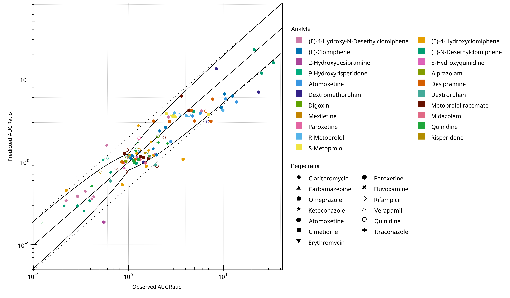

**Figure 2-1: CYP2D6 DDIs.  Predicted vs. Observed AUC Ratio. (&delta; = 1.25 in Guest *et al.* formula)**

 
 

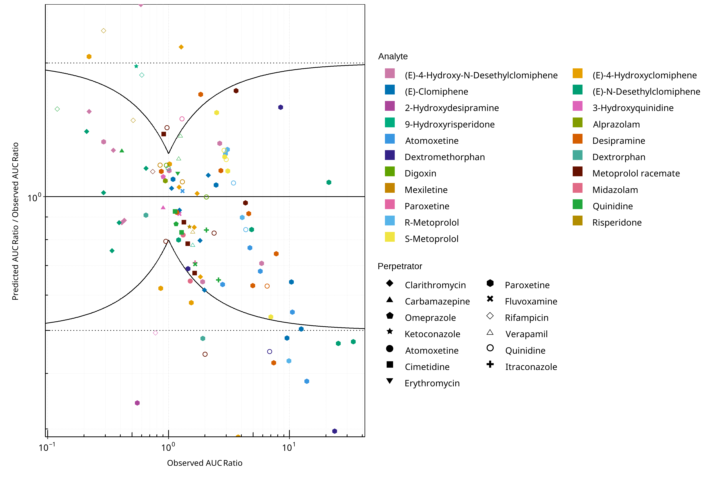

**Figure 2-2: CYP2D6 DDIs.  Predicted/Observed vs. Observed AUC Ratio. (&delta; = 1.25 in Guest *et al.* formula)**

 
 

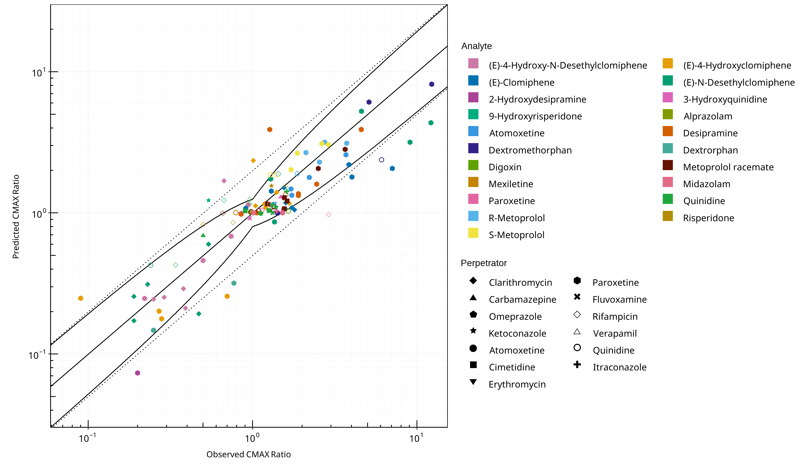

**Figure 2-3: CYP2D6 DDIs.  Predicted vs. Observed Cmax Ratio. (&delta; = 1.25 in Guest *et al.* formula)**

 
 

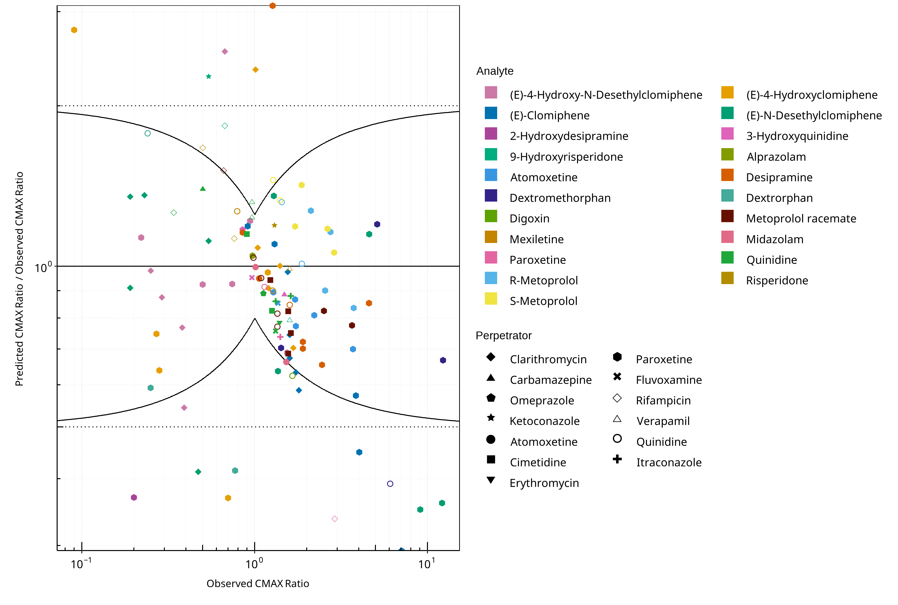

**Figure 2-4: CYP2D6 DDIs.  Predicted/Observed vs. Observed Cmax Ratio. (&delta; = 1.25 in Guest *et al.* formula)**

 
 

**Table 2-1: GMFE for CYP2D6 DDI ratios**

|PK parameter |GMFE |
|:------------|:----|
|AUC          |1.41 |
|CMAX         |1.38 |

 
 

**Table 2-2: Summary of CYP2D6 DDI results - AUC ratio. (&delta; = 1.25 in Guest *et al.* formula)**

|AUC                          |Number |Ratio [%] |
|:----------------------------|:------|:---------|
|Points total                 |117    |-        |
|Points within Guest *et al.* |90     |76.92     |
|Points within 2 fold         |100    |85.47     |

 
 

**Table 2-3: Summary of CYP2D6 DDI results - Cmax ratio. (&delta; = 1.25 in Guest *et al.* formula)**

|CMAX                         |Number |Ratio [%] |
|:----------------------------|:------|:---------|
|Points total                 |116    |-        |
|Points within Guest *et al.* |90     |77.59     |
|Points within 2 fold         |101    |87.07     |

 
 

**Table 2-4: Summary of CYP2D6 DDI results**

|Victim           |Analyte                            |Perpetrator                               |Victim route |CYP2D6 comparison |Data ID |Predicted AUC ratio |Observed AUC ratio |Predicted/observed AUC ratio |Predicted Cmax ratio |Observed Cmax ratio |Predicted/observed Cmax ratio |Reference             |
|:----------------|:----------------------------------|:-----------------------------------------|:------------|:-----------------|:-------|:-------------------|:------------------|:----------------------------|:-------------------------------|:------------------------------|:----------------------------------------|:---------------------|
|(E)-Clomiphene   |(E)-4-Hydroxy-N-desethylclomiphene |Clarithromycin, 500 mg, PO, BID           |PO           |—                 |17004   |1.60                |0.59               |2.71                         |1.70                            |0.67                           |2.53                                     |[Mürdter 2016](#references)|
|(E)-Clomiphene   |(E)-4-Hydroxy-N-desethylclomiphene |Clarithromycin, 500 mg, PO, BID           |PO           |—                 |17012   |0.45                |0.35               |1.27                         |0.25                            |0.25                           |0.98                                     |[Mürdter 2016](#references)|
|(E)-Clomiphene   |(E)-4-Hydroxy-N-desethylclomiphene |Clarithromycin, 500 mg, PO, BID           |PO           |—                 |17020   |0.38                |0.43               |0.89                         |0.21                            |0.39                           |0.54                                     |[Mürdter 2016](#references)|
|(E)-Clomiphene   |(E)-4-Hydroxy-N-desethylclomiphene |Clarithromycin, 500 mg, PO, BID           |PO           |—                 |17028   |0.34                |0.22               |1.56                         |0.25                            |0.29                           |0.88                                     |[Mürdter 2016](#references)|
|(E)-Clomiphene   |(E)-4-Hydroxy-N-desethylclomiphene |Clarithromycin, 500 mg, PO, BID           |PO           |—                 |17036   |0.36                |0.41               |0.88                         |0.29                            |0.38                           |0.77                                     |[Mürdter 2016](#references)|
|(E)-Clomiphene   |(E)-4-Hydroxy-N-desethylclomiphene |Paroxetine, 40 mg, PO, QD                 |PO           |—                 |17044   |1.16                |1.01               |1.15                         |1.15                            |0.94                           |1.22                                     |[Mürdter 2016](#references)|
|(E)-Clomiphene   |(E)-4-Hydroxy-N-desethylclomiphene |Paroxetine, 40 mg, PO, QD                 |PO           |—                 |17052   |0.39                |0.29               |1.33                         |0.25                            |0.22                           |1.13                                     |[Mürdter 2016](#references)|
|(E)-Clomiphene   |(E)-4-Hydroxy-N-desethylclomiphene |Paroxetine, 40 mg, PO, QD                 |PO           |—                 |17060   |1.23                |1.91               |0.64                         |0.46                            |0.5                            |0.93                                     |[Mürdter 2016](#references)|
|(E)-Clomiphene   |(E)-4-Hydroxy-N-desethylclomiphene |Paroxetine, 40 mg, PO, QD                 |PO           |—                 |17068   |3.50                |2.65               |1.32                         |0.69                            |0.74                           |0.93                                     |[Mürdter 2016](#references)|
|(E)-Clomiphene   |(E)-4-Hydroxy-N-desethylclomiphene |Paroxetine, 40 mg, PO, QD                 |PO           |—                 |17076   |4.16                |5.87               |0.71                         |1.06                            |1.54                           |0.69                                     |[Mürdter 2016](#references)|
|(E)-Clomiphene   |(E)-4-Hydroxyclomiphene            |Clarithromycin, 500 mg, PO, BID           |PO           |—                 |17000   |2.77                |1.27               |2.18                         |2.36                            |1.01                           |2.34                                     |[Mürdter 2016](#references)|
|(E)-Clomiphene   |(E)-4-Hydroxyclomiphene            |Clarithromycin, 500 mg, PO, BID           |PO           |—                 |17008   |1.75                |1.72               |1.02                         |1.41                            |1.4                            |1                                        |[Mürdter 2016](#references)|
|(E)-Clomiphene   |(E)-4-Hydroxyclomiphene            |Clarithromycin, 500 mg, PO, BID           |PO           |—                 |17016   |1.39                |1.63               |0.86                         |1.18                            |1.67                           |0.7                                      |[Mürdter 2016](#references)|
|(E)-Clomiphene   |(E)-4-Hydroxyclomiphene            |Clarithromycin, 500 mg, PO, BID           |PO           |—                 |17024   |1.28                |1.22               |1.05                         |1.13                            |1.04                           |1.09                                     |[Mürdter 2016](#references)|
|(E)-Clomiphene   |(E)-4-Hydroxyclomiphene            |Clarithromycin, 500 mg, PO, BID           |PO           |—                 |17032   |1.21                |1.83               |0.66                         |1.09                            |1.2                            |0.91                                     |[Mürdter 2016](#references)|
|(E)-Clomiphene   |(E)-4-Hydroxyclomiphene            |Paroxetine, 40 mg, PO, QD                 |PO           |—                 |17040   |1.21                |1.02               |1.19                         |1.16                            |1.19                           |0.98                                     |[Mürdter 2016](#references)|
|(E)-Clomiphene   |(E)-4-Hydroxyclomiphene            |Paroxetine, 40 mg, PO, QD                 |PO           |—                 |17048   |0.46                |0.22               |2.07                         |0.25                            |0.09                           |2.78                                     |[Mürdter 2016](#references)|
|(E)-Clomiphene   |(E)-4-Hydroxyclomiphene            |Paroxetine, 40 mg, PO, QD                 |PO           |—                 |17056   |0.54                |0.86               |0.62                         |0.18                            |0.28                           |0.64                                     |[Mürdter 2016](#references)|
|(E)-Clomiphene   |(E)-4-Hydroxyclomiphene            |Paroxetine, 40 mg, PO, QD                 |PO           |—                 |17064   |0.89                |1.54               |0.58                         |0.20                            |0.27                           |0.75                                     |[Mürdter 2016](#references)|
|(E)-Clomiphene   |(E)-4-Hydroxyclomiphene            |Paroxetine, 40 mg, PO, QD                 |PO           |—                 |17072   |1.08                |3.76               |0.29                         |0.26                            |0.7                            |0.37                                     |[Mürdter 2016](#references)|
|(E)-Clomiphene   |(E)-Clomiphene                     |Clarithromycin, 500 mg, PO, BID           |PO           |—                 |16998   |2.38                |2.13               |1.12                         |1.52                            |1.55                           |0.98                                     |[Mürdter 2016](#references)|
|(E)-Clomiphene   |(E)-Clomiphene                     |Clarithromycin, 500 mg, PO, BID           |PO           |—                 |17006   |1.45                |1.82               |0.80                         |1.18                            |1.59                           |0.75                                     |[Mürdter 2016](#references)|
|(E)-Clomiphene   |(E)-Clomiphene                     |Clarithromycin, 500 mg, PO, BID           |PO           |—                 |17014   |1.22                |1.98               |0.62                         |1.10                            |1.73                           |0.63                                     |[Mürdter 2016](#references)|
|(E)-Clomiphene   |(E)-Clomiphene                     |Clarithromycin, 500 mg, PO, BID           |PO           |—                 |17022   |1.15                |1.23               |0.93                         |1.07                            |1.59                           |0.67                                     |[Mürdter 2016](#references)|
|(E)-Clomiphene   |(E)-Clomiphene                     |Clarithromycin, 500 mg, PO, BID           |PO           |—                 |17030   |1.11                |1.06               |1.05                         |1.06                            |1.8                            |0.59                                     |[Mürdter 2016](#references)|
|(E)-Clomiphene   |(E)-Clomiphene                     |Paroxetine, 40 mg, PO, QD                 |PO           |—                 |17038   |1.19                |1.09               |1.10                         |1.08                            |0.91                           |1.19                                     |[Mürdter 2016](#references)|
|(E)-Clomiphene   |(E)-Clomiphene                     |Paroxetine, 40 mg, PO, QD                 |PO           |—                 |17046   |2.63                |2.47               |1.06                         |1.43                            |1.3                            |1.1                                      |[Mürdter 2016](#references)|
|(E)-Clomiphene   |(E)-Clomiphene                     |Paroxetine, 40 mg, PO, QD                 |PO           |—                 |17054   |4.59                |9.53               |0.48                         |1.81                            |4.02                           |0.45                                     |[Mürdter 2016](#references)|
|(E)-Clomiphene   |(E)-Clomiphene                     |Paroxetine, 40 mg, PO, QD                 |PO           |—                 |17062   |6.66                |10.35              |0.64                         |2.21                            |3.85                           |0.57                                     |[Mürdter 2016](#references)|
|(E)-Clomiphene   |(E)-Clomiphene                     |Paroxetine, 40 mg, PO, QD                 |PO           |—                 |17070   |6.29                |12.47              |0.50                         |2.08                            |7.08                           |0.29                                     |[Mürdter 2016](#references)|
|(E)-Clomiphene   |(E)-N-Desethylclomiphene           |Clarithromycin, 500 mg, PO, BID           |PO           |—                 |17002   |0.75                |0.65               |1.16                         |0.60                            |0.54                           |1.12                                     |[Mürdter 2016](#references)|
|(E)-Clomiphene   |(E)-N-Desethylclomiphene           |Clarithromycin, 500 mg, PO, BID           |PO           |—                 |17010   |0.30                |0.29               |1.02                         |0.17                            |0.19                           |0.91                                     |[Mürdter 2016](#references)|
|(E)-Clomiphene   |(E)-N-Desethylclomiphene           |Clarithromycin, 500 mg, PO, BID           |PO           |—                 |17018   |0.26                |0.34               |0.76                         |0.19                            |0.47                           |0.41                                     |[Mürdter 2016](#references)|
|(E)-Clomiphene   |(E)-N-Desethylclomiphene           |Clarithromycin, 500 mg, PO, BID           |PO           |—                 |17026   |0.30                |0.21               |1.41                         |0.26                            |0.19                           |1.35                                     |[Mürdter 2016](#references)|
|(E)-Clomiphene   |(E)-N-Desethylclomiphene           |Clarithromycin, 500 mg, PO, BID           |PO           |—                 |17034   |0.34                |0.39               |0.88                         |0.31                            |0.23                           |1.36                                     |[Mürdter 2016](#references)|
|(E)-Clomiphene   |(E)-N-Desethylclomiphene           |Paroxetine, 40 mg, PO, QD                 |PO           |—                 |17042   |0.97                |1.21               |0.80                         |0.87                            |1.36                           |0.64                                     |[Mürdter 2016](#references)|
|(E)-Clomiphene   |(E)-N-Desethylclomiphene           |Paroxetine, 40 mg, PO, QD                 |PO           |—                 |17050   |4.10                |4.86               |0.84                         |1.75                            |1.29                           |1.36                                     |[Mürdter 2016](#references)|
|(E)-Clomiphene   |(E)-N-Desethylclomiphene           |Paroxetine, 40 mg, PO, QD                 |PO           |—                 |17058   |11.85               |25.32              |0.47                         |3.18                            |9.07                           |0.35                                     |[Mürdter 2016](#references)|
|(E)-Clomiphene   |(E)-N-Desethylclomiphene           |Paroxetine, 40 mg, PO, QD                 |PO           |—                 |17066   |22.80               |21.14              |1.08                         |5.28                            |4.59                           |1.15                                     |[Mürdter 2016](#references)|
|(E)-Clomiphene   |(E)-N-Desethylclomiphene           |Paroxetine, 40 mg, PO, QD                 |PO           |—                 |17074   |15.92               |33.72              |0.47                         |4.38                            |12.14                          |0.36                                     |[Mürdter 2016](#references)|
|Alprazolam       |Alprazolam                         |Paroxetine, 20 mg, PO, QD                 |PO           |—                 |16980   |1.02                |0.94               |1.09                         |1.02                            |0.97                           |1.05                                     |[Calvo 2004](#references)|
|Atomoxetine      |Atomoxetine                        |Fluvoxamine, 50/100 mg, PO, QD/QD         |PO           |—                 |16986   |1.34                |1.30               |1.03                         |1.16                            |1.36                           |0.85                                     |[Todor 2017](#references)|
|Atomoxetine      |Atomoxetine                        |Paroxetine, 20 mg, PO, QD                 |PO           |—                 |16988   |1.78                |2.80               |0.64                         |1.15                            |1.28                           |0.9                                      |[Jung 2020](#references)|
|Atomoxetine      |Atomoxetine                        |Paroxetine, 20 mg, PO, QD                 |PO           |—                 |16990   |3.61                |4.70               |0.77                         |1.49                            |1.71                           |0.87                                     |[Jung 2020](#references)|
|Atomoxetine      |Atomoxetine                        |Paroxetine, 20 mg, PO, QD                 |PO           |—                 |16992   |5.82                |10.57              |0.55                         |1.79                            |2.21                           |0.81                                     |[Jung 2020](#references)|
|Atomoxetine      |Atomoxetine                        |Paroxetine, 20 mg, PO, QD                 |PO           |—                 |16996   |5.34                |13.87              |0.38                         |2.59                            |3.7                            |0.7                                      |[Belle 2002](#references)|
|Atomoxetine      |Atomoxetine                        |Paroxetine, 20/20 mg, PO, BID/QD          |PO           |—                 |16994   |3.90                |5.73               |0.68                         |1.34                            |1.73                           |0.77                                     |[Todor 2015](#references)|
|Desipramine      |2-Hydroxydesipramine               |Paroxetine, 20 mg, PO, QD                 |PO           |—                 |17084   |0.19                |0.55               |0.34                         |0.07                            |0.2                            |0.37                                     |[Nichols 2009](#references)|
|Desipramine      |Desipramine                        |Atomoxetine, 60 mg, PO, BID               |PO           |—                 |17078   |1.08                |1.17               |0.92                         |1.01                            |1.06                           |0.95                                     |[Sauer 2004](#references)|
|Desipramine      |Desipramine                        |Paroxetine, 20 mg, PO, QD                 |PO           |—                 |17082   |3.11                |2.71               |1.15                         |1.37                            |1.9                            |0.72                                     |[Nichols 2009](#references)|
|Desipramine      |Desipramine                        |Paroxetine, 20 mg, PO, QD                 |PO           |—                 |17086   |0.99                |0.87               |1.14                         |0.99                            |0.85                           |1.16                                     |[Brøsen 1993](#references)|
|Desipramine      |Desipramine                        |Paroxetine, 20 mg, PO, QD                 |PO           |—                 |17088   |4.22                |4.60               |0.92                         |1.33                            |1.9                            |0.7                                      |[Brøsen 1993](#references)|
|Desipramine      |Desipramine                        |Paroxetine, 20 mg, PO, QD                 |PO           |—                 |17090   |5.78                |7.76               |0.74                         |1.61                            |2.45                           |0.66                                     |[Brøsen 1993](#references)|
|Desipramine      |Desipramine                        |Paroxetine, 20/30 mg, PO, QD/QD           |PO           |—                 |17092   |3.13                |1.84               |1.70                         |3.91                            |1.27                           |3.08                                     |[Alderman 1997](#references)|
|Desipramine      |Desipramine                        |Paroxetine, 20/30 mg, PO, QD/QD           |PO           |—                 |17093   |3.13                |4.96               |0.63                         |3.91                            |4.58                           |0.85                                     |[Alderman 1997](#references)|
|Desipramine      |Desipramine                        |Paroxetine, 20/30 mg, PO, QD/QD           |PO           |—                 |17094   |3.13                |7.40               |0.42                         |3.91                            |4.58                           |0.85                                     |[Alderman 1997](#references)|
|Desipramine      |Desipramine                        |Quinidine, 200 mg, PO, QD                 |PO           |—                 |17096   |4.10                |6.52               |0.63                         |1.34                            |1.59                           |0.85                                     |[Brøsen 1989](#references)|
|Dextromethorphan |Dextromethorphan                   |Paroxetine, 20 mg, PO, BID                |PO           |—                 |17098   |13.46               |8.45               |1.59                         |6.14                            |5.11                           |1.2                                      |[Storelli 2018](#references)|
|Dextromethorphan |Dextromethorphan                   |Paroxetine, 20 mg, PO, BID                |PO           |—                 |17102   |7.01                |23.61              |0.30                         |8.21                            |12.29                          |0.67                                     |[Storelli 2018](#references)|
|Dextromethorphan |Dextromethorphan                   |Paroxetine, 20 mg, PO, QD                 |PO           |—                 |17106   |1.00                |1.45               |0.69                         |1.00                            |1.42                           |0.7                                      |[Schoedel 2012](#references)|
|Dextromethorphan |Dextromethorphan                   |Quinidine, 50 mg, PO, SD: 1h before DEX   |PO           |—                 |16940   |3.06                |6.84               |0.45                         |2.37                            |6.07                           |0.39                                     |[Capon 1996](#references)|
|Dextromethorphan |Dextrorphan                        |Paroxetine, 20 mg, PO, BID                |PO           |—                 |17100   |0.59                |0.65               |0.91                         |0.15                            |0.25                           |0.59                                     |[Storelli 2018](#references)|
|Dextromethorphan |Dextrorphan                        |Paroxetine, 20 mg, PO, BID                |PO           |—                 |17104   |0.92                |1.92               |0.48                         |0.32                            |0.77                           |0.42                                     |[Storelli 2018](#references)|
|Dextromethorphan |Total dextrorphan                  |Quinidine, 50 mg, PO, SD: 1h before DEX   |PO           |—                 |16942   |1.15                |0.99               |1.16                         |0.43                            |0.24                           |1.77                                     |[Capon 1996](#references)|
|Digoxin          |Digoxin                            |Quinidine, 200 mg, PO, BID                |IV           |—                 |16946   |1.13                |0.96               |1.18                         |0.68                            |—                              |—                                        |[Steiness 1980](#references)|
|Digoxin          |Digoxin                            |Quinidine, 200 mg, PO, QID                |IV           |—                 |16948   |2.04                |2.05               |1.00                         |1.03                            |1.65                           |0.62                                     |[Ochs 1981](#references)|
|Metoprolol       |Metoprolol                         |Cimetidine, 200/200/200/400 mg, PO, QD    |PO           |—                 |17114   |1.10                |1.64               |0.67                         |1.07                            |1.56                           |0.69                                     |[Kirch 1982](#references)|
|Metoprolol       |Metoprolol                         |Cimetidine, 800 mg, PO, QD                |PO           |—                 |17108   |1.26                |0.91               |1.38                         |1.29                            |1.56                           |0.82                                     |[Chellingsworth 1988](#references)|
|Metoprolol       |Metoprolol                         |Cimetidine, 800 mg, PO, QD                |PO           |—                 |17110   |1.17                |1.34               |0.88                         |1.22                            |1.62                           |0.75                                     |[Chellingsworth 1988](#references)|
|Metoprolol       |Metoprolol                         |Cimetidine, 800 mg, PO, QD                |PO           |—                 |17112   |1.13                |1.44               |0.78                         |1.16                            |1.23                           |0.94                                     |[Toon 1988](#references)|
|Metoprolol       |Metoprolol                         |Paroxetine, 10 mg, PO, QD/BID             |PO           |—                 |17116   |4.20                |4.33               |0.97                         |2.07                            |2.51                           |0.83                                     |[Stout 2011](#references)|
|Metoprolol       |Metoprolol                         |Paroxetine, 10 mg, PO, QD/BID             |PO           |—                 |17118   |6.28                |3.62               |1.73                         |2.84                            |3.65                           |0.78                                     |[Stout 2011](#references)|
|Metoprolol       |Metoprolol                         |Quinidine, 250 mg, PO, BID                |IV           |—                 |17140   |1.39                |0.97               |1.43                         |1.04                            |1.09                           |0.95                                     |[Leemann 1993](#references)|
|Metoprolol       |Metoprolol                         |Quinidine, 250 mg, PO, BID                |IV           |—                 |17142   |1.97                |2.38               |0.83                         |1.10                            |1.35                           |0.81                                     |[Leemann 1993](#references)|
|Metoprolol       |Metoprolol                         |Quinidine, 50 mg, PO, SD                  |IV           |—                 |17136   |0.75                |0.95               |0.79                         |1.02                            |0.98                           |1.04                                     |[Leemann 1993](#references)|
|Metoprolol       |Metoprolol                         |Quinidine, 50 mg, PO, SD                  |IV           |—                 |17138   |0.88                |2.00               |0.44                         |1.04                            |1.35                           |0.77                                     |[Leemann 1993](#references)|
|Metoprolol       |Metoprolol                         |Rifampicin, 600 mg, PO, QD                |PO           |—                 |17152   |0.84                |0.74               |1.14                         |1.00                            |0.66                           |1.52                                     |[Bennett 1982](#references)|
|Metoprolol       |R-Metoprolol                       |Paroxetine, 10 mg, PO, BID                |PO           |—                 |17132   |4.22                |9.88               |0.43                         |2.30                            |2.55                           |0.9                                      |[Hemeryck 2000](#references)|
|Metoprolol       |R-Metoprolol                       |Paroxetine, 20 mg, PO, QD                 |PO           |—                 |17120   |3.70                |2.96               |1.25                         |3.18                            |2.74                           |1.16                                     |[Parker 2011](#references)|
|Metoprolol       |R-Metoprolol                       |Paroxetine, 20 mg, PO, QD                 |PO           |—                 |17124   |3.92                |3.06               |1.28                         |2.69                            |2.11                           |1.27                                     |[Parker 2011](#references)|
|Metoprolol       |R-Metoprolol                       |Paroxetine, 20 mg, PO, QD                 |PO           |—                 |17128   |3.65                |4.06               |0.90                         |3.13                            |3.74                           |0.84                                     |[Parker 2011](#references)|
|Metoprolol       |R-Metoprolol                       |Quinidine, 100 mg, PO, QD                 |PO           |—                 |17144   |3.69                |3.44               |1.07                         |1.88                            |1.43                           |1.32                                     |[Johnson 1996](#references)|
|Metoprolol       |R-Metoprolol                       |Quinidine, 100 mg, PO, QD                 |PO           |—                 |17148   |3.66                |4.35               |0.84                         |1.89                            |1.87                           |1.01                                     |[Johnson 1996](#references)|
|Metoprolol       |S-Metoprolol                       |Paroxetine, 10 mg, PO, BID                |PO           |—                 |17134   |3.77                |7.01               |0.54                         |2.04                            |1.71                           |1.19                                     |[Hemeryck 2000](#references)|
|Metoprolol       |S-Metoprolol                       |Paroxetine, 20 mg, PO, QD                 |PO           |—                 |17122   |3.59                |2.91               |1.23                         |3.11                            |2.64                           |1.18                                     |[Parker 2011](#references)|
|Metoprolol       |S-Metoprolol                       |Paroxetine, 20 mg, PO, QD                 |PO           |—                 |17126   |3.87                |2.50               |1.55                         |2.66                            |1.87                           |1.42                                     |[Parker 2011](#references)|
|Metoprolol       |S-Metoprolol                       |Paroxetine, 20 mg, PO, QD                 |PO           |—                 |17130   |3.54                |3.09               |1.14                         |3.06                            |2.88                           |1.06                                     |[Parker 2011](#references)|
|Metoprolol       |S-Metoprolol                       |Quinidine, 100 mg, PO, QD                 |PO           |—                 |17146   |3.65                |2.87               |1.27                         |1.86                            |1.28                           |1.45                                     |[Johnson 1996](#references)|
|Metoprolol       |S-Metoprolol                       |Quinidine, 100 mg, PO, QD                 |PO           |—                 |17150   |3.62                |2.99               |1.21                         |1.86                            |1.4                            |1.33                                     |[Johnson 1996](#references)|
|Mexiletine       |Mexiletine                         |Quinidine, 50 mg, PO, QID                 |PO           |—                 |16950   |1.00                |0.85               |1.18                         |1.00                            |0.79                           |1.27                                     |[Abolfathi 1993](#references)|
|Mexiletine       |Mexiletine                         |Quinidine, 50 mg, PO, QID                 |PO           |—                 |16952   |1.40                |1.30               |1.08                         |1.14                            |1.27                           |0.9                                      |[Abolfathi 1993](#references)|
|Midazolam        |Midazolam                          |Atomoxetine, 60 mg, PO, BID               |PO           |—                 |17154   |1.08                |1.32               |0.82                         |1.01                            |1.01                           |1                                        |[Sauer 2004](#references)|
|Midazolam        |Midazolam                          |Atomoxetine, 60 mg, PO, BID               |PO           |—                 |17156   |0.98                |1.51               |0.65                         |1.01                            |1.52                           |0.66                                     |[Sauer 2004](#references)|
|Paroxetine       |Paroxetine                         |Itraconazole, 100 mg, PO, BID             |PO           |—                 |17158   |1.17                |1.65               |0.71                         |1.03                            |1.4                            |0.74                                     |[Yasui-Furukori 2007](#references)|
|Paroxetine       |Paroxetine                         |Quinidine, 30 mg, PO, BID                 |PO           |—                 |16954   |1.93                |1.29               |1.50                         |1.04                            |1.14                           |0.91                                     |[Schoedel 2012](#references)|
|Quinidine        |3-Hydroxyquinidine                 |Carbamazepine, 200/400 mg, PO, BID        |PO           |—                 |16958   |0.85                |0.90               |0.95                         |1.32                            |1.48                           |0.89                                     |[Andreasen 2007](#references)|
|Quinidine        |3-Hydroxyquinidine                 |Fluvoxamine, 100 mg, PO, QD               |PO           |—                 |16966   |1.12                |1.23               |0.91                         |0.91                            |0.96                           |0.95                                     |[Damkier 1999a](#references)|
|Quinidine        |3-Hydroxyquinidine                 |Omeprazole, 40 mg, PO, QD                 |PO           |—                 |16970   |1.00                |0.90               |1.11                         |1.00                            |0.85                           |1.17                                     |[Ching 1991](#references)|
|Quinidine        |3-Hydroxyquinidine                 |Rifampicin, 600 mg, PO, QD                |PO           |—                 |16974   |0.39                |0.78               |0.49                         |0.98                            |2.9                            |0.34                                     |[Damkier 1999](#references)|
|Quinidine        |Quinidine                          |Carbamazepine, 200/400 mg, PO, BID        |PO           |—                 |16956   |0.52                |0.41               |1.27                         |0.70                            |0.5                            |1.4                                      |[Andreasen 2007](#references)|
|Quinidine        |Quinidine                          |Cimetidine, 300 mg, PO, QD                |PO           |—                 |16960   |1.05                |1.13               |0.93                         |1.04                            |0.9                            |1.15                                     |[Kolb 1984](#references)|
|Quinidine        |Quinidine                          |Cimetidine, 300 mg, PO, QID               |PO           |—                 |16962   |1.06                |1.28               |0.83                         |1.04                            |1.26                           |0.83                                     |[Hardy 1988](#references)|
|Quinidine        |Quinidine                          |Erythromycin, 250/250/250/250 mg, PO, QID |PO           |—                 |17160   |1.34                |1.19               |1.13                         |1.09                            |1.39                           |0.78                                     |[Damkier 1999b](#references)|
|Quinidine        |Quinidine                          |Fluvoxamine, 100 mg, PO, QD               |PO           |—                 |16964   |1.17                |1.66               |0.70                         |1.00                            |1.32                           |0.76                                     |[Damkier 1999a](#references)|
|Quinidine        |Quinidine                          |Itraconazole, 100 mg, PO, QD              |PO           |—                 |17164   |1.67                |2.58               |0.65                         |1.13                            |1.32                           |0.86                                     |[Damkier 1999b](#references)|
|Quinidine        |Quinidine                          |Itraconazole, 200 mg, PO, QD              |PO           |—                 |17162   |1.72                |2.05               |0.84                         |1.42                            |1.61                           |0.88                                     |[Kaukonen 1997](#references)|
|Quinidine        |Quinidine                          |Omeprazole, 40 mg, PO, QD                 |PO           |—                 |16968   |1.00                |1.15               |0.87                         |1.00                            |1.12                           |0.89                                     |[Ching 1991](#references)|
|Quinidine        |Quinidine                          |Rifampicin, 600 mg, PO, QD                |PO           |—                 |16972   |0.19                |0.12               |1.58                         |0.43                            |0.34                           |1.26                                     |[Damkier 1999](#references)|
|Quinidine        |Quinidine                          |Verapamil, 120 mg, PO, TID                |PO           |—                 |16978   |1.72                |1.25               |1.38                         |1.27                            |0.96                           |1.32                                     |[Edwards 1987](#references)|
|Quinidine        |Quinidine                          |Verapamil, 80 mg, PO, TID                 |PO           |—                 |16976   |1.48                |1.21               |1.22                         |1.19                            |0.96                           |1.24                                     |[Edwards 1987](#references)|
|Risperidone      |9-Hydroxyrisperidone               |Ketoconazole, 200 mg, PO, QD              |PO           |—                 |17168   |1.06                |0.54               |1.97                         |1.22                            |0.54                           |2.27                                     |[Mahatthanatrakul 2012](#references)|
|Risperidone      |9-Hydroxyrisperidone               |Rifampicin, 600 mg, PO, QD                |PO           |—                 |17172   |1.13                |0.60               |1.88                         |1.23                            |0.67                           |1.84                                     |[Kim 2008](#references)|
|Risperidone      |9-Hydroxyrisperidone               |Verapamil, 80/80/80 mg, PO, TID           |PO           |—                 |17178   |1.23                |1.58               |0.78                         |1.27                            |1.59                           |0.8                                      |[Nakagami 2005](#references)|
|Risperidone      |Risperidone                        |Ketoconazole, 200 mg, PO, QD              |PO           |—                 |17166   |1.27                |1.49               |0.85                         |1.55                            |1.3                            |1.19                                     |[Mahatthanatrakul 2012](#references)|
|Risperidone      |Risperidone                        |Rifampicin, 600 mg, PO, QD                |PO           |—                 |17170   |0.76                |0.51               |1.49                         |0.86                            |0.76                           |1.13                                     |[Kim 2008](#references)|
|Risperidone      |Risperidone                        |Rifampicin, 600 mg, PO, QD                |PO           |—                 |17174   |0.69                |0.29               |2.37                         |0.84                            |0.5                            |1.67                                     |[Mahatthanatrakul 2007](#references)|
|Risperidone      |Risperidone                        |Verapamil, 80/80/80 mg, PO, TID           |PO           |—                 |17176   |1.32                |1.58               |0.84                         |1.58                            |1.59                           |0.99                                     |[Nakagami 2005](#references)|

 
 

### 2.1.1 Perpetrator

#### 2.1.1.1 Atomoxetine

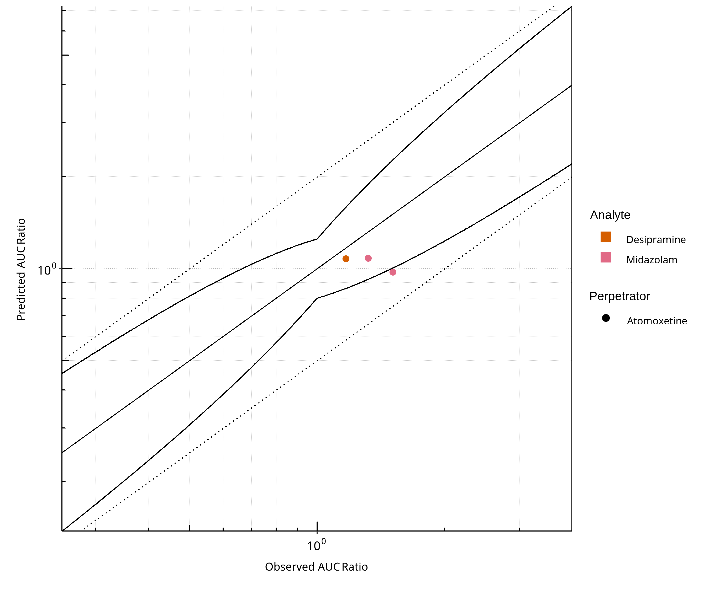

**Figure 2-5: CYP2D6 DDIs. Perpetrator: Atomoxetine. Predicted vs. Observed AUC Ratio. (&delta; = 1.25 in Guest *et al.* formula)**

 
 

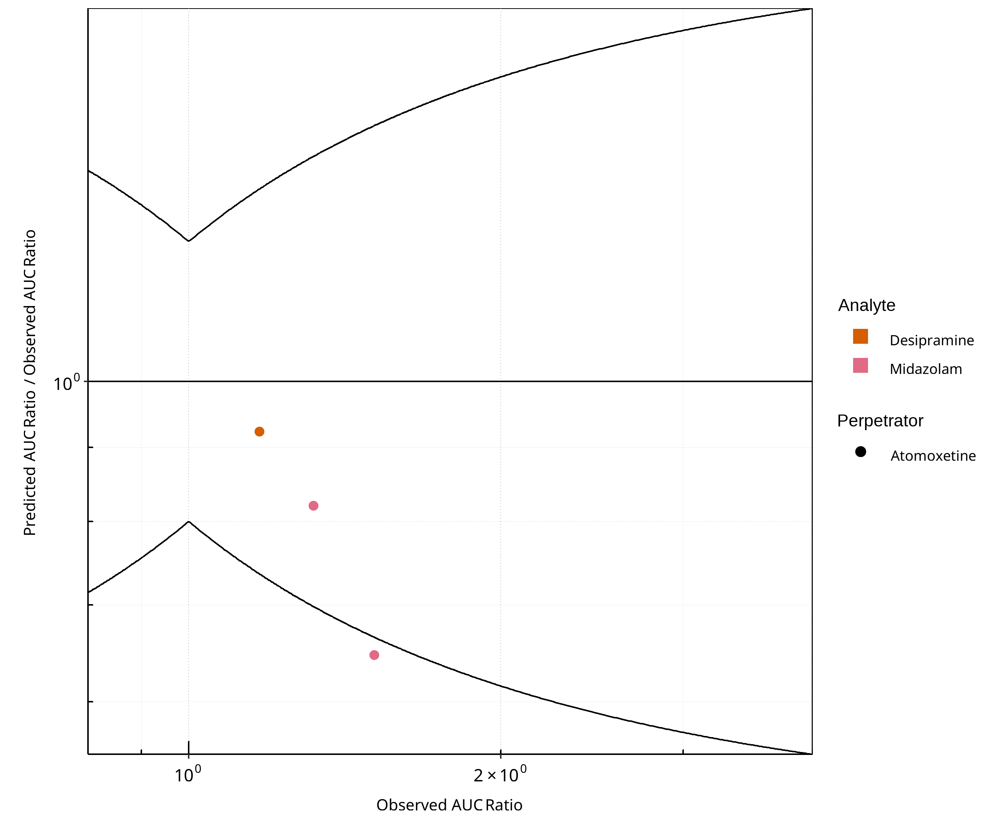

**Figure 2-6: CYP2D6 DDIs. Perpetrator: Atomoxetine. Predicted/Observed vs. Observed AUC Ratio. (&delta; = 1.25 in Guest *et al.* formula)**

 
 

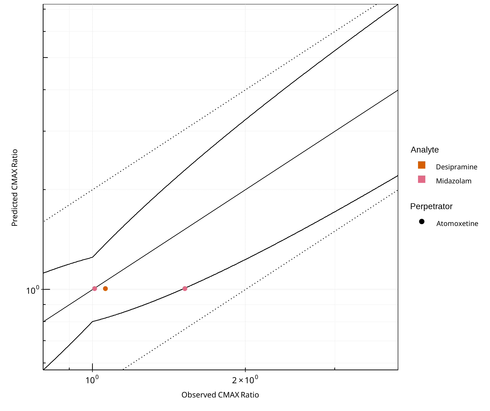

**Figure 2-7: CYP2D6 DDIs. Perpetrator: Atomoxetine. Predicted vs. Observed Cmax Ratio. (&delta; = 1.25 in Guest *et al.* formula)**

 
 

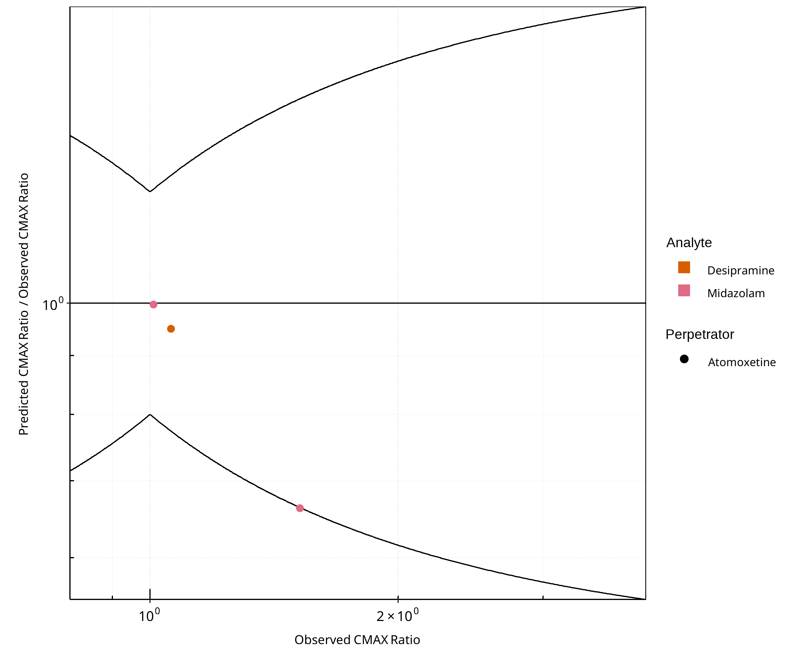

**Figure 2-8: CYP2D6 DDIs. Perpetrator: Atomoxetine. Predicted/Observed vs. Observed Cmax Ratio. (&delta; = 1.25 in Guest *et al.* formula)**

 
 

**Table 2-5: GMFE for CYP2D6 DDI ratios**

|PK parameter |GMFE |
|:------------|:----|
|AUC          |1.27 |
|CMAX         |1.17 |

 
 

**Table 2-6: Summary of CYP2D6 DDI results - AUC ratio. (&delta; = 1.25 in Guest *et al.* formula)**

|AUC                          |Number |Ratio [%] |
|:----------------------------|:------|:---------|
|Points total                 |3      |-        |
|Points within Guest *et al.* |2      |66.67     |
|Points within 2 fold         |3      |100.00    |

 
 

**Table 2-7: Summary of CYP2D6 DDI results - Cmax ratio. (&delta; = 1.25 in Guest *et al.* formula)**

|CMAX                         |Number |Ratio [%] |
|:----------------------------|:------|:---------|
|Points total                 |3      |-        |
|Points within Guest *et al.* |2      |66.67     |
|Points within 2 fold         |3      |100.00    |

 
 

#### 2.1.1.2 Carbamazepine

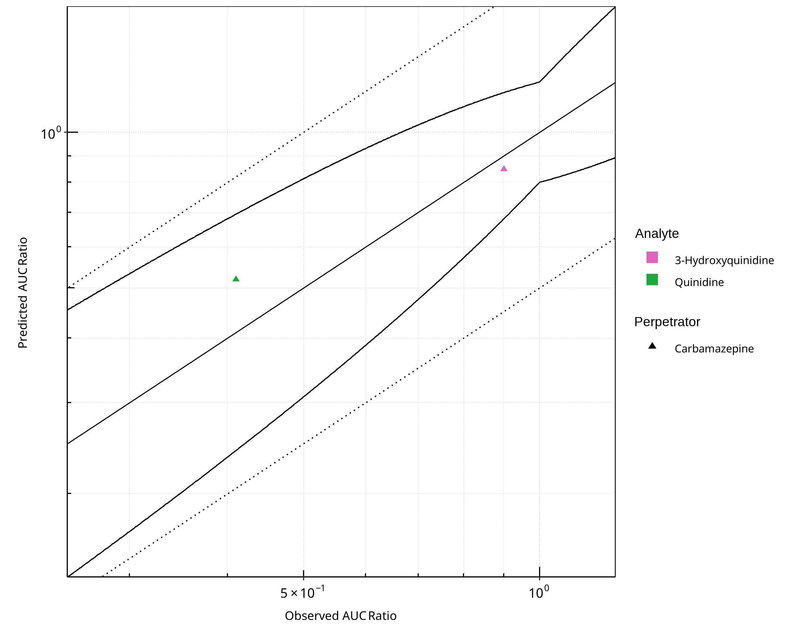

**Figure 2-9: CYP2D6 DDIs. Perpetrator: Carbamazepine. Predicted vs. Observed AUC Ratio. (&delta; = 1.25 in Guest *et al.* formula)**

 
 

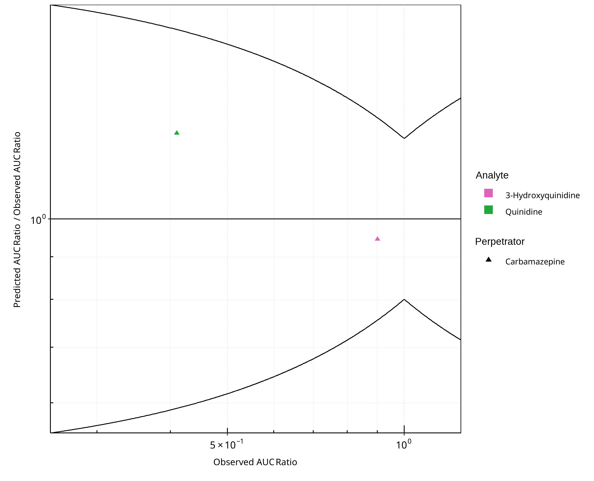

**Figure 2-10: CYP2D6 DDIs. Perpetrator: Carbamazepine. Predicted/Observed vs. Observed AUC Ratio. (&delta; = 1.25 in Guest *et al.* formula)**

 
 

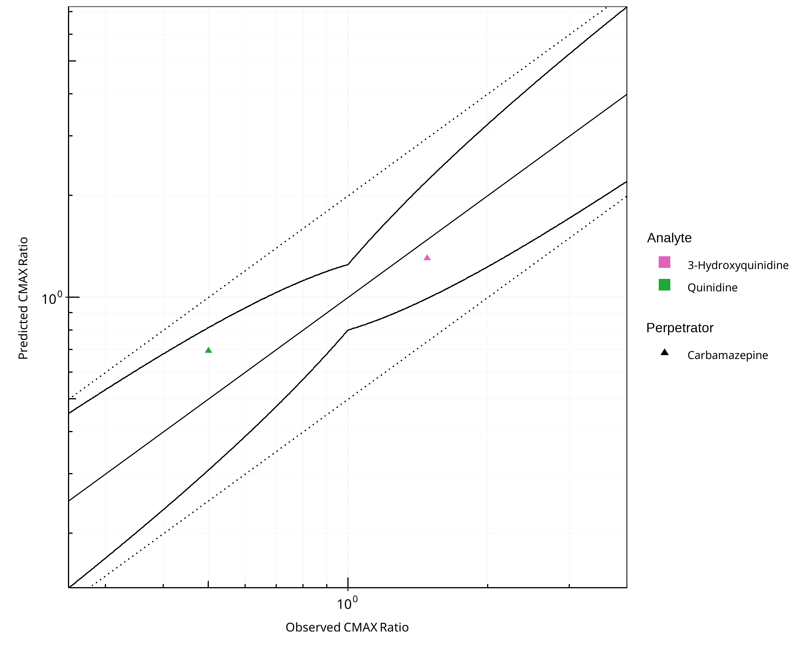

**Figure 2-11: CYP2D6 DDIs. Perpetrator: Carbamazepine. Predicted vs. Observed Cmax Ratio. (&delta; = 1.25 in Guest *et al.* formula)**

 
 

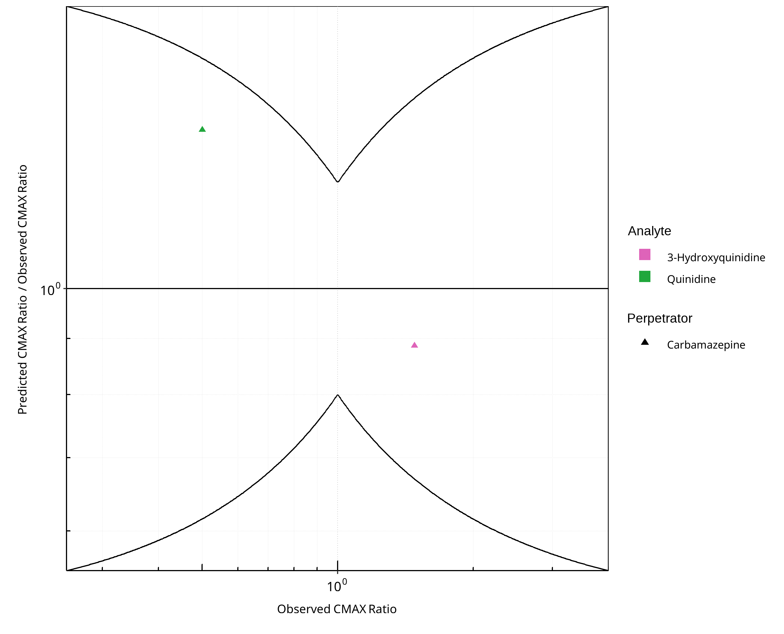

**Figure 2-12: CYP2D6 DDIs. Perpetrator: Carbamazepine. Predicted/Observed vs. Observed Cmax Ratio. (&delta; = 1.25 in Guest *et al.* formula)**

 
 

**Table 2-8: GMFE for CYP2D6 DDI ratios**

|PK parameter |GMFE |
|:------------|:----|
|AUC          |1.16 |
|CMAX         |1.26 |

 
 

**Table 2-9: Summary of CYP2D6 DDI results - AUC ratio. (&delta; = 1.25 in Guest *et al.* formula)**

|AUC                          |Number |Ratio [%] |
|:----------------------------|:------|:---------|
|Points total                 |2      |-        |
|Points within Guest *et al.* |2      |100       |
|Points within 2 fold         |2      |100       |

 
 

**Table 2-10: Summary of CYP2D6 DDI results - Cmax ratio. (&delta; = 1.25 in Guest *et al.* formula)**

|CMAX                         |Number |Ratio [%] |
|:----------------------------|:------|:---------|
|Points total                 |2      |-        |
|Points within Guest *et al.* |2      |100       |
|Points within 2 fold         |2      |100       |

 
 

#### 2.1.1.3 Cimetidine

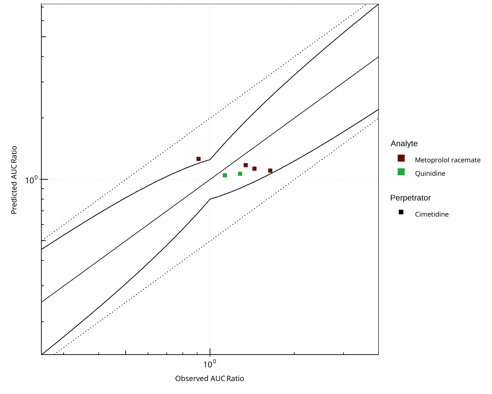

**Figure 2-13: CYP2D6 DDIs. Perpetrator: Cimetidine. Predicted vs. Observed AUC Ratio. (&delta; = 1.25 in Guest *et al.* formula)**

 
 

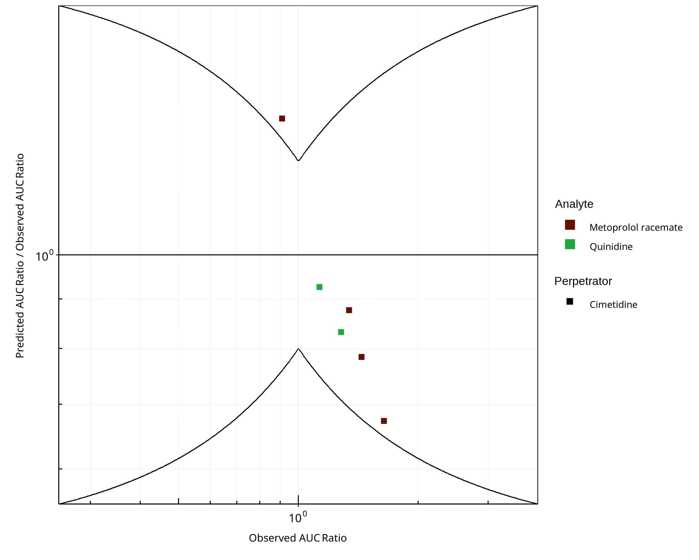

**Figure 2-14: CYP2D6 DDIs. Perpetrator: Cimetidine. Predicted/Observed vs. Observed AUC Ratio. (&delta; = 1.25 in Guest *et al.* formula)**

 
 

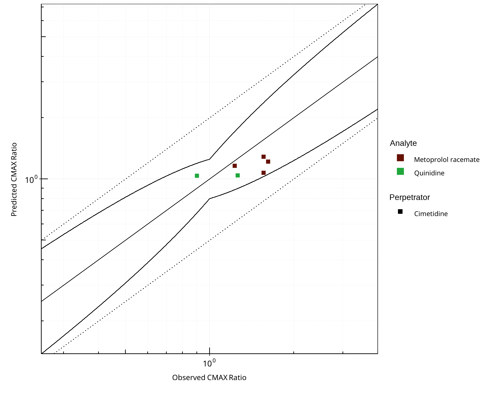

**Figure 2-15: CYP2D6 DDIs. Perpetrator: Cimetidine. Predicted vs. Observed Cmax Ratio. (&delta; = 1.25 in Guest *et al.* formula)**

 
 

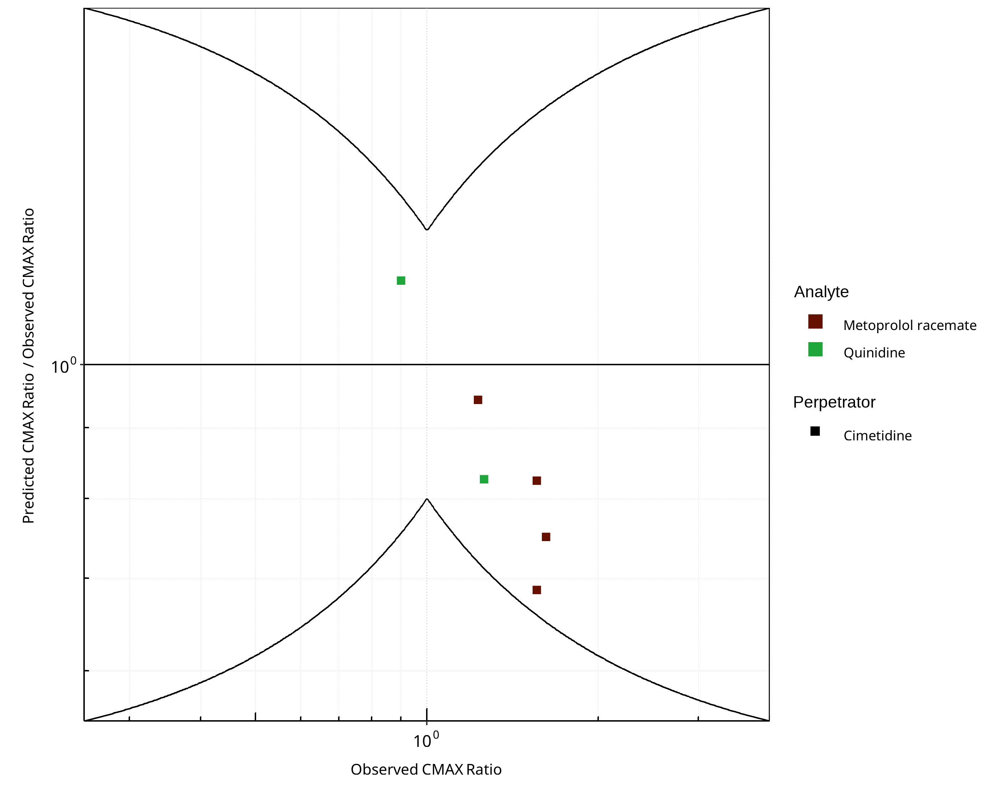

**Figure 2-16: CYP2D6 DDIs. Perpetrator: Cimetidine. Predicted/Observed vs. Observed Cmax Ratio. (&delta; = 1.25 in Guest *et al.* formula)**

 
 

**Table 2-11: GMFE for CYP2D6 DDI ratios**

|PK parameter |GMFE |
|:------------|:----|
|AUC          |1.25 |
|CMAX         |1.23 |

 
 

**Table 2-12: Summary of CYP2D6 DDI results - AUC ratio. (&delta; = 1.25 in Guest *et al.* formula)**

|AUC                          |Number |Ratio [%] |
|:----------------------------|:------|:---------|
|Points total                 |6      |-        |
|Points within Guest *et al.* |5      |83.33     |
|Points within 2 fold         |6      |100.00    |

 
 

**Table 2-13: Summary of CYP2D6 DDI results - Cmax ratio. (&delta; = 1.25 in Guest *et al.* formula)**

|CMAX                         |Number |Ratio [%] |
|:----------------------------|:------|:---------|
|Points total                 |6      |-        |
|Points within Guest *et al.* |6      |100       |
|Points within 2 fold         |6      |100       |

 
 

#### 2.1.1.4 Clarithromycin

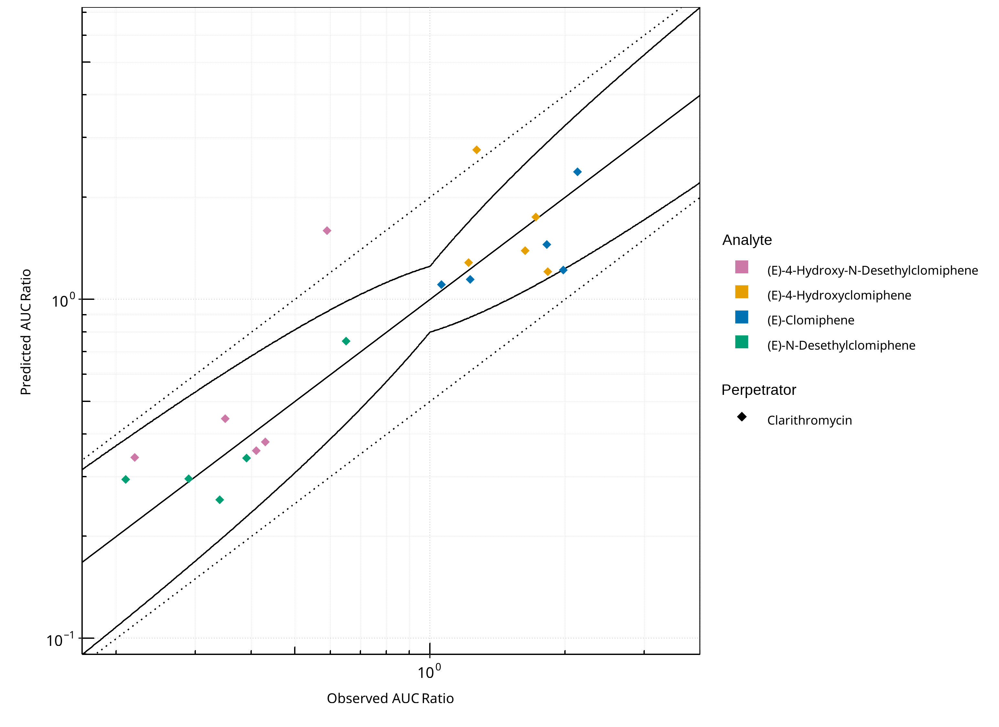

**Figure 2-17: CYP2D6 DDIs. Perpetrator: Clarithromycin. Predicted vs. Observed AUC Ratio. (&delta; = 1.25 in Guest *et al.* formula)**

 
 

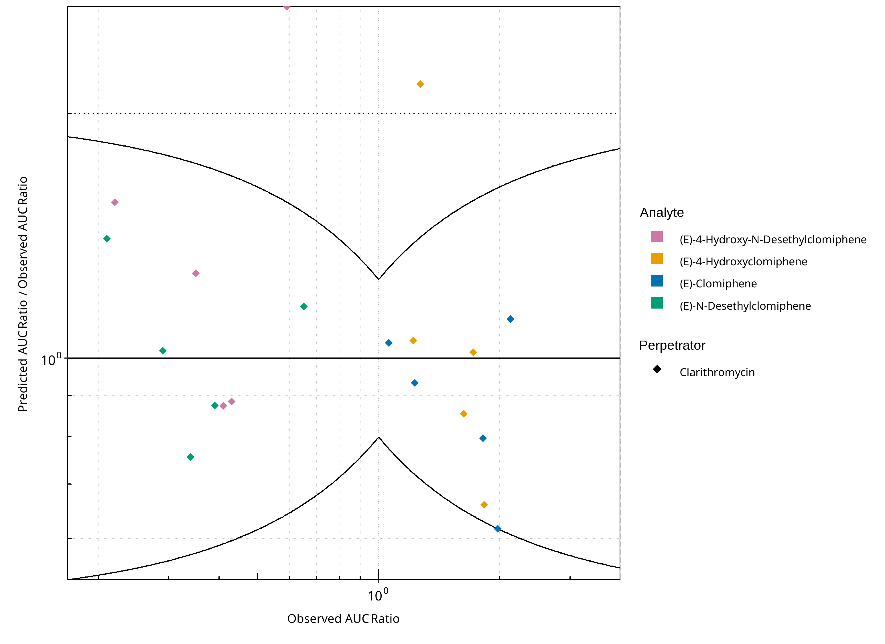

**Figure 2-18: CYP2D6 DDIs. Perpetrator: Clarithromycin. Predicted/Observed vs. Observed AUC Ratio. (&delta; = 1.25 in Guest *et al.* formula)**

 
 

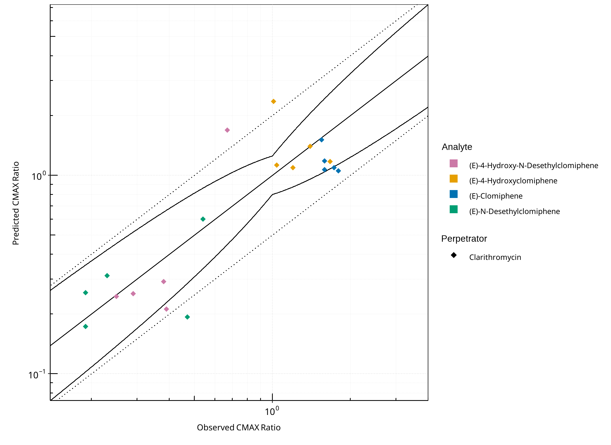

**Figure 2-19: CYP2D6 DDIs. Perpetrator: Clarithromycin. Predicted vs. Observed Cmax Ratio. (&delta; = 1.25 in Guest *et al.* formula)**

 
 

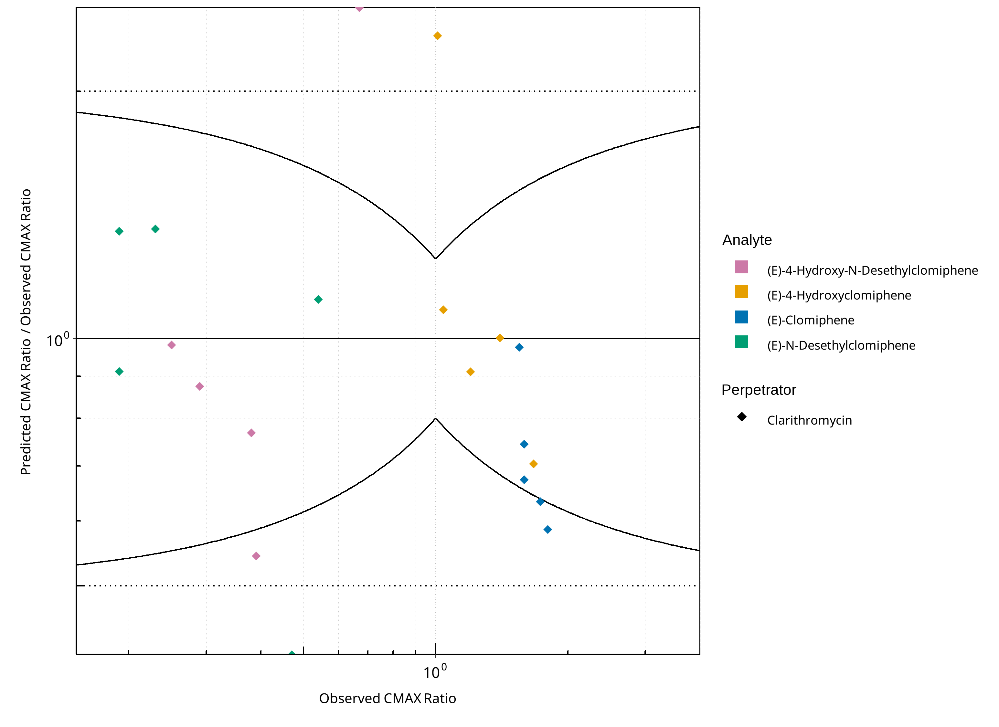

**Figure 2-20: CYP2D6 DDIs. Perpetrator: Clarithromycin. Predicted/Observed vs. Observed Cmax Ratio. (&delta; = 1.25 in Guest *et al.* formula)**

 
 

**Table 2-14: GMFE for CYP2D6 DDI ratios**

|PK parameter |GMFE |
|:------------|:----|
|AUC          |1.30 |
|CMAX         |1.40 |

 
 

**Table 2-15: Summary of CYP2D6 DDI results - AUC ratio. (&delta; = 1.25 in Guest *et al.* formula)**

|AUC                          |Number |Ratio [%] |
|:----------------------------|:------|:---------|
|Points total                 |20     |-        |
|Points within Guest *et al.* |18     |90        |
|Points within 2 fold         |18     |90        |

 
 

**Table 2-16: Summary of CYP2D6 DDI results - Cmax ratio. (&delta; = 1.25 in Guest *et al.* formula)**

|CMAX                         |Number |Ratio [%] |
|:----------------------------|:------|:---------|
|Points total                 |20     |-        |
|Points within Guest *et al.* |14     |70        |
|Points within 2 fold         |17     |85        |

 
 

#### 2.1.1.5 Erythromycin

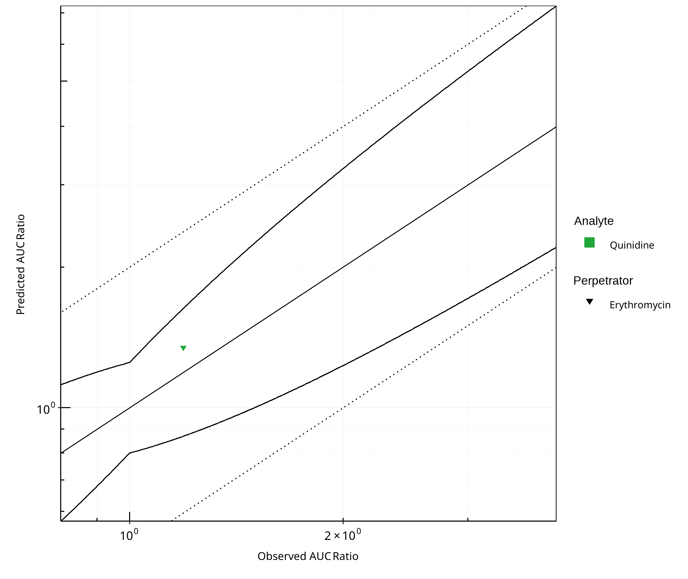

**Figure 2-21: CYP2D6 DDIs. Perpetrator: Erythromycin. Predicted vs. Observed AUC Ratio. (&delta; = 1.25 in Guest *et al.* formula)**

 
 

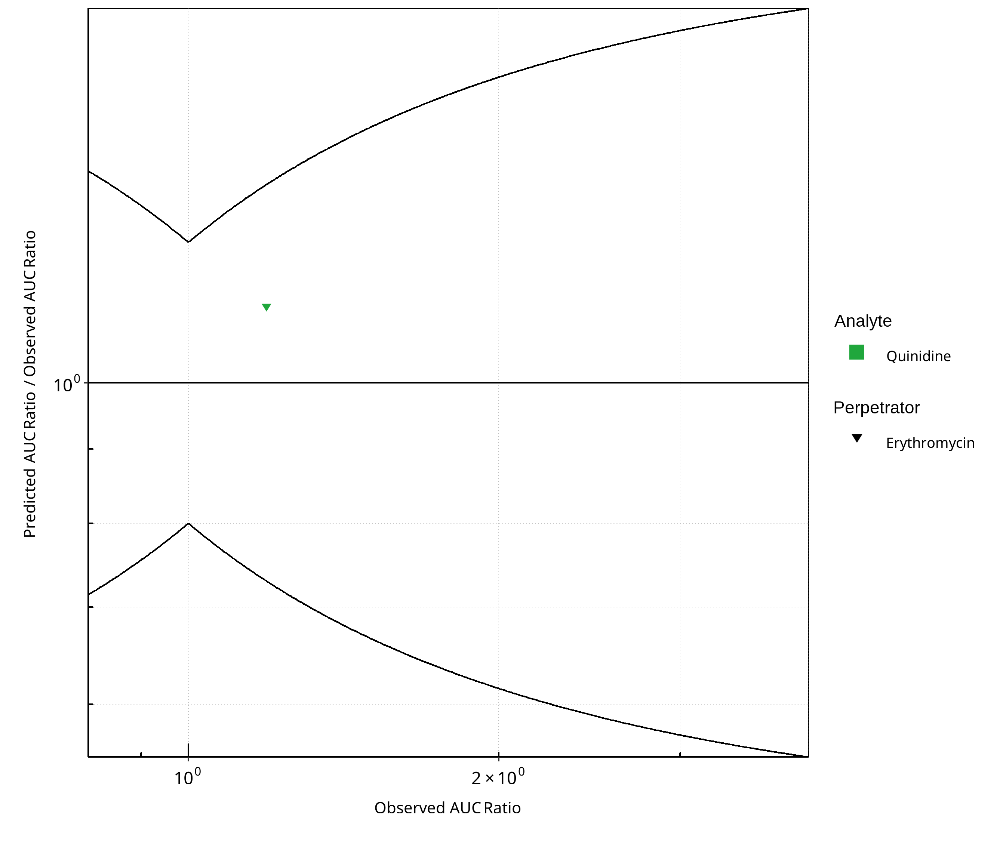

**Figure 2-22: CYP2D6 DDIs. Perpetrator: Erythromycin. Predicted/Observed vs. Observed AUC Ratio. (&delta; = 1.25 in Guest *et al.* formula)**

 
 

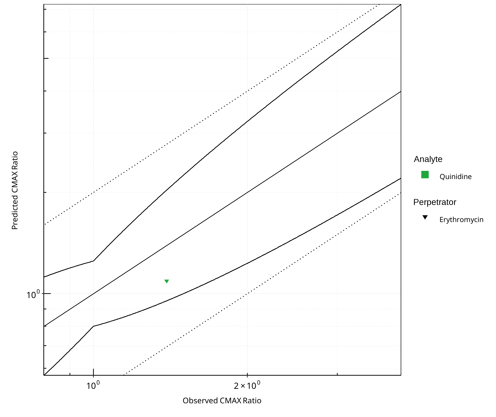

**Figure 2-23: CYP2D6 DDIs. Perpetrator: Erythromycin. Predicted vs. Observed Cmax Ratio. (&delta; = 1.25 in Guest *et al.* formula)**

 
 

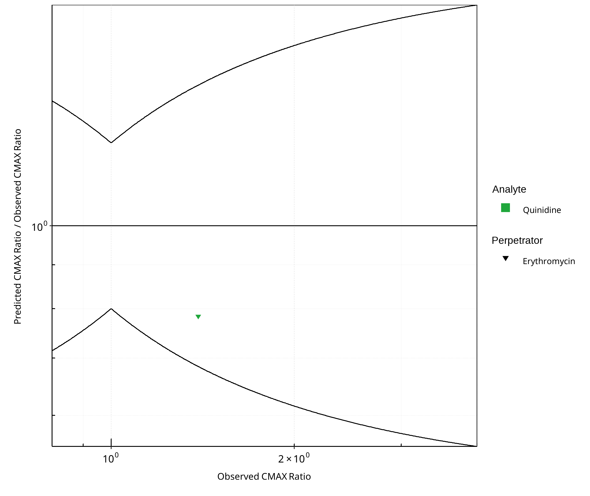

**Figure 2-24: CYP2D6 DDIs. Perpetrator: Erythromycin. Predicted/Observed vs. Observed Cmax Ratio. (&delta; = 1.25 in Guest *et al.* formula)**

 
 

**Table 2-17: GMFE for CYP2D6 DDI ratios**

|PK parameter |GMFE |
|:------------|:----|
|AUC          |1.13 |
|CMAX         |1.28 |

 
 

**Table 2-18: Summary of CYP2D6 DDI results - AUC ratio. (&delta; = 1.25 in Guest *et al.* formula)**

|AUC                          |Number |Ratio [%] |
|:----------------------------|:------|:---------|
|Points total                 |1      |-        |
|Points within Guest *et al.* |1      |100       |
|Points within 2 fold         |1      |100       |

 
 

**Table 2-19: Summary of CYP2D6 DDI results - Cmax ratio. (&delta; = 1.25 in Guest *et al.* formula)**

|CMAX                         |Number |Ratio [%] |
|:----------------------------|:------|:---------|
|Points total                 |1      |-        |
|Points within Guest *et al.* |1      |100       |
|Points within 2 fold         |1      |100       |

 
 

#### 2.1.1.6 Fluvoxamine

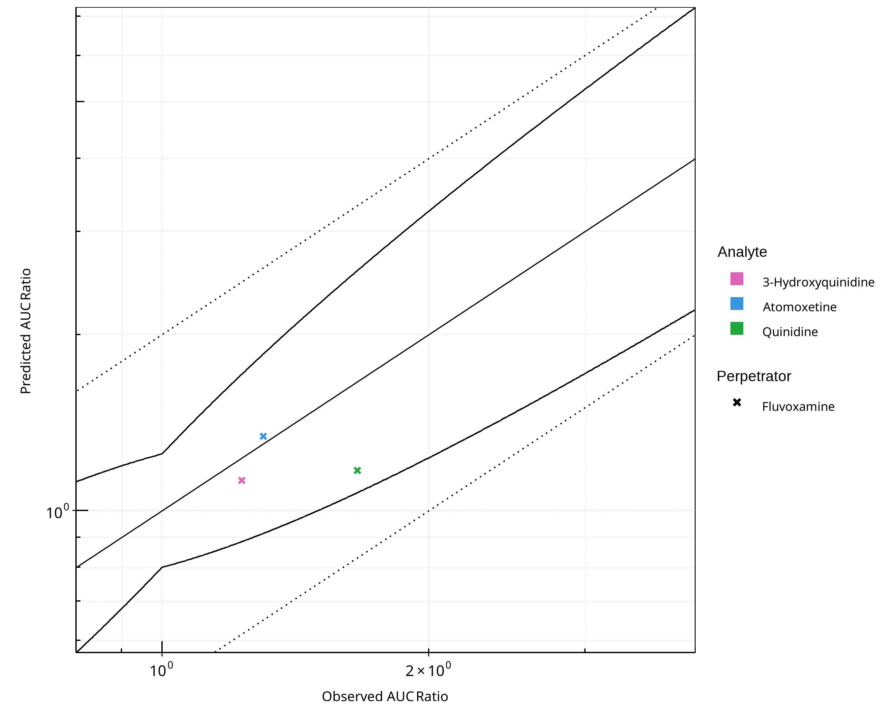

**Figure 2-25: CYP2D6 DDIs. Perpetrator: Fluvoxamine. Predicted vs. Observed AUC Ratio. (&delta; = 1.25 in Guest *et al.* formula)**

 
 

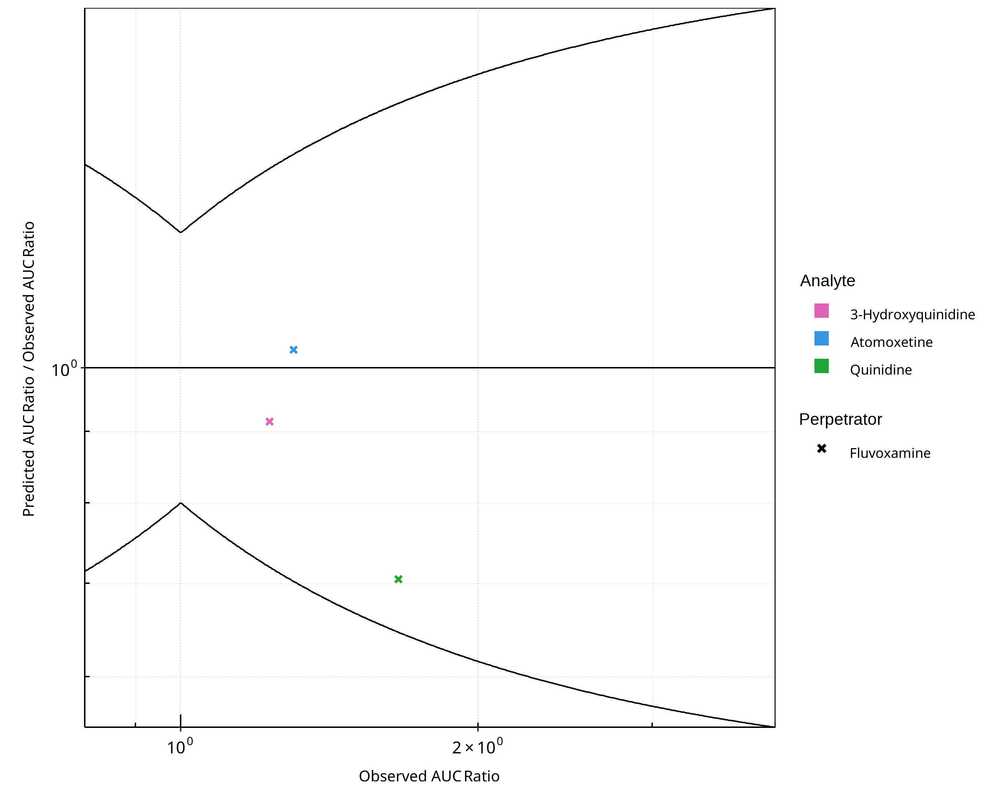

**Figure 2-26: CYP2D6 DDIs. Perpetrator: Fluvoxamine. Predicted/Observed vs. Observed AUC Ratio. (&delta; = 1.25 in Guest *et al.* formula)**

 
 

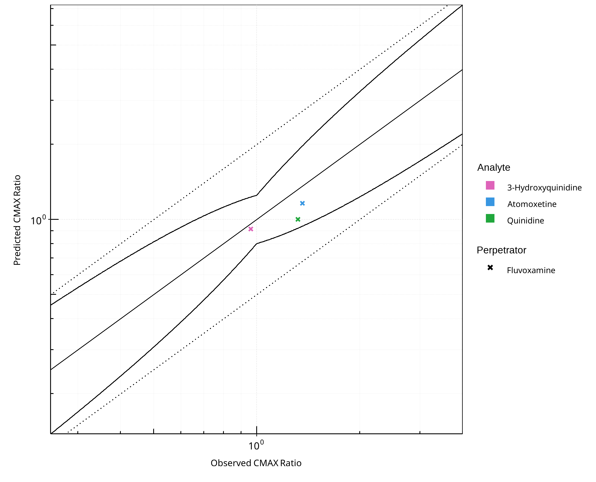

**Figure 2-27: CYP2D6 DDIs. Perpetrator: Fluvoxamine. Predicted vs. Observed Cmax Ratio. (&delta; = 1.25 in Guest *et al.* formula)**

 
 

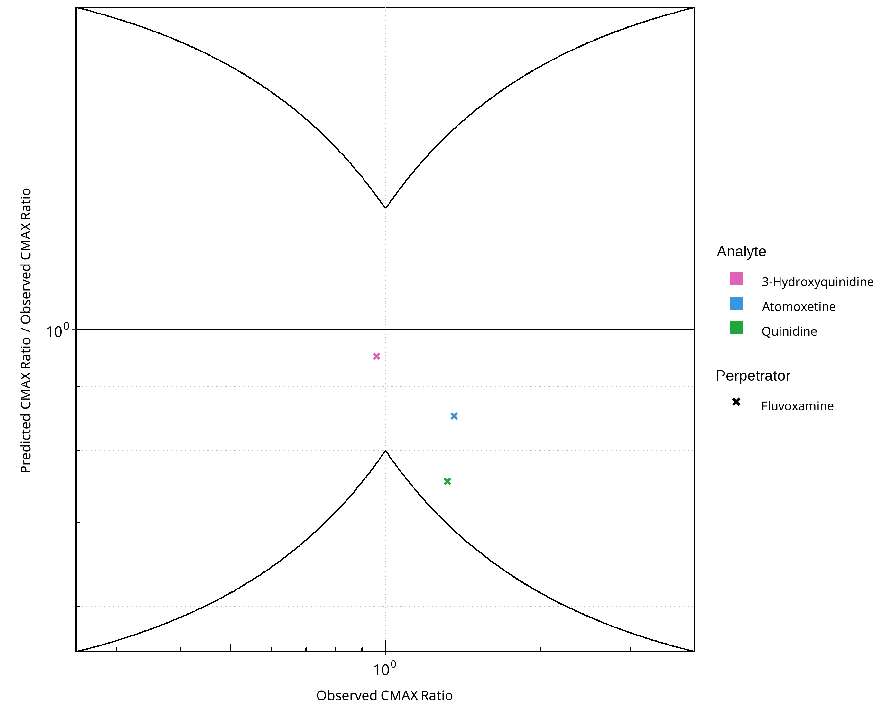

**Figure 2-28: CYP2D6 DDIs. Perpetrator: Fluvoxamine. Predicted/Observed vs. Observed Cmax Ratio. (&delta; = 1.25 in Guest *et al.* formula)**

 
 

**Table 2-20: GMFE for CYP2D6 DDI ratios**

|PK parameter |GMFE |
|:------------|:----|
|AUC          |1.17 |
|CMAX         |1.18 |

 
 

**Table 2-21: Summary of CYP2D6 DDI results - AUC ratio. (&delta; = 1.25 in Guest *et al.* formula)**

|AUC                          |Number |Ratio [%] |
|:----------------------------|:------|:---------|
|Points total                 |3      |-        |
|Points within Guest *et al.* |3      |100       |
|Points within 2 fold         |3      |100       |

 
 

**Table 2-22: Summary of CYP2D6 DDI results - Cmax ratio. (&delta; = 1.25 in Guest *et al.* formula)**

|CMAX                         |Number |Ratio [%] |
|:----------------------------|:------|:---------|
|Points total                 |3      |-        |
|Points within Guest *et al.* |3      |100       |
|Points within 2 fold         |3      |100       |

 
 

#### 2.1.1.7 Itraconazole

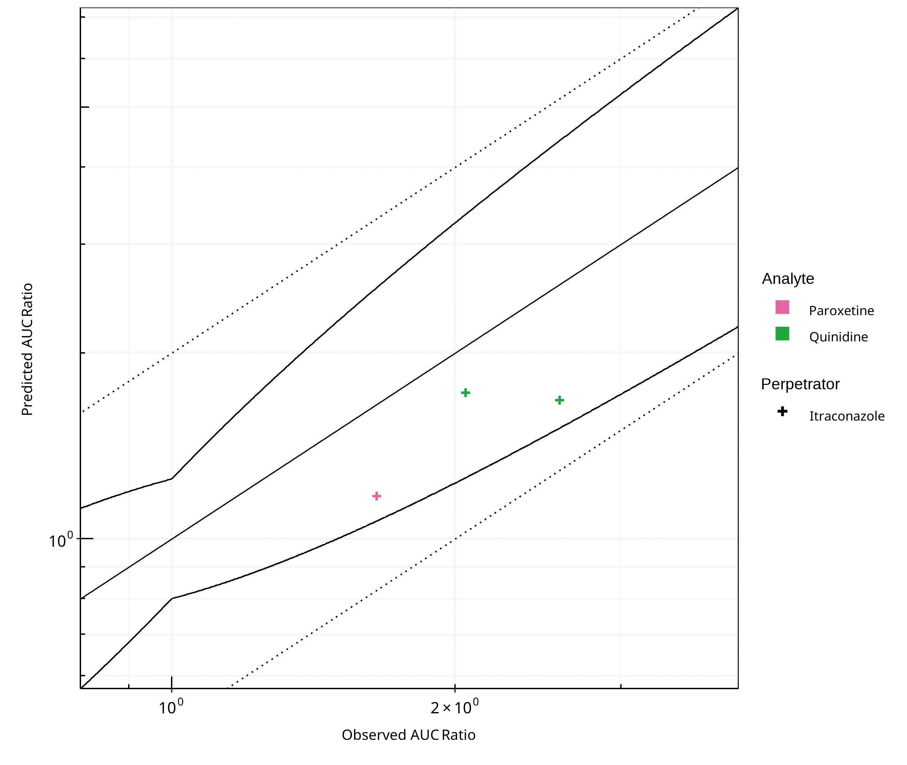

**Figure 2-29: CYP2D6 DDIs. Perpetrator: Itraconazole. Predicted vs. Observed AUC Ratio. (&delta; = 1.25 in Guest *et al.* formula)**

 
 

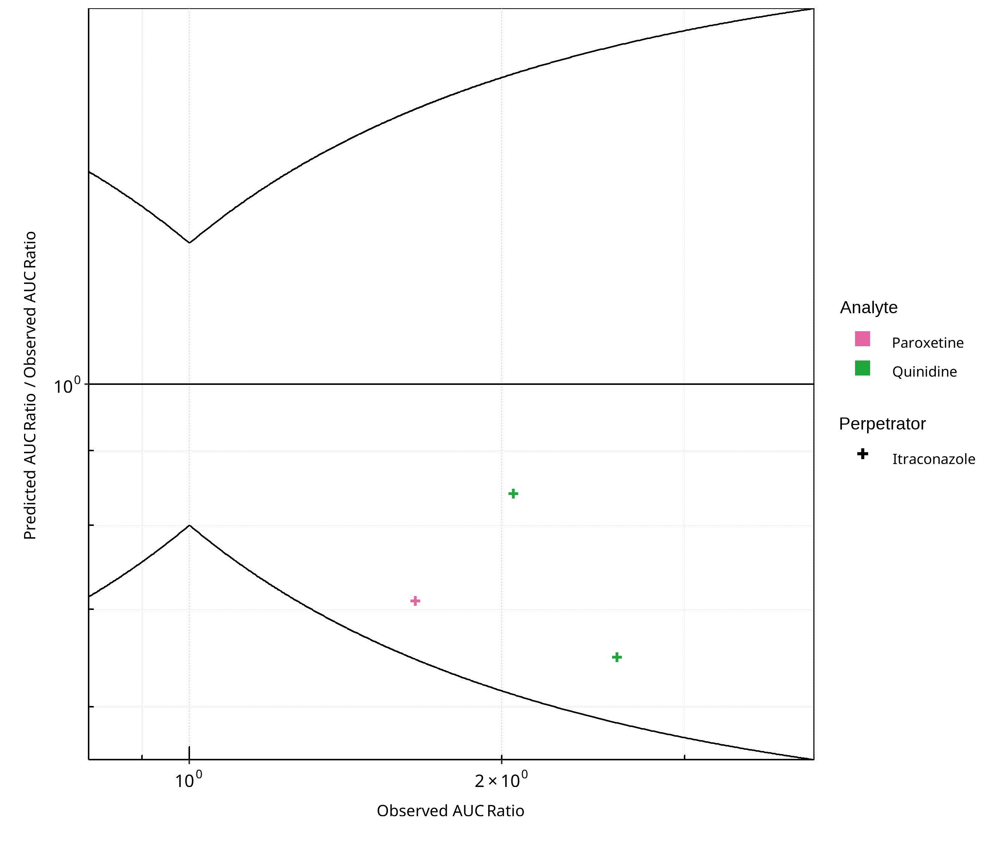

**Figure 2-30: CYP2D6 DDIs. Perpetrator: Itraconazole. Predicted/Observed vs. Observed AUC Ratio. (&delta; = 1.25 in Guest *et al.* formula)**

 
 

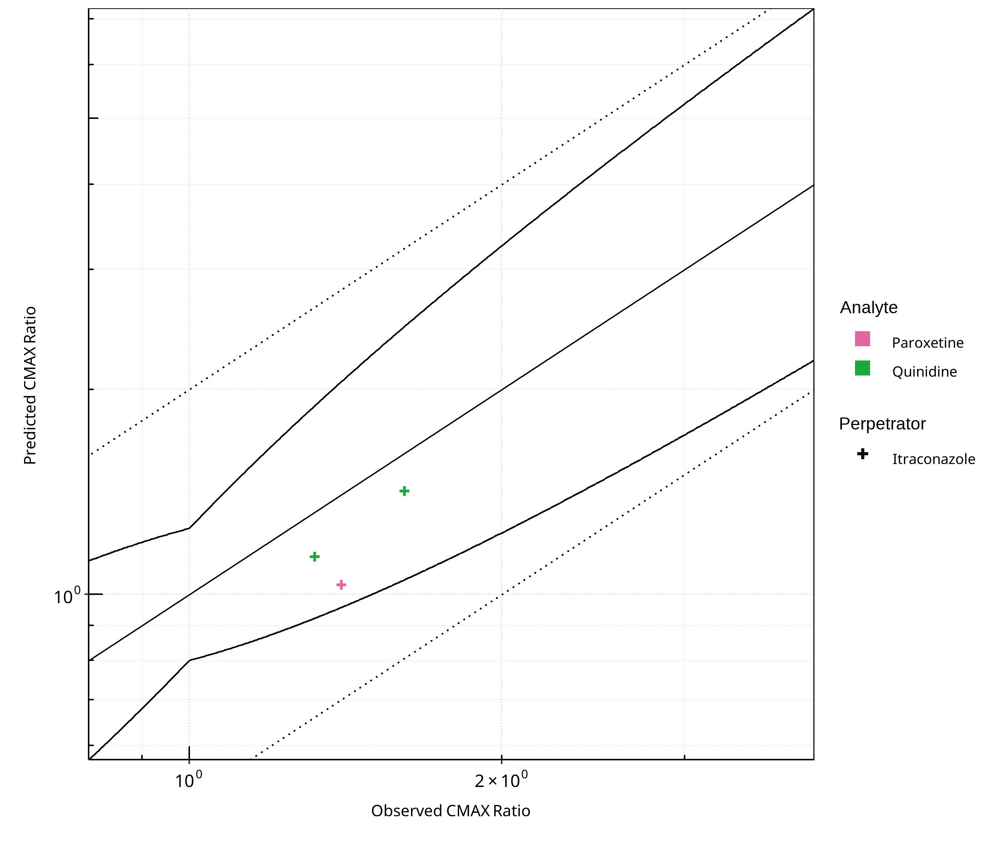

**Figure 2-31: CYP2D6 DDIs. Perpetrator: Itraconazole. Predicted vs. Observed Cmax Ratio. (&delta; = 1.25 in Guest *et al.* formula)**

 
 

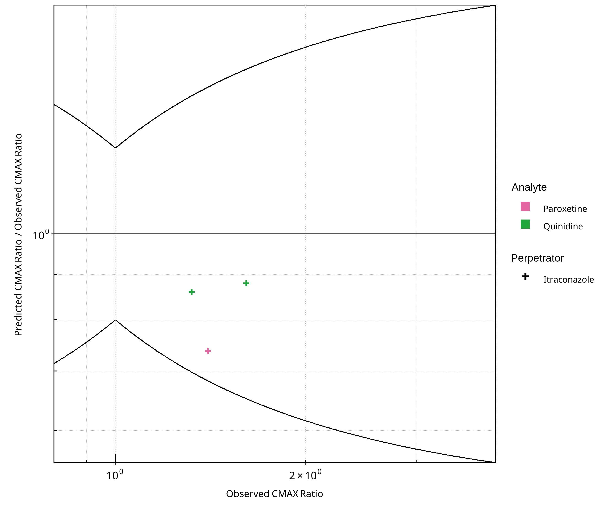

**Figure 2-32: CYP2D6 DDIs. Perpetrator: Itraconazole. Predicted/Observed vs. Observed Cmax Ratio. (&delta; = 1.25 in Guest *et al.* formula)**

 
 

**Table 2-23: GMFE for CYP2D6 DDI ratios**

|PK parameter |GMFE |
|:------------|:----|
|AUC          |1.37 |
|CMAX         |1.22 |

 
 

**Table 2-24: Summary of CYP2D6 DDI results - AUC ratio. (&delta; = 1.25 in Guest *et al.* formula)**

|AUC                          |Number |Ratio [%] |
|:----------------------------|:------|:---------|
|Points total                 |3      |-        |
|Points within Guest *et al.* |3      |100       |
|Points within 2 fold         |3      |100       |

 
 

**Table 2-25: Summary of CYP2D6 DDI results - Cmax ratio. (&delta; = 1.25 in Guest *et al.* formula)**

|CMAX                         |Number |Ratio [%] |
|:----------------------------|:------|:---------|
|Points total                 |3      |-        |
|Points within Guest *et al.* |3      |100       |
|Points within 2 fold         |3      |100       |

 
 

#### 2.1.1.8 Ketoconazole

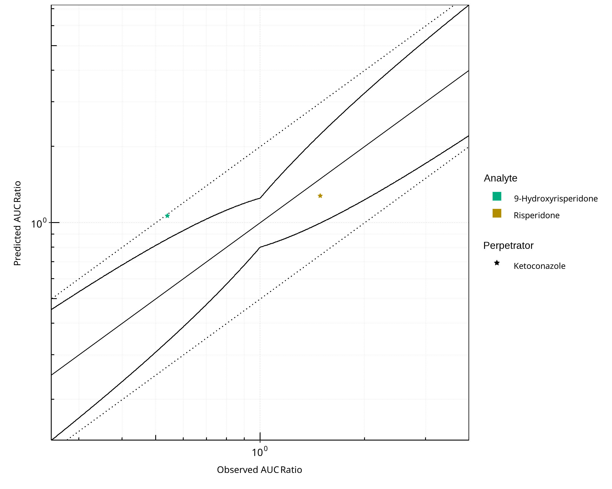

**Figure 2-33: CYP2D6 DDIs. Perpetrator: Ketoconazole. Predicted vs. Observed AUC Ratio. (&delta; = 1.25 in Guest *et al.* formula)**

 
 

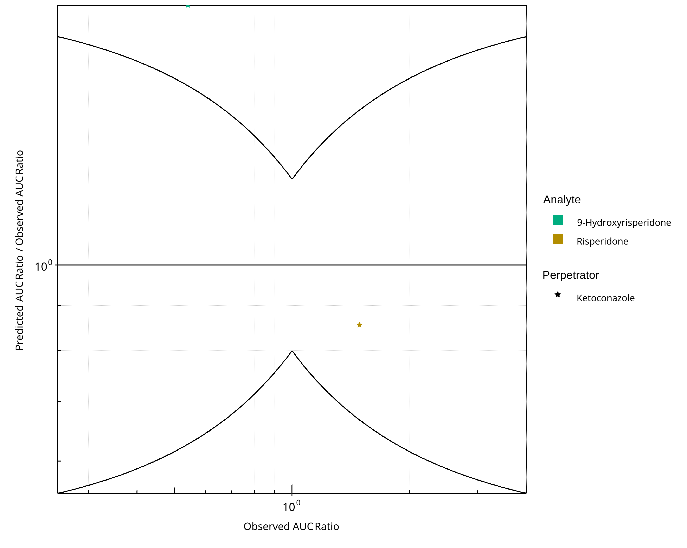

**Figure 2-34: CYP2D6 DDIs. Perpetrator: Ketoconazole. Predicted/Observed vs. Observed AUC Ratio. (&delta; = 1.25 in Guest *et al.* formula)**

 
 

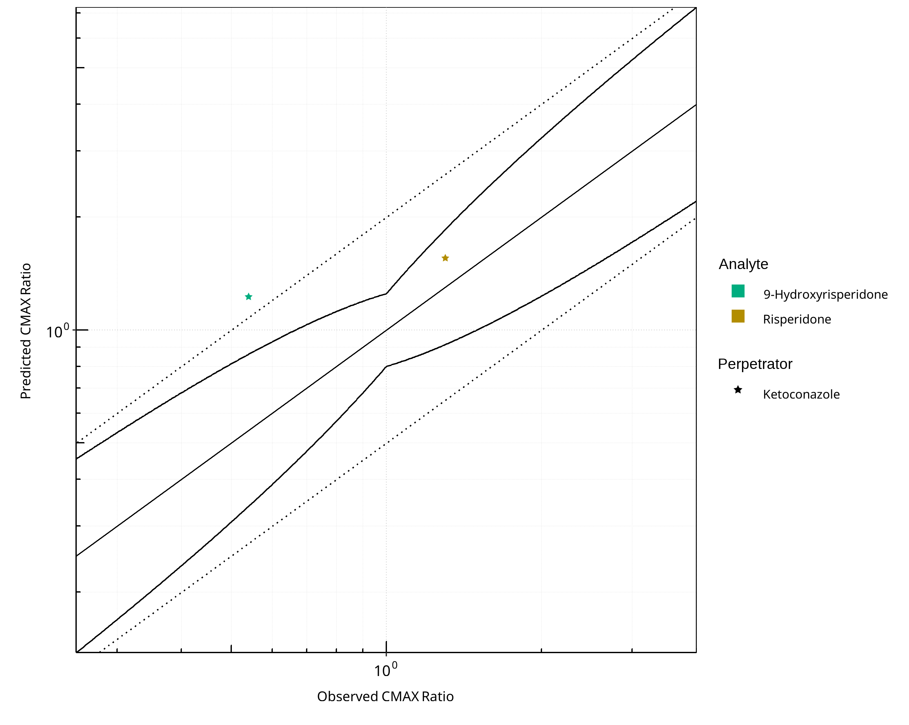

**Figure 2-35: CYP2D6 DDIs. Perpetrator: Ketoconazole. Predicted vs. Observed Cmax Ratio. (&delta; = 1.25 in Guest *et al.* formula)**

 
 

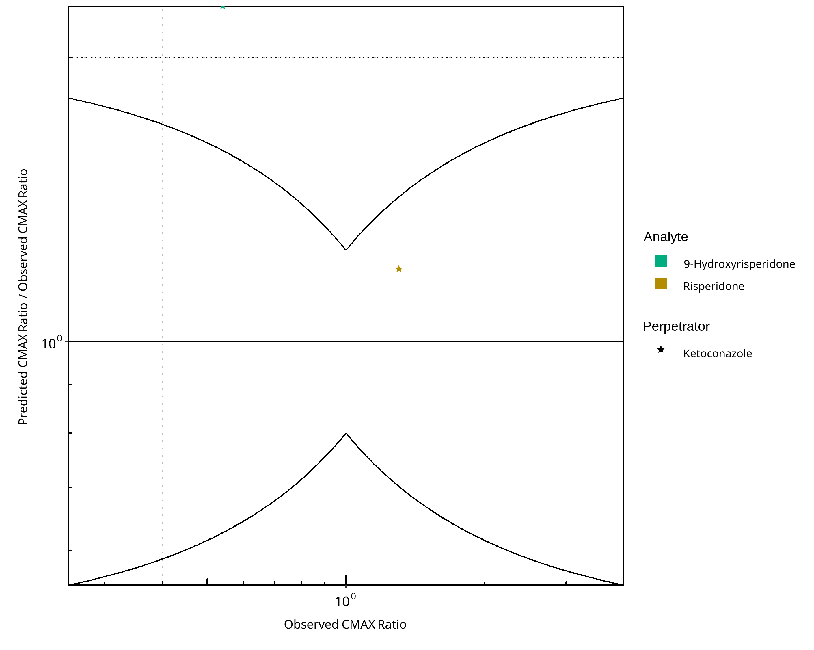

**Figure 2-36: CYP2D6 DDIs. Perpetrator: Ketoconazole. Predicted/Observed vs. Observed Cmax Ratio. (&delta; = 1.25 in Guest *et al.* formula)**

 
 

**Table 2-26: GMFE for CYP2D6 DDI ratios**

|PK parameter |GMFE |
|:------------|:----|
|AUC          |1.52 |
|CMAX         |1.64 |

 
 

**Table 2-27: Summary of CYP2D6 DDI results - AUC ratio. (&delta; = 1.25 in Guest *et al.* formula)**

|AUC                          |Number |Ratio [%] |
|:----------------------------|:------|:---------|
|Points total                 |2      |-        |
|Points within Guest *et al.* |1      |50        |
|Points within 2 fold         |2      |100       |

 
 

**Table 2-28: Summary of CYP2D6 DDI results - Cmax ratio. (&delta; = 1.25 in Guest *et al.* formula)**

|CMAX                         |Number |Ratio [%] |
|:----------------------------|:------|:---------|
|Points total                 |2      |-        |
|Points within Guest *et al.* |1      |50        |
|Points within 2 fold         |1      |50        |

 
 

#### 2.1.1.9 Omeprazole

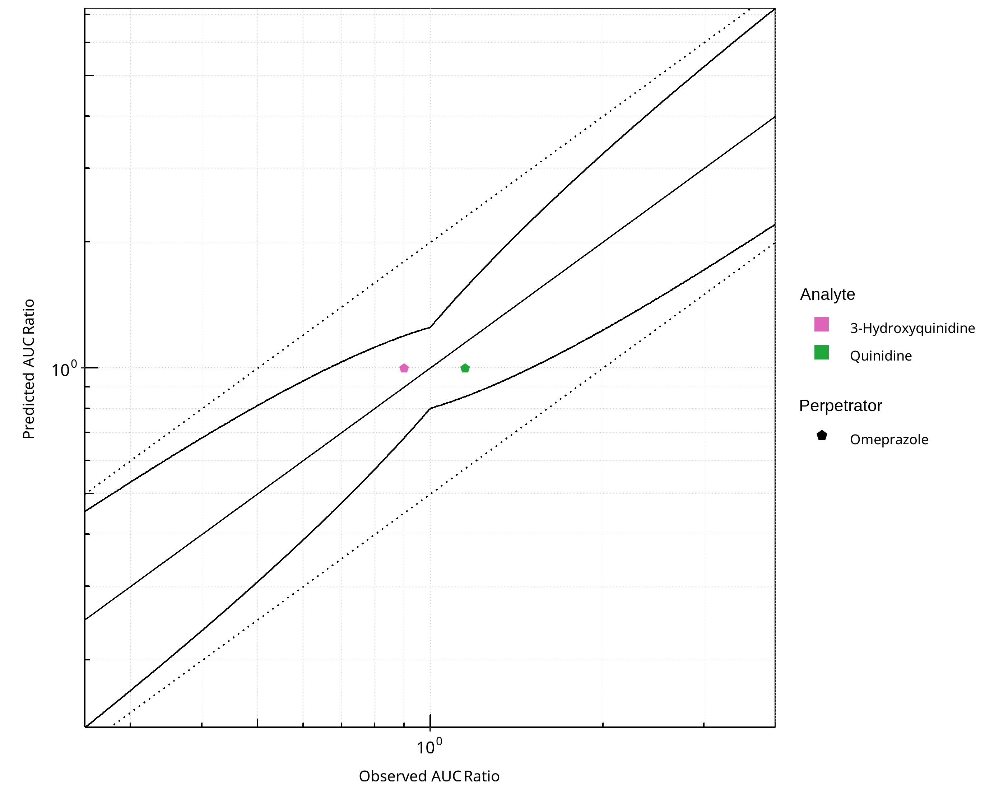

**Figure 2-37: CYP2D6 DDIs. Perpetrator: Omeprazole. Predicted vs. Observed AUC Ratio. (&delta; = 1.25 in Guest *et al.* formula)**

 
 

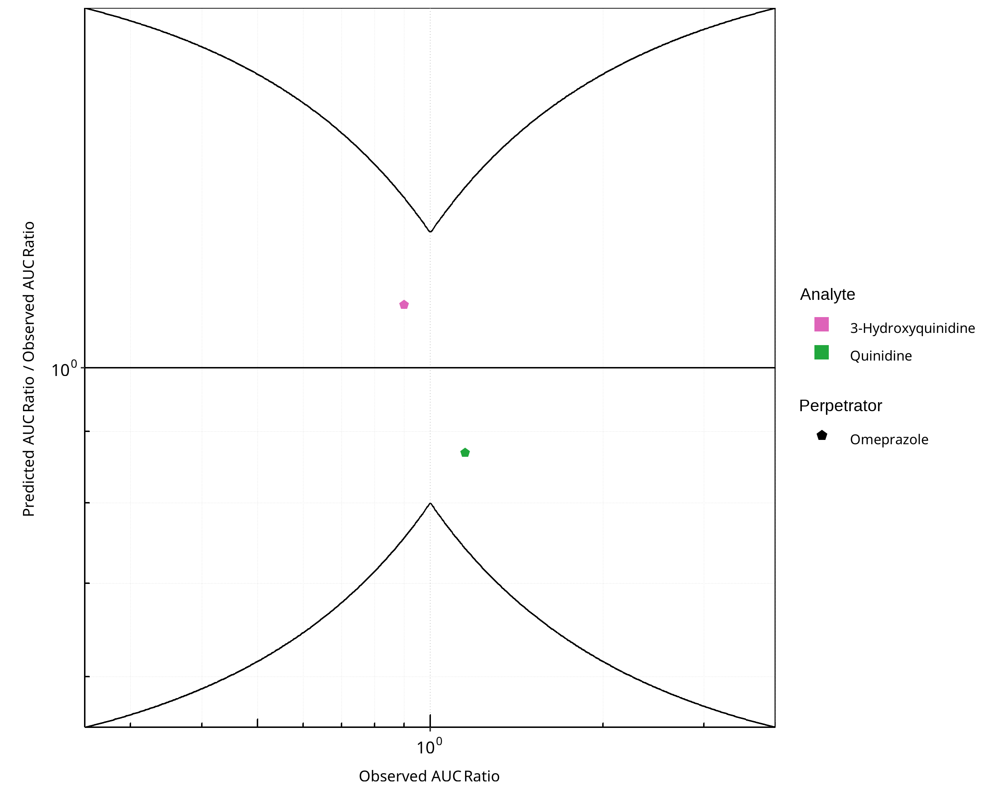

**Figure 2-38: CYP2D6 DDIs. Perpetrator: Omeprazole. Predicted/Observed vs. Observed AUC Ratio. (&delta; = 1.25 in Guest *et al.* formula)**

 
 

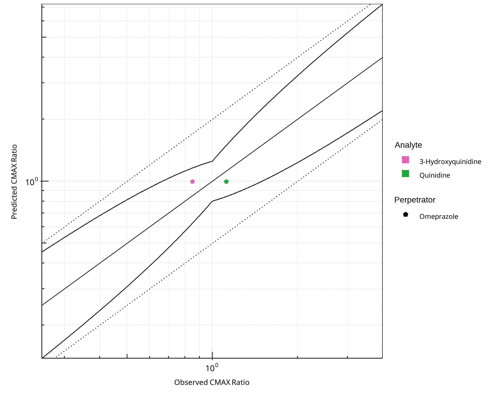

**Figure 2-39: CYP2D6 DDIs. Perpetrator: Omeprazole. Predicted vs. Observed Cmax Ratio. (&delta; = 1.25 in Guest *et al.* formula)**

 
 

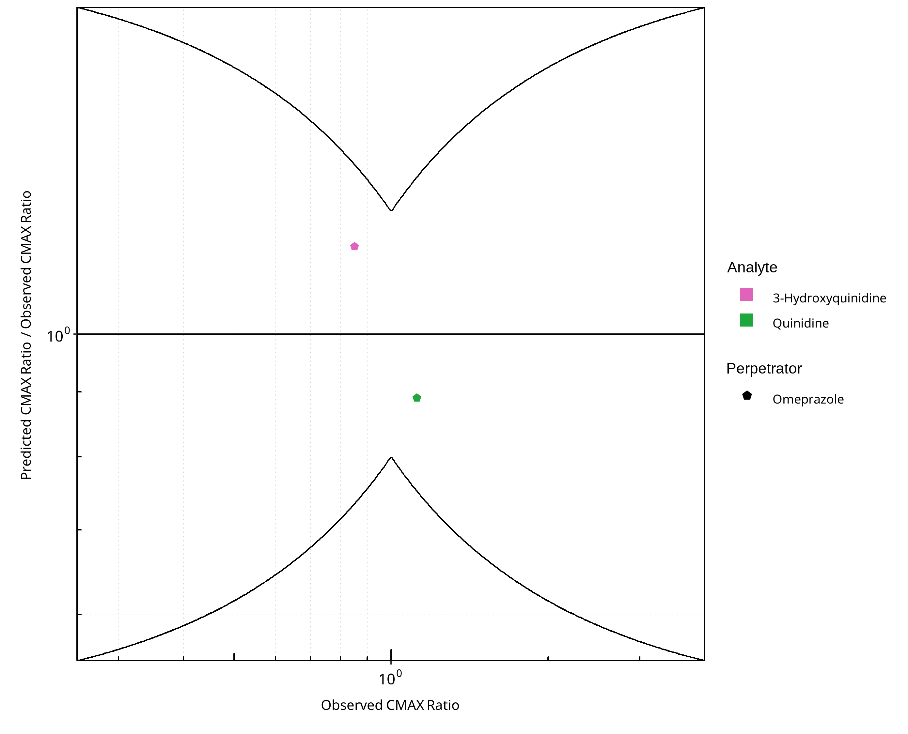

**Figure 2-40: CYP2D6 DDIs. Perpetrator: Omeprazole. Predicted/Observed vs. Observed Cmax Ratio. (&delta; = 1.25 in Guest *et al.* formula)**

 
 

**Table 2-29: GMFE for CYP2D6 DDI ratios**

|PK parameter |GMFE |
|:------------|:----|
|AUC          |1.13 |
|CMAX         |1.15 |

 
 

**Table 2-30: Summary of CYP2D6 DDI results - AUC ratio. (&delta; = 1.25 in Guest *et al.* formula)**

|AUC                          |Number |Ratio [%] |
|:----------------------------|:------|:---------|
|Points total                 |2      |-        |
|Points within Guest *et al.* |2      |100       |
|Points within 2 fold         |2      |100       |

 
 

**Table 2-31: Summary of CYP2D6 DDI results - Cmax ratio. (&delta; = 1.25 in Guest *et al.* formula)**

|CMAX                         |Number |Ratio [%] |
|:----------------------------|:------|:---------|
|Points total                 |2      |-        |
|Points within Guest *et al.* |2      |100       |
|Points within 2 fold         |2      |100       |

 
 

#### 2.1.1.10 Paroxetine

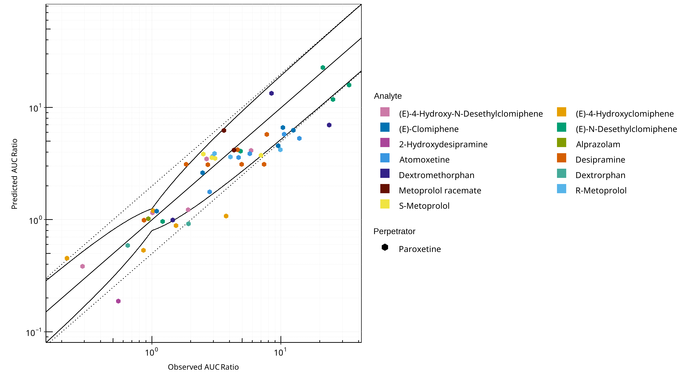

**Figure 2-41: CYP2D6 DDIs. Perpetrator: Paroxetine. Predicted vs. Observed AUC Ratio. (&delta; = 1.25 in Guest *et al.* formula)**

 
 

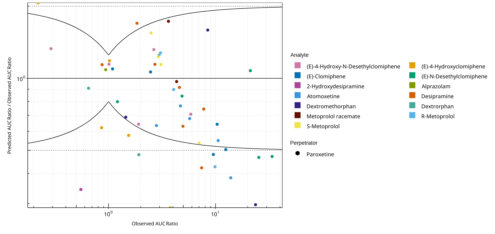

**Figure 2-42: CYP2D6 DDIs. Perpetrator: Paroxetine. Predicted/Observed vs. Observed AUC Ratio. (&delta; = 1.25 in Guest *et al.* formula)**

 
 

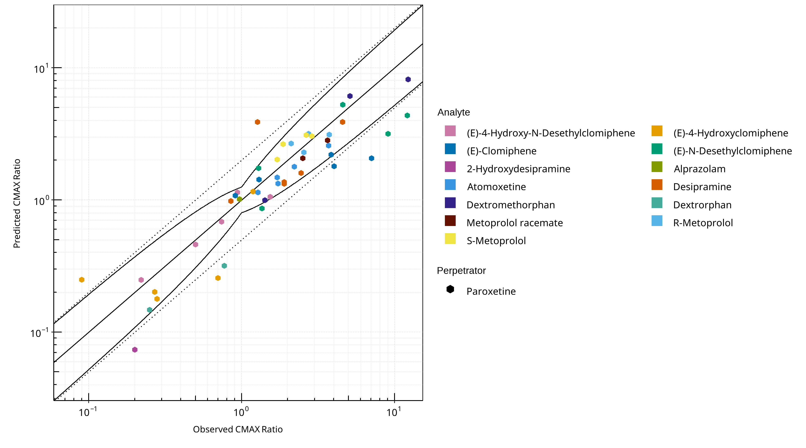

**Figure 2-43: CYP2D6 DDIs. Perpetrator: Paroxetine. Predicted vs. Observed Cmax Ratio. (&delta; = 1.25 in Guest *et al.* formula)**

 
 

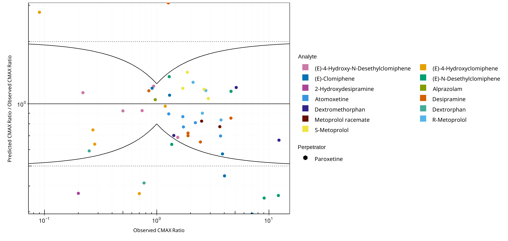

**Figure 2-44: CYP2D6 DDIs. Perpetrator: Paroxetine. Predicted/Observed vs. Observed Cmax Ratio. (&delta; = 1.25 in Guest *et al.* formula)**

 
 

**Table 2-32: GMFE for CYP2D6 DDI ratios**

|PK parameter |GMFE |
|:------------|:----|
|AUC          |1.54 |
|CMAX         |1.46 |

 
 

**Table 2-33: Summary of CYP2D6 DDI results - AUC ratio. (&delta; = 1.25 in Guest *et al.* formula)**

|AUC                          |Number |Ratio [%] |
|:----------------------------|:------|:---------|
|Points total                 |49     |-        |
|Points within Guest *et al.* |34     |69.39     |
|Points within 2 fold         |38     |77.55     |

 
 

**Table 2-34: Summary of CYP2D6 DDI results - Cmax ratio. (&delta; = 1.25 in Guest *et al.* formula)**

|CMAX                         |Number |Ratio [%] |
|:----------------------------|:------|:---------|
|Points total                 |49     |-        |
|Points within Guest *et al.* |39     |79.59     |
|Points within 2 fold         |40     |81.63     |

 
 

#### 2.1.1.11 Quinidine

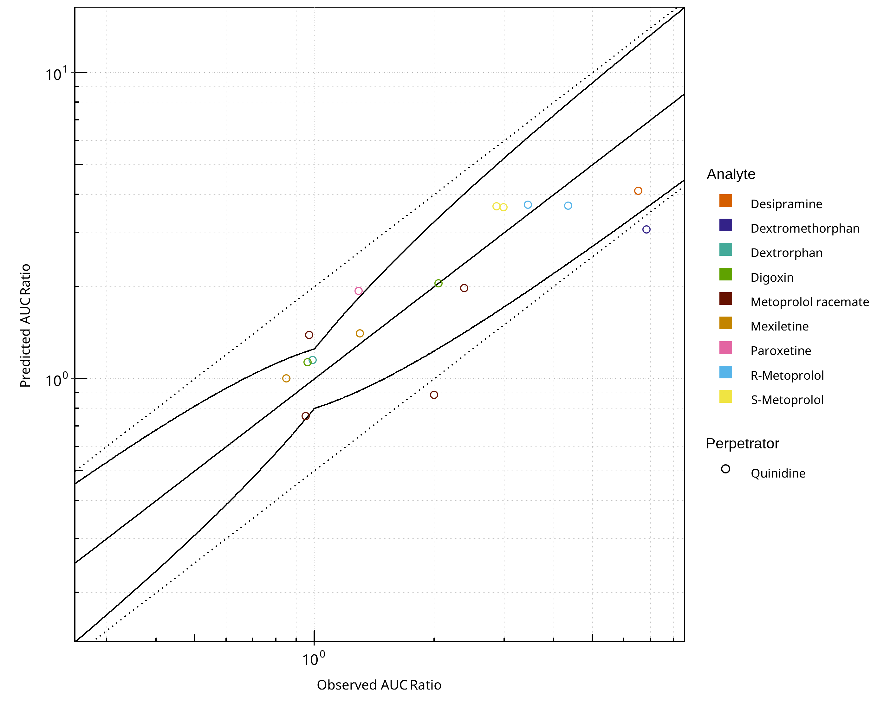

**Figure 2-45: CYP2D6 DDIs. Perpetrator: Quinidine. Predicted vs. Observed AUC Ratio. (&delta; = 1.25 in Guest *et al.* formula)**

 
 

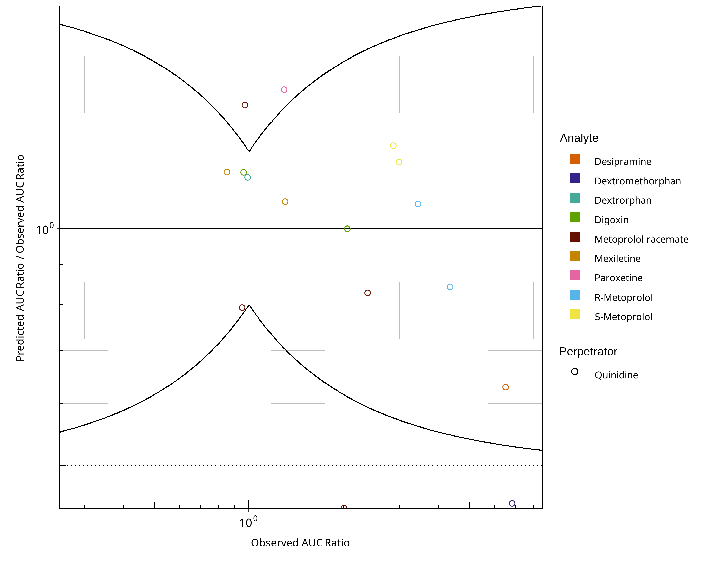

**Figure 2-46: CYP2D6 DDIs. Perpetrator: Quinidine. Predicted/Observed vs. Observed AUC Ratio. (&delta; = 1.25 in Guest *et al.* formula)**

 
 

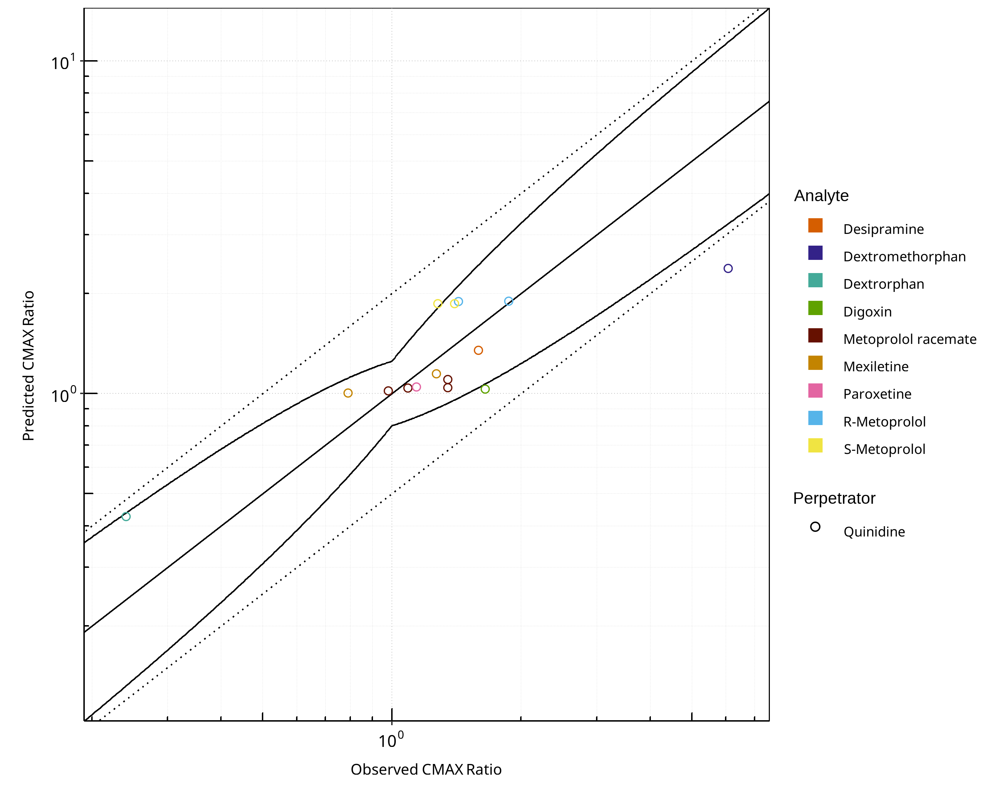

**Figure 2-47: CYP2D6 DDIs. Perpetrator: Quinidine. Predicted vs. Observed Cmax Ratio. (&delta; = 1.25 in Guest *et al.* formula)**

 
 

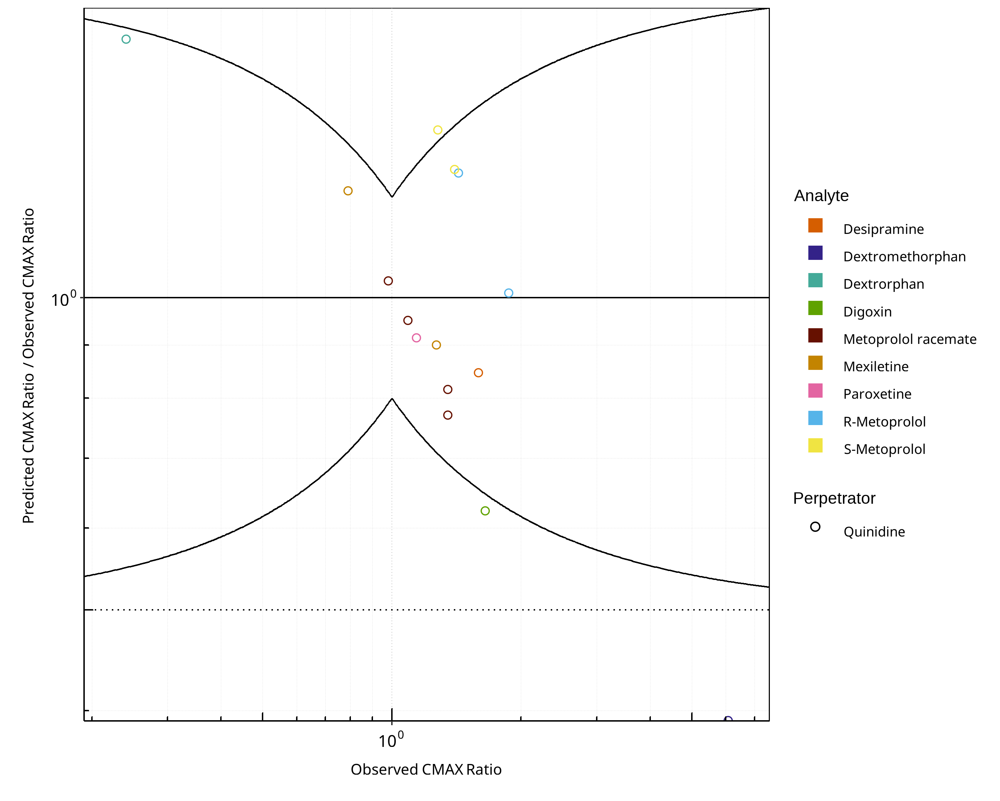

**Figure 2-48: CYP2D6 DDIs. Perpetrator: Quinidine. Predicted/Observed vs. Observed Cmax Ratio. (&delta; = 1.25 in Guest *et al.* formula)**

 
 

**Table 2-35: GMFE for CYP2D6 DDI ratios**

|PK parameter |GMFE |
|:------------|:----|
|AUC          |1.32 |
|CMAX         |1.31 |

 
 

**Table 2-36: Summary of CYP2D6 DDI results - AUC ratio. (&delta; = 1.25 in Guest *et al.* formula)**

|AUC                          |Number |Ratio [%] |
|:----------------------------|:------|:---------|
|Points total                 |16     |-        |
|Points within Guest *et al.* |12     |75.00     |
|Points within 2 fold         |14     |87.50     |

 
 

**Table 2-37: Summary of CYP2D6 DDI results - Cmax ratio. (&delta; = 1.25 in Guest *et al.* formula)**

|CMAX                         |Number |Ratio [%] |
|:----------------------------|:------|:---------|
|Points total                 |15     |-        |
|Points within Guest *et al.* |12     |80.00     |
|Points within 2 fold         |14     |93.33     |

 
 

#### 2.1.1.12 Rifampicin

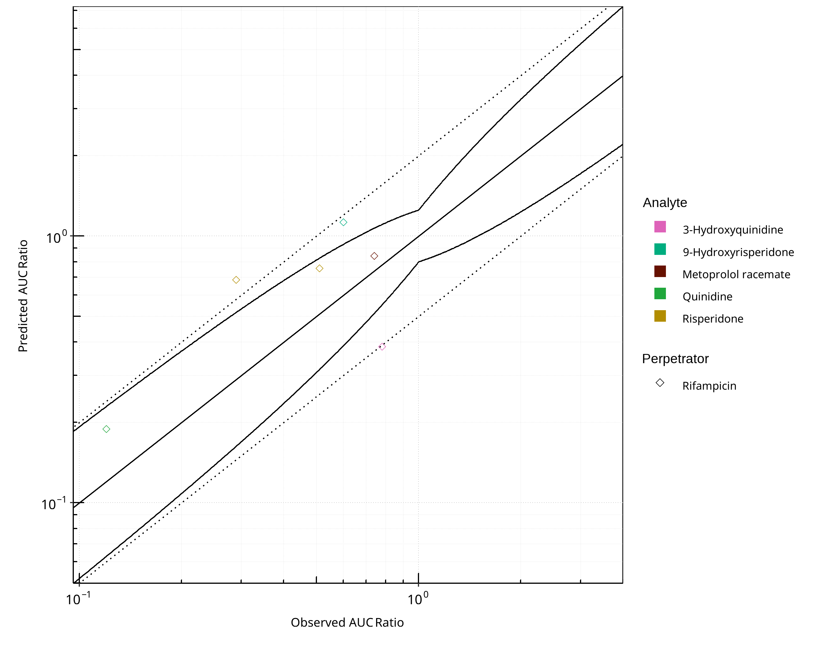

**Figure 2-49: CYP2D6 DDIs. Perpetrator: Rifampicin. Predicted vs. Observed AUC Ratio. (&delta; = 1.25 in Guest *et al.* formula)**

 
 


**Figure 2-50: CYP2D6 DDIs. Perpetrator: Rifampicin. Predicted/Observed vs. Observed AUC Ratio. (&delta; = 1.25 in Guest *et al.* formula)**

 
 


**Figure 2-51: CYP2D6 DDIs. Perpetrator: Rifampicin. Predicted vs. Observed Cmax Ratio. (&delta; = 1.25 in Guest *et al.* formula)**

 
 


**Figure 2-52: CYP2D6 DDIs. Perpetrator: Rifampicin. Predicted/Observed vs. Observed Cmax Ratio. (&delta; = 1.25 in Guest *et al.* formula)**

 
 

**Table 2-38: GMFE for CYP2D6 DDI ratios**

|PK parameter |GMFE |
|:------------|:----|
|AUC          |1.70 |
|CMAX         |1.64 |

 
 

**Table 2-39: Summary of CYP2D6 DDI results - AUC ratio. (&delta; = 1.25 in Guest *et al.* formula)**

|AUC                          |Number |Ratio [%] |
|:----------------------------|:------|:---------|
|Points total                 |6      |-        |
|Points within Guest *et al.* |3      |50.00     |
|Points within 2 fold         |4      |66.67     |

 
 

**Table 2-40: Summary of CYP2D6 DDI results - Cmax ratio. (&delta; = 1.25 in Guest *et al.* formula)**

|CMAX                         |Number |Ratio [%] |
|:----------------------------|:------|:---------|
|Points total                 |6      |-        |
|Points within Guest *et al.* |2      |33.33     |
|Points within 2 fold         |5      |83.33     |

 
 

#### 2.1.1.13 Verapamil


**Figure 2-53: CYP2D6 DDIs. Perpetrator: Verapamil. Predicted vs. Observed AUC Ratio. (&delta; = 1.25 in Guest *et al.* formula)**

 
 


**Figure 2-54: CYP2D6 DDIs. Perpetrator: Verapamil. Predicted/Observed vs. Observed AUC Ratio. (&delta; = 1.25 in Guest *et al.* formula)**

 
 


**Figure 2-55: CYP2D6 DDIs. Perpetrator: Verapamil. Predicted vs. Observed Cmax Ratio. (&delta; = 1.25 in Guest *et al.* formula)**

 
 


**Figure 2-56: CYP2D6 DDIs. Perpetrator: Verapamil. Predicted/Observed vs. Observed Cmax Ratio. (&delta; = 1.25 in Guest *et al.* formula)**

 
 

**Table 2-41: GMFE for CYP2D6 DDI ratios**

|PK parameter |GMFE |
|:------------|:----|
|AUC          |1.27 |
|CMAX         |1.20 |

 
 

**Table 2-42: Summary of CYP2D6 DDI results - AUC ratio. (&delta; = 1.25 in Guest *et al.* formula)**

|AUC                          |Number |Ratio [%] |
|:----------------------------|:------|:---------|
|Points total                 |4      |-        |
|Points within Guest *et al.* |4      |100       |
|Points within 2 fold         |4      |100       |

 
 

**Table 2-43: Summary of CYP2D6 DDI results - Cmax ratio. (&delta; = 1.25 in Guest *et al.* formula)**

|CMAX                         |Number |Ratio [%] |
|:----------------------------|:------|:---------|
|Points total                 |4      |-        |
|Points within Guest *et al.* |3      |75        |
|Points within 2 fold         |4      |100       |

 
 

### 2.1.2 Victim

#### 2.1.2.1 (E)-Clomiphene


**Figure 2-57: CYP2D6 DDIs. Victim: (E)-Clomiphene. Predicted vs. Observed AUC Ratio. (&delta; = 1.25 in Guest *et al.* formula)**

 
 


**Figure 2-58: CYP2D6 DDIs. Victim: (E)-Clomiphene. Predicted/Observed vs. Observed AUC Ratio. (&delta; = 1.25 in Guest *et al.* formula)**

 
 


**Figure 2-59: CYP2D6 DDIs. Victim: (E)-Clomiphene. Predicted vs. Observed Cmax Ratio. (&delta; = 1.25 in Guest *et al.* formula)**

 
 


**Figure 2-60: CYP2D6 DDIs. Victim: (E)-Clomiphene. Predicted/Observed vs. Observed Cmax Ratio. (&delta; = 1.25 in Guest *et al.* formula)**

 
 

**Table 2-44: GMFE for CYP2D6 DDI ratios**

|PK parameter |GMFE |
|:------------|:----|
|AUC          |1.41 |
|CMAX         |1.50 |

 
 

**Table 2-45: Summary of CYP2D6 DDI results - AUC ratio. (&delta; = 1.25 in Guest *et al.* formula)**

|AUC                          |Number |Ratio [%] |
|:----------------------------|:------|:---------|
|Points total                 |40     |-        |
|Points within Guest *et al.* |30     |75.00     |
|Points within 2 fold         |33     |82.50     |

 
 

**Table 2-46: Summary of CYP2D6 DDI results - Cmax ratio. (&delta; = 1.25 in Guest *et al.* formula)**

|CMAX                         |Number |Ratio [%] |
|:----------------------------|:------|:---------|
|Points total                 |40     |-        |
|Points within Guest *et al.* |27     |67.50     |
|Points within 2 fold         |31     |77.50     |

 
 

#### 2.1.2.2 Alprazolam


**Figure 2-61: CYP2D6 DDIs. Victim: Alprazolam. Predicted vs. Observed AUC Ratio. (&delta; = 1.25 in Guest *et al.* formula)**

 
 


**Figure 2-62: CYP2D6 DDIs. Victim: Alprazolam. Predicted/Observed vs. Observed AUC Ratio. (&delta; = 1.25 in Guest *et al.* formula)**

 
 

**Figure 2-63: CYP2D6 DDIs. Victim: Alprazolam. Predicted vs. Observed Cmax Ratio. (&delta; = 1.25 in Guest *et al.* formula)**

 
 

**Figure 2-64: CYP2D6 DDIs. Victim: Alprazolam. Predicted/Observed vs. Observed Cmax Ratio. (&delta; = 1.25 in Guest *et al.* formula)**

 
 

**Table 2-47: GMFE for CYP2D6 DDI ratios**

|PK parameter |GMFE |
|:------------|:----|
|AUC          |1.09 |
|CMAX         |1.05 |

 
 

**Table 2-48: Summary of CYP2D6 DDI results - AUC ratio. (&delta; = 1.25 in Guest *et al.* formula)**

|AUC                          |Number |Ratio [%] |
|:----------------------------|:------|:---------|
|Points total                 |1      |-        |
|Points within Guest *et al.* |1      |100       |
|Points within 2 fold         |1      |100       |

 
 

**Table 2-49: Summary of CYP2D6 DDI results - Cmax ratio. (&delta; = 1.25 in Guest *et al.* formula)**

|CMAX                         |Number |Ratio [%] |
|:----------------------------|:------|:---------|
|Points total                 |1      |-        |
|Points within Guest *et al.* |1      |100       |
|Points within 2 fold         |1      |100       |

 
 

#### 2.1.2.3 Atomoxetine


**Figure 2-65: CYP2D6 DDIs. Victim: Atomoxetine. Predicted vs. Observed AUC Ratio. (&delta; = 1.25 in Guest *et al.* formula)**

 
 


**Figure 2-66: CYP2D6 DDIs. Victim: Atomoxetine. Predicted/Observed vs. Observed AUC Ratio. (&delta; = 1.25 in Guest *et al.* formula)**

 
 


**Figure 2-67: CYP2D6 DDIs. Victim: Atomoxetine. Predicted vs. Observed Cmax Ratio. (&delta; = 1.25 in Guest *et al.* formula)**

 
 


**Figure 2-68: CYP2D6 DDIs. Victim: Atomoxetine. Predicted/Observed vs. Observed Cmax Ratio. (&delta; = 1.25 in Guest *et al.* formula)**

 
 

**Table 2-50: GMFE for CYP2D6 DDI ratios**

|PK parameter |GMFE |
|:------------|:----|
|AUC          |1.56 |
|CMAX         |1.23 |

 
 

**Table 2-51: Summary of CYP2D6 DDI results - AUC ratio. (&delta; = 1.25 in Guest *et al.* formula)**

|AUC                          |Number |Ratio [%] |
|:----------------------------|:------|:---------|
|Points total                 |6      |-        |
|Points within Guest *et al.* |5      |83.33     |
|Points within 2 fold         |5      |83.33     |

 
 

**Table 2-52: Summary of CYP2D6 DDI results - Cmax ratio. (&delta; = 1.25 in Guest *et al.* formula)**

|CMAX                         |Number |Ratio [%] |
|:----------------------------|:------|:---------|
|Points total                 |6      |-        |
|Points within Guest *et al.* |6      |100       |
|Points within 2 fold         |6      |100       |

 
 

#### 2.1.2.4 Desipramine


**Figure 2-69: CYP2D6 DDIs. Victim: Desipramine. Predicted vs. Observed AUC Ratio. (&delta; = 1.25 in Guest *et al.* formula)**

 
 


**Figure 2-70: CYP2D6 DDIs. Victim: Desipramine. Predicted/Observed vs. Observed AUC Ratio. (&delta; = 1.25 in Guest *et al.* formula)**

 
 


**Figure 2-71: CYP2D6 DDIs. Victim: Desipramine. Predicted vs. Observed Cmax Ratio. (&delta; = 1.25 in Guest *et al.* formula)**

 
 


**Figure 2-72: CYP2D6 DDIs. Victim: Desipramine. Predicted/Observed vs. Observed Cmax Ratio. (&delta; = 1.25 in Guest *et al.* formula)**

 
 

**Table 2-53: GMFE for CYP2D6 DDI ratios**

|PK parameter |GMFE |
|:------------|:----|
|AUC          |1.51 |
|CMAX         |1.48 |

 
 

**Table 2-54: Summary of CYP2D6 DDI results - AUC ratio. (&delta; = 1.25 in Guest *et al.* formula)**

|AUC                          |Number |Ratio [%] |
|:----------------------------|:------|:---------|
|Points total                 |10     |-        |
|Points within Guest *et al.* |7      |70        |
|Points within 2 fold         |8      |80        |

 
 

**Table 2-55: Summary of CYP2D6 DDI results - Cmax ratio. (&delta; = 1.25 in Guest *et al.* formula)**

|CMAX                         |Number |Ratio [%] |
|:----------------------------|:------|:---------|
|Points total                 |10     |-        |
|Points within Guest *et al.* |8      |80        |
|Points within 2 fold         |8      |80        |

 
 

#### 2.1.2.5 Dextromethorphan


**Figure 2-73: CYP2D6 DDIs. Victim: Dextromethorphan. Predicted vs. Observed AUC Ratio. (&delta; = 1.25 in Guest *et al.* formula)**

 
 


**Figure 2-74: CYP2D6 DDIs. Victim: Dextromethorphan. Predicted/Observed vs. Observed AUC Ratio. (&delta; = 1.25 in Guest *et al.* formula)**

 
 


**Figure 2-75: CYP2D6 DDIs. Victim: Dextromethorphan. Predicted vs. Observed Cmax Ratio. (&delta; = 1.25 in Guest *et al.* formula)**

 
 


**Figure 2-76: CYP2D6 DDIs. Victim: Dextromethorphan. Predicted/Observed vs. Observed Cmax Ratio. (&delta; = 1.25 in Guest *et al.* formula)**

 
 

**Table 2-56: GMFE for CYP2D6 DDI ratios**

|PK parameter |GMFE |
|:------------|:----|
|AUC          |1.73 |
|CMAX         |1.73 |

 
 

**Table 2-57: Summary of CYP2D6 DDI results - AUC ratio. (&delta; = 1.25 in Guest *et al.* formula)**

|AUC                          |Number |Ratio [%] |
|:----------------------------|:------|:---------|
|Points total                 |7      |-        |
|Points within Guest *et al.* |4      |57.14     |
|Points within 2 fold         |4      |57.14     |

 
 

**Table 2-58: Summary of CYP2D6 DDI results - Cmax ratio. (&delta; = 1.25 in Guest *et al.* formula)**

|CMAX                         |Number |Ratio [%] |
|:----------------------------|:------|:---------|
|Points total                 |7      |-        |
|Points within Guest *et al.* |5      |71.43     |
|Points within 2 fold         |5      |71.43     |

 
 

#### 2.1.2.6 Digoxin


**Figure 2-77: CYP2D6 DDIs. Victim: Digoxin. Predicted vs. Observed AUC Ratio. (&delta; = 1.25 in Guest *et al.* formula)**

 
 


**Figure 2-78: CYP2D6 DDIs. Victim: Digoxin. Predicted/Observed vs. Observed AUC Ratio. (&delta; = 1.25 in Guest *et al.* formula)**

 
 


**Figure 2-79: CYP2D6 DDIs. Victim: Digoxin. Predicted vs. Observed Cmax Ratio. (&delta; = 1.25 in Guest *et al.* formula)**

 
 


**Figure 2-80: CYP2D6 DDIs. Victim: Digoxin. Predicted/Observed vs. Observed Cmax Ratio. (&delta; = 1.25 in Guest *et al.* formula)**

 
 

**Table 2-59: GMFE for CYP2D6 DDI ratios**

|PK parameter |GMFE |
|:------------|:----|
|AUC          |1.09 |
|CMAX         |1.61 |

 
 

**Table 2-60: Summary of CYP2D6 DDI results - AUC ratio. (&delta; = 1.25 in Guest *et al.* formula)**

|AUC                          |Number |Ratio [%] |
|:----------------------------|:------|:---------|
|Points total                 |2      |-        |
|Points within Guest *et al.* |2      |100       |
|Points within 2 fold         |2      |100       |

 
 

**Table 2-61: Summary of CYP2D6 DDI results - Cmax ratio. (&delta; = 1.25 in Guest *et al.* formula)**

|CMAX                         |Number |Ratio [%] |
|:----------------------------|:------|:---------|
|Points total                 |1      |-        |
|Points within Guest *et al.* |0      |0         |
|Points within 2 fold         |1      |100       |

 
 

#### 2.1.2.7 Metoprolol


**Figure 2-81: CYP2D6 DDIs. Victim: Metoprolol. Predicted vs. Observed AUC Ratio. (&delta; = 1.25 in Guest *et al.* formula)**

 
 


**Figure 2-82: CYP2D6 DDIs. Victim: Metoprolol. Predicted/Observed vs. Observed AUC Ratio. (&delta; = 1.25 in Guest *et al.* formula)**

 
 


**Figure 2-83: CYP2D6 DDIs. Victim: Metoprolol. Predicted vs. Observed Cmax Ratio. (&delta; = 1.25 in Guest *et al.* formula)**

 
 


**Figure 2-84: CYP2D6 DDIs. Victim: Metoprolol. Predicted/Observed vs. Observed Cmax Ratio. (&delta; = 1.25 in Guest *et al.* formula)**

 
 

**Table 2-62: GMFE for CYP2D6 DDI ratios**

|PK parameter |GMFE |
|:------------|:----|
|AUC          |1.35 |
|CMAX         |1.23 |

 
 

**Table 2-63: Summary of CYP2D6 DDI results - AUC ratio. (&delta; = 1.25 in Guest *et al.* formula)**

|AUC                          |Number |Ratio [%] |
|:----------------------------|:------|:---------|
|Points total                 |23     |-        |
|Points within Guest *et al.* |19     |82.61     |
|Points within 2 fold         |21     |91.30     |

 
 

**Table 2-64: Summary of CYP2D6 DDI results - Cmax ratio. (&delta; = 1.25 in Guest *et al.* formula)**

|CMAX                         |Number |Ratio [%] |
|:----------------------------|:------|:---------|
|Points total                 |23     |-        |
|Points within Guest *et al.* |21     |91.30     |
|Points within 2 fold         |23     |100.00    |

 
 

#### 2.1.2.8 Mexiletine

**Figure 2-85: CYP2D6 DDIs. Victim: Mexiletine. Predicted vs. Observed AUC Ratio. (&delta; = 1.25 in Guest *et al.* formula)**

 
 


**Figure 2-86: CYP2D6 DDIs. Victim: Mexiletine. Predicted/Observed vs. Observed AUC Ratio. (&delta; = 1.25 in Guest *et al.* formula)**

 
 


**Figure 2-87: CYP2D6 DDIs. Victim: Mexiletine. Predicted vs. Observed Cmax Ratio. (&delta; = 1.25 in Guest *et al.* formula)**

 
 


**Figure 2-88: CYP2D6 DDIs. Victim: Mexiletine. Predicted/Observed vs. Observed Cmax Ratio. (&delta; = 1.25 in Guest *et al.* formula)**

 
 

**Table 2-65: GMFE for CYP2D6 DDI ratios**

|PK parameter |GMFE |
|:------------|:----|
|AUC          |1.13 |
|CMAX         |1.19 |

 
 

**Table 2-66: Summary of CYP2D6 DDI results - AUC ratio. (&delta; = 1.25 in Guest *et al.* formula)**

|AUC                          |Number |Ratio [%] |
|:----------------------------|:------|:---------|
|Points total                 |2      |-        |
|Points within Guest *et al.* |2      |100       |
|Points within 2 fold         |2      |100       |

 
 

**Table 2-67: Summary of CYP2D6 DDI results - Cmax ratio. (&delta; = 1.25 in Guest *et al.* formula)**

|CMAX                         |Number |Ratio [%] |
|:----------------------------|:------|:---------|
|Points total                 |2      |-        |
|Points within Guest *et al.* |2      |100       |
|Points within 2 fold         |2      |100       |

 
 

#### 2.1.2.9 Midazolam


**Figure 2-89: CYP2D6 DDIs. Victim: Midazolam. Predicted vs. Observed AUC Ratio. (&delta; = 1.25 in Guest *et al.* formula)**

 
 


**Figure 2-90: CYP2D6 DDIs. Victim: Midazolam. Predicted/Observed vs. Observed AUC Ratio. (&delta; = 1.25 in Guest *et al.* formula)**

 
 


**Figure 2-91: CYP2D6 DDIs. Victim: Midazolam. Predicted vs. Observed Cmax Ratio. (&delta; = 1.25 in Guest *et al.* formula)**

 
 


**Figure 2-92: CYP2D6 DDIs. Victim: Midazolam. Predicted/Observed vs. Observed Cmax Ratio. (&delta; = 1.25 in Guest *et al.* formula)**

 
 

**Table 2-68: GMFE for CYP2D6 DDI ratios**

|PK parameter |GMFE |
|:------------|:----|
|AUC          |1.37 |
|CMAX         |1.23 |

 
 

**Table 2-69: Summary of CYP2D6 DDI results - AUC ratio. (&delta; = 1.25 in Guest *et al.* formula)**

|AUC                          |Number |Ratio [%] |
|:----------------------------|:------|:---------|
|Points total                 |2      |-        |
|Points within Guest *et al.* |1      |50        |
|Points within 2 fold         |2      |100       |

 
 

**Table 2-70: Summary of CYP2D6 DDI results - Cmax ratio. (&delta; = 1.25 in Guest *et al.* formula)**

|CMAX                         |Number |Ratio [%] |
|:----------------------------|:------|:---------|
|Points total                 |2      |-        |
|Points within Guest *et al.* |1      |50        |
|Points within 2 fold         |2      |100       |

 
 

#### 2.1.2.10 Paroxetine


**Figure 2-93: CYP2D6 DDIs. Victim: Paroxetine. Predicted vs. Observed AUC Ratio. (&delta; = 1.25 in Guest *et al.* formula)**

 
 


**Figure 2-94: CYP2D6 DDIs. Victim: Paroxetine. Predicted/Observed vs. Observed AUC Ratio. (&delta; = 1.25 in Guest *et al.* formula)**

 
 


**Figure 2-95: CYP2D6 DDIs. Victim: Paroxetine. Predicted vs. Observed Cmax Ratio. (&delta; = 1.25 in Guest *et al.* formula)**

 
 


**Figure 2-96: CYP2D6 DDIs. Victim: Paroxetine. Predicted/Observed vs. Observed Cmax Ratio. (&delta; = 1.25 in Guest *et al.* formula)**

 
 

**Table 2-71: GMFE for CYP2D6 DDI ratios**

|PK parameter |GMFE |
|:------------|:----|
|AUC          |1.45 |
|CMAX         |1.22 |

 
 

**Table 2-72: Summary of CYP2D6 DDI results - AUC ratio. (&delta; = 1.25 in Guest *et al.* formula)**

|AUC                          |Number |Ratio [%] |
|:----------------------------|:------|:---------|
|Points total                 |2      |-        |
|Points within Guest *et al.* |1      |50        |
|Points within 2 fold         |2      |100       |

 
 

**Table 2-73: Summary of CYP2D6 DDI results - Cmax ratio. (&delta; = 1.25 in Guest *et al.* formula)**

|CMAX                         |Number |Ratio [%] |
|:----------------------------|:------|:---------|
|Points total                 |2      |-        |
|Points within Guest *et al.* |2      |100       |
|Points within 2 fold         |2      |100       |

 
 

#### 2.1.2.11 Quinidine


**Figure 2-97: CYP2D6 DDIs. Victim: Quinidine. Predicted vs. Observed AUC Ratio. (&delta; = 1.25 in Guest *et al.* formula)**

 
 


**Figure 2-98: CYP2D6 DDIs. Victim: Quinidine. Predicted/Observed vs. Observed AUC Ratio. (&delta; = 1.25 in Guest *et al.* formula)**

 
 


**Figure 2-99: CYP2D6 DDIs. Victim: Quinidine. Predicted vs. Observed Cmax Ratio. (&delta; = 1.25 in Guest *et al.* formula)**

 
 


**Figure 2-100: CYP2D6 DDIs. Victim: Quinidine. Predicted/Observed vs. Observed Cmax Ratio. (&delta; = 1.25 in Guest *et al.* formula)**

 
 

**Table 2-74: GMFE for CYP2D6 DDI ratios**

|PK parameter |GMFE |
|:------------|:----|
|AUC          |1.28 |
|CMAX         |1.28 |

 
 

**Table 2-75: Summary of CYP2D6 DDI results - AUC ratio. (&delta; = 1.25 in Guest *et al.* formula)**

|AUC                          |Number |Ratio [%] |
|:----------------------------|:------|:---------|
|Points total                 |15     |-        |
|Points within Guest *et al.* |14     |93.33     |
|Points within 2 fold         |14     |93.33     |

 
 

**Table 2-76: Summary of CYP2D6 DDI results - Cmax ratio. (&delta; = 1.25 in Guest *et al.* formula)**

|CMAX                         |Number |Ratio [%] |
|:----------------------------|:------|:---------|
|Points total                 |15     |-        |
|Points within Guest *et al.* |13     |86.67     |
|Points within 2 fold         |14     |93.33     |

 
 

#### 2.1.2.12 Risperidone


**Figure 2-101: CYP2D6 DDIs. Victim: Risperidone. Predicted vs. Observed AUC Ratio. (&delta; = 1.25 in Guest *et al.* formula)**

 
 


**Figure 2-102: CYP2D6 DDIs. Victim: Risperidone. Predicted/Observed vs. Observed AUC Ratio. (&delta; = 1.25 in Guest *et al.* formula)**

 
 


**Figure 2-103: CYP2D6 DDIs. Victim: Risperidone. Predicted vs. Observed Cmax Ratio. (&delta; = 1.25 in Guest *et al.* formula)**

 
 


**Figure 2-104: CYP2D6 DDIs. Victim: Risperidone. Predicted/Observed vs. Observed Cmax Ratio. (&delta; = 1.25 in Guest *et al.* formula)**

 
 

**Table 2-77: GMFE for CYP2D6 DDI ratios**

|PK parameter |GMFE |
|:------------|:----|
|AUC          |1.57 |
|CMAX         |1.42 |

 
 

**Table 2-78: Summary of CYP2D6 DDI results - AUC ratio. (&delta; = 1.25 in Guest *et al.* formula)**

|AUC                          |Number |Ratio [%] |
|:----------------------------|:------|:---------|
|Points total                 |7      |-        |
|Points within Guest *et al.* |4      |57.14     |
|Points within 2 fold         |6      |85.71     |

 
 

**Table 2-79: Summary of CYP2D6 DDI results - Cmax ratio. (&delta; = 1.25 in Guest *et al.* formula)**

|CMAX                         |Number |Ratio [%] |
|:----------------------------|:------|:---------|
|Points total                 |7      |-        |
|Points within Guest *et al.* |4      |57.14     |
|Points within 2 fold         |6      |85.71     |

 
 

## 2.2 DGI Qualification

The following plots compare predicted and observed CYP2D6 genotype-, phenotype-, or activity-score exposure ratios for DGI scenarios without a perpetrator drug.

Ratios are included only when a matching observed ratio record and matching parent-model simulations are available. Each detailed result row identifies the evaluated CYP2D6 comparison. The Guest *et al.* criterion uses δ = 1.25.

The marker fill identifies the analyte. The marker outline identifies the complete CYP2D6 comparison, such as poor metabolizer / normal metabolizer or activity score 0 / activity score 2.


**Figure 2-105: CYP2D6 DGIs.  Predicted vs. Observed AUC Ratio. (&delta; = 1.25 in Guest *et al.* formula)**

 
 


**Figure 2-106: CYP2D6 DGIs.  Predicted/Observed vs. Observed AUC Ratio. (&delta; = 1.25 in Guest *et al.* formula)**

 
 


**Figure 2-107: CYP2D6 DGIs.  Predicted vs. Observed Cmax Ratio. (&delta; = 1.25 in Guest *et al.* formula)**

 
 


**Figure 2-108: CYP2D6 DGIs.  Predicted/Observed vs. Observed Cmax Ratio. (&delta; = 1.25 in Guest *et al.* formula)**

 
 

**Table 2-80: GMFE for CYP2D6 DGI ratios**

|PK parameter |GMFE |
|:------------|:----|
|AUC          |1.48 |
|CMAX         |1.36 |

 
 

**Table 2-81: Summary of CYP2D6 DGI results - AUC ratio. (&delta; = 1.25 in Guest *et al.* formula)**

|AUC                          |Number |Ratio [%] |
|:----------------------------|:------|:---------|
|Points total                 |85     |-        |
|Points within Guest *et al.* |64     |75.29     |
|Points within 2 fold         |74     |87.06     |

 
 

**Table 2-82: Summary of CYP2D6 DGI results - Cmax ratio. (&delta; = 1.25 in Guest *et al.* formula)**

|CMAX                         |Number |Ratio [%] |
|:----------------------------|:------|:---------|
|Points total                 |85     |-        |
|Points within Guest *et al.* |65     |76.47     |
|Points within 2 fold         |79     |92.94     |

 
 

**Table 2-83: Summary of CYP2D6 DGI results**

|Victim           |Analyte                            |Victim route |CYP2D6 comparison                            |Ratio record ID |Predicted AUC ratio |Observed AUC ratio |Predicted/observed AUC ratio |Predicted Cmax ratio |Observed Cmax ratio |Predicted/observed Cmax ratio |Reference      |
|:----------------|:----------------------------------|:------------|:--------------------------------------------|:---------------|:-------------------|:------------------|:----------------------------|:-------------------------------|:------------------------------|:----------------------------------------|:--------------|
|(E)-Clomiphene   |(E)-4-hydroxy-N-desethylclomiphene |PO           |activity score 0 / activity score 2          |900016          |0.33                |0.29               |1.16                         |0.06                            |0.06                           |1.04                                     |[Kovar 2022](#references)|
|(E)-Clomiphene   |(E)-4-hydroxy-N-desethylclomiphene |PO           |activity score 0.5 / activity score 2        |900017          |3.29                |2.75               |1.20                         |1.07                            |1.02                           |1.05                                     |[Kovar 2022](#references)|
|(E)-Clomiphene   |(E)-4-hydroxy-N-desethylclomiphene |PO           |activity score 0.75 / activity score 2       |900018          |3.00                |1.16               |2.58                         |1.01                            |1.07                           |0.94                                     |[Kovar 2022](#references)|
|(E)-Clomiphene   |(E)-4-hydroxy-N-desethylclomiphene |PO           |activity score 1 / activity score 2          |900019          |1.88                |0.84               |2.24                         |0.98                            |0.66                           |1.48                                     |[Kovar 2022](#references)|
|(E)-Clomiphene   |(E)-4-hydroxy-N-desethylclomiphene |PO           |activity score 3 / activity score 2          |900020          |0.65                |0.37               |1.75                         |0.77                            |0.56                           |1.37                                     |[Kovar 2022](#references)|
|(E)-Clomiphene   |(E)-4-hydroxyclomiphene            |PO           |activity score 0 / activity score 2          |900006          |0.43                |0.40               |1.07                         |0.08                            |0.08                           |1.00                                     |[Kovar 2022](#references)|
|(E)-Clomiphene   |(E)-4-hydroxyclomiphene            |PO           |activity score 0.5 / activity score 2        |900007          |1.38                |2.29               |0.60                         |0.45                            |0.92                           |0.48                                     |[Kovar 2022](#references)|
|(E)-Clomiphene   |(E)-4-hydroxyclomiphene            |PO           |activity score 0.75 / activity score 2       |900008          |1.46                |1.10               |1.33                         |0.47                            |0.85                           |0.55                                     |[Kovar 2022](#references)|
|(E)-Clomiphene   |(E)-4-hydroxyclomiphene            |PO           |activity score 1 / activity score 2          |900009          |1.29                |1.00               |1.29                         |0.61                            |0.59                           |1.03                                     |[Kovar 2022](#references)|
|(E)-Clomiphene   |(E)-4-hydroxyclomiphene            |PO           |activity score 3 / activity score 2          |900010          |0.87                |0.42               |2.06                         |1.01                            |0.59                           |1.72                                     |[Kovar 2022](#references)|
|(E)-Clomiphene   |(E)-clomiphene                     |PO           |activity score 0 / activity score 2          |900001          |6.81                |10.23              |0.67                         |2.21                            |4.12                           |0.54                                     |[Kovar 2022](#references)|
|(E)-Clomiphene   |(E)-clomiphene                     |PO           |activity score 0.5 / activity score 2        |900002          |3.27                |4.25               |0.77                         |1.71                            |2.49                           |0.69                                     |[Kovar 2022](#references)|
|(E)-Clomiphene   |(E)-clomiphene                     |PO           |activity score 0.75 / activity score 2       |900003          |2.81                |1.25               |2.26                         |1.58                            |0.92                           |1.72                                     |[Kovar 2022](#references)|
|(E)-Clomiphene   |(E)-clomiphene                     |PO           |activity score 1 / activity score 2          |900004          |1.64                |1.11               |1.48                         |1.22                            |0.79                           |1.55                                     |[Kovar 2022](#references)|
|(E)-Clomiphene   |(E)-clomiphene                     |PO           |activity score 3 / activity score 2          |900005          |0.75                |0.80               |0.94                         |0.88                            |0.71                           |1.23                                     |[Kovar 2022](#references)|
|(E)-Clomiphene   |(E)-N-desethylclomiphene           |PO           |activity score 0 / activity score 2          |900011          |30.84               |25.84              |1.19                         |7.23                            |6.07                           |1.19                                     |[Kovar 2022](#references)|
|(E)-Clomiphene   |(E)-N-desethylclomiphene           |PO           |activity score 0.5 / activity score 2        |900012          |9.47                |6.44               |1.47                         |3.64                            |3.30                           |1.10                                     |[Kovar 2022](#references)|
|(E)-Clomiphene   |(E)-N-desethylclomiphene           |PO           |activity score 0.75 / activity score 2       |900013          |7.56                |1.50               |5.03                         |3.08                            |1.42                           |2.17                                     |[Kovar 2022](#references)|
|(E)-Clomiphene   |(E)-N-desethylclomiphene           |PO           |activity score 1 / activity score 2          |900014          |2.79                |1.17               |2.39                         |1.68                            |0.57                           |2.92                                     |[Kovar 2022](#references)|
|(E)-Clomiphene   |(E)-N-desethylclomiphene           |PO           |activity score 3 / activity score 2          |900015          |0.62                |0.40               |1.56                         |0.74                            |0.43                           |1.74                                     |[Kovar 2022](#references)|
|Atomoxetine      |Atomoxetine                        |PO           |activity score 0 / activity score 2          |900030          |4.17                |3.26               |1.28                         |1.73                            |1.57                           |1.10                                     |[Jung 2020](#references)|
|Atomoxetine      |Atomoxetine                        |PO           |activity score 0.5 / activity score 2        |900021          |3.21                |2.64               |1.22                         |1.68                            |1.74                           |0.96                                     |[Byeon 2015](#references)|
|Atomoxetine      |Atomoxetine                        |PO           |activity score 0.5 / activity score 2        |900023          |3.32                |2.77               |1.20                         |1.70                            |1.61                           |1.05                                     |[Kim 2018](#references)|
|Atomoxetine      |Atomoxetine                        |PO           |activity score 1.25 / activity score 2       |900022          |1.76                |1.36               |1.30                         |1.34                            |1.15                           |1.17                                     |[Byeon 2015](#references)|
|Atomoxetine      |Atomoxetine                        |PO           |activity score 1.25 / activity score 2       |900031          |1.69                |1.86               |0.91                         |1.18                            |1.21                           |0.97                                     |[Jung 2020](#references)|
|Atomoxetine      |Atomoxetine                        |PO           |poor metabolizer / normal metabolizer        |900032          |5.01                |9.84               |0.51                         |2.85                            |5.43                           |0.52                                     |[Sauer 2003](#references)|
|Atomoxetine      |Atomoxetine                        |PO           |poor metabolizer / normal metabolizer        |900033          |4.27                |3.68               |1.16                         |1.39                            |1.86                           |0.75                                     |[Todor 2016](#references)|
|Desipramine      |2-Hydroxydesipramine               |PO           |activity score 2.5 / activity score 2        |900041          |1.08                |0.92               |1.17                         |1.39                            |1.33                           |1.04                                     |[Bergmann 2001](#references)|
|Desipramine      |2-Hydroxydesipramine               |PO           |fast normal metabolizer / normal metabolizer |900039          |1.17                |0.84               |1.39                         |1.61                            |1.54                           |1.05                                     |[Brøsen 1993](#references)|
|Desipramine      |2-Hydroxydesipramine               |PO           |fast normal metabolizer / normal metabolizer |900044          |1.24                |1.01               |1.23                         |1.60                            |1.99                           |0.80                                     |[Brøsen 1986](#references)|
|Desipramine      |Desipramine                        |PO           |activity score 2.5 / activity score 2        |900040          |0.37                |0.52               |0.70                         |0.41                            |0.60                           |0.69                                     |[Bergmann 2001](#references)|
|Desipramine      |Desipramine                        |IV           |fast normal metabolizer / normal metabolizer |900035          |0.59                |0.88               |0.67                         |0.84                            |1.28                           |0.66                                     |[Brøsen 1988](#references)|
|Desipramine      |Desipramine                        |PO           |fast normal metabolizer / normal metabolizer |900038          |0.63                |0.34               |1.86                         |0.80                            |0.53                           |1.51                                     |[Brøsen 1993](#references)|
|Desipramine      |Desipramine                        |PO           |fast normal metabolizer / normal metabolizer |900043          |0.59                |0.64               |0.92                         |0.79                            |0.75                           |1.05                                     |[Brøsen 1986](#references)|
|Desipramine      |Desipramine                        |IV           |poor metabolizer / normal metabolizer        |900034          |4.04                |4.45               |0.91                         |0.81                            |1.29                           |0.62                                     |[Brøsen 1988](#references)|
|Desipramine      |Desipramine                        |PO           |poor metabolizer / normal metabolizer        |900036          |3.23                |4.64               |0.70                         |1.47                            |1.80                           |0.82                                     |[Spina 1987](#references)|
|Desipramine      |Desipramine                        |PO           |poor metabolizer / normal metabolizer        |900037          |4.81                |4.56               |1.05                         |1.37                            |1.66                           |0.83                                     |[Brøsen 1993](#references)|
|Desipramine      |Desipramine                        |PO           |poor metabolizer / normal metabolizer        |900042          |5.61                |7.04               |0.80                         |1.40                            |1.35                           |1.04                                     |[Brøsen 1986](#references)|
|Dextromethorphan |Dextromethorphan                   |PO           |activity score 0.5 / activity score 2        |900047          |11.11               |11.06              |1.00                         |7.95                            |12.17                          |0.65                                     |[Qiu 2016](#references)|
|Dextromethorphan |Dextromethorphan                   |PO           |activity score 0.5 / activity score 2        |900049          |11.32               |7.67               |1.48                         |7.97                            |5.84                           |1.37                                     |[Yamazaki 2017](#references)|
|Dextromethorphan |Dextromethorphan                   |PO           |activity score 1 / activity score 2          |900045          |3.07                |3.27               |0.94                         |3.60                            |3.13                           |1.15                                     |[Storelli 2018](#references)|
|Dextromethorphan |Dextromethorphan                   |PO           |activity score 1.25 / activity score 2       |900048          |2.51                |3.10               |0.81                         |2.70                            |3.23                           |0.84                                     |[Qiu 2016](#references)|
|Dextromethorphan |Dextromethorphan                   |PO           |poor metabolizer / normal metabolizer        |900050          |49.85               |5.82               |8.57                         |5.87                            |5.71                           |1.03                                     |[Capon 1996](#references)|
|Dextromethorphan |Dextromethorphan                   |PO           |poor metabolizer / normal metabolizer        |900051          |10.33               |14.29              |0.72                         |6.28                            |8.11                           |0.77                                     |[Gorski 2004](#references)|
|Dextromethorphan |Dextrorphan                        |PO           |activity score 1 / activity score 2          |900046          |0.99                |1.33               |0.75                         |0.78                            |1.16                           |0.67                                     |[Storelli 2018](#references)|
|Metoprolol       |alpha-Hydroxymetoprolol            |PO           |activity score 0.5 / activity score 2        |900054          |0.58                |5.58               |0.10                         |0.35                            |2.77                           |0.13                                     |[Bae 2014](#references)|
|Metoprolol       |alpha-Hydroxymetoprolol            |PO           |activity score 0.5 / activity score 2        |900056          |0.57                |0.49               |1.17                         |0.35                            |0.34                           |1.01                                     |[Jin 2008](#references)|
|Metoprolol       |alpha-Hydroxymetoprolol            |PO           |activity score 1.25 / activity score 2       |900058          |0.90                |1.00               |0.90                         |0.78                            |0.73                           |1.07                                     |[Jin 2008](#references)|
|Metoprolol       |Metoprolol racemate                |PO           |activity score 0 / activity score 1.5        |900060          |5.23                |3.12               |1.68                         |2.07                            |2.44                           |0.85                                     |[Sharma 2005](#references)|
|Metoprolol       |Metoprolol racemate                |PO           |activity score 0.5 / activity score 2        |900053          |3.53                |0.31               |11.39                        |2.15                            |0.23                           |9.36                                     |[Bae 2014](#references)|
|Metoprolol       |Metoprolol racemate                |PO           |activity score 0.5 / activity score 2        |900055          |3.49                |4.49               |0.78                         |2.11                            |3.18                           |0.66                                     |[Jin 2008](#references)|
|Metoprolol       |Metoprolol racemate                |PO           |activity score 1.25 / activity score 2       |900057          |1.59                |2.08               |0.76                         |1.38                            |1.70                           |0.81                                     |[Jin 2008](#references)|
|Metoprolol       |Metoprolol racemate                |IV           |poor metabolizer / normal metabolizer        |900052          |1.46                |2.11               |0.69                         |1.07                            |1.40                           |0.76                                     |[Leemann 1993](#references)|
|Metoprolol       |Metoprolol racemate                |PO           |poor metabolizer / normal metabolizer        |900059          |5.54                |3.36               |1.65                         |2.13                            |2.86                           |0.74                                     |[Hamelin 2000](#references)|
|Metoprolol       |R-Metoprolol                       |PO           |activity score 0 / activity score 1.5        |900061          |5.85                |3.79               |1.54                         |2.23                            |2.98                           |0.75                                     |[Sharma 2005](#references)|
|Metoprolol       |R-Metoprolol                       |PO           |activity score 0 / activity score 2          |900067          |7.01                |7.67               |0.91                         |2.72                            |3.36                           |0.81                                     |[Seeringer 2008](#references)|
|Metoprolol       |R-Metoprolol                       |PO           |activity score 0.5 / activity score 2        |900063          |2.97                |2.82               |1.05                         |2.12                            |2.21                           |0.96                                     |[Huang 1999](#references)|
|Metoprolol       |R-Metoprolol                       |PO           |activity score 1.25 / activity score 2       |900065          |1.58                |1.36               |1.16                         |1.41                            |1.19                           |1.18                                     |[Huang 1999](#references)|
|Metoprolol       |R-Metoprolol                       |PO           |activity score 3 / activity score 2          |900069          |0.59                |0.39               |1.52                         |0.65                            |0.52                           |1.24                                     |[Seeringer 2008](#references)|
|Metoprolol       |S-Metoprolol                       |PO           |activity score 0 / activity score 1.5        |900062          |4.74                |2.72               |1.74                         |1.93                            |2.38                           |0.81                                     |[Sharma 2005](#references)|
|Metoprolol       |S-Metoprolol                       |PO           |activity score 0 / activity score 2          |900068          |5.58                |5.22               |1.07                         |2.29                            |2.33                           |0.98                                     |[Seeringer 2008](#references)|
|Metoprolol       |S-Metoprolol                       |PO           |activity score 0.5 / activity score 2        |900064          |2.66                |2.17               |1.22                         |1.89                            |1.72                           |1.10                                     |[Huang 1999](#references)|
|Metoprolol       |S-Metoprolol                       |PO           |activity score 1.25 / activity score 2       |900066          |1.54                |1.27               |1.21                         |1.36                            |1.05                           |1.29                                     |[Huang 1999](#references)|
|Metoprolol       |S-Metoprolol                       |PO           |activity score 3 / activity score 2          |900070          |0.60                |0.41               |1.47                         |0.67                            |0.59                           |1.13                                     |[Seeringer 2008](#references)|
|Mexiletine       |Mexiletine                         |PO           |poor metabolizer / normal metabolizer        |900071          |1.26                |1.54               |0.82                         |1.16                            |1.40                           |0.83                                     |[Labbé 2000](#references)|
|Mexiletine       |Mexiletine                         |PO           |poor metabolizer / normal metabolizer        |900072          |1.45                |1.39               |1.04                         |1.15                            |1.33                           |0.86                                     |[Abolfathi 1993](#references)|
|Paroxetine       |Paroxetine                         |PO           |activity score 0 / activity score 2          |900077          |3.20                |3.80               |0.84                         |2.01                            |1.57                           |1.28                                     |[Mürdter 2016](#references)|
|Paroxetine       |Paroxetine                         |PO           |activity score 0 / activity score 2          |900082          |8.24                |5.89               |1.40                         |2.56                            |4.88                           |0.52                                     |[Yoon 2000](#references)|
|Paroxetine       |Paroxetine                         |PO           |activity score 0.5 / activity score 2        |900073          |5.93                |7.40               |0.80                         |2.34                            |5.05                           |0.46                                     |[Chen 2015](#references)|
|Paroxetine       |Paroxetine                         |PO           |activity score 0.5 / activity score 2        |900078          |2.63                |2.38               |1.10                         |1.72                            |1.41                           |1.22                                     |[Mürdter 2016](#references)|
|Paroxetine       |Paroxetine                         |PO           |activity score 0.5 / activity score 2        |900083          |5.43                |1.49               |3.64                         |1.91                            |1.43                           |1.34                                     |[Yoon 2000](#references)|
|Paroxetine       |Paroxetine                         |PO           |activity score 0.75 / activity score 2       |900079          |2.70                |4.53               |0.60                         |1.82                            |1.57                           |1.16                                     |[Mürdter 2016](#references)|
|Paroxetine       |Paroxetine                         |PO           |activity score 1 / activity score 2          |900074          |3.17                |3.68               |0.86                         |1.83                            |2.96                           |0.62                                     |[Chen 2015](#references)|
|Paroxetine       |Paroxetine                         |PO           |activity score 1 / activity score 2          |900080          |2.34                |2.05               |1.14                         |1.65                            |0.99                           |1.66                                     |[Mürdter 2016](#references)|
|Paroxetine       |Paroxetine                         |PO           |activity score 1.25 / activity score 2       |900084          |2.46                |1.38               |1.78                         |1.41                            |1.38                           |1.02                                     |[Yoon 2000](#references)|
|Paroxetine       |Paroxetine                         |PO           |activity score 1.5 / activity score 2        |900075          |1.82                |1.61               |1.13                         |1.50                            |1.10                           |1.36                                     |[Chen 2015](#references)|
|Paroxetine       |Paroxetine                         |PO           |activity score 3 / activity score 2          |900081          |0.43                |0.51               |0.85                         |0.60                            |0.68                           |0.89                                     |[Mürdter 2016](#references)|
|Paroxetine       |Paroxetine                         |PO           |poor metabolizer / normal metabolizer        |900076          |2.53                |2.35               |1.08                         |1.86                            |1.55                           |1.20                                     |[Sindrup 1992](#references)|
|Risperidone      |9-Hydroxyrisperidone               |PO           |activity score 0 / activity score 2          |900027          |0.32                |0.26               |1.23                         |0.17                            |0.16                           |1.10                                     |[Novalbos 2010](#references)|
|Risperidone      |9-Hydroxyrisperidone               |PO           |activity score 1 / activity score 2          |900028          |0.91                |0.91               |1.00                         |0.73                            |0.78                           |0.94                                     |[Novalbos 2010](#references)|
|Risperidone      |9-Hydroxyrisperidone               |PO           |activity score 3 / activity score 2          |900029          |0.95                |1.01               |0.94                         |1.00                            |1.09                           |0.92                                     |[Novalbos 2010](#references)|
|Risperidone      |Risperidone                        |PO           |activity score 0 / activity score 2          |900024          |7.67                |5.67               |1.35                         |2.18                            |1.81                           |1.20                                     |[Novalbos 2010](#references)|
|Risperidone      |Risperidone                        |PO           |activity score 1 / activity score 2          |900025          |2.36                |2.66               |0.88                         |1.60                            |1.44                           |1.12                                     |[Novalbos 2010](#references)|
|Risperidone      |Risperidone                        |PO           |activity score 3 / activity score 2          |900026          |0.50                |0.69               |0.73                         |0.57                            |0.68                           |0.84                                     |[Novalbos 2010](#references)|
|Risperidone      |Risperidone                        |PO           |poor metabolizer / normal metabolizer        |900085          |2.84                |6.18               |0.46                         |1.94                            |3.29                           |0.59                                     |[Bondolfi 2002](#references)|

 
 

### 2.2.1 Victim

#### 2.2.1.1 (E)-Clomiphene


**Figure 2-109: CYP2D6 DGIs. Victim: (E)-Clomiphene. Predicted vs. Observed AUC Ratio. (&delta; = 1.25 in Guest *et al.* formula)**

 
 


**Figure 2-110: CYP2D6 DGIs. Victim: (E)-Clomiphene. Predicted/Observed vs. Observed AUC Ratio. (&delta; = 1.25 in Guest *et al.* formula)**

 
 


**Figure 2-111: CYP2D6 DGIs. Victim: (E)-Clomiphene. Predicted vs. Observed Cmax Ratio. (&delta; = 1.25 in Guest *et al.* formula)**

 
 


**Figure 2-112: CYP2D6 DGIs. Victim: (E)-Clomiphene. Predicted/Observed vs. Observed Cmax Ratio. (&delta; = 1.25 in Guest *et al.* formula)**

 
 

**Table 2-84: GMFE for CYP2D6 DGI ratios**

|PK parameter |GMFE |
|:------------|:----|
|AUC          |1.64 |
|CMAX         |1.46 |

 
 

**Table 2-85: Summary of CYP2D6 DGI results - AUC ratio. (&delta; = 1.25 in Guest *et al.* formula)**

|AUC                          |Number |Ratio [%] |
|:----------------------------|:------|:---------|
|Points total                 |20     |-        |
|Points within Guest *et al.* |10     |50        |
|Points within 2 fold         |14     |70        |

 
 

**Table 2-86: Summary of CYP2D6 DGI results - Cmax ratio. (&delta; = 1.25 in Guest *et al.* formula)**

|CMAX                         |Number |Ratio [%] |
|:----------------------------|:------|:---------|
|Points total                 |20     |-        |
|Points within Guest *et al.* |11     |55        |
|Points within 2 fold         |17     |85        |

 
 

#### 2.2.1.2 Atomoxetine


**Figure 2-113: CYP2D6 DGIs. Victim: Atomoxetine. Predicted vs. Observed AUC Ratio. (&delta; = 1.25 in Guest *et al.* formula)**

 
 


**Figure 2-114: CYP2D6 DGIs. Victim: Atomoxetine. Predicted/Observed vs. Observed AUC Ratio. (&delta; = 1.25 in Guest *et al.* formula)**

 
 


**Figure 2-115: CYP2D6 DGIs. Victim: Atomoxetine. Predicted vs. Observed Cmax Ratio. (&delta; = 1.25 in Guest *et al.* formula)**

 
 


**Figure 2-116: CYP2D6 DGIs. Victim: Atomoxetine. Predicted/Observed vs. Observed Cmax Ratio. (&delta; = 1.25 in Guest *et al.* formula)**

 
 

**Table 2-87: GMFE for CYP2D6 DGI ratios**

|PK parameter |GMFE |
|:------------|:----|
|AUC          |1.29 |
|CMAX         |1.20 |

 
 

**Table 2-88: Summary of CYP2D6 DGI results - AUC ratio. (&delta; = 1.25 in Guest *et al.* formula)**

|AUC                          |Number |Ratio [%] |
|:----------------------------|:------|:---------|
|Points total                 |7      |-        |
|Points within Guest *et al.* |6      |85.71     |
|Points within 2 fold         |7      |100.00    |

 
 

**Table 2-89: Summary of CYP2D6 DGI results - Cmax ratio. (&delta; = 1.25 in Guest *et al.* formula)**

|CMAX                         |Number |Ratio [%] |
|:----------------------------|:------|:---------|
|Points total                 |7      |-        |
|Points within Guest *et al.* |6      |85.71     |
|Points within 2 fold         |7      |100.00    |

 
 

#### 2.2.1.3 Desipramine


**Figure 2-117: CYP2D6 DGIs. Victim: Desipramine. Predicted vs. Observed AUC Ratio. (&delta; = 1.25 in Guest *et al.* formula)**

 
 


**Figure 2-118: CYP2D6 DGIs. Victim: Desipramine. Predicted/Observed vs. Observed AUC Ratio. (&delta; = 1.25 in Guest *et al.* formula)**

 
 


**Figure 2-119: CYP2D6 DGIs. Victim: Desipramine. Predicted vs. Observed Cmax Ratio. (&delta; = 1.25 in Guest *et al.* formula)**

 
 


**Figure 2-120: CYP2D6 DGIs. Victim: Desipramine. Predicted/Observed vs. Observed Cmax Ratio. (&delta; = 1.25 in Guest *et al.* formula)**

 
 

**Table 2-90: GMFE for CYP2D6 DGI ratios**

|PK parameter |GMFE |
|:------------|:----|
|AUC          |1.30 |
|CMAX         |1.25 |

 
 

**Table 2-91: Summary of CYP2D6 DGI results - AUC ratio. (&delta; = 1.25 in Guest *et al.* formula)**

|AUC                          |Number |Ratio [%] |
|:----------------------------|:------|:---------|
|Points total                 |11     |-        |
|Points within Guest *et al.* |8      |72.73     |
|Points within 2 fold         |11     |100.00    |

 
 

**Table 2-92: Summary of CYP2D6 DGI results - Cmax ratio. (&delta; = 1.25 in Guest *et al.* formula)**

|CMAX                         |Number |Ratio [%] |
|:----------------------------|:------|:---------|
|Points total                 |11     |-        |
|Points within Guest *et al.* |9      |81.82     |
|Points within 2 fold         |11     |100.00    |

 
 

#### 2.2.1.4 Dextromethorphan


**Figure 2-121: CYP2D6 DGIs. Victim: Dextromethorphan. Predicted vs. Observed AUC Ratio. (&delta; = 1.25 in Guest *et al.* formula)**

 
 


**Figure 2-122: CYP2D6 DGIs. Victim: Dextromethorphan. Predicted/Observed vs. Observed AUC Ratio. (&delta; = 1.25 in Guest *et al.* formula)**

 
 


**Figure 2-123: CYP2D6 DGIs. Victim: Dextromethorphan. Predicted vs. Observed Cmax Ratio. (&delta; = 1.25 in Guest *et al.* formula)**

 
 


**Figure 2-124: CYP2D6 DGIs. Victim: Dextromethorphan. Predicted/Observed vs. Observed Cmax Ratio. (&delta; = 1.25 in Guest *et al.* formula)**

 
 

**Table 2-93: GMFE for CYP2D6 DGI ratios**

|PK parameter |GMFE |
|:------------|:----|
|AUC          |1.63 |
|CMAX         |1.28 |

 
 

**Table 2-94: Summary of CYP2D6 DGI results - AUC ratio. (&delta; = 1.25 in Guest *et al.* formula)**

|AUC                          |Number |Ratio [%] |
|:----------------------------|:------|:---------|
|Points total                 |7      |-        |
|Points within Guest *et al.* |6      |85.71     |
|Points within 2 fold         |6      |85.71     |

 
 

**Table 2-95: Summary of CYP2D6 DGI results - Cmax ratio. (&delta; = 1.25 in Guest *et al.* formula)**

|CMAX                         |Number |Ratio [%] |
|:----------------------------|:------|:---------|
|Points total                 |7      |-        |
|Points within Guest *et al.* |6      |85.71     |
|Points within 2 fold         |7      |100.00    |

 
 

#### 2.2.1.5 Metoprolol


**Figure 2-125: CYP2D6 DGIs. Victim: Metoprolol. Predicted vs. Observed AUC Ratio. (&delta; = 1.25 in Guest *et al.* formula)**

 
 


**Figure 2-126: CYP2D6 DGIs. Victim: Metoprolol. Predicted/Observed vs. Observed AUC Ratio. (&delta; = 1.25 in Guest *et al.* formula)**

 
 


**Figure 2-127: CYP2D6 DGIs. Victim: Metoprolol. Predicted vs. Observed Cmax Ratio. (&delta; = 1.25 in Guest *et al.* formula)**

 
 


**Figure 2-128: CYP2D6 DGIs. Victim: Metoprolol. Predicted/Observed vs. Observed Cmax Ratio. (&delta; = 1.25 in Guest *et al.* formula)**

 
 

**Table 2-96: GMFE for CYP2D6 DGI ratios**

|PK parameter |GMFE |
|:------------|:----|
|AUC          |1.64 |
|CMAX         |1.47 |

 
 

**Table 2-97: Summary of CYP2D6 DGI results - AUC ratio. (&delta; = 1.25 in Guest *et al.* formula)**

|AUC                          |Number |Ratio [%] |
|:----------------------------|:------|:---------|
|Points total                 |19     |-        |
|Points within Guest *et al.* |16     |84.21     |
|Points within 2 fold         |17     |89.47     |

 
 

**Table 2-98: Summary of CYP2D6 DGI results - Cmax ratio. (&delta; = 1.25 in Guest *et al.* formula)**

|CMAX                         |Number |Ratio [%] |
|:----------------------------|:------|:---------|
|Points total                 |19     |-        |
|Points within Guest *et al.* |16     |84.21     |
|Points within 2 fold         |17     |89.47     |

 
 

#### 2.2.1.6 Mexiletine


**Figure 2-129: CYP2D6 DGIs. Victim: Mexiletine. Predicted vs. Observed AUC Ratio. (&delta; = 1.25 in Guest *et al.* formula)**

 
 


**Figure 2-130: CYP2D6 DGIs. Victim: Mexiletine. Predicted/Observed vs. Observed AUC Ratio. (&delta; = 1.25 in Guest *et al.* formula)**

 
 


**Figure 2-131: CYP2D6 DGIs. Victim: Mexiletine. Predicted vs. Observed Cmax Ratio. (&delta; = 1.25 in Guest *et al.* formula)**

 
 


**Figure 2-132: CYP2D6 DGIs. Victim: Mexiletine. Predicted/Observed vs. Observed Cmax Ratio. (&delta; = 1.25 in Guest *et al.* formula)**

 
 

**Table 2-99: GMFE for CYP2D6 DGI ratios**

|PK parameter |GMFE |
|:------------|:----|
|AUC          |1.13 |
|CMAX         |1.18 |

 
 

**Table 2-100: Summary of CYP2D6 DGI results - AUC ratio. (&delta; = 1.25 in Guest *et al.* formula)**

|AUC                          |Number |Ratio [%] |
|:----------------------------|:------|:---------|
|Points total                 |2      |-        |
|Points within Guest *et al.* |2      |100       |
|Points within 2 fold         |2      |100       |

 
 

**Table 2-101: Summary of CYP2D6 DGI results - Cmax ratio. (&delta; = 1.25 in Guest *et al.* formula)**

|CMAX                         |Number |Ratio [%] |
|:----------------------------|:------|:---------|
|Points total                 |2      |-        |
|Points within Guest *et al.* |2      |100       |
|Points within 2 fold         |2      |100       |

 
 

#### 2.2.1.7 Paroxetine


**Figure 2-133: CYP2D6 DGIs. Victim: Paroxetine. Predicted vs. Observed AUC Ratio. (&delta; = 1.25 in Guest *et al.* formula)**

 
 


**Figure 2-134: CYP2D6 DGIs. Victim: Paroxetine. Predicted/Observed vs. Observed AUC Ratio. (&delta; = 1.25 in Guest *et al.* formula)**

 
 


**Figure 2-135: CYP2D6 DGIs. Victim: Paroxetine. Predicted vs. Observed Cmax Ratio. (&delta; = 1.25 in Guest *et al.* formula)**

 
 


**Figure 2-136: CYP2D6 DGIs. Victim: Paroxetine. Predicted/Observed vs. Observed Cmax Ratio. (&delta; = 1.25 in Guest *et al.* formula)**

 
 

**Table 2-102: GMFE for CYP2D6 DGI ratios**

|PK parameter |GMFE |
|:------------|:----|
|AUC          |1.38 |
|CMAX         |1.39 |

 
 

**Table 2-103: Summary of CYP2D6 DGI results - AUC ratio. (&delta; = 1.25 in Guest *et al.* formula)**

|AUC                          |Number |Ratio [%] |
|:----------------------------|:------|:---------|
|Points total                 |12     |-        |
|Points within Guest *et al.* |10     |83.33     |
|Points within 2 fold         |11     |91.67     |

 
 

**Table 2-104: Summary of CYP2D6 DGI results - Cmax ratio. (&delta; = 1.25 in Guest *et al.* formula)**

|CMAX                         |Number |Ratio [%] |
|:----------------------------|:------|:---------|
|Points total                 |12     |-        |
|Points within Guest *et al.* |8      |66.67     |
|Points within 2 fold         |11     |91.67     |

 
 

#### 2.2.1.8 Risperidone


**Figure 2-137: CYP2D6 DGIs. Victim: Risperidone. Predicted vs. Observed AUC Ratio. (&delta; = 1.25 in Guest *et al.* formula)**

 
 


**Figure 2-138: CYP2D6 DGIs. Victim: Risperidone. Predicted/Observed vs. Observed AUC Ratio. (&delta; = 1.25 in Guest *et al.* formula)**

 
 


**Figure 2-139: CYP2D6 DGIs. Victim: Risperidone. Predicted vs. Observed Cmax Ratio. (&delta; = 1.25 in Guest *et al.* formula)**

 
 


**Figure 2-140: CYP2D6 DGIs. Victim: Risperidone. Predicted/Observed vs. Observed Cmax Ratio. (&delta; = 1.25 in Guest *et al.* formula)**

 
 

**Table 2-105: GMFE for CYP2D6 DGI ratios**

|PK parameter |GMFE |
|:------------|:----|
|AUC          |1.29 |
|CMAX         |1.19 |

 
 

**Table 2-106: Summary of CYP2D6 DGI results - AUC ratio. (&delta; = 1.25 in Guest *et al.* formula)**

|AUC                          |Number |Ratio [%] |
|:----------------------------|:------|:---------|
|Points total                 |7      |-        |
|Points within Guest *et al.* |6      |85.71     |
|Points within 2 fold         |6      |85.71     |

 
 

**Table 2-107: Summary of CYP2D6 DGI results - Cmax ratio. (&delta; = 1.25 in Guest *et al.* formula)**

|CMAX                         |Number |Ratio [%] |
|:----------------------------|:------|:---------|
|Points total                 |7      |-        |
|Points within Guest *et al.* |7      |100       |
|Points within 2 fold         |7      |100       |

 
 

## 2.3 DDGI Qualification

The following section reports predicted and observed DDGI exposure ratios and the corresponding study-level tables. A DDGI ratio compares the DDI ratio in a CYP2D6 variant group with the DDI ratio in its reference group:

$$
\mathrm{DDGI\ ratio} =
\frac{(\mathrm{treatment}/\mathrm{control})_\mathrm{variant}}
{(\mathrm{treatment}/\mathrm{control})_\mathrm{reference}}
$$

Activity score 2 is the reference for activity-score comparisons. Normal metabolizers are the reference for phenotype comparisons. The report does not present DDGI concentration-time profiles because a ratio of ratios is a derived summary rather than one concentration-time series.

Model performance for AUC and Cmax ratios is summarized using the geometric mean fold error:

$$
\mathrm{GMFE} = 10^{\frac{1}{n}\sum_{i=1}^{n}\left|\log_{10}\left(\frac{\mathrm{Pred}_i}{\mathrm{Obs}_i}\right)\right|}
$$

The ratio direction is predicted divided by observed. The identity line, two-fold limits, and Guest *et al.* limits are interpreted as described for the DDI ratio plots. The marker fill identifies the analyte, the symbol identifies the perpetrator, and the marker outline identifies the CYP2D6 comparison.


**Figure 2-141: CYP2D6 DDGIs.  Predicted vs. Observed AUC Ratio. (&delta; = 1.25 in Guest *et al.* formula)**

 
 


**Figure 2-142: CYP2D6 DDGIs.  Predicted/Observed vs. Observed AUC Ratio. (&delta; = 1.25 in Guest *et al.* formula)**

 
 


**Figure 2-143: CYP2D6 DDGIs.  Predicted vs. Observed Cmax Ratio. (&delta; = 1.25 in Guest *et al.* formula)**

 
 


**Figure 2-144: CYP2D6 DDGIs.  Predicted/Observed vs. Observed Cmax Ratio. (&delta; = 1.25 in Guest *et al.* formula)**

 
 

**Table 2-108: GMFE for CYP2D6 DDGI ratios**

|PK parameter |GMFE |
|:------------|:----|
|AUC          |1.56 |
|CMAX         |1.51 |

 
 

**Table 2-109: Summary of CYP2D6 DDGI results - AUC ratio. (&delta; = 1.25 in Guest *et al.* formula)**

|AUC                          |Number |Ratio [%] |
|:----------------------------|:------|:---------|
|Points total                 |41     |-        |
|Points within Guest *et al.* |22     |53.66     |
|Points within 2 fold         |33     |80.49     |

 
 

**Table 2-110: Summary of CYP2D6 DDGI results - Cmax ratio. (&delta; = 1.25 in Guest *et al.* formula)**

|CMAX                         |Number |Ratio [%] |
|:----------------------------|:------|:---------|
|Points total                 |41     |-        |
|Points within Guest *et al.* |25     |60.98     |
|Points within 2 fold         |33     |80.49     |

 
 

**Table 2-111: Summary of CYP2D6 DDGI results**

|Victim           |Analyte                            |Perpetrator                     |Victim route |CYP2D6 comparison                            |Data ID       |Predicted AUC ratio |Observed AUC ratio |Predicted/observed AUC ratio |Predicted Cmax ratio |Observed Cmax ratio |Predicted/observed Cmax ratio |Reference      |
|:----------------|:----------------------------------|:-------------------------------|:------------|:--------------------------------------------|:-------------|:-------------------|:------------------|:----------------------------|:-------------------------------|:------------------------------|:----------------------------------------|:--------------|
|(E)-Clomiphene   |(E)-4-Hydroxy-N-desethylclomiphene |Clarithromycin, 500 mg, PO, BID |PO           |activity score 0 / activity score 2          |17004 / 17028 |4.67                |2.68               |1.74                         |6.67                            |2.31                           |2.89                                     |[Mürdter 2016](#references)|
|(E)-Clomiphene   |(E)-4-Hydroxy-N-desethylclomiphene |Clarithromycin, 500 mg, PO, BID |PO           |activity score 0.5 / activity score 2        |17012 / 17028 |1.30                |1.59               |0.82                         |0.97                            |0.86                           |1.12                                     |[Mürdter 2016](#references)|
|(E)-Clomiphene   |(E)-4-Hydroxy-N-desethylclomiphene |Clarithromycin, 500 mg, PO, BID |PO           |activity score 1 / activity score 2          |17020 / 17028 |1.11                |1.95               |0.57                         |0.84                            |1.34                           |0.62                                     |[Mürdter 2016](#references)|
|(E)-Clomiphene   |(E)-4-Hydroxy-N-desethylclomiphene |Clarithromycin, 500 mg, PO, BID |PO           |activity score 3 / activity score 2          |17036 / 17028 |1.05                |1.86               |0.56                         |1.15                            |1.31                           |0.88                                     |[Mürdter 2016](#references)|
|(E)-Clomiphene   |(E)-4-Hydroxy-N-desethylclomiphene |Paroxetine, 40 mg, PO, QD       |PO           |activity score 0 / activity score 2          |17044 / 17068 |0.33                |0.38               |0.87                         |1.67                            |1.27                           |1.31                                     |[Mürdter 2016](#references)|
|(E)-Clomiphene   |(E)-4-Hydroxy-N-desethylclomiphene |Paroxetine, 40 mg, PO, QD       |PO           |activity score 0.5 / activity score 2        |17052 / 17068 |0.11                |0.11               |1.01                         |0.36                            |0.30                           |1.22                                     |[Mürdter 2016](#references)|
|(E)-Clomiphene   |(E)-4-Hydroxy-N-desethylclomiphene |Paroxetine, 40 mg, PO, QD       |PO           |activity score 1 / activity score 2          |17060 / 17068 |0.35                |0.72               |0.49                         |0.67                            |0.68                           |1.00                                     |[Mürdter 2016](#references)|
|(E)-Clomiphene   |(E)-4-Hydroxy-N-desethylclomiphene |Paroxetine, 40 mg, PO, QD       |PO           |activity score 3 / activity score 2          |17076 / 17068 |1.19                |2.22               |0.54                         |1.55                            |2.08                           |0.74                                     |[Mürdter 2016](#references)|
|(E)-Clomiphene   |(E)-4-Hydroxyclomiphene            |Clarithromycin, 500 mg, PO, BID |PO           |activity score 0 / activity score 2          |17000 / 17024 |2.15                |1.04               |2.07                         |2.09                            |0.97                           |2.16                                     |[Mürdter 2016](#references)|
|(E)-Clomiphene   |(E)-4-Hydroxyclomiphene            |Clarithromycin, 500 mg, PO, BID |PO           |activity score 0.5 / activity score 2        |17008 / 17024 |1.36                |1.41               |0.97                         |1.24                            |1.35                           |0.92                                     |[Mürdter 2016](#references)|
|(E)-Clomiphene   |(E)-4-Hydroxyclomiphene            |Clarithromycin, 500 mg, PO, BID |PO           |activity score 1 / activity score 2          |17016 / 17024 |1.08                |1.34               |0.81                         |1.04                            |1.61                           |0.65                                     |[Mürdter 2016](#references)|
|(E)-Clomiphene   |(E)-4-Hydroxyclomiphene            |Clarithromycin, 500 mg, PO, BID |PO           |activity score 3 / activity score 2          |17032 / 17024 |0.94                |1.50               |0.63                         |0.97                            |1.15                           |0.84                                     |[Mürdter 2016](#references)|
|(E)-Clomiphene   |(E)-4-Hydroxyclomiphene            |Paroxetine, 40 mg, PO, QD       |PO           |activity score 0 / activity score 2          |17040 / 17064 |1.36                |0.66               |2.05                         |5.74                            |4.41                           |1.30                                     |[Mürdter 2016](#references)|
|(E)-Clomiphene   |(E)-4-Hydroxyclomiphene            |Paroxetine, 40 mg, PO, QD       |PO           |activity score 0.5 / activity score 2        |17048 / 17064 |0.51                |0.14               |3.58                         |1.24                            |0.33                           |3.71                                     |[Mürdter 2016](#references)|
|(E)-Clomiphene   |(E)-4-Hydroxyclomiphene            |Paroxetine, 40 mg, PO, QD       |PO           |activity score 1 / activity score 2          |17056 / 17064 |0.60                |0.56               |1.08                         |0.89                            |1.04                           |0.85                                     |[Mürdter 2016](#references)|
|(E)-Clomiphene   |(E)-4-Hydroxyclomiphene            |Paroxetine, 40 mg, PO, QD       |PO           |activity score 3 / activity score 2          |17072 / 17064 |1.22                |2.44               |0.50                         |1.28                            |2.59                           |0.49                                     |[Mürdter 2016](#references)|
|(E)-Clomiphene   |(E)-Clomiphene                     |Clarithromycin, 500 mg, PO, BID |PO           |activity score 0 / activity score 2          |16998 / 17022 |2.08                |1.73               |1.20                         |1.41                            |0.97                           |1.45                                     |[Mürdter 2016](#references)|
|(E)-Clomiphene   |(E)-Clomiphene                     |Clarithromycin, 500 mg, PO, BID |PO           |activity score 0.5 / activity score 2        |17006 / 17022 |1.26                |1.48               |0.85                         |1.11                            |1.00                           |1.11                                     |[Mürdter 2016](#references)|
|(E)-Clomiphene   |(E)-Clomiphene                     |Clarithromycin, 500 mg, PO, BID |PO           |activity score 1 / activity score 2          |17014 / 17022 |1.06                |1.61               |0.66                         |1.02                            |1.09                           |0.94                                     |[Mürdter 2016](#references)|
|(E)-Clomiphene   |(E)-Clomiphene                     |Clarithromycin, 500 mg, PO, BID |PO           |activity score 3 / activity score 2          |17030 / 17022 |0.97                |0.86               |1.12                         |0.99                            |1.13                           |0.87                                     |[Mürdter 2016](#references)|
|(E)-Clomiphene   |(E)-Clomiphene                     |Paroxetine, 40 mg, PO, QD       |PO           |activity score 0 / activity score 2          |17038 / 17062 |0.18                |0.11               |1.70                         |0.49                            |0.24                           |2.08                                     |[Mürdter 2016](#references)|
|(E)-Clomiphene   |(E)-Clomiphene                     |Paroxetine, 40 mg, PO, QD       |PO           |activity score 0.5 / activity score 2        |17046 / 17062 |0.39                |0.24               |1.65                         |0.65                            |0.34                           |1.92                                     |[Mürdter 2016](#references)|
|(E)-Clomiphene   |(E)-Clomiphene                     |Paroxetine, 40 mg, PO, QD       |PO           |activity score 1 / activity score 2          |17054 / 17062 |0.69                |0.92               |0.75                         |0.82                            |1.04                           |0.78                                     |[Mürdter 2016](#references)|
|(E)-Clomiphene   |(E)-Clomiphene                     |Paroxetine, 40 mg, PO, QD       |PO           |activity score 3 / activity score 2          |17070 / 17062 |0.94                |1.20               |0.78                         |0.94                            |1.84                           |0.51                                     |[Mürdter 2016](#references)|
|(E)-Clomiphene   |(E)-N-Desethylclomiphene           |Clarithromycin, 500 mg, PO, BID |PO           |activity score 0 / activity score 2          |17002 / 17026 |2.55                |3.10               |0.83                         |2.35                            |2.84                           |0.83                                     |[Mürdter 2016](#references)|
|(E)-Clomiphene   |(E)-N-Desethylclomiphene           |Clarithromycin, 500 mg, PO, BID |PO           |activity score 0.5 / activity score 2        |17010 / 17026 |1.00                |1.38               |0.73                         |0.67                            |1.00                           |0.67                                     |[Mürdter 2016](#references)|
|(E)-Clomiphene   |(E)-N-Desethylclomiphene           |Clarithromycin, 500 mg, PO, BID |PO           |activity score 1 / activity score 2          |17018 / 17026 |0.87                |1.62               |0.54                         |0.75                            |2.47                           |0.30                                     |[Mürdter 2016](#references)|
|(E)-Clomiphene   |(E)-N-Desethylclomiphene           |Clarithromycin, 500 mg, PO, BID |PO           |activity score 3 / activity score 2          |17034 / 17026 |1.16                |1.86               |0.62                         |1.22                            |1.21                           |1.01                                     |[Mürdter 2016](#references)|
|(E)-Clomiphene   |(E)-N-Desethylclomiphene           |Paroxetine, 40 mg, PO, QD       |PO           |activity score 0 / activity score 2          |17042 / 17066 |0.04                |0.06               |0.74                         |0.16                            |0.30                           |0.55                                     |[Mürdter 2016](#references)|
|(E)-Clomiphene   |(E)-N-Desethylclomiphene           |Paroxetine, 40 mg, PO, QD       |PO           |activity score 0.5 / activity score 2        |17050 / 17066 |0.18                |0.23               |0.78                         |0.33                            |0.28                           |1.18                                     |[Mürdter 2016](#references)|
|(E)-Clomiphene   |(E)-N-Desethylclomiphene           |Paroxetine, 40 mg, PO, QD       |PO           |activity score 1 / activity score 2          |17058 / 17066 |0.52                |1.20               |0.43                         |0.60                            |1.98                           |0.30                                     |[Mürdter 2016](#references)|
|(E)-Clomiphene   |(E)-N-Desethylclomiphene           |Paroxetine, 40 mg, PO, QD       |PO           |activity score 3 / activity score 2          |17074 / 17066 |0.70                |1.60               |0.44                         |0.83                            |2.64                           |0.31                                     |[Mürdter 2016](#references)|
|Atomoxetine      |Atomoxetine                        |Paroxetine, 20 mg, PO, QD       |PO           |activity score 0 / activity score 2          |16988 / 16992 |0.31                |0.26               |1.15                         |0.64                            |0.58                           |1.10                                     |[Jung 2020](#references)|
|Atomoxetine      |Atomoxetine                        |Paroxetine, 20 mg, PO, QD       |PO           |activity score 1.25 / activity score 2       |16990 / 16992 |0.62                |0.44               |1.40                         |0.83                            |0.77                           |1.07                                     |[Jung 2020](#references)|
|Desipramine      |Desipramine                        |Paroxetine, 20 mg, PO, QD       |PO           |fast normal metabolizer / normal metabolizer |17090 / 17088 |1.37                |1.69               |0.81                         |1.20                            |1.29                           |0.93                                     |[Brøsen 1993](#references)|
|Desipramine      |Desipramine                        |Paroxetine, 20 mg, PO, QD       |PO           |poor metabolizer / normal metabolizer        |17086 / 17088 |0.24                |0.19               |1.24                         |0.74                            |0.45                           |1.65                                     |[Brøsen 1993](#references)|
|Dextromethorphan |Dextromethorphan                   |Paroxetine, 20 mg, PO, BID      |PO           |activity score 1 / activity score 2          |17098 / 17102 |1.92                |0.36               |5.36                         |0.75                            |0.42                           |1.80                                     |[Storelli 2018](#references)|
|Dextromethorphan |Dextrorphan                        |Paroxetine, 20 mg, PO, BID      |PO           |activity score 1 / activity score 2          |17100 / 17104 |0.64                |0.34               |1.90                         |0.46                            |0.32                           |1.43                                     |[Storelli 2018](#references)|
|Metoprolol       |Metoprolol                         |Quinidine, 250 mg, PO, BID      |IV           |poor metabolizer / normal metabolizer        |17140 / 17142 |0.70                |0.41               |1.73                         |0.94                            |0.81                           |1.17                                     |[Leemann 1993](#references)|
|Metoprolol       |Metoprolol                         |Quinidine, 50 mg, PO, SD        |IV           |poor metabolizer / normal metabolizer        |17136 / 17138 |0.85                |0.48               |1.79                         |0.98                            |0.73                           |1.35                                     |[Leemann 1993](#references)|
|Mexiletine       |Mexiletine                         |Quinidine, 50 mg, PO, QID       |PO           |poor metabolizer / normal metabolizer        |16950 / 16952 |0.71                |0.65               |1.09                         |0.88                            |0.62                           |1.41                                     |[Abolfathi 1993](#references)|

 
 

### 2.3.1 Perpetrator

#### 2.3.1.1 Clarithromycin


**Figure 2-145: CYP2D6 DDGIs. Perpetrator: Clarithromycin. Predicted vs. Observed AUC Ratio. (&delta; = 1.25 in Guest *et al.* formula)**

 
 


**Figure 2-146: CYP2D6 DDGIs. Perpetrator: Clarithromycin. Predicted/Observed vs. Observed AUC Ratio. (&delta; = 1.25 in Guest *et al.* formula)**

 
 


**Figure 2-147: CYP2D6 DDGIs. Perpetrator: Clarithromycin. Predicted vs. Observed Cmax Ratio. (&delta; = 1.25 in Guest *et al.* formula)**

 
 


**Figure 2-148: CYP2D6 DDGIs. Perpetrator: Clarithromycin. Predicted/Observed vs. Observed Cmax Ratio. (&delta; = 1.25 in Guest *et al.* formula)**

 
 

**Table 2-112: GMFE for CYP2D6 DDGI ratios**

|PK parameter |GMFE |
|:------------|:----|
|AUC          |1.44 |
|CMAX         |1.43 |

 
 

**Table 2-113: Summary of CYP2D6 DDGI results - AUC ratio. (&delta; = 1.25 in Guest *et al.* formula)**

|AUC                          |Number |Ratio [%] |
|:----------------------------|:------|:---------|
|Points total                 |16     |-        |
|Points within Guest *et al.* |9      |56.25     |
|Points within 2 fold         |15     |93.75     |

 
 

**Table 2-114: Summary of CYP2D6 DDGI results - Cmax ratio. (&delta; = 1.25 in Guest *et al.* formula)**

|CMAX                         |Number |Ratio [%] |
|:----------------------------|:------|:---------|
|Points total                 |16     |-        |
|Points within Guest *et al.* |9      |56.25     |
|Points within 2 fold         |13     |81.25     |

 
 

#### 2.3.1.2 Paroxetine


**Figure 2-149: CYP2D6 DDGIs. Perpetrator: Paroxetine. Predicted vs. Observed AUC Ratio. (&delta; = 1.25 in Guest *et al.* formula)**

 
 


**Figure 2-150: CYP2D6 DDGIs. Perpetrator: Paroxetine. Predicted/Observed vs. Observed AUC Ratio. (&delta; = 1.25 in Guest *et al.* formula)**

 
 


**Figure 2-151: CYP2D6 DDGIs. Perpetrator: Paroxetine. Predicted vs. Observed Cmax Ratio. (&delta; = 1.25 in Guest *et al.* formula)**

 
 


**Figure 2-152: CYP2D6 DDGIs. Perpetrator: Paroxetine. Predicted/Observed vs. Observed Cmax Ratio. (&delta; = 1.25 in Guest *et al.* formula)**

 
 

**Table 2-115: GMFE for CYP2D6 DDGI ratios**

|PK parameter |GMFE |
|:------------|:----|
|AUC          |1.67 |
|CMAX         |1.60 |

 
 

**Table 2-116: Summary of CYP2D6 DDGI results - AUC ratio. (&delta; = 1.25 in Guest *et al.* formula)**

|AUC                          |Number |Ratio [%] |
|:----------------------------|:------|:---------|
|Points total                 |22     |-        |
|Points within Guest *et al.* |12     |54.55     |
|Points within 2 fold         |15     |68.18     |

 
 

**Table 2-117: Summary of CYP2D6 DDGI results - Cmax ratio. (&delta; = 1.25 in Guest *et al.* formula)**

|CMAX                         |Number |Ratio [%] |
|:----------------------------|:------|:---------|
|Points total                 |22     |-        |
|Points within Guest *et al.* |13     |59.09     |
|Points within 2 fold         |17     |77.27     |

 
 

#### 2.3.1.3 Quinidine


**Figure 2-153: CYP2D6 DDGIs. Perpetrator: Quinidine. Predicted vs. Observed AUC Ratio. (&delta; = 1.25 in Guest *et al.* formula)**

 
 


**Figure 2-154: CYP2D6 DDGIs. Perpetrator: Quinidine. Predicted/Observed vs. Observed AUC Ratio. (&delta; = 1.25 in Guest *et al.* formula)**

 
 


**Figure 2-155: CYP2D6 DDGIs. Perpetrator: Quinidine. Predicted vs. Observed Cmax Ratio. (&delta; = 1.25 in Guest *et al.* formula)**

 
 


**Figure 2-156: CYP2D6 DDGIs. Perpetrator: Quinidine. Predicted/Observed vs. Observed Cmax Ratio. (&delta; = 1.25 in Guest *et al.* formula)**

 
 

**Table 2-118: GMFE for CYP2D6 DDGI ratios**

|PK parameter |GMFE |
|:------------|:----|
|AUC          |1.50 |
|CMAX         |1.30 |

 
 

**Table 2-119: Summary of CYP2D6 DDGI results - AUC ratio. (&delta; = 1.25 in Guest *et al.* formula)**

|AUC                          |Number |Ratio [%] |
|:----------------------------|:------|:---------|
|Points total                 |3      |-        |
|Points within Guest *et al.* |1      |33.33     |
|Points within 2 fold         |3      |100.00    |

 
 

**Table 2-120: Summary of CYP2D6 DDGI results - Cmax ratio. (&delta; = 1.25 in Guest *et al.* formula)**

|CMAX                         |Number |Ratio [%] |
|:----------------------------|:------|:---------|
|Points total                 |3      |-        |
|Points within Guest *et al.* |3      |100       |
|Points within 2 fold         |3      |100       |

 
 

### 2.3.2 Victim

#### 2.3.2.1 (E)-Clomiphene


**Figure 2-157: CYP2D6 DDGIs. Victim: (E)-Clomiphene. Predicted vs. Observed AUC Ratio. (&delta; = 1.25 in Guest *et al.* formula)**

 
 


**Figure 2-158: CYP2D6 DDGIs. Victim: (E)-Clomiphene. Predicted/Observed vs. Observed AUC Ratio. (&delta; = 1.25 in Guest *et al.* formula)**

 
 


**Figure 2-159: CYP2D6 DDGIs. Victim: (E)-Clomiphene. Predicted vs. Observed Cmax Ratio. (&delta; = 1.25 in Guest *et al.* formula)**

 
 


**Figure 2-160: CYP2D6 DDGIs. Victim: (E)-Clomiphene. Predicted/Observed vs. Observed Cmax Ratio. (&delta; = 1.25 in Guest *et al.* formula)**

 
 

**Table 2-121: GMFE for CYP2D6 DDGI ratios**

|PK parameter |GMFE |
|:------------|:----|
|AUC          |1.54 |
|CMAX         |1.56 |

 
 

**Table 2-122: Summary of CYP2D6 DDGI results - AUC ratio. (&delta; = 1.25 in Guest *et al.* formula)**

|AUC                          |Number |Ratio [%] |
|:----------------------------|:------|:---------|
|Points total                 |32     |-        |
|Points within Guest *et al.* |17     |53.12     |
|Points within 2 fold         |25     |78.12     |

 
 

**Table 2-123: Summary of CYP2D6 DDGI results - Cmax ratio. (&delta; = 1.25 in Guest *et al.* formula)**

|CMAX                         |Number |Ratio [%] |
|:----------------------------|:------|:---------|
|Points total                 |32     |-        |
|Points within Guest *et al.* |17     |53.12     |
|Points within 2 fold         |24     |75.00     |

 
 

#### 2.3.2.2 Atomoxetine


**Figure 2-161: CYP2D6 DDGIs. Victim: Atomoxetine. Predicted vs. Observed AUC Ratio. (&delta; = 1.25 in Guest *et al.* formula)**

 
 


**Figure 2-162: CYP2D6 DDGIs. Victim: Atomoxetine. Predicted/Observed vs. Observed AUC Ratio. (&delta; = 1.25 in Guest *et al.* formula)**

 
 


**Figure 2-163: CYP2D6 DDGIs. Victim: Atomoxetine. Predicted vs. Observed Cmax Ratio. (&delta; = 1.25 in Guest *et al.* formula)**

 
 


**Figure 2-164: CYP2D6 DDGIs. Victim: Atomoxetine. Predicted/Observed vs. Observed Cmax Ratio. (&delta; = 1.25 in Guest *et al.* formula)**

 
 

**Table 2-124: GMFE for CYP2D6 DDGI ratios**

|PK parameter |GMFE |
|:------------|:----|
|AUC          |1.27 |
|CMAX         |1.09 |

 
 

**Table 2-125: Summary of CYP2D6 DDGI results - AUC ratio. (&delta; = 1.25 in Guest *et al.* formula)**

|AUC                          |Number |Ratio [%] |
|:----------------------------|:------|:---------|
|Points total                 |2      |-        |
|Points within Guest *et al.* |2      |100       |
|Points within 2 fold         |2      |100       |

 
 

**Table 2-126: Summary of CYP2D6 DDGI results - Cmax ratio. (&delta; = 1.25 in Guest *et al.* formula)**

|CMAX                         |Number |Ratio [%] |
|:----------------------------|:------|:---------|
|Points total                 |2      |-        |
|Points within Guest *et al.* |2      |100       |
|Points within 2 fold         |2      |100       |

 
 

#### 2.3.2.3 Desipramine


**Figure 2-165: CYP2D6 DDGIs. Victim: Desipramine. Predicted vs. Observed AUC Ratio. (&delta; = 1.25 in Guest *et al.* formula)**

 
 


**Figure 2-166: CYP2D6 DDGIs. Victim: Desipramine. Predicted/Observed vs. Observed AUC Ratio. (&delta; = 1.25 in Guest *et al.* formula)**

 
 


**Figure 2-167: CYP2D6 DDGIs. Victim: Desipramine. Predicted vs. Observed Cmax Ratio. (&delta; = 1.25 in Guest *et al.* formula)**

 
 


**Figure 2-168: CYP2D6 DDGIs. Victim: Desipramine. Predicted/Observed vs. Observed Cmax Ratio. (&delta; = 1.25 in Guest *et al.* formula)**

 
 

**Table 2-127: GMFE for CYP2D6 DDGI ratios**

|PK parameter |GMFE |
|:------------|:----|
|AUC          |1.24 |
|CMAX         |1.33 |

 
 

**Table 2-128: Summary of CYP2D6 DDGI results - AUC ratio. (&delta; = 1.25 in Guest *et al.* formula)**

|AUC                          |Number |Ratio [%] |
|:----------------------------|:------|:---------|
|Points total                 |2      |-        |
|Points within Guest *et al.* |2      |100       |
|Points within 2 fold         |2      |100       |

 
 

**Table 2-129: Summary of CYP2D6 DDGI results - Cmax ratio. (&delta; = 1.25 in Guest *et al.* formula)**

|CMAX                         |Number |Ratio [%] |
|:----------------------------|:------|:---------|
|Points total                 |2      |-        |
|Points within Guest *et al.* |2      |100       |
|Points within 2 fold         |2      |100       |

 
 

#### 2.3.2.4 Dextromethorphan


**Figure 2-169: CYP2D6 DDGIs. Victim: Dextromethorphan. Predicted vs. Observed AUC Ratio. (&delta; = 1.25 in Guest *et al.* formula)**

 
 


**Figure 2-170: CYP2D6 DDGIs. Victim: Dextromethorphan. Predicted/Observed vs. Observed AUC Ratio. (&delta; = 1.25 in Guest *et al.* formula)**

 
 


**Figure 2-171: CYP2D6 DDGIs. Victim: Dextromethorphan. Predicted vs. Observed Cmax Ratio. (&delta; = 1.25 in Guest *et al.* formula)**

 
 


**Figure 2-172: CYP2D6 DDGIs. Victim: Dextromethorphan. Predicted/Observed vs. Observed Cmax Ratio. (&delta; = 1.25 in Guest *et al.* formula)**

 
 

**Table 2-130: GMFE for CYP2D6 DDGI ratios**

|PK parameter |GMFE |
|:------------|:----|
|AUC          |3.19 |
|CMAX         |1.60 |

 
 

**Table 2-131: Summary of CYP2D6 DDGI results - AUC ratio. (&delta; = 1.25 in Guest *et al.* formula)**

|AUC                          |Number |Ratio [%] |
|:----------------------------|:------|:---------|
|Points total                 |2      |-        |
|Points within Guest *et al.* |0      |0         |
|Points within 2 fold         |1      |50        |

 
 

**Table 2-132: Summary of CYP2D6 DDGI results - Cmax ratio. (&delta; = 1.25 in Guest *et al.* formula)**

|CMAX                         |Number |Ratio [%] |
|:----------------------------|:------|:---------|
|Points total                 |2      |-        |
|Points within Guest *et al.* |1      |50        |
|Points within 2 fold         |2      |100       |

 
 

#### 2.3.2.5 Metoprolol


**Figure 2-173: CYP2D6 DDGIs. Victim: Metoprolol. Predicted vs. Observed AUC Ratio. (&delta; = 1.25 in Guest *et al.* formula)**

 
 


**Figure 2-174: CYP2D6 DDGIs. Victim: Metoprolol. Predicted/Observed vs. Observed AUC Ratio. (&delta; = 1.25 in Guest *et al.* formula)**

 
 


**Figure 2-175: CYP2D6 DDGIs. Victim: Metoprolol. Predicted vs. Observed Cmax Ratio. (&delta; = 1.25 in Guest *et al.* formula)**

 
 


**Figure 2-176: CYP2D6 DDGIs. Victim: Metoprolol. Predicted/Observed vs. Observed Cmax Ratio. (&delta; = 1.25 in Guest *et al.* formula)**

 
 

**Table 2-133: GMFE for CYP2D6 DDGI ratios**

|PK parameter |GMFE |
|:------------|:----|
|AUC          |1.76 |
|CMAX         |1.25 |

 
 

**Table 2-134: Summary of CYP2D6 DDGI results - AUC ratio. (&delta; = 1.25 in Guest *et al.* formula)**

|AUC                          |Number |Ratio [%] |
|:----------------------------|:------|:---------|
|Points total                 |2      |-        |
|Points within Guest *et al.* |0      |0         |
|Points within 2 fold         |2      |100       |

 
 

**Table 2-135: Summary of CYP2D6 DDGI results - Cmax ratio. (&delta; = 1.25 in Guest *et al.* formula)**

|CMAX                         |Number |Ratio [%] |
|:----------------------------|:------|:---------|
|Points total                 |2      |-        |
|Points within Guest *et al.* |2      |100       |
|Points within 2 fold         |2      |100       |

 
 

#### 2.3.2.6 Mexiletine


**Figure 2-177: CYP2D6 DDGIs. Victim: Mexiletine. Predicted vs. Observed AUC Ratio. (&delta; = 1.25 in Guest *et al.* formula)**

 
 


**Figure 2-178: CYP2D6 DDGIs. Victim: Mexiletine. Predicted/Observed vs. Observed AUC Ratio. (&delta; = 1.25 in Guest *et al.* formula)**

 
 


**Figure 2-179: CYP2D6 DDGIs. Victim: Mexiletine. Predicted vs. Observed Cmax Ratio. (&delta; = 1.25 in Guest *et al.* formula)**

 
 


**Figure 2-180: CYP2D6 DDGIs. Victim: Mexiletine. Predicted/Observed vs. Observed Cmax Ratio. (&delta; = 1.25 in Guest *et al.* formula)**

 
 

**Table 2-136: GMFE for CYP2D6 DDGI ratios**

|PK parameter |GMFE |
|:------------|:----|
|AUC          |1.09 |
|CMAX         |1.41 |

 
 

**Table 2-137: Summary of CYP2D6 DDGI results - AUC ratio. (&delta; = 1.25 in Guest *et al.* formula)**

|AUC                          |Number |Ratio [%] |
|:----------------------------|:------|:---------|
|Points total                 |1      |-        |
|Points within Guest *et al.* |1      |100       |
|Points within 2 fold         |1      |100       |

 
 

**Table 2-138: Summary of CYP2D6 DDGI results - Cmax ratio. (&delta; = 1.25 in Guest *et al.* formula)**

|CMAX                         |Number |Ratio [%] |
|:----------------------------|:------|:---------|
|Points total                 |1      |-        |
|Points within Guest *et al.* |1      |100       |
|Points within 2 fold         |1      |100       |

 
 

# 3 Concentration-Time Profiles

The following section shows study-specific concentration-time profiles of the victim drugs in comparison with observed data. Each figure represents one clinical dataset, treatment arm, analyte, and observation period, except where control and interaction periods from the same crossover dataset are shown together for direct comparison.

An individual concentration-time profile that compares exposure with and without a perpetrator at one fixed CYP2D6 group is a DDI profile. A DDGI evaluation compares the magnitude of that DDI between CYP2D6 groups. Genotype-stratified DDI profiles therefore provide the group-specific inputs for a DDGI comparison but are not themselves ratios of ratios.

| Profile or result | Comparison | CYP2D6 interpretation |
| --- | --- | --- |
| DDI profile | With versus without a perpetrator | One fixed CYP2D6 group |
| DGI result | Variant versus reference exposure without a perpetrator | Difference between CYP2D6 groups |
| DDGI result | Variant-group DDI ratio versus reference-group DDI ratio | Difference in DDI magnitude between CYP2D6 groups |

The quantitative DDI table leaves the CYP2D6-comparison field blank when no between-group comparison is made.

Observed concentrations are shown as filled points and observed variability as error bars when reported. Population predictions are shown as lines. Each legend label starts with the plotted compound. Control conditions are blue and conditions with a perpetrator are orange. Parent compounds precede metabolites within each study. Figure titles identify the study and treatment comparison. Time ranges are restricted to the clinically relevant observation period.

Concentration profiles use a logarithmic y-axis when this is required to resolve the terminal phase or a range exceeding approximately one order of magnitude. Linear axes start at zero. The qualification-plan schema used for this report applies one style to the observed and predicted series within a mapping and does not independently encode phenotype by line type. Phenotype groups therefore remain explicitly identified in the legend and in separate study-specific figures.

The simulated population follows the population encoded in each source project. `HV` denotes healthy volunteers. `NR` denotes information that the clinical source does not report. Mixed-sex notation indicates that the evaluated group includes female and male participants when a separate sex-specific result is unavailable. A modeled CYP2D6 group must not be interpreted as a reported clinical phenotype unless the clinical table identifies it as reported. Results from extremely small groups, including N = 1 groups, are descriptive and do not support population-level inference or reliable estimation of between-subject variability.

## 3.1 DDI Concentration-Time Profiles

### 3.1.1 Atomoxetine - Desipramine DDI


**Figure 3-1: Sauer 2004: Atomoxetine - Desipramine DDI**

 
 

### 3.1.2 Atomoxetine - Midazolam DDI


**Figure 3-2: Sauer 2004, day 6: Atomoxetine - Midazolam DDI**

 
 


**Figure 3-3: Sauer 2004, day 12: Atomoxetine - Midazolam DDI**

 
 

### 3.1.3 Carbamazepine - Quinidine DDI


**Figure 3-4: Andreasen 2007: Carbamazepine - Quinidine DDI**

 
 

### 3.1.4 Cimetidine - Metoprolol DDI


**Figure 3-5: Chellingsworth 1988: Cimetidine - Metoprolol DDI**

 
 


**Figure 3-6: Chellingsworth 1988: Cimetidine - Metoprolol DDI**

 
 


**Figure 3-7: Toon 1988: Cimetidine - Metoprolol DDI**

 
 


**Figure 3-8: Kirch 1982: Cimetidine - Metoprolol DDI**

 
 

### 3.1.5 Cimetidine - Quinidine DDI


**Figure 3-9: Kolb 1984: Cimetidine - Quinidine DDI**

 
 


**Figure 3-10: Hardy 1988: Cimetidine - Quinidine DDI**

 
 

### 3.1.6 Clarithromycin - Clomiphene DDI


**Figure 3-11: Mürdter 2016: Clarithromycin - Clomiphene DDI**

 
 


**Figure 3-12: Mürdter 2016: Clarithromycin - Clomiphene DDI**

 
 


**Figure 3-13: Mürdter 2016: Clarithromycin - Clomiphene DDI**

 
 


**Figure 3-14: Mürdter 2016: Clarithromycin - Clomiphene DDI**

 
 


**Figure 3-15: Mürdter 2016: Clarithromycin - Clomiphene DDI**

 
 


**Figure 3-16: Mürdter 2016: Clarithromycin - Clomiphene DDI**

 
 


**Figure 3-17: Mürdter 2016: Clarithromycin - Clomiphene DDI**

 
 


**Figure 3-18: Mürdter 2016: Clarithromycin - Clomiphene DDI**

 
 


**Figure 3-19: Mürdter 2016: Clarithromycin - Clomiphene DDI**

 
 


**Figure 3-20: Mürdter 2016: Clarithromycin - Clomiphene DDI**

 
 


**Figure 3-21: Mürdter 2016: Clarithromycin - Clomiphene DDI**

 
 


**Figure 3-22: Mürdter 2016: Clarithromycin - Clomiphene DDI**

 
 


**Figure 3-23: Mürdter 2016: Clarithromycin - Clomiphene DDI**

 
 


**Figure 3-24: Mürdter 2016: Clarithromycin - Clomiphene DDI**

 
 


**Figure 3-25: Mürdter 2016: Clarithromycin - Clomiphene DDI**

 
 


**Figure 3-26: Mürdter 2016: Clarithromycin - Clomiphene DDI**

 
 


**Figure 3-27: Mürdter 2016: Clarithromycin - Clomiphene DDI**

 
 


**Figure 3-28: Mürdter 2016: Clarithromycin - Clomiphene DDI**

 
 


**Figure 3-29: Mürdter 2016: Clarithromycin - Clomiphene DDI**

 
 


**Figure 3-30: Mürdter 2016: Clarithromycin - Clomiphene DDI**

 
 

### 3.1.7 Erythromycin - Quinidine DDI


**Figure 3-31: Damkier 1999: Erythromycin - Quinidine DDI**

 
 

### 3.1.8 Fluvoxamine - Atomoxetine DDI


**Figure 3-32: Todor 2017: atomoxetine with and without fluvoxamine**

 
 

### 3.1.9 Fluvoxamine - Quinidine DDI


**Figure 3-33: Damkier 1999a: Fluvoxamine - Quinidine DDI**

 
 

### 3.1.10 Itraconazole - Paroxetine DDI


**Figure 3-34: Yasui-Furukori 2007: Itraconazole - Paroxetine DDI**

 
 

### 3.1.11 Itraconazole - Quinidine DDI


**Figure 3-35: Kaukonen 1997: Itraconazole - Quinidine DDI**

 
 


**Figure 3-36: Damkier 1999: Itraconazole - Quinidine DDI**

 
 

### 3.1.12 Ketoconazole - Risperidone DDI


**Figure 3-37: Mahatthanatrakul 2012: Ketoconazole - Risperidone DDI**

 
 

### 3.1.13 Omeprazole - Quinidine DDI


**Figure 3-38: Ching 1991: Omeprazole - Quinidine DDI**

 
 

### 3.1.14 Paroxetine - Alprazolam DDI


**Figure 3-39: Calvo 2004: Paroxetine - Alprazolam DDI**

 
 

### 3.1.15 Paroxetine - Atomoxetine DDI


**Figure 3-40: Jung 2020: Paroxetine - Atomoxetine DDI**

 
 


**Figure 3-41: Jung 2020: Paroxetine - Atomoxetine DDI**

 
 


**Figure 3-42: Jung 2020: Paroxetine - Atomoxetine DDI**

 
 


**Figure 3-43: Todor 2015: Paroxetine - Atomoxetine DDI**

 
 


**Figure 3-44: Belle 2002: Paroxetine - Atomoxetine DDI**

 
 

### 3.1.16 Paroxetine - Clomiphene DDI


**Figure 3-45: Mürdter 2016: Paroxetine - Clomiphene DDI**

 
 


**Figure 3-46: Mürdter 2016: Paroxetine - Clomiphene DDI**

 
 


**Figure 3-47: Mürdter 2016: Paroxetine - Clomiphene DDI**

 
 


**Figure 3-48: Mürdter 2016: Paroxetine - Clomiphene DDI**

 
 


**Figure 3-49: Mürdter 2016: Paroxetine - Clomiphene DDI**

 
 


**Figure 3-50: Mürdter 2016: Paroxetine - Clomiphene DDI**

 
 


**Figure 3-51: Mürdter 2016: Paroxetine - Clomiphene DDI**

 
 


**Figure 3-52: Mürdter 2016: Paroxetine - Clomiphene DDI**

 
 


**Figure 3-53: Mürdter 2016: Paroxetine - Clomiphene DDI**

 
 


**Figure 3-54: Mürdter 2016: Paroxetine - Clomiphene DDI**

 
 


**Figure 3-55: Mürdter 2016: Paroxetine - Clomiphene DDI**

 
 


**Figure 3-56: Mürdter 2016: Paroxetine - Clomiphene DDI**

 
 


**Figure 3-57: Mürdter 2016: Paroxetine - Clomiphene DDI**

 
 


**Figure 3-58: Mürdter 2016: Paroxetine - Clomiphene DDI**

 
 


**Figure 3-59: Mürdter 2016: Paroxetine - Clomiphene DDI**

 
 


**Figure 3-60: Mürdter 2016: Paroxetine - Clomiphene DDI**

 
 


**Figure 3-61: Mürdter 2016: Paroxetine - Clomiphene DDI**

 
 


**Figure 3-62: Mürdter 2016: Paroxetine - Clomiphene DDI**

 
 


**Figure 3-63: Mürdter 2016: Paroxetine - Clomiphene DDI**

 
 


**Figure 3-64: Mürdter 2016: Paroxetine - Clomiphene DDI**

 
 

### 3.1.17 Paroxetine - Desipramine DDI


**Figure 3-65: Nichols 2009: Paroxetine - Desipramine DDI**

 
 


**Figure 3-66: Brosen 1993: Paroxetine - Desipramine DDI**

 
 


**Figure 3-67: Brosen 1993: Paroxetine - Desipramine DDI**

 
 


**Figure 3-68: Brosen 1993: Paroxetine - Desipramine DDI**

 
 


**Figure 3-69: Alderman 1997: Paroxetine - Desipramine DDI**

 
 

### 3.1.18 Paroxetine - Dextromethorphan DDI


**Figure 3-70: Storelli 2018: Paroxetine - Dextromethorphan DDI**

 
 


**Figure 3-71: Storelli 2018: Paroxetine - Dextromethorphan DDI**

 
 


**Figure 3-72: Schoedel 2012: Paroxetine + Quinidine - Dextromethorphan**

 
 

### 3.1.19 Paroxetine - Metoprolol DDI


**Figure 3-73: Stout 2011: Paroxetine - Metoprolol DDI**

 
 


**Figure 3-74: Stout 2011: Paroxetine - Metoprolol DDI**

 
 


**Figure 3-75: Parker 2011: Paroxetine - Metoprolol DDI**

 
 


**Figure 3-76: Parker 2011: Paroxetine - Metoprolol DDI**

 
 


**Figure 3-77: Parker 2011: Paroxetine - Metoprolol DDI**

 
 


**Figure 3-78: Hemeryck 2000: Paroxetine - Metoprolol DDI**

 
 

### 3.1.20 Quinidine - Desipramine DDI


**Figure 3-79: Brosen 1989: Quinidine - Desipramine DDI**

 
 

### 3.1.21 Quinidine - Dextromethorphan DDI


**Figure 3-80: Capon 1996: Quinidine - Dextromethorphan DDI**

 
 


**Figure 3-81: Schadel 1995: Quinidine - Dextromethorphan DDI**

 
 

### 3.1.22 Quinidine - Digoxin DDI


**Figure 3-82: Steiness 1980: Quinidine - Digoxin DDI**

 
 


**Figure 3-83: Ochs 1981: Quinidine - Digoxin DDI**

 
 

### 3.1.23 Quinidine - Metoprolol DDI


**Figure 3-84: Leemann 1993: Quinidine - Metoprolol DDI**

 
 


**Figure 3-85: Leemann 1993: Quinidine - Metoprolol DDI**

 
 


**Figure 3-86: Leemann 1993: Quinidine - Metoprolol DDI**

 
 


**Figure 3-87: Leemann 1993: Quinidine - Metoprolol DDI**

 
 


**Figure 3-88: Johnson 1996: Quinidine - Metoprolol DDI**

 
 


**Figure 3-89: Johnson 1996: Quinidine - Metoprolol DDI**

 
 

### 3.1.24 Quinidine - Mexiletine DDI


**Figure 3-90: Abolfathi 1993: Quinidine - Mexiletine DDI**

 
 


**Figure 3-91: Abolfathi 1993: Quinidine - Mexiletine DDI**

 
 

### 3.1.25 Quinidine - Paroxetine DDI


**Figure 3-92: Schoedel 2012: Quinidine - Paroxetine DDI**

 
 

### 3.1.26 Rifampicin - Metoprolol DDI


**Figure 3-93: Bennett 1982: Rifampicin - Metoprolol DDI**

 
 

### 3.1.27 Rifampicin - Quinidine DDI


**Figure 3-94: Damkier 1999: Rifampicin - Quinidine DDI**

 
 

### 3.1.28 Rifampicin - Risperidone DDI


**Figure 3-95: Kim 2008: Rifampicin - Risperidone DDI**

 
 


**Figure 3-96: Mahatthanatrakul 2007: Rifampicin - Risperidone DDI**

 
 

### 3.1.29 Verapamil - Quinidine DDI


**Figure 3-97: Edwards 1987: Verapamil - Quinidine DDI**

 
 


**Figure 3-98: Edwards 1987: Verapamil - Quinidine DDI**

 
 

### 3.1.30 Verapamil - Risperidone DDI


**Figure 3-99: Nakagami 2005: Verapamil - Risperidone DDI**

 
 

## 3.2 DGI Concentration-Time Profiles

### 3.2.1 Atomoxetine DGI


**Figure 3-100: Byeon 2015: Atomoxetine DGI**

 
 


**Figure 3-101: Kim 2018: Atomoxetine DGI**

 
 


**Figure 3-102: Todor 2016: Atomoxetine DGI**

 
 


**Figure 3-103: Jung 2020: Atomoxetine DGI**

 
 


**Figure 3-104: Sauer 2003: Atomoxetine DGI**

 
 

### 3.2.2 Clomiphene DGI


**Figure 3-105: Mürdter 2016: Clomiphene DGI - (E)-clomiphene**

 
 


**Figure 3-106: Mürdter 2016: Clomiphene DGI - (E)-4-hydroxyclomiphene**

 
 


**Figure 3-107: Mürdter 2016: Clomiphene DGI - (E)-N-desethylclomiphene**

 
 


**Figure 3-108: Mürdter 2016: Clomiphene DGI - (E)-4-hydroxy-N-desethylclomiphene**

 
 

### 3.2.3 Desipramine DGI


**Figure 3-109: Brøsen 1986: Desipramine DGI**

 
 


**Figure 3-110: Brøsen 1988: Desipramine DGI**

 
 


**Figure 3-111: Spina 1987: Desipramine DGI**

 
 


**Figure 3-112: Bergmann 2001: Desipramine DGI**

 
 


**Figure 3-113: Bergmann 2001: 2-Hydroxydesipramine DGI**

 
 


**Figure 3-114: Brøsen 1993: Desipramine DGI**

 
 

### 3.2.4 Dextromethorphan DGI


**Figure 3-115: Storelli 2018: Dextromethorphan DGI - Dextromethorphan**

 
 


**Figure 3-116: Qiu 2016: Dextromethorphan DGI - Dextromethorphan**

 
 


**Figure 3-117: Capon 1996: Dextromethorphan DGI - Dextromethorphan**

 
 


**Figure 3-118: Gorski 2004: Dextromethorphan DGI - Dextromethorphan**

 
 


**Figure 3-119: Storelli 2018: Dextromethorphan DGI - Dextrorphan**

 
 


**Figure 3-120: Yamazaki 2017: Dextromethorphan DGI - Dextromethorphan**

 
 

### 3.2.5 Metoprolol DGI


**Figure 3-121: Bae 2014: Metoprolol DGI - Metoprolol racemate**

 
 


**Figure 3-122: Jin 2008: Metoprolol DGI - Metoprolol racemate**

 
 


**Figure 3-123: Hamelin 2000: Metoprolol DGI - Metoprolol racemate**

 
 


**Figure 3-124: Sharma 2005: Metoprolol DGI - Metoprolol racemate**

 
 


**Figure 3-125: Bae 2014: Metoprolol DGI - alpha-Hydroxymetoprolol**

 
 


**Figure 3-126: Jin 2008: Metoprolol DGI - alpha-Hydroxymetoprolol**

 
 


**Figure 3-127: Sharma 2005: Metoprolol DGI - R-Metoprolol**

 
 


**Figure 3-128: Huang 1999: Metoprolol DGI - R-Metoprolol**

 
 


**Figure 3-129: Kirchheiner/Seeringer 2008: Metoprolol DGI - R-Metoprolol**

 
 


**Figure 3-130: Sharma 2005: Metoprolol DGI - S-Metoprolol**

 
 


**Figure 3-131: Huang 1999: Metoprolol DGI - S-Metoprolol**

 
 


**Figure 3-132: Kirchheiner/Seeringer 2008: Metoprolol DGI - S-Metoprolol**

 
 


**Figure 3-133: Leemann 1993: Metoprolol DGI**

 
 

### 3.2.6 Mexiletine DGI


**Figure 3-134: Abolfathi 1993: Mexiletine DGI - Mexiletine**

 
 


**Figure 3-135: Labbé 2000: Mexiletine DGI**

 
 

### 3.2.7 Paroxetine DGI


**Figure 3-136: Sindrup 1992: Paroxetine DGI**

 
 


**Figure 3-137: Chen 2015: Paroxetine DGI**

 
 


**Figure 3-138: Mürdter 2016: Paroxetine DGI**

 
 


**Figure 3-139: Yoon 2000: Paroxetine DGI**

 
 

### 3.2.8 Risperidone DGI


**Figure 3-140: Novalbos 2010: Risperidone DGI - Risperidone**

 
 


**Figure 3-141: Novalbos 2010: Risperidone DGI - 9-Hydroxyrisperidone**

 
 


**Figure 3-142: Bondolfi 2002: Risperidone DGI**

 
 

# 4 Conclusion

The CYP2D6 DDGI network was qualified against clinical DDI, DGI, and DDGI data for AUC and Cmax ratios across the selected perpetrator and victim combinations. The qualification results are presented in the DDI, DGI, and DDGI sections of this report.

The report characterizes predictive performance for the evaluated DDI, DGI, and DDGI scenarios. Results should be interpreted together with the underlying interaction mechanism, CYP2D6 group, victim drug, perpetrator drug, analyte, population, route, and dose regimen.

This qualification does not replace compound-specific model evaluation. New use cases should remain within the mechanistic and clinical-data domain covered by the qualified network or should be supported by additional verification.

# 5 References

[1] Z. Abolfathi, C. Fiset, M. Gilbert, K. Moerike, P. M. Belanger, and J. Turgeon. Role of polymorphic debrisoquin 4-hydroxylase activity in the stereoselective disposition of mexiletine in humans. Journal of Pharmacology and Experimental Therapeutics, 266(3):1196–1201, 1993.

[2] J. Alderman, S. H. Preskorn, D. J. Greenblatt, W. Harrison, D. Penenberg, J. Allison, and M. Chung. Desipramine pharmacokinetics when coadministered with paroxetine or sertraline in extensive metabolizers. Journal of Clinical Psychopharmacology, 17(4):284–91, 1997. doi: [10.1097/00004714-199708000-00008](https://doi.org/10.1097/00004714-199708000-00008).

[3] A. H. Andreasen, K. Brøsen, and P. Damkier. A comparative pharmacokinetic study in healthy volunteers of the effect of carbamazepine and oxcarbazepine on CYP3A4. Epilepsia, 48(3):490–496, 2007. doi: [10.1111/j.1528-1167.2007.00924.x](https://doi.org/10.1111/j.1528-1167.2007.00924.x).

[4] D. J. Belle, C. S. Ernest, J.-M. Sauer, B. P. Smith, H. R. Thomasson, and J. W. Witcher. Effect of potent CYP2D6 inhibition by paroxetine on atomoxetine pharmacokinetics. Journal of Clinical Pharmacology, 42(11):1219–27, 2002. doi: [10.1177/009127002762491307](https://doi.org/10.1177/009127002762491307).

[5] P. N. Bennett, V. A. John, and V. B. Whitmarsh. Effect of rifampicin on metoprolol and antipyrine kinetics. British Journal of Clinical Pharmacology, 13(3):387–91, 1982. doi: [10.1111/j.1365-2125.1982.tb01390.x](https://doi.org/10.1111/j.1365-2125.1982.tb01390.x).

[6] K. Brøsen and L. F. Gram. Quinidine inhibits the 2-hydroxylation of imipramine and desipramine but not the demethylation of imipramine. European Journal of Clinical Pharmacology, 37(2):155–160, 1989. doi: [10.1007/BF00558224](https://doi.org/10.1007/BF00558224).

[7] K. Brøsen, J. G. Hansen, K. K. Nielsen, S. H. Sindrup, and L. F. Gram. Inhibition by paroxetine of desipramine metabolism in extensive but not in poor metabolizers of sparteine. European Journal of Clinical Pharmacology, 44(4):349–55, 1993. doi: [10.1007/BF00316471](https://doi.org/10.1007/BF00316471).

[8] G. Calvo, C. García-Gea, A. Luque, A. Morte, R. Dal-Ré, and M. Barbanoj. Lack of pharmacologic interaction between paroxetine and alprazolam at steady state in healthy volunteers. Journal of Clinical Psychopharmacology, 24(3):268–76, 2004. doi: [10.1097/01.jcp.0000125689.05091.c6](https://doi.org/10.1097/01.jcp.0000125689.05091.c6).

[9] D. A. Capon, F. Bochner, N. Kerry, G. Mikus, C. Danz, and A. A. Somogyi. The influence of CYP2D6 polymorphism and quinidine on the disposition and antitussive effect of dextromethorphan in humans. Clinical Pharmacology and Therapeutics, 60(3):295–307, 1996. doi: [10.1016/S0009-9236(96)90056-9](https://doi.org/10.1016/S0009-9236(96)90056-9).

[10] M. C. Chellingsworth, S. Laugher, S. Akhlaghi, D. B. Jack, and M. J. Kendall. The effects of ranitidine and cimetidine on the pharmacokinetics and pharmacodynamics of metoprolol. Alimentary Pharmacology & Therapeutics, 2(6):521–7, 1988. doi: [10.1111/j.1365-2036.1988.tb00726.x](https://doi.org/10.1111/j.1365-2036.1988.tb00726.x).

[11] M. S. Ching, S. L. Elliott, C. K. Stead, R. T. Murdoch, S. Devenish-Meares, D. J. Morgan, and R. A. Smallwood. Quinidine single dose pharmacokinetics and pharmacodynamics are unaltered by omeprazole. Alimentary Pharmacology & Therapeutics, 5(5):523–31, 1991. doi: [10.1111/j.1365-2036.1991.tb00521.x](https://doi.org/10.1111/j.1365-2036.1991.tb00521.x).

[12] P. Damkier, L. L. Hansen, and K. Brøsen. Rifampicin treatment greatly increases the apparent oral clearance of quinidine. Pharmacology and Toxicology, 85(6):257–262, 1999. doi: [10.1111/j.1600-0773.1999.tb02019.x](https://doi.org/10.1111/j.1600-0773.1999.tb02019.x).

[13] P. Damkier, L. L. Hansen, and K. Brøsen. Effect of fluvoxamine on the pharmacokinetics of quinidine. European Journal of Clinical Pharmacology, 55(6):451–456, 1999. doi: [10.1007/s002280050655](https://doi.org/10.1007/s002280050655).

[14] P. Damkier, L. L. Hansen, and K. Brøsen. Effect of diclofenac, disulfiram, itraconazole, grapefruit juice and erythromycin on the pharmacokinetics of quinidine. British Journal of Clinical Pharmacology, 48(6):829–838, 1999. doi: [10.1046/j.1365-2125.1999.00099.x](https://doi.org/10.1046/j.1365-2125.1999.00099.x).

[15] D. J. Edwards, R. Lavoie, H. Beckman, R. Blevins, and M. Rubenfire. The effect of coadministration of verapamil on the pharmacokinetics and metabolism of quinidine. Clinical Pharmacology and Therapeutics, 41(1):68–73, 1987. doi: [10.1038/clpt.1987.11](https://doi.org/10.1038/clpt.1987.11).

[16] E. J. Guest, L. Aarons, J. B. Houston, A. Rostami-Hodjegan, and A. Galetin. Critique of the two-fold measure of prediction success for ratios: application for the assessment of drug-drug interactions. Drug Metabolism and Disposition, 39(2):170–173, 2011. doi: [10.1124/dmd.110.036103](https://doi.org/10.1124/dmd.110.036103).

[17] B. G. Hardy and J. J. Schentag. Lack of effect of cimetidine on the metabolism of quinidine: effect on renal clearance. International Journal of Clinical Pharmacology, Therapy, and Toxicology, 26(8):388–391, 1988.

[18] A. Hemeryck, R. A. Lefebvre, C. De Vriendt, and F. M. Belpaire. Paroxetine affects metoprolol pharmacokinetics and pharmacodynamics in healthy volunteers. Clinical Pharmacology and Therapeutics, 67(3):283–91, 2000. doi: [10.1067/mcp.2000.104788](https://doi.org/10.1067/mcp.2000.104788).

[19] J. A. Johnson and B. S. Burlew. Metoprolol metabolism via cytochrome P4502D6 in ethnic populations. Drug Metabolism and Disposition, 24(3):350–5, 1996.

[20] E. H. Jung, Y. J. Lee, D.-H. Kim, P. Kang, C. W. Lim, C.-K. Cho, C.-G. Jang, S.-Y. Lee, and J.-W. Bae. Effects of paroxetine on the pharmacokinetics of atomoxetine and its metabolites in different CYP2D6 genotypes. Archives of Pharmacal Research, 43(12):1356–1363, 2020. doi: [10.1007/s12272-020-01300-8](https://doi.org/10.1007/s12272-020-01300-8).

[21] K. M. Kaukonen, K. T. Olkkola, and P. J. Neuvonen. Itraconazole increases plasma concentrations of quinidine. Clinical Pharmacology and Therapeutics, 62(5):510–7, 1997. doi: [10.1016/S0009-9236(97)90046-1](https://doi.org/10.1016/S0009-9236(97)90046-1).

[22] K.-A. Kim, P.-W. Park, K.-H. Liu, K.-B. Kim, H.-J. Lee, J.-G. Shin, and J.-Y. Park. Effect of rifampin, an inducer of CYP3A and P-glycoprotein, on the pharmacokinetics of risperidone. Journal of Clinical Pharmacology, 48(1):66–72, 2008. doi: [10.1177/0091270007309888](https://doi.org/10.1177/0091270007309888).

[23] W. Kirch, H. Spahn, H. Köhler, E. E. Ohnhaus, and E. Mutschler. Interaction of metoprolol, propranolol and atenolol with concurrent administration of cimetidine. Klinische Wochenschrift, 60(22):1401–7, 1982. doi: [10.1007/BF01716245](https://doi.org/10.1007/BF01716245).

[24] K. W. Kolb, W. R. Garnett, R. E. Small, G. W. Vetrovec, B. J. Kline, and T. Fox. Effect of cimetidine on quinidine clearance. Therapeutic Drug Monitoring, 6(3):306–312, 1984. doi: [10.1097/00007691-198409000-00009](https://doi.org/10.1097/00007691-198409000-00009).

[25] C. Kovar, L. Kovar, S. Rüdesheim, D. Selzer, B. Ganchev, P. Kroener, S. Igel, R. Kerb, E. Schaeffeler, T. E. Mürdter, M. Schwab, and T. Lehr. Prediction of Drug-Drug-Gene Interaction Scenarios of (E)-Clomiphene and Its Metabolites Using Physiologically Based Pharmacokinetic Modeling. Pharmaceutics, 14:2604, 2022. doi: [10.3390/pharmaceutics14122604](https://doi.org/10.3390/pharmaceutics14122604).

[26] T. D. Leemann, K. P. Devi, and P. Dayer. Similar effect of oxidation deficiency (debrisoquine polymorphism) and quinidine on the apparent volume of distribution of (+/-)-metoprolol. European Journal of Clinical Pharmacology, 45(1):65–71, 1993. doi: [10.1007/BF00315352](https://doi.org/10.1007/BF00315352).

[27] W. Mahatthanatrakul, T. Nontaput, W. Ridtitid, M. Wongnawa, and M. Sunbhanich. Rifampin, a cytochrome P4503A inducer, decreases plasma concentrations of antipsychotic risperidone in healthy volunteers. Journal of Clinical Pharmacy and Therapeutics, 32(2):161–7, 2007. doi: [10.1111/j.1365-2710.2007.00811.x](https://doi.org/10.1111/j.1365-2710.2007.00811.x).

[28] W. Mahatthanatrakul, S. Sriwiriyajan, W. Ridtitid, J. Boonleang, M. Wongnawa, N. Rujimamahasan, and W. Pipatrattanaseree. Effect of cytochrome P450 3A4 inhibitor ketoconazole on risperidone pharmacokinetics in healthy volunteers. Journal of Clinical Pharmacy and Therapeutics, 37(2):221–5, 2012. doi: [10.1111/j.1365-2710.2011.01271.x](https://doi.org/10.1111/j.1365-2710.2011.01271.x).

[29] T. Mürdter. Impact of CYP2D6 genotype and co-medication with paroxetine and clarithromycin on clomiphene metabolism in vivo. Abstracts of the 82nd Annual Meeting of the German Society for Experimental and Clinical Pharmacology and Toxicology (DGPT) in Naunyn-Schmiedeberg Archives of Pharmacology, 2016.

[30] T. E. Mürdter, R. Kerb, M. Turpeinen, W. Schroth, B. Ganchev, G. M. Boehmer, S. Igel, E. Schaeffeler, U. Zanger, H. Brauch, and M. Schwab. Genetic polymorphism of cytochrome P450 2D6 determines oestrogen receptor activity of the major infertility drug clomiphene via its active metabolites. Human Molecular Genetics, 21:1145–1154, 2012. doi: [10.1093/hmg/ddr543](https://doi.org/10.1093/hmg/ddr543).

[31] T. Nakagami, N. Yasui-Furukori, M. Saito, T. Tateishi, and S. Kaneo. Effect of verapamil on pharmacokinetics and pharmacodynamics of risperidone: in vivo evidence of involvement of P-glycoprotein in risperidone disposition. Clinical Pharmacology and Therapeutics, 78(1):43–51, 2005. doi: [10.1016/j.clpt.2005.03.009](https://doi.org/10.1016/j.clpt.2005.03.009).

[32] A. I. Nichols, P. Fatato, M. Shenouda, J. Paul, J. A. Isler, R. D. Pedersen, Q. Jiang, S. Ahmed, and A. Patroneva. The effects of desvenlafaxine and paroxetine on the pharmacokinetics of the cytochrome P450 2D6 substrate desipramine in healthy adults. Journal of Clinical Pharmacology, 49(2):219–28, 2009. doi: [10.1177/0091270008326716](https://doi.org/10.1177/0091270008326716).

[33] J. Novalbos, F. Lopez-Rodriguez, E. Roman, B. Gallego-Sandin, A. Ochoa, J. Abad-Santos. Effects of CYP2D6 genotype on the pharmacokinetics, pharmacodynamics, and safety of risperidone in healthy volunteers. Journal of Clinical Psychopharmacology, 30(5):504–511, 2010. doi: [10.1097/JCP.0b013e3181f0c704](https://doi.org/10.1097/JCP.0b013e3181f0c704).

[34] H. R. Ochs, G. Bodem, and D. J. Greenblatt. Impairment of digoxin clearance by coadministration of quinidine. Journal of Clinical Pharmacology, 21(10):396–400, 1981. doi: [10.1002/j.1552-4604.1981.tb01739.x](https://doi.org/10.1002/j.1552-4604.1981.tb01739.x).

[35] R. B. Parker and J. E. Soberman. Effects of paroxetine on the pharmacokinetics and pharmacodynamics of immediate-release and extended-release metoprolol. Pharmacotherapy, 31(7):630–41, 2011. doi: [10.1592/phco.31.7.630](https://doi.org/10.1592/phco.31.7.630).

[36] M. J. Reese, R. M. Wurm, K. T. Muir, G. T. Generaux, L. St John-Williams, and D. J. McConn. An in vitro mechanistic study to elucidate the desipramine/bupropion clinical drug-drug interaction. Drug Metabolism and Disposition, 36(7):1198–201, 2008. doi: [10.1124/dmd.107.020198](https://doi.org/10.1124/dmd.107.020198).

[37] S. Rüdesheim, D. Selzer, T. Mürdter, S. Igel, R. Kerb, M. Schwab, and T. Lehr. Physiologically Based Pharmacokinetic Modeling to Describe the CYP2D6 Activity Score-Dependent Metabolism of Paroxetine, Atomoxetine and Risperidone. Pharmaceutics, 14:1734, 2022. doi: [10.3390/pharmaceutics14081734](https://doi.org/10.3390/pharmaceutics14081734).

[38] J.-M. Sauer, A. J. Long, B. Ring, J. S. Gillespie, N. P. Sanburn, K. A. DeSante, D. Petullo, M. R. VandenBranden, C. B. Jensen, S. A. Wrighton, B. P. Smith, H. A. Read, and J. W. Witcher. Atomoxetine hydrochloride: clinical drug-drug interaction prediction and outcome. Journal of Pharmacology and Experimental Therapeutics, 308(2):410–418, 2004. doi: [10.1124/jpet.103.058727](https://doi.org/10.1124/jpet.103.058727).

[39] M. Schadel, D. Wu, S. V. Otton, W. Kalow, and E. M. Sellers. Pharmacokinetics of dextromethorphan and metabolites in humans. Journal of Clinical Psychopharmacology, 15(4):263–269, 1995. doi: [10.1097/00004714-199508000-00005](https://doi.org/10.1097/00004714-199508000-00005).

[40] K. A. Schoedel, L. E. Pope, and E. M. Sellers. Randomized open-label drug-drug interaction trial of dextromethorphan/quinidine and paroxetine in healthy volunteers. Clinical Drug Investigation, 32(3):157–169, 2012. doi: [10.2165/11599870-000000000-00000](https://doi.org/10.2165/11599870-000000000-00000).

[41] E. Steiness, S. Waldorff, P. B. Hansen, H. Egebald, J. Buch, and H. Egeblad. Reduction of digoxin-induced inotropism during quinidine administration. Clinical Pharmacology and Therapeutics, 27(6):791–795, 1980. doi: [10.1038/clpt.1980.112](https://doi.org/10.1038/clpt.1980.112).

[42] F. Storelli, A. Matthey, S. Lenglet, A. Thomas, J. Desmeules, and Y. Daali. Impact of CYP2D6 functional allelic variations on phenoconversion and drug–drug interactions. Clinical Pharmacology and Therapeutics, 104(1):148–157, 2018. doi: [10.1002/cpt.889](https://doi.org/10.1002/cpt.889).

[43] S. M. Stout, J. Nielsen, L. S. Welage, M. Shea, R. Brook, K. Kerber, and B. E. Bleske. Influence of metoprolol dosage release formulation on the pharmacokinetic drug interaction with paroxetine. Journal of Clinical Pharmacology, 51(3):389–96, 2011. doi: [10.1177/0091270010365559](https://doi.org/10.1177/0091270010365559).

[44] I. Todor, A. Popa, M. Neag, D. Muntean, C. Bocsan, A. Buzoianu, L. Vlase, A. M. Gheldiu, R. Chira, and C. Briciu. The influence of paroxetine on the pharmacokinetics of atomoxetine and its main metabolite. Clujul Medical, 88(4):513–520, 2015. doi: [10.15386/cjmed-488](https://doi.org/10.15386/cjmed-488).

[45] I. Todor, A. Popa, M. Neag, D. Muntean, C. Bocsan, A. Buzoianu, L. Vlase, A. M. Gheldiu, and C. Briciu. Evaluation of a potential metabolism-mediated drug-drug interaction between atomoxetine and bupropion in healthy volunteers. Journal of Pharmacy and Pharmaceutical Sciences, 19(2):198–207, 2016. doi: [10.18433/J3H03R](https://doi.org/10.18433/J3H03R).

[46] I. Todor, A. Popa, M. Neag, D. Muntean, C. Bocsan, A. Buzoianu, L. Vlase, A. M. Gheldiu, and C. Briciu. Evaluation of the potential pharmacokinetic interaction between atomoxetine and fluvoxamine in healthy volunteers. Pharmacology, 99(1-2):84–88, 2017. doi: [10.1159/000452223](https://doi.org/10.1159/000452223).

[47] S. Toon, E. M. Davidson, F. M. Garstang, H. Batra, R. J. Bowes, and M. Rowland. The racemic metoprolol H2-antagonist interaction. Clinical Pharmacology and Therapeutics, 43(3):283–9, 1988. doi: [10.1038/clpt.1988.34](https://doi.org/10.1038/clpt.1988.34).

[48] N. Yasui-Furukori, M. Saito, T. Niioka, Y. Inoue, Y. Sato, and S. Kaneko. Effect of itraconazole on pharmacokinetics of paroxetine: the role of gut transporters. Therapeutic Drug Monitoring, 29(1):45–8, 2007. doi: [10.1097/FTD.0b013e31802bb20d](https://doi.org/10.1097/FTD.0b013e31802bb20d).

[49] U.S. Food and Drug Administration. For Healthcare Professionals: FDA's Examples of Drugs that Interact with CYP Enzymes and Transporter Systems. Accessed July 22, 2026. [FDA website](https://www.fda.gov/drugs/drug-interactions-labeling/healthcare-professionals-fdas-examples-drugs-interact-cyp-enzymes-and-transporter-systems).

[50] K. Brøsen, S. V. Otton, and L. F. Gram. Imipramine demethylation and hydroxylation: impact of the sparteine oxidation phenotype. Clinical Pharmacology and Therapeutics, 40:543–549, 1986. doi: [10.1038/clpt.1986.221](https://doi.org/10.1038/clpt.1986.221).

[51] K. Brøsen and L. F. Gram. First-pass metabolism of imipramine and desipramine: impact of the sparteine oxidation phenotype. Clinical Pharmacology and Therapeutics, 43:400–406, 1988. doi: [10.1038/clpt.1988.50](https://doi.org/10.1038/clpt.1988.50).

[52] E. Spina, E. Steiner, Ö. Ericsson, and F. Sjöqvist. Hydroxylation of desmethylimipramine: dependence on the debrisoquin hydroxylation phenotype. Clinical Pharmacology and Therapeutics, 41:314–319, 1987. doi: [10.1038/clpt.1987.33](https://doi.org/10.1038/clpt.1987.33).

[53] J. Y. Byeon, S. H. Kim, M. K. Lee, J. G. Shin, and K. A. Kim. Effects of the CYP2D6*10 allele on the pharmacokinetics of atomoxetine and its metabolites. Archives of Pharmacal Research, 38:2083–2091, 2015.

[54] S. H. Kim, K. A. Kim, and J. G. Shin. Physiologically based pharmacokinetic modelling of atomoxetine with regard to CYP2D6 genotypes. Scientific Reports, 8:1–9, 2018.

[55] J. C. Gorski, S.-M. Huang, A. Pinto, et al. The effect of echinacea on cytochrome P450 activity in vivo. Clinical Pharmacology and Therapeutics, 75(1):89–100, 2004. doi: [10.1016/j.clpt.2003.09.013](https://doi.org/10.1016/j.clpt.2003.09.013).

[56] F. Qiu, S. Liu, P. Miao, et al. Effects of the Chinese herbal formula Zuojin Pill on the pharmacokinetics of dextromethorphan in healthy Chinese volunteers with CYP2D6*10 genotype. European Journal of Clinical Pharmacology, 72(6):689–695, 2016. doi: [10.1007/s00228-016-2048-7](https://doi.org/10.1007/s00228-016-2048-7).

[57] S. H. Bae, J. K. Lee, D.-Y. Cho, and S. K. Bae. Pharmacokinetics of metoprolol and its metabolites associated with CYP2D6 genotype. Journal of Separation Science, 37:1256–1264, 2014. doi: [10.1002/jssc.201301353](https://doi.org/10.1002/jssc.201301353).

[58] B. A. Hamelin, et al. Significant interaction between diphenhydramine and metoprolol in healthy men with high or low CYP2D6 activity. Clinical Pharmacology and Therapeutics, 67:466–477, 2000. doi: [10.1067/mcp.2000.106464](https://doi.org/10.1067/mcp.2000.106464).

[59] J. Huang, S. K. Chuang, C. L. Cheng, and M. L. Lai. Pharmacokinetics of metoprolol enantiomers in Chinese subjects of major CYP2D6 genotypes. Clinical Pharmacology and Therapeutics, 65:402–407, 1999. doi: [10.1016/S0009-9236(99)70134-7](https://doi.org/10.1016/S0009-9236(99)70134-7).

[60] S. K. Jin, et al. Influence of CYP2D6*10 on the pharmacokinetics of metoprolol in healthy Korean volunteers. Journal of Clinical Pharmacy and Therapeutics, 33:567–573, 2008. doi: [10.1111/j.1365-2710.2008.00945.x](https://doi.org/10.1111/j.1365-2710.2008.00945.x).

[61] J. Kirchheiner, et al. Impact of the ultrarapid metabolizer genotype of CYP2D6 on metoprolol pharmacokinetics and pharmacodynamics. Clinical Pharmacology and Therapeutics, 76:302–312, 2004. doi: [10.1016/j.clpt.2004.07.002](https://doi.org/10.1016/j.clpt.2004.07.002).

[62] A. Seeringer, J. Brockmöller, S. Bauer, and J. Kirchheiner. Enantiospecific pharmacokinetics of metoprolol in CYP2D6 ultrarapid metabolizers. European Journal of Clinical Pharmacology, 64:883–888, 2008. doi: [10.1007/s00228-008-0504-8](https://doi.org/10.1007/s00228-008-0504-8).

[63] A. Sharma, et al. Modulation of metoprolol pharmacokinetics and hemodynamics by diphenhydramine coadministration. Journal of Pharmacology and Experimental Therapeutics, 313:1172–1181, 2005. doi: [10.1124/jpet.104.081109](https://doi.org/10.1124/jpet.104.081109).

[64] L. Labbé, G. O'Hara, M. Lefebvre, et al. Pharmacokinetic and pharmacodynamic interaction between mexiletine and propafenone in human beings. Clinical Pharmacology and Therapeutics, 68(1):44–57, 2000.

[65] R. Chen, H. Wang, J. Shi, K. Shen, and P. Hu. CYP2D6 genotype affects controlled-release paroxetine pharmacokinetics in healthy Chinese subjects. European Journal of Clinical Pharmacology, 71:835–841, 2015.

[66] S. H. Sindrup, et al. The relationship between paroxetine and the sparteine oxidation polymorphism. Clinical Pharmacology and Therapeutics, 51:278–287, 1992.

[67] Y. R. Yoon, et al. Relationship of paroxetine disposition to metoprolol metabolic ratio and CYP2D6*10 genotype. Clinical Pharmacology and Therapeutics, 67:567–576, 2000.

[68] S. Rüdesheim, H. L. H. Loer, D. Feick, F. Z. Marok, L. M. Fuhr, D. Selzer, D. Teutonico, A. R. P. Schneider, J. Solodenko, S. Frechen, M. van der Lee, D. J. A. R. Moes, J. J. Swen, M. Schwab, and T. Lehr. A comprehensive CYP2D6 drug-drug-gene interaction network for application in precision dosing and drug development. Clinical Pharmacology and Therapeutics, 117(6):1718–1731, 2025. doi: [10.1002/cpt.3604](https://doi.org/10.1002/cpt.3604).

[69] D. Feick, S. Rüdesheim, F. Z. Marok, D. Selzer, H. L. H. Loer, D. Teutonico, S. Frechen, M. van der Lee, D. J. A. R. Moes, J. J. Swen, M. Schwab, and T. Lehr. Physiologically based pharmacokinetic modeling of quinidine to establish a CYP3A4, P-gp, and CYP2D6 drug-drug-gene interaction network. CPT: Pharmacometrics and Systems Pharmacology, 12:1143–1156, 2023. doi: [10.1002/psp4.12981](https://doi.org/10.1002/psp4.12981).

# 6 Appendix

## 6.1 Open Systems Pharmacology Suite (OSPS) Introduction

The Open Systems Pharmacology (OSP) Suite is an open software environment for whole-body physiologically based pharmacokinetic (PBPK) modeling and simulation. PK-Sim and MoBi are the principal modeling applications in the suite [[1](#references-osps-introduction)]. PK-Sim provides a generic whole-body PBPK structure. MoBi supports detailed extensions of the model structure and reaction networks.

The generic human model represents the principal organs and tissues that control drug absorption, distribution, metabolism, and excretion. These include arterial and venous blood, adipose tissue, brain, bone, gonads, heart, kidneys, large intestine, liver, lung, muscle, pancreas, portal vein, skin, small intestine, spleen, and stomach. Figure Appendix-1 shows the model structure.

Each organ contains vascular plasma, blood-cell, interstitial, and cellular spaces. Distribution between these spaces can be perfusion-limited or permeability-limited. The brain model places the permeation barrier between the vascular and interstitial spaces. PK-Sim can estimate intestinal permeability, organ-to-plasma partition coefficients, and membrane permeabilities from compound properties and tissue composition [[2-7](#references-osps-introduction)].

The physiological databases describe organ composition, organ weights, blood flows, and gastrointestinal properties. The gastrointestinal parameters include segment length, radius, surface area, transit time, and pH. These properties depend on characteristics such as body weight, height, age, sex, and ethnicity. PK-Sim uses these relationships to create individuals and virtual populations [[2, 4, 8, 9](#references-osps-introduction)]. See the current [OSP modeling concepts](https://docs.open-systems-pharmacology.org/mechanistic-modeling-of-pharmacokinetics-and-dynamics/modeling-concepts) for additional details.


**Figure Appendix-1: Structure of the whole-body PBPK model implemented in PK-Sim**

### References for the OSP introduction

1. [Open Systems Pharmacology](https://www.open-systems-pharmacology.org/).
2. [Willmann S, Schmitt W, Keldenich J, Lippert J, Dressman JB. A physiological model for the estimation of the fraction dose absorbed in humans. *J Med Chem.* 2004;47:4022-4031.](https://pubmed.ncbi.nlm.nih.gov/15267240/)
3. Haerter MW, Keldenich J, Schmitt W. Estimation of physicochemical and ADME parameters. In: *Handbook of Combinatorial Chemistry*. Wiley-VCH; 2002:743-760.
4. [Willmann S, Lippert J, Schmitt W. From physicochemistry to absorption and distribution: predictive mechanistic modelling and computational tools. *Expert Opin Drug Metab Toxicol.* 2005;1:159-168.](https://pubmed.ncbi.nlm.nih.gov/16922658/)
5. [Rodgers T, Leahy D, Rowland M. Physiologically based pharmacokinetic modeling 1: predicting the tissue distribution of moderate-to-strong bases. *J Pharm Sci.* 2005;94:1259-1276.](https://pubmed.ncbi.nlm.nih.gov/15858854/)
6. [Rodgers T, Rowland M. Physiologically based pharmacokinetic modelling 2: predicting the tissue distribution of acids, very weak bases, neutrals and zwitterions. *J Pharm Sci.* 2006;95:1238-1257.](https://pubmed.ncbi.nlm.nih.gov/16639716/)
7. [Rodgers T, Rowland M. Mechanistic approaches to volume of distribution predictions: understanding the processes. *Pharm Res.* 2007;24:918-933.](https://pubmed.ncbi.nlm.nih.gov/17372687/)
8. [Willmann S, Höhn K, Edginton A, et al. Development of a physiology-based whole-body population model for assessing the influence of individual variability on drug pharmacokinetics. *J Pharmacokinet Pharmacodyn.* 2007;34:401-431.](https://pubmed.ncbi.nlm.nih.gov/17431751/)
9. Willmann S, Lippert J, Sevestre M, et al. PK-Sim: a physiologically based pharmacokinetic whole-body model. *Biosilico.* 2003;1:121-124.

## 6.2 Mathematical Implementation of Drug-Drug Interactions

Drug-drug interaction simulations in the OSP Suite use mechanistic changes in drug disposition processes. The qualified CYP2D6 network includes enzyme inhibition, enzyme induction, transporter interactions, and genotype-dependent enzyme activity. The source models define the applicable mechanisms and parameters.

**Reversible inhibition**

Reversible inhibition reduces the affected enzyme or transporter activity according to the inhibitor concentration and the inhibition parameters in the source model. See the OSP documentation for [competitive inhibition](https://docs.open-systems-pharmacology.org/working-with-pk-sim/pk-sim-documentation/pk-sim-compounds-defining-inhibition-induction-processes#competitive-inhibition-simple-setting-with-one-inhibitor).

**Mechanism-based inactivation**

Mechanism-based inactivation changes enzyme activity over time. Recovery depends on enzyme turnover and the inactivation parameters in the source model. See the OSP documentation for [irreversible inhibition](https://docs.open-systems-pharmacology.org/working-with-pk-sim/pk-sim-documentation/pk-sim-compounds-defining-inhibition-induction-processes#irreversible-inhibition).

**Induction**

Induction increases the abundance or activity of the affected protein according to the inducer exposure and the induction parameters. See the OSP documentation for [enzyme induction](https://docs.open-systems-pharmacology.org/working-with-pk-sim/pk-sim-documentation/pk-sim-compounds-defining-inhibition-induction-processes#enzyme-induction).

**Transporter interactions**

Some interactions in the network include transporter inhibition or induction, such as P-glycoprotein effects. These effects are separate from CYP2D6 metabolism and are included only when they are defined in the qualified source model and interaction scenario.

**Drug-gene and drug-drug-gene interactions**

CYP2D6 genotype or phenotype is represented with the activity-score-specific or phenotype-specific settings defined by each source model. A DGI comparison changes CYP2D6 activity without a perpetrator. A DDGI comparison combines the genotype-dependent activity setting with perpetrator exposure. Drug effects and gene effects therefore enter the simulations through separate model settings.

The qualification workflow calculates AUC and Cmax ratios from matched control and comparison simulations over the prespecified integration windows. It compares these predictions with the corresponding observed ratios. The qualification workflow does not optimize mechanism parameters during report generation. Interaction-project snapshots may contain prespecified mechanism parameters that differ from, or are not included in, the corresponding parent-model snapshot. Such deviations are documented in the network description.

## 6.3 Automatic (re)-qualification workflow

OSP provides versioned model repositories, observed clinical data, and a technical framework for qualification. The automatic requalification workflow contains four stages:

1. Develop and verify the PBPK models with observed data.
2. Create a machine-readable qualification plan for the intended use.
3. Execute the plan with Qualification Runner.
4. Generate the qualification report with OSPSuite.ReportingEngine.

Figure Appendix-2 summarizes this workflow for the CYP2D6 DDI, DGI, and DDGI use cases.

**Figure Appendix-2: OSP automatic requalification workflow**

The qualification plan identifies the model snapshots, simulations, observed datasets, output paths, comparison windows, figures, tables, and report sections. It can also describe cross-project dependencies and additional model-building steps. All quantitative results remain traceable to the referenced model snapshot and observed-data record.

Figure Appendix-3 shows how the CYP2D6 DDGI qualification repository connects these inputs to the report workflow.

**Figure Appendix-3: CYP2D6 DDGI qualification repository and data flow**

[Qualification Runner](https://github.com/Open-Systems-Pharmacology/QualificationRunner) resolves the referenced inputs and prepares the simulation and reporting inputs. [OSPSuite.ReportingEngine](https://github.com/Open-Systems-Pharmacology/OSPSuite.ReportingEngine) executes the reporting workflow and creates the figures, tables, and final report artifacts.

Requalification is required when a relevant model snapshot, observed dataset, qualification-plan mapping, OSP Suite version, Qualification Runner version, or Reporting Engine version changes. Before publication, the report must be regenerated from a clean environment. The generated Markdown, HTML, PDF, and DOCX artifacts must be checked against the qualification plan, the referenced model snapshots, and the workflow logs.

# 7 Glossary

| ALP     | alprazolam                                                      |
| AS      | CYP2D6 activity score                                           |
| ATO     | atomoxetine                                                     |
| AUC     | area under the plasma concentration-time curve                  |
| AUClast | AUC calculated between first and last concentration measurement |
| AUCR    | AUC ratio                                                       |
| b.i.d.  | twice daily                                                     |
| BUP     | bupropion                                                       |
| CBZ     | carbamazepine                                                   |
| CIM     | cimetidine                                                      |
| CLA     | clarithromycin                                                  |
| CLO     | (E)-clomiphene                                                  |
| Cmax | maximum plasma concentration                           |
| CmaxR | Cmax ratio                                  |
| CYP     | cytochrome P450                                                 |
| DDI     | drug-drug interaction                                           |
| DDGI    | drug-drug-gene interaction                                      |
| DGI     | drug-gene interaction                                           |
| DES     | desipramine                                                     |
| DEX     | dextromethorphan                                                |
| DIG     | digoxin                                                         |
| DTT     | total dextrorphan                                               |
| DXG     | dextrorphan-O-glucuronide                                       |
| DXT     | dextrorphan                                                     |
| ERY     | erythromycin                                                    |
| FLV     | fluvoxamine                                                     |
| HDC     | (E)-4-hydroxy-N-desethylclomiphene                              |
| IM      | CYP2D6 intermediate metabolizer                                 |
| ITR     | itraconazole                                                    |
| iv      | intravenous                                                     |
| KET     | ketoconazole                                                    |
| MET     | metoprolol                                                      |
| MEX     | mexiletine                                                      |
| MID     | midazolam                                                       |
| N       | number of study participants                                    |
| NDC     | (E)-N-desethylclomiphene                                        |
| NM      | CYP2D6 normal metabolizer                                       |
| OHC     | (E)-4-hydroxyclomiphene                                         |
| OHD     | 2-hydroxydesipramine                                            |
| OHQ     | 3-hydroxyquinidine                                              |
| OHR     | 9-hydroxyrisperidone                                            |
| OME     | omeprazole                                                      |
| OSP     | Open Systems Pharmacology                                       |
| PAR     | paroxetine                                                      |
| PBPK    | physiologically based pharmacokinetic                           |
| P-gp    | P-glycoprotein                                                  |
| PM      | CYP2D6 poor metabolizer                                         |
| po      | oral                                                            |
| q.d.    | once daily                                                      |
| q.i.d.  | four times daily                                                |
| QUI     | quinidine                                                       |
| RIF     | rifampicin                                                      |
| RIS     | risperidone                                                     |
| RME     | (R)-metoprolol                                                  |
| s.d.    | single dose                                                     |
| SME     | (S)-metoprolol                                                  |
| t.i.d.  | three times daily                                               |
| VER     | verapamil                                                       |

