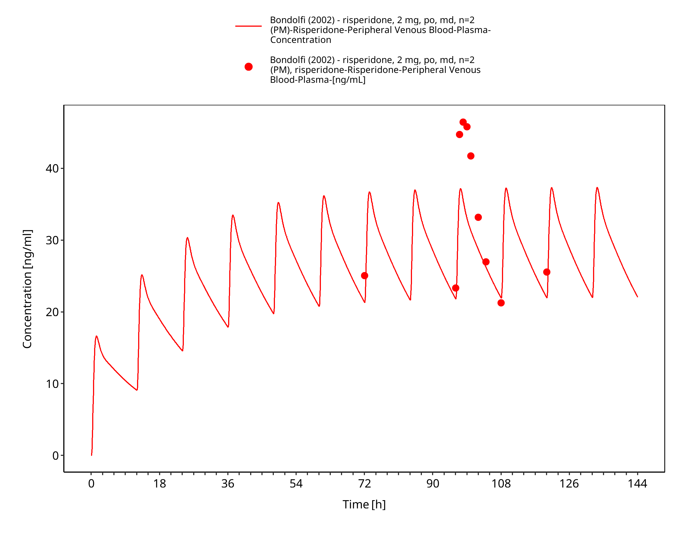
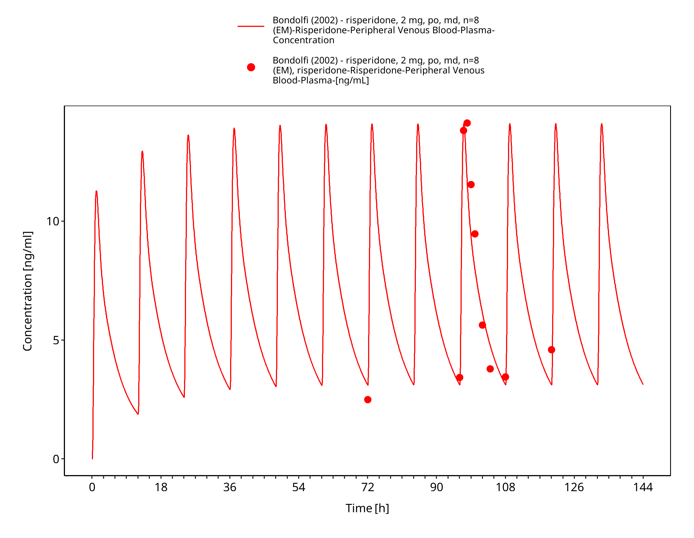
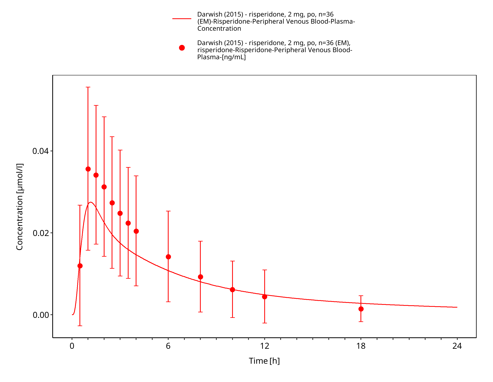
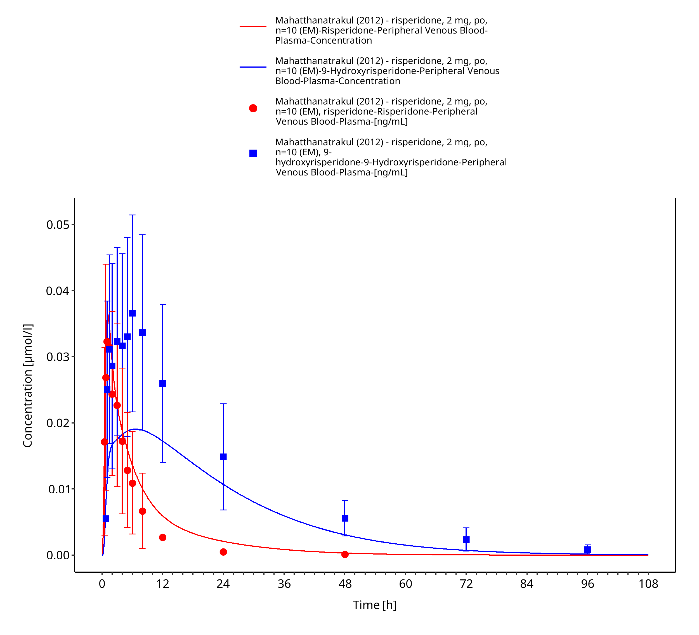
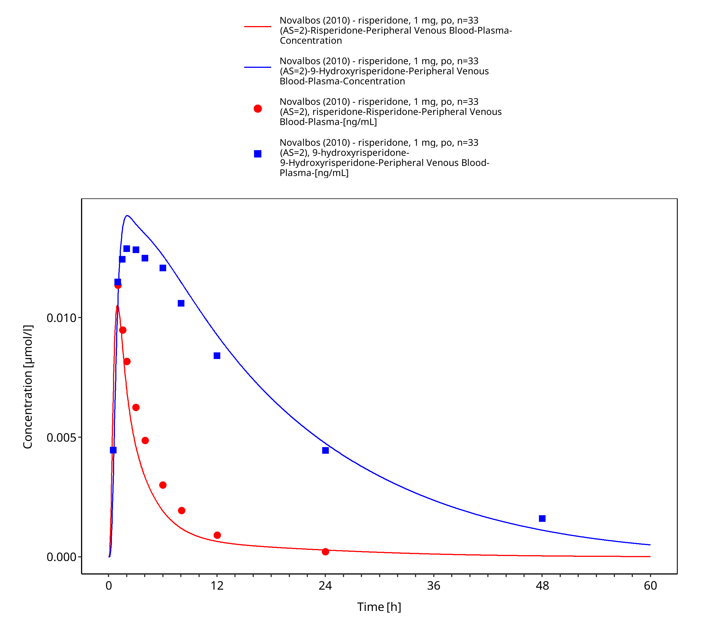
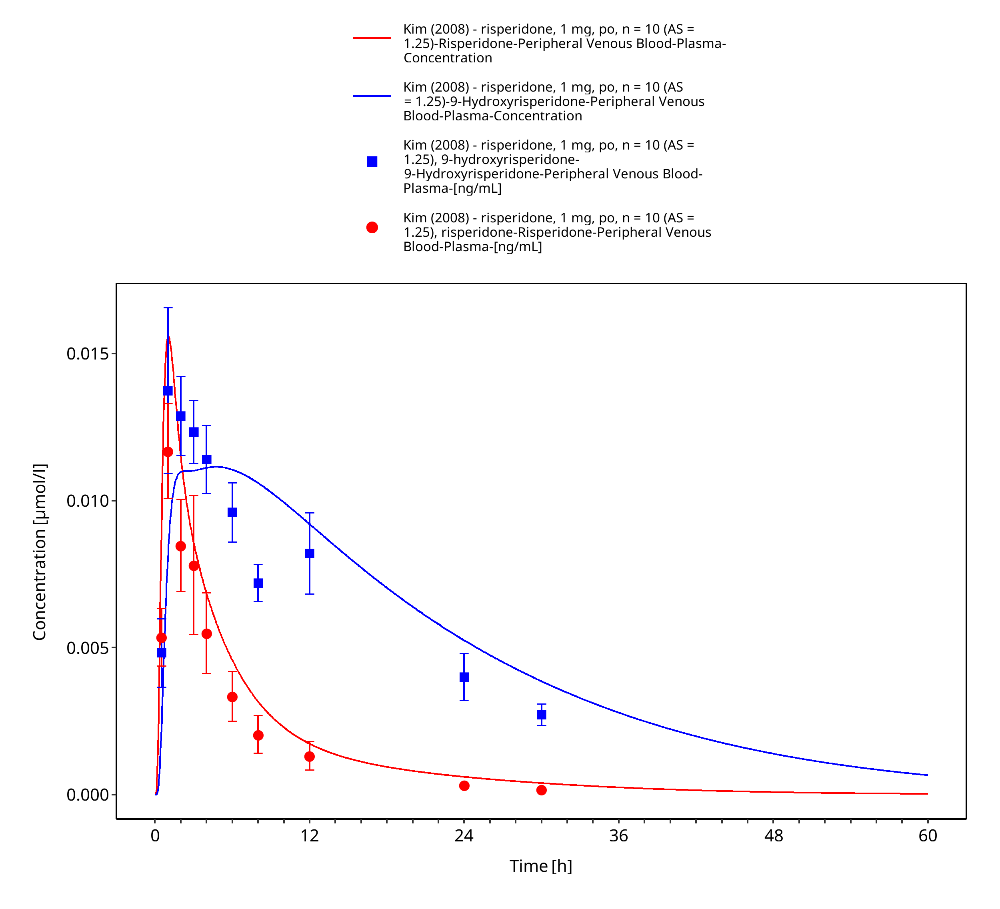
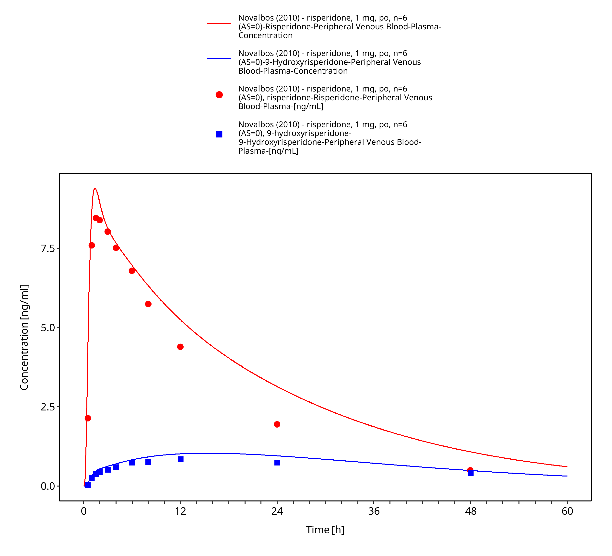
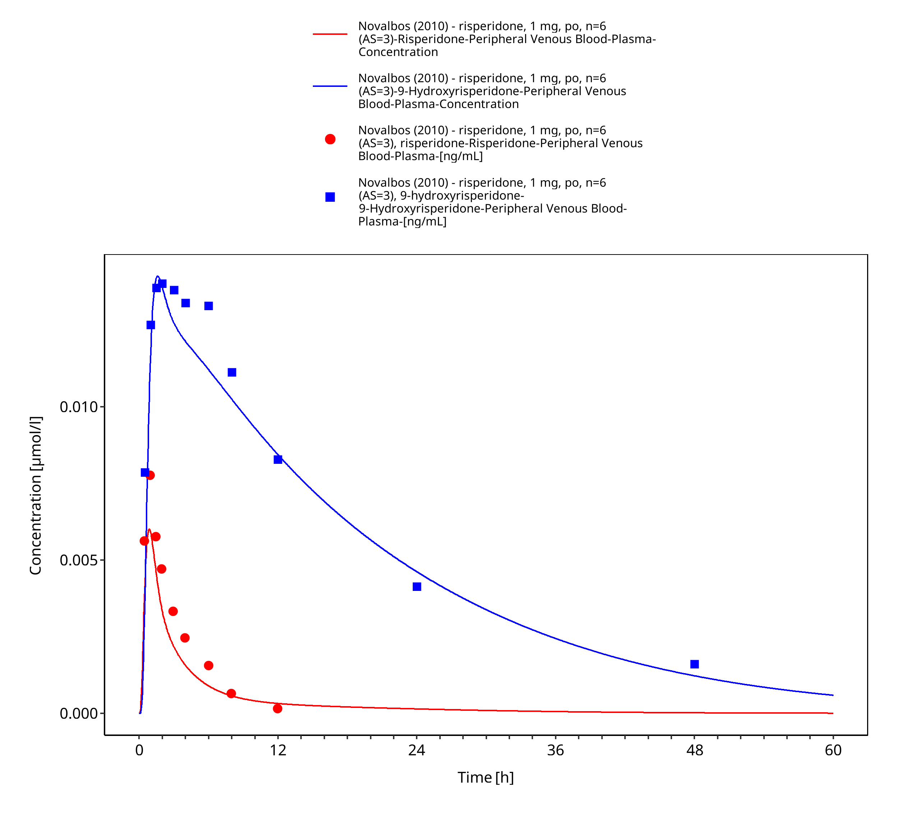

# Building and evaluation of a PBPK model for Risperidone in CYP2D6 phenotype and activity-score groups

| Version                                         | evaluation-OSP12.2                                                   |
| ----------------------------------------------- | ------------------------------------------------------------ |
| based on *Model Snapshot* and *Evaluation Plan* | https://github.com/Open-Systems-Pharmacology/Risperidone-Model/releases/tag/vevaluation |
| OSP Version                                     | 12.2                                                          |
| Qualification Framework Version                 | 3.5                                                          |

This evaluation report and the corresponding PK-Sim project file are filed at:

https://github.com/Open-Systems-Pharmacology/OSP-PBPK-Model-Library/

# Table of Contents

 * [1 Introduction](#1)
 * [2 Methods](#2)
   * [2.1 Modeling strategy](#21)
   * [2.2 Data used](#22)
     * [2.2.1 In vitro and physicochemical data](#221)
   * [2.3 Model parameters and assumptions](#23)
 * [3 Results and Discussion](#3)
   * [3.1 Risperidone final input parameters](#31)
   * [3.2 Diagnostic plots](#32)
     * [3.2.1 Risperidone goodness-of-fit diagnostics](#321)
     * [3.2.2 9-Hydroxyrisperidone goodness-of-fit diagnostics](#322)
   * [3.3 Concentration-time profiles](#33)
     * [3.3.1 Model Building](#331)
     * [3.3.2 Model Verification](#332)
 * [4 Conclusion](#4)
 * [5 References](#5)

# 1 Introduction

Risperidone is an atypical antipsychotic used for schizophrenia and other psychiatric indications. It is administered orally and is converted to the active metabolite 9-hydroxyrisperidone, also known as paliperidone. CYP2D6 is an important metabolic pathway for risperidone, while CYP3A4 and transporter processes contribute to parent and metabolite disposition.

This risperidone model is intended to describe plasma concentration-time profiles of risperidone and 9-hydroxyrisperidone across CYP2D6 phenotype and activity-score groups. It supports evaluation of CYP2D6 drug-gene interactions and interacting-drug scenarios where risperidone or 9-hydroxyrisperidone exposure is clinically relevant.

The risperidone parent-metabolite PBPK model was originally developed by [Kneller 2020](#5). The model was subsequently used in the CYP2D6 activity-score framework by [Rüdesheim 2022](#5) and in the CYP2D6 drug-drug-gene interaction network by [Rüdesheim 2025](#5). The clinical data include oral single-dose and multiple-dose administration of risperidone and CYP2D6 phenotype or activity-score stratified groups.

The presented model includes the following features:

- risperidone and 9-hydroxyrisperidone as parent and metabolite compounds,
- CYP2D6-mediated risperidone metabolism with activity-score-dependent kcat values,
- CYP3A4-mediated metabolism and residual sink pathways,
- P-gp transport for risperidone and 9-hydroxyrisperidone,
- renal filtration for parent and metabolite,
- oral tablet administration in the evaluated clinical studies.

# 2 Methods

## 2.1 Modeling strategy

The general concept of building a PBPK model has previously been described by Kuepfer et al. ([Kuepfer 2016](#5)). Relevant information on anthropometric and physiological parameters in adults was gathered from the literature and incorporated into PK-Sim as default values for adult simulations ([Willmann 2007](#5)).

The applied activity and variability of plasma proteins and active processes integrated into PK-Sim are described in the publicly available PK-Sim Ontogeny Database or otherwise referenced for the specific process.

The risperidone model was developed as a parent-metabolite model for risperidone and 9-hydroxyrisperidone. The original model by [Kneller 2020](#5) described oral risperidone pharmacokinetics by CYP2D6 phenotype. [Rüdesheim 2022](#5) then used the model in a CYP2D6 activity-score framework, where CYP2D6 metabolic capacity is represented by activity-score-dependent kcat values.

Clinical studies used for model building covered oral risperidone administration and included data for risperidone and 9-hydroxyrisperidone where available. Model verification used independent oral risperidone-only study arms, including CYP2D6 poor-, normal-, and higher-activity groups. Model performance is interpreted separately for risperidone and 9-hydroxyrisperidone.

The model-building workflow first established the parent disposition and the formation of 9-hydroxyrisperidone. CYP2D6-related parameters were then used to describe the shift from parent exposure toward metabolite exposure across phenotype and activity-score groups. Verification focused on whether the final parameter set described independent study arms without additional study-specific adjustment.

The model contains CYP2D6 and CYP3A4 metabolism, P-gp transport, renal filtration, and residual clearance processes. CYP2D6 poor-metabolizer activity is represented by setting CYP2D6 kcat to zero, while non-zero activity-score groups use fitted or scaled CYP2D6 kcat values.

The evaluated applications are oral risperidone applications with risperidone and 9-hydroxyrisperidone observations. The major proteins and processes represented explicitly are CYP2D6, CYP3A4, P-gp, plasma protein binding, passive renal filtration, and unspecific hepatic clearance for the metabolite. The parent-metabolite structure requires separate evaluation of risperidone and 9-hydroxyrisperidone.

The report therefore presents model diagnostics for the parent and metabolite concentrations and links the clinical-data table to model-building and verification profiles. The intended interpretation is the plausibility of risperidone and 9-hydroxyrisperidone exposure across CYP2D6 status, not a separate reoptimization for each clinical study.

Details about input data are provided in [Section 2.2](#22). Details about the structural model and assumptions are provided in [Section 2.3](#23).

## 2.2 Data used

### 2.2.1 In vitro and physicochemical data

The table below summarizes the drug-dependent inputs documented for the risperidone model ([Table 1](#table-1)). Parameter values are listed for the parent compound and 9-hydroxyrisperidone where they are relevant for interpreting the parent-metabolite simulations.

| Parameter | Unit | Value | Source | Description |
| --- | ---: | ---: | --- | --- |
| **Risperidone** |  |  |  |  |
| MW | g/mol | 410.48 | [Kneller 2020](#5) | Molecular weight. |
| pKa,base | - | 8.76 | [Kneller 2020](#5) | pKa of a basic ionization site. |
| pKa,acid | - | 3.11 | [Kneller 2020](#5) | pKa of an acidic ionization site. |
| fu | % | 17.50 | [Kneller 2020](#5) | Fraction unbound in plasma. |
| Km,CYP2D6 | µmol/L | 1.10 | [Kneller 2020](#5) | Michaelis constant for 9-hydroxyrisperidone formation. |
| kcat,CYP2D6, EM | 1/min | 1.07 | Optimized | Catalytic rate constant for 9-hydroxyrisperidone formation in extensive metabolizers. |
| Km,P-gp | µmol/L | 26.30 | [Kneller 2020](#5) | Michaelis constant for P-glycoprotein transport. |
| kcat,P-gp | 1/min | 12.72 | Optimized | Catalytic rate constant for P-glycoprotein transport. |
| **9-Hydroxyrisperidone** |  |  |  |  |
| fu | % | 29.00 | [Kneller 2020](#5) | Fraction unbound in plasma. |
| Km,P-gp | µmol/L | 149.60c | [Kneller 2020](#5) | Michaelis constant for P-glycoprotein transport. |
| CLhep | 1/min | 0.08 | Optimized | Unspecific hepatic clearance. |
| **Shared distribution parameters** |  |  |  |  |
| Partition coefficients | - | Rodgers and Rowland | Calculated | Tissue-to-plasma partition coefficients calculated with the Rodgers and Rowland method. |
| Cellular permeabilities | - | PK-Sim Standard | Calculated | Cellular permeabilities calculated with the PK-Sim Standard method. |
| **Shared elimination parameter** |  |  |  |  |
| GFR fraction | - | 1.00 | Assumed | Fraction used to scale passive glomerular filtration. |

**Table 1:** Drug-dependent physicochemical, distribution, metabolism, and elimination parameters used in the final risperidone model.

c The publication and supplement by [Rüdesheim 2022](#5) incorrectly report 26.3 µmol/L. The correct model value is 149.6 µmol/L.

The CYP2D6 activity-score-specific catalytic rate constants used in the model are listed below.

| CYP2D6 AS | kcat to 9-hydroxyrisperidone [1/min] | kcat to other metabolites [1/min] | Parameter origin |
| ---: | ---: | ---: | --- |
| 0 | 0.00 | 0.00 | Calculated |
| 1 | 1.22 | 0.74 | Calculated |
| 1.25 | 1.64 | 1.00 | Calculated |
| 2 | 3.19 | 1.94 | Optimized |
| 3 | 5.91 | 3.60 | Calculated |

**Table 1a:** CYP2D6 activity-score-specific kcat values for risperidone metabolism from Table 2 of [Rüdesheim 2022](#5). Values for AS other than 2 were calculated from the relative activity-score scale and the optimized AS = 2 values. AS: activity score.

### Clinical data

The evaluation uses 12 plasma concentration-time profiles from adults ([Table 2](#table-2)). Six profiles were used for model building and six profiles were used for model verification. The assignments follow the training and test classifications in the published model supplement.

| Source | Dose [mg] / schedule\* | Age [years] | Weight [kg] | Sex | N | Form. | CYP2D6 characterization |
| --- | --- | --- | --- | --- | ---: | --- | --- |
| [Bondolfi 2002](#5)+ | 2 q.d. | 43 (18-63) | NR | 27% female | 2 | Tablet | PM |
| [Bondolfi 2002](#5)+ | 2 q.d. | 43 (18-63) | NR | 27% female | 8 | Tablet | EM |
| [Darwish 2015](#5)+ | 2 | 32 | 79 | 33% female | 36 | Tablet | EM |
| [Kim 2008](#5) | 1 | 23-38 | 65-80 | Male | 10 | Tablet | AS = 1.25 (NM) |
| [Mahatthanatrakul 2007](#5) | 4 | 31 | 55-76 | Male | 10 | Tablet | EM |
| [Mahatthanatrakul 2012](#5)+ | 2 | 33 (23-44) | 64 (55-76) | Male | 10 | Tablet | EM |
| [Markowitz 2002](#5)+ | 1 | 28 (22-42) | NR | 21% female | 12 | Tablet | EM |
| [Nakagami 2005](#5) | 1 | 24 (20-28) | 65 (53-86) | Male | 12 | Tablet | AS = 1 (IM) |
| [Novalbos 2010](#5) | 1 | 23 (19-27) | 65 (43-106) | 58% female | 26 | Tablet | AS = 1 (IM) |
| [Novalbos 2010](#5)+ | 1 | 23 (19-27) | 66 (46-89) | 55% female | 33 | Tablet | AS = 2 (NM) |
| [Novalbos 2010](#5) | 1 | 24 (19-27) | 67 (51-86) | 33% female | 6 | Tablet | AS = 0 (PM) |
| [Novalbos 2010](#5) | 1 | 23 (19-34) | 73 (56-81) | 17% female | 6 | Tablet | AS = 3 (UM) |

**Table 2:** Clinical risperidone concentration-time profiles used for model building and verification. \*: Single oral dose unless otherwise specified; AS: activity score; EM: extensive metabolizer; IM: intermediate metabolizer; NM: normal metabolizer; NR: not reported; PM: poor metabolizer; PT: predicted phenotype; q.d.: once daily; UM: ultrarapid metabolizer; +: data used for model building. Parenthetical PTs for AS-coded rows use the current CPIC CYP2D6 activity score-to-phenotype mapping ([Moore 2026](#5)). EM is the model default when study-specific CYP2D6 information is not available.

## 2.3 Model parameters and assumptions

### Absorption

The model includes oral administration of risperidone. Oral absorption is represented with compound-specific intestinal permeability and formulation settings. The risperidone intestinal permeability was optimized, while the 9-hydroxyrisperidone intestinal permeability was calculated.

The clinical studies used for model building and verification are oral tablet studies, so the evaluation focuses on oral risperidone absorption and subsequent parent-metabolite disposition.

The 9-hydroxyrisperidone solubility input is 0.171 mg/mL at pH 6.5, as reported by [Kneller 2020](#5).

No intravenous risperidone data are included in the evaluation, so oral absorption and first-pass metabolism are coupled in the clinical concentration-time profiles. The `Specific intestinal permeability` parameter is therefore interpreted together with the metabolic parameters that determine parent and metabolite exposure after oral dosing.

The same oral absorption assumptions are used across CYP2D6 status groups. Phenotype and activity-score differences are assigned to metabolic capacity rather than to study-specific changes in absorption.

### Distribution

Risperidone and 9-hydroxyrisperidone are represented with compound-specific plasma protein binding. Fraction unbound values of 17.50% for risperidone and 29.00% for 9-hydroxyrisperidone were used as summarized in [Section 2.2.1](#221).

Partition coefficients were calculated with the Rodgers and Rowland method. Cellular permeabilities were calculated with the PK-Sim Standard method. The parent-metabolite structure means that distribution affects both the parent and metabolite concentration-time profiles.

The model uses separate physicochemical and distribution properties for risperidone and 9-hydroxyrisperidone. Tissue distribution and plasma binding are compound-specific, so the parent and metabolite profiles are evaluated separately.

Distribution was not fitted separately by phenotype. CYP2D6 status affects the rate of risperidone conversion to 9-hydroxyrisperidone, while the same adult physiology and compound-specific binding assumptions are retained across simulations.

### Metabolism and elimination

Two CYP-mediated pathways, transporter processes, renal filtration, and residual clearance pathways are represented in the model.

* CYP2D6

CYP2D6 converts risperidone to 9-hydroxyrisperidone. CYP2D6 activity is activity-score-dependent. Poor-metabolizer activity is set to zero, while non-zero activity-score groups use fitted or scaled kcat values based on the CYP2D6 activity-score framework.

The CYP2D6 pathway controls both parent depletion and metabolite formation. For this reason, CYP2D6 parameterization affects risperidone and 9-hydroxyrisperidone profiles in different directions. Parent-only diagnostics are not sufficient to evaluate this model.

* CYP3A4 and sink pathways

CYP3A4 contributes to risperidone metabolism. Additional sink pathways are included to capture clearance not explicitly assigned to CYP2D6-mediated 9-hydroxyrisperidone formation.

These pathways provide CYP2D6-independent clearance and prevent poor-metabolizer simulations from depending solely on renal elimination. Their interpretation is structural and empirical, because they represent clearance components not resolved as individual measured metabolites in the clinical evaluation.

* P-gp and renal elimination

P-gp transport is implemented for risperidone and 9-hydroxyrisperidone. Both compounds include passive renal filtration with a `GFR fraction` of 1. The metabolite also includes unspecific hepatic clearance as summarized in [Section 2.2.1](#221).

P-gp transport was retained for both parent and metabolite because it can affect intestinal and renal handling. Passive renal filtration uses the compound-specific fraction unbound and adult renal physiology. The additional metabolite clearance pathway captures elimination of 9-hydroxyrisperidone not represented by filtration alone.

# 3 Results and Discussion

The PBPK model for risperidone was developed and evaluated with clinical pharmacokinetic data after oral administration. The evaluation covers single-dose and multiple-dose oral administration, risperidone and 9-hydroxyrisperidone plasma concentration-time profiles, and CYP2D6 poor-, extensive-, and activity-score stratified groups.

Model-building studies included CYP2D6 activity-score or phenotype data from [Novalbos 2010](#5), [Bondolfi 2002](#5), and [Markowitz 2002](#5), as well as studies with parent and metabolite measurements from [Darwish 2015](#5) and [Mahatthanatrakul 2012](#5). Verification included independent activity-score data and risperidone-only study arms from [Novalbos 2010](#5), [Nakagami 2005](#5), [Mahatthanatrakul 2007](#5), and [Kim 2008](#5).

The model includes CYP2D6-mediated formation of 9-hydroxyrisperidone, CYP3A4-mediated metabolism, P-gp transport, passive renal filtration, and residual clearance of the active metabolite. Model performance is evaluated separately for risperidone and 9-hydroxyrisperidone.

The next sections show:

1. the final model input parameters for the building blocks in Section 3.1.
2. the goodness-of-fit diagnostics for risperidone and 9-hydroxyrisperidone in Section 3.2.
3. simulated vs. observed concentration-time profiles for the clinical studies used for model building and model verification in Section 3.3.

## 3.1 Risperidone final input parameters

The compound parameter values of the final PBPK model are illustrated below.

### Compound: Risperidone

#### Parameters

Name                                             | Value                   | Value Origin                                                | Alternative | Default
------------------------------------------------ | ----------------------- | ----------------------------------------------------------- | ----------- | -------
Solubility at reference pH                       | 0.171 mg/ml             | Publication-Other-Kneller et al. 2020                       | Measurement | True   
Reference pH                                     | 7.3                     | Publication-Other-Kneller et al. 2020                       | Measurement | True   
Lipophilicity                                    | 2.4 Log Units           | Publication-Other-Kneller et al. 2020                       | LogP        | True   
Fraction unbound (plasma, reference value)       | 17.5 %                  | Publication-Other-Kneller et al. 2020                       | Measurement | True   
Specific intestinal permeability (transcellular) | 8.0437234696E-06 cm/min | Parameter Identification-Parameter Identification-Optimized | Optimized   | True   
F                                                | 1                       |                                                             |             |        
Is small molecule                                | Yes                     |                                                             |             |        
Molecular weight                                 | 410.48 g/mol            |                                                             |             |        
Plasma protein binding partner                   | α1-acid glycoprotein    |                                                             |             |        

#### Calculation methods

Name                    | Value              
----------------------- | -------------------
Partition coefficients  | Rodgers and Rowland
Cellular permeabilities | PK-Sim Standard    

#### Processes

##### Metabolizing Enzyme: CYP2D6-AS=2 (9-hydroxylation)

Molecule: CYP2D6

Metabolite: 9-Hydroxyrisperidone

###### Parameters

Name                                        | Value                      | Value Origin                                               
------------------------------------------- | -------------------------- | -----------------------------------------------------------
In vitro Vmax for liver microsomes          | 0 pmol/min/mg mic. protein |                                                            
Content of CYP proteins in liver microsomes | 10 pmol/mg mic. protein    | Unknown                                                    
Km                                          | 1.1 µmol/l                 | Other-Manual Fit                                           
kcat                                        | 3.19 1/min                 | Parameter Identification-Parameter Identification-Optimized

##### Metabolizing Enzyme: CYP2D6-AS=2 (sink)

Molecule: CYP2D6

###### Parameters

Name                                        | Value                      | Value Origin                                               
------------------------------------------- | -------------------------- | -----------------------------------------------------------
In vitro Vmax for liver microsomes          | 0 pmol/min/mg mic. protein |                                                            
Content of CYP proteins in liver microsomes | 10 pmol/mg mic. protein    | Unknown                                                    
Km                                          | 1.1 µmol/l                 | Other-Manual Fit                                           
kcat                                        | 1.94 1/min                 | Parameter Identification-Parameter Identification-Optimized

##### Metabolizing Enzyme: CYP3A4-Okubo 2016 (9-hydroxylation)

Molecule: CYP3A4

Metabolite: 9-Hydroxyrisperidone

###### Parameters

Name                               | Value                      | Value Origin                         
---------------------------------- | -------------------------- | -------------------------------------
In vitro Vmax for liver microsomes | 0 pmol/min/mg mic. protein |                                      
Km                                 | 61 µmol/l                  | Publication-Other-Kneller et al. 2020
kcat                               | 0.7 1/min                  | Publication-Other-Kneller et al. 2020

##### Metabolizing Enzyme: CYP3A4-Okubo 2016 (sink)

Molecule: CYP3A4

###### Parameters

Name                               | Value                      | Value Origin                         
---------------------------------- | -------------------------- | -------------------------------------
In vitro Vmax for liver microsomes | 0 pmol/min/mg mic. protein |                                      
Km                                 | 61 µmol/l                  | Publication-Other-Kneller et al. 2020
kcat                               | 0.15 1/min                 | Publication-Other-Kneller et al. 2020

##### Transport Protein: ABCB1-Ejsing 2005

Molecule: ABCB1

###### Parameters

Name                      | Value              | Value Origin                                               
------------------------- | ------------------ | -----------------------------------------------------------
Transporter concentration | 1 µmol/l           |                                                            
Vmax                      | 0 µmol/l/min       |                                                            
Km                        | 26.3 µmol/l        |                                                            
kcat                      | 12.715199036 1/min | Parameter Identification-Parameter Identification-Optimized

##### Systemic Process: Glomerular Filtration-Assumed

Species: Human

###### Parameters

Name         | Value | Value Origin
------------ | -----:| ------------:
GFR fraction |     1 |             

##### Metabolizing Enzyme: CYP2D6-AS=0 (9-hydroxylation)

Molecule: CYP2D6

Metabolite: 9-Hydroxyrisperidone

###### Parameters

Name                                        | Value                      | Value Origin
------------------------------------------- | -------------------------- | ------------
In vitro Vmax for liver microsomes          | 0 pmol/min/mg mic. protein |             
Content of CYP proteins in liver microsomes | 10 pmol/mg mic. protein    | Unknown     
Km                                          | 1.1 µmol/l                 |             

##### Metabolizing Enzyme: CYP2D6-AS=0 (sink)

Molecule: CYP2D6

###### Parameters

Name                                        | Value                      | Value Origin
------------------------------------------- | -------------------------- | ------------
In vitro Vmax for liver microsomes          | 0 pmol/min/mg mic. protein |             
Content of CYP proteins in liver microsomes | 10 pmol/mg mic. protein    | Unknown     
Km                                          | 1.1 µmol/l                 |             

##### Metabolizing Enzyme: CYP2D6-AS=1 (9-hydroxylation)

Molecule: CYP2D6

Metabolite: 9-Hydroxyrisperidone

###### Parameters

Name                                        | Value                      | Value Origin    
------------------------------------------- | -------------------------- | ----------------
In vitro Vmax for liver microsomes          | 0 pmol/min/mg mic. protein |                 
Content of CYP proteins in liver microsomes | 10 pmol/mg mic. protein    | Unknown         
Km                                          | 1.1 µmol/l                 | Other-Manual Fit
kcat                                        | 1.22 1/min                 | Other-Manual Fit

##### Metabolizing Enzyme: CYP2D6-AS=1 (sink)

Molecule: CYP2D6

###### Parameters

Name                                        | Value                      | Value Origin    
------------------------------------------- | -------------------------- | ----------------
In vitro Vmax for liver microsomes          | 0 pmol/min/mg mic. protein |                 
Content of CYP proteins in liver microsomes | 10 pmol/mg mic. protein    | Unknown         
Km                                          | 1.1 µmol/l                 | Other-Manual Fit
kcat                                        | 0.74 1/min                 | Other-Manual Fit

##### Metabolizing Enzyme: CYP2D6-AS=3 (9-hydroxylation)

Molecule: CYP2D6

Metabolite: 9-Hydroxyrisperidone

###### Parameters

Name                                        | Value                      | Value Origin    
------------------------------------------- | -------------------------- | ----------------
In vitro Vmax for liver microsomes          | 0 pmol/min/mg mic. protein |                 
Content of CYP proteins in liver microsomes | 10 pmol/mg mic. protein    | Unknown         
Km                                          | 1.1 µmol/l                 | Other-Manual Fit
kcat                                        | 5.91 1/min                 | Other-Manual Fit

##### Metabolizing Enzyme: CYP2D6-AS=3 (sink)

Molecule: CYP2D6

###### Parameters

Name                                        | Value                      | Value Origin    
------------------------------------------- | -------------------------- | ----------------
In vitro Vmax for liver microsomes          | 0 pmol/min/mg mic. protein |                 
Content of CYP proteins in liver microsomes | 10 pmol/mg mic. protein    | Unknown         
Km                                          | 1.1 µmol/l                 | Other-Manual Fit
kcat                                        | 3.6 1/min                  | Other-Manual Fit

##### Metabolizing Enzyme: CYP2D6-Okubo 2016 (9-hydroxylation)

Molecule: CYP2D6

Metabolite: 9-Hydroxyrisperidone

###### Parameters

Name                                        | Value                      | Value Origin                                               
------------------------------------------- | -------------------------- | -----------------------------------------------------------
In vitro Vmax for liver microsomes          | 0 pmol/min/mg mic. protein |                                                            
Content of CYP proteins in liver microsomes | 10 pmol/mg mic. protein    | Unknown                                                    
Km                                          | 1.1 µmol/l                 |                                                            
kcat                                        | 1.07 1/min                 | Parameter Identification-Parameter Identification-Optimized

##### Metabolizing Enzyme: CYP2D6-Okubo 2016 (sink)

Molecule: CYP2D6

###### Parameters

Name                                        | Value                      | Value Origin                                               
------------------------------------------- | -------------------------- | -----------------------------------------------------------
In vitro Vmax for liver microsomes          | 0 pmol/min/mg mic. protein |                                                            
Content of CYP proteins in liver microsomes | 10 pmol/mg mic. protein    | Unknown                                                    
Km                                          | 1.1 µmol/l                 |                                                            
kcat                                        | 0.67 1/min                 | Parameter Identification-Parameter Identification-Optimized

##### Metabolizing Enzyme: CYP2D6-AS=1.25 (9-hydroxylation)

Molecule: CYP2D6

Metabolite: 9-Hydroxyrisperidone

###### Parameters

Name                                        | Value                      | Value Origin    
------------------------------------------- | -------------------------- | ----------------
In vitro Vmax for liver microsomes          | 0 pmol/min/mg mic. protein |                 
Content of CYP proteins in liver microsomes | 10 pmol/mg mic. protein    | Unknown         
Km                                          | 1.1 µmol/l                 |                 
kcat                                        | 1.64 1/min                 | Other-Manual Fit

##### Metabolizing Enzyme: CYP2D6-AS=1.25 (sink)

Molecule: CYP2D6

###### Parameters

Name                                        | Value                      | Value Origin    
------------------------------------------- | -------------------------- | ----------------
In vitro Vmax for liver microsomes          | 0 pmol/min/mg mic. protein |                 
Content of CYP proteins in liver microsomes | 10 pmol/mg mic. protein    | Unknown         
Km                                          | 1.1 µmol/l                 |                 
kcat                                        | 1 1/min                    | Other-Manual Fit

### Compound: 9-Hydroxyrisperidone

#### Parameters

Name                                       | Value                | Value Origin                          | Alternative | Default
------------------------------------------ | -------------------- | ------------------------------------- | ----------- | -------
Solubility at reference pH                 | 0.171 mg/ml          | Publication-Other-Kneller et al. 2020 | Measurement | True   
Reference pH                               | 6.5                  | Publication-Other-Kneller et al. 2020 | Measurement | True   
Lipophilicity                              | 2.1 Log Units        | Publication-Other-Kneller et al. 2020 | LogP        | True   
Fraction unbound (plasma, reference value) | 29 %                 | Publication-Other-Kneller et al. 2020 | Measurement | True   
F                                          | 1                    |                                       |             |        
Is small molecule                          | Yes                  |                                       |             |        
Molecular weight                           | 426.48 g/mol         |                                       |             |        
Plasma protein binding partner             | α1-acid glycoprotein |                                       |             |        

#### Calculation methods

Name                    | Value              
----------------------- | -------------------
Partition coefficients  | Rodgers and Rowland
Cellular permeabilities | PK-Sim Standard    

#### Processes

##### Systemic Process: Total Hepatic Clearance-Assumption

Species: Human

###### Parameters

Name                          | Value              | Value Origin                                               
----------------------------- | ------------------ | -----------------------------------------------------------
Fraction unbound (experiment) | 0.26               |                                                            
Lipophilicity (experiment)    | 1.76 Log Units     |                                                            
Plasma clearance              | 0 ml/min/kg        |                                                            
Specific clearance            | 0.0821152637 1/min | Parameter Identification-Parameter Identification-Optimized

##### Systemic Process: Glomerular Filtration-Assumption

Species: Human

###### Parameters

Name         | Value | Value Origin
------------ | -----:| ------------:
GFR fraction |     1 |             

##### Transport Protein: ABCB1-Ejsing 2005

Molecule: ABCB1

###### Parameters

Name                      | Value                 | Value Origin                                               
------------------------- | --------------------- | -----------------------------------------------------------
Transporter concentration | 1 µmol/l              |                                                            
Vmax                      | 0 µmol/l/min          |                                                            
Km                        | 149.6 µmol/l          |                                                            
kcat                      | 0.0057047043998 1/min | Parameter Identification-Parameter Identification-Optimized

## 3.2 Diagnostic plots

The goodness-of-fit diagnostics are shown separately for risperidone and 9-hydroxyrisperidone. For each analyte, the first plot compares observed and simulated concentrations. The second plot shows log residuals over time. Administration route and model-building or verification status are not used to stratify these diagnostics.

### 3.2.1 Risperidone goodness-of-fit diagnostics

The first goodness-of-fit plot compares observed and simulated risperidone plasma concentrations. The second plot shows log residuals over time.

**Table 3-1: GMFE for Risperidone goodness-of-fit diagnostics**

|Group       |GMFE |
|:-----------|:----|
|Risperidone |1.30 |

 
 

**Figure 3-1: Risperidone goodness-of-fit diagnostics**

 
 

**Figure 3-2: Risperidone goodness-of-fit diagnostics**

 
 

### 3.2.2 9-Hydroxyrisperidone goodness-of-fit diagnostics

The first goodness-of-fit plot compares observed and simulated 9-hydroxyrisperidone plasma concentrations. The second plot shows log residuals over time.

**Table 3-2: GMFE for 9-Hydroxyrisperidone goodness-of-fit diagnostics**

|Group                |GMFE |
|:--------------------|:----|
|9-Hydroxyrisperidone |1.31 |

 
 

**Figure 3-3: 9-Hydroxyrisperidone goodness-of-fit diagnostics**

 
 

**Figure 3-4: 9-Hydroxyrisperidone goodness-of-fit diagnostics**

 
 

## 3.3 Concentration-time profiles

Simulated versus observed concentration-time profiles of all data listed in Section 2.2.2 (Clinical data) are presented below.

### 3.3.1 Model Building

The following model-building profiles show risperidone and 9-hydroxyrisperidone data used to establish parent disposition and CYP2D6-mediated metabolite formation. Parent and metabolite observations are interpreted separately.

**Figure 3-5: Bondolfi 2002: risperidone, 2 mg, po, md, n=2 (PM)**

 
 

**Figure 3-6: Bondolfi 2002: risperidone, 2 mg, po, md, n=8 (EM)**

 
 

**Figure 3-7: Darwish 2015: risperidone, 2 mg, po, n=36 (EM)**

 
 

**Figure 3-8: Mahatthanatrakul 2012: risperidone, 2 mg, po, n=10 (EM)**

 
 

**Figure 3-9: Markowitz 2002: risperidone, 1 mg, po, n=12 (EM)**

 
 

**Figure 3-10: Novalbos 2010: risperidone, 1 mg, po, n=33 (AS=2)**

 
 

### 3.3.2 Model Verification

The following verification profiles compare the final model with independent risperidone studies across dose and CYP2D6 activity groups. Risperidone and 9-hydroxyrisperidone performance are evaluated separately.

**Figure 3-11: Kim 2008: risperidone, 1 mg, po, n=10 (AS=1.25)**

 
 

**Figure 3-12: Mahatthanatrakul 2007: risperidone, 4 mg, po, n=10 (EM)**

 
 

**Figure 3-13: Nakagami 2005: risperidone, 1 mg, po, n=12 (AS=1)**

 
 

**Figure 3-14: Novalbos 2010: risperidone, 1 mg, po, n=26 (AS=1)**

 
 

**Figure 3-15: Novalbos 2010: risperidone, 1 mg, po, n=6 (AS=0)**

 
 

**Figure 3-16: Novalbos 2010: risperidone, 1 mg, po, n=6 (AS=3)**

 
 

# 4 Conclusion

The risperidone PBPK model describes the evaluated plasma concentration-time data for risperidone and 9-hydroxyrisperidone after oral doses of 1-4 mg in adults. The evaluation includes single-dose and multiple-dose administration and CYP2D6 poor, normal/extensive, and higher-activity groups represented by phenotype, genotype, or activity score.

The model uses common absorption and distribution parameters across CYP2D6 groups. CYP2D6 forms 9-hydroxyrisperidone, while CYP3A4, P-gp, passive glomerular filtration, and residual clearance pathways contribute to parent and metabolite disposition. Activity-score-dependent CYP2D6 catalytic rates describe the shift between parent and metabolite exposure across the evaluated CYP2D6 groups.

The concentration-time profiles and goodness-of-fit diagnostics characterize model performance for adult oral risperidone simulations within the evaluated dose, regimen, analyte, and CYP2D6 ranges. No formal acceptance criterion was applied. Some source publications investigated interacting drugs, but this compound report evaluates only their risperidone-only study arms.

The main limitations are the absence of intravenous data, residual-clearance pathways not linked to measured metabolites, and limited data for 9-hydroxyrisperidone and P-gp transport.

# 5 References

[1] Rüdesheim S, Selzer D, Mürdter T, Igel S, Kerb R, Schwab M, Lehr T. Physiologically Based Pharmacokinetic Modeling to Describe the CYP2D6 Activity Score-Dependent Metabolism of Paroxetine, Atomoxetine and Risperidone. Pharmaceutics. 2022;14:1734. doi: [10.3390/pharmaceutics14081734](https://doi.org/10.3390/pharmaceutics14081734).

[2] Rüdesheim S, Loer HLH, Feick D, Marok FZ, Fuhr LM, Selzer D, et al. A Comprehensive CYP2D6 Drug-Drug-Gene Interaction Network for Application in Precision Dosing and Drug Development. Clin Pharmacol Ther. 2025;117:1718-1731. doi: [10.1002/cpt.3604](https://doi.org/10.1002/cpt.3604).

[3] Kneller LA, Abad-Santos F, Hempel G. Physiologically Based Pharmacokinetic Modelling to Describe the Pharmacokinetics of Risperidone and 9-Hydroxyrisperidone According to Cytochrome P450 2D6 Phenotypes. Clin Pharmacokinet. 2020;59:51-65. doi: [10.1007/s40262-019-00793-x](https://doi.org/10.1007/s40262-019-00793-x).

[4] Novalbos J, López-Rodríguez R, Román M, Gallego-Sadín S, Ochoa D, Abad-Santos F. Effects of CYP2D6 genotype on the pharmacokinetics, pharmacodynamics, and safety of risperidone in healthy volunteers. J Clin Psychopharmacol. 2010;30:504-511. doi: [10.1097/JCP.0b013e3181ee84c7](https://doi.org/10.1097/JCP.0b013e3181ee84c7).

[5] Bondolfi G, Eap CB, Bertschy G, Zullino D, Vermeulen A, Baumann P. The effect of fluoxetine on the pharmacokinetics and safety of risperidone in psychotic patients. Pharmacopsychiatry. 2002;35:50-56. doi: [10.1055/s-2002-25026](https://doi.org/10.1055/s-2002-25026).

[6] Markowitz JS, DeVane CL, Liston HL, Boulton DW, Risch SC. The effects of probenecid on the disposition of risperidone and olanzapine in healthy volunteers. Clin Pharmacol Ther. 2002;71:30-38. doi: [10.1067/mcp.2002.119815](https://doi.org/10.1067/mcp.2002.119815).

[7] Darwish M, Bond M, Yang R, Hellriegel ET, Robertson P. Evaluation of Potential Pharmacokinetic Drug-Drug Interaction Between Armodafinil and Risperidone in Healthy Adults. Clin Drug Investig. 2015;35:725-733. doi: [10.1007/s40261-015-0330-6](https://doi.org/10.1007/s40261-015-0330-6).

[8] Mahatthanatrakul W, Sriwiriyajan S, Ridtitid W, Boonleang J, Wongnawa M, Rujimamahasan N, Pipatrattanaseree W. Effect of cytochrome P450 3A4 inhibitor ketoconazole on risperidone pharmacokinetics in healthy volunteers. J Clin Pharm Ther. 2012;37:221-225. doi: [10.1111/j.1365-2710.2011.01271.x](https://doi.org/10.1111/j.1365-2710.2011.01271.x).

[9] Nakagami T, Yasui-Furukori N, Saito M, Tateishi T, Kaneo S. Effect of verapamil on pharmacokinetics and pharmacodynamics of risperidone. Clin Pharmacol Ther. 2005;78:43-51. doi: [10.1016/j.clpt.2005.03.009](https://doi.org/10.1016/j.clpt.2005.03.009).

[10] Kim KA, Park PW, Liu KH, Kim KB, Kim HJ, Shin JG, Park JY. Effect of rifampin, an inducer of CYP3A and P-glycoprotein, on the pharmacokinetics of risperidone. J Clin Pharmacol. 2008;48:66-72. doi: [10.1177/0091270007309888](https://doi.org/10.1177/0091270007309888).

[11] Mahatthanatrakul W, Nontaput T, Ridtitid W, Wongnawa M, Sunbhanich M. Rifampin decreases plasma concentrations of risperidone in healthy volunteers. J Clin Pharm Ther. 2007;32:161-167. doi: [10.1111/j.1365-2710.2007.00811.x](https://doi.org/10.1111/j.1365-2710.2007.00811.x).

[12] Kuepfer L, Niederalt C, Wendl T, Schlender JF, Willmann S, Lippert J, Block M, Eissing T, Teutonico D. Applied Concepts in PBPK Modeling: How to Build a PBPK/PD Model. CPT Pharmacometrics Syst Pharmacol. 2016;5:516-531. doi: [10.1002/psp4.12134](https://doi.org/10.1002/psp4.12134).

[13] Willmann S, Höhn K, Edginton A, Sevestre M, Solodenko J, Weiss W, Lippert J, Schmitt W. Development of a physiology-based whole-body population model for assessing the influence of individual variability on the pharmacokinetics of drugs. J Pharmacokinet Pharmacodyn. 2007;34:401-431. doi: [10.1007/s10928-007-9059-5](https://doi.org/10.1007/s10928-007-9059-5).

[14] Moore C, Bourque MS, Halman A, Agúndez JAG, Prows CA, Hikino K, et al. Clinical Pharmacogenetics Implementation Consortium (CPIC) Guideline for CYP2D6 Genotype and Use of 5-HT3 Receptor Antagonists: 2026 Update. Clinical Pharmacology & Therapeutics. 2026;120:387-393. doi: [10.1002/cpt.70291](https://doi.org/10.1002/cpt.70291).

